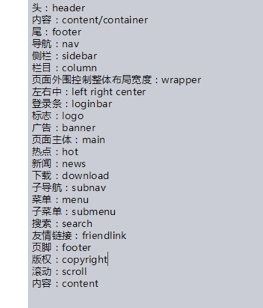

# CSS基础Day01_书写介绍_选择器_复合选择器

[TOC]

##CSS介绍
###CSS概念
* CSS 指**层叠样式表** 或者叫级联样式表 (Cascading   Style  Sheets)
   * 层叠性： 属于CSS中的一个特性。
   * CSS 用来美化网页（**给网页设置样式**）
   
   
-------

   
###CSS作用
* 设置网页结构样式(改变html标签的样式)
* 通过CSS给html标签设置属性达到改变标签样式

-------

##CSS书写介绍
#### 内嵌式写法
* 内嵌：将CSS放到html文件中设置
* 书写位置在**head标签内**
  
```html
    <head>
        <style type="text/css">
            CSS代码
        </style>
    </head>

```

-------

#### 外联式写法
#### 行内式写法

-------


##CSS语法

```txt

选择器 {属性: 属性值;}

```

-------

##选择器
* 概念：选择标签的过程

-------

####标签选择器

```txt
Html标签名{属性： 属性值;}
```


```html
<head>
    <style type="text/css">
    //标签选择器
        p {
           color: red; //改变文字颜色 
           font-size: 50px; //改变文字大小
           background-color: pink; //改变背景颜色
           width: 300px;  //设置宽度
           height: 300px;   //设置高度
        }
        
        div {
            color: red; //改变div中文字颜色 
        }
    </style>
</head>

<body>
    <p>111</p>
    <div>div中的文字</div>
    <ul>
    </ul>
</body>

```

-------

#####常用属性
属性 | 说明 | 属性值
----|------|------|
**color** |（前景色）设置文字颜色 | 
**background-color** | 背景色 |
**font-size** | 设置文字大小 | 
**width** | 设置宽度 | 
**height** | 设置高度 | 
**text-align** | 设置内容 文字和图片 对齐方式 | 默认值：left 居中：center 靠右：right 注意：该属性只能给**块极元素**设置
**text-indent** | 设置首行缩进 | 2em
**cursor** |  鼠标模式 | **help** 鼠标问号模式 **pointer**鼠标小手模式


-------

#####单位介绍
* **px** 像素
* **em** 1em 等于一个文字的大小

-------

#####颜色的表示方式
* 直接设置颜色的名称 （如： red pink green）
 
```css
    p {
        background-color: red; 
     }
```

 * 使用十六进制表示 （#0-f之间）
    
```css
    p {
        background-color: #000; 
     }
```

* 使用三原色表示（RGB）每个原色0-255之间

```css
    p {
        background-color: rgb(255,255,0); 
    }
``` 

* 使用rgba表示有透明度的颜色 a的范围0-1之间

```css
    p {
        background-color: rgba(0,0,0,0.5); 
    }
```

* 使用**opacity**实现半透明 opacity取值0-1之间
    
```css
    p {
        background-color: red;
        opacity: 0.5; //opacity设置的是整体控件的半透明
        filter:Alpha(opacity=50); //解决ie8兼容opacity透明度的问题
    }
```

-------

####类选择器

```txt
 .自定义类型 {属性: 属性值;}
```

```html
<head>
    <style type="text/css">
        //类选择器 会选中类名为p_red的标签 类样式定义
        .p_red {
            color: red;
        }
        
        .p_green {
            color: green;
        }
        
        .public {
            font-size: 30px;
        }        
    </style>
</head>

<body>
    //设置标签类名 class
    <p class="p_red"> 文字1</p>
    <p class="p_green"> 文字2</p> 
    
    <div class="p_red public"> div1 </div>
    <div> div2 </div>
</body>
```

1. 通过 " .自定义类名 " 定义一个类样式
2. html标签通过class属性调用类样式

-------

#####类选择器的特点
* 一个**类样式**可以被**多个标签**同时调用
* 一个**标签**可以同时调用**多个样式**

```html
<div class="p_red public"> div1 </div>
```

-------

#####类选择器的命名规范
* 

* 合法类名
    * 不能使用纯数字 或 数字开头定义类名
    * 不推荐使用汉字定义类名
    * 不能使用特殊字符定义类名
    * 不推荐使用标签名定义类名
      
-------
 
####id选择器
    
```txt
    #自定义名称 {属性：属性值；}
```

```html
<head>
    <style type="text/css">
    // id选择器
      #div_color {
        color:red;
      }
    </style>
</head>
<body>   
    // 设置标签id
    <div id="div_color"> div1 </div>
    <div> div2 </div>
</body>    
    
```

1. 首先通过**#自定义名称**定义一个id选择器样式
2. html标签通过id属性 调用id样式

-------

#####id选择器与类选择器的区别
* 页面中标签的**id值必须唯一**
* **一个标签只能调用一个id样式**

-------

####通配符选择器

```txt
    * {属性：属性值；}
```

```html
<head>
    <style type="text/css">
    //通配符选择器 选中页面中所有标签
        * {
           font-size: 16px;
           font-family: 宋体; 
        }
    </style>
</head>
<body>   
    <div> div1 </div>
    <p> p1 </p>
    <span> span1 </span>
</body> 
```

* 通配符选择器会将页面中所有的标签都选中（**包括body**）
* 一般用于**样式初始化**

-------

#####font属性介绍
属性| 说明 | 属性值 
-----|----- |-----
**font-size** | 文字大小 | 18px
**font-weight** | 文字加粗效果 | 默认值normal  加粗bold 或 700加粗 400正常
**font-style** | 设置文字是否斜体显示 |  normal正常  italic文字斜体显示
**font-family** | 设置文字字体 | "微软雅黑" (可带引号 或不带引号) 
 **line-height** | 设置文字行高 | 20px
 
 * **font-family**:微软雅黑; 设置文字字体
    * 属性值 "微软雅黑" (可带引号 或不带引号)
    * 文字字体的表示方式
        * 直接设置字体对应的名称
        * 设置字体对应的英文方式
        * 设置字体对应的Unicode编码
            * 在浏览器控制台中 利用 escape() 查询字体编码  
    * 注意：font-family一次可以**设置多个字体** 字体与字体中间用**逗号**分隔;
    * 注意： 设置字体要设置**常用**的字体
    
-------

#####font属性联写


```//

font: font-weight font-style font-size/line-height font-family;

```

```//
<head>
    <style type="text/css">
        p {
           font: 700 italic 30px/20px 微软雅黑；
        }
    </style>
</head>
<body>   
  <p> p1 </p>
</body> 

```    

* 注意：属性联写中**必须设置** **font-size** 和 **font-family** ！
    ` font:  30px 宋体;`
* 注意：在属性联写中 **font-size** 必须 **在 font-family 前面**！
* 注意： 如果font属性联写中的属性都有设置 按照`font-weight font-style font-size/line-height font-family`顺序写 font-weight font-style顺序可以调换
 
-------

###复合选择器
 
####标签指定式选择器

```//
标签名.类名 {属性： 属性值；}
标签名#id名 {属性： 属性值；}
```

```//
<head>
    <style type="text/css">
        .one {
            color:red;
        }
        //标签指定式选择器
        //即是div同时类名是one 才被选中
        div.one {
            color:green;
        }
    </style>
</head>
<body>   
  <p class = "one"> p1 </p>
  <div class ="one"> div <div>
</body> 
```

* 关系：**即....又.....**

-------

####后代选择器
1. 后代选择器标签必须是**嵌套关系**
2. 选择器与选择器之间必须使用**空格**隔开
3. 后代选择器**只能选中后代元素**

```//
    选择器 选择器 {属性：属性值；}
```

```//
<head>
    <style type="text/css">
         //首先选择div标签在div标签中选择p标签
         //只要p标签是div标签的后代无论直接后代还是间接后代都被选择
         div p {
            color: red;
         }
         
    </style>
</head>
<body>   
    <div class="one">
        <p class ="two"> 有父元素的p</p>
    </div>
</body> 

```

-------

####并集选择器
1. 选择器与选择器之间必须用**逗号**隔开
2. 选择器**标签之间**的结构可以是**任意**一种关系

```//
    选择器，选择器 {属性：属性值；}
```
    
```//
<head>
    <style type="text/css">
        //并集选择器
        div，p，span {
            color：red；
        }
        .one,span {
            color：red；
        }            
    </style>
</head>
<body>   
    <div class="one"> 123 </div>
    <p class="one"> 456 </p>
    <span> 789 </span>
    <div class="three">
        <span>111</span>
    </div> 
</body>  
```

-------

####补充（选择器）
#####子代选择器
* 子代选择器之间必须是**嵌套结构**
* 子代选择器只能选择**直接后代元素**（后代选择器可以选中所有的后代元素）
```//
    选择器>选择器 {属性： 属性值；}
```

```//
    
    <!DOCTYPE html>
<html lang="en">
<head>
	<meta charset="UTF-8">
	<title>Document</title>

	<style>
		//子代选择器
		div>span {
			color: red;
		}

	</style>

</head>
<body>

	<div class="one">
		<span>直接后代</span>
		<p>
			<span>
			 	间接后代
			</span>
		</p>

	</div>
	
</body>
</html>

```

-------

##### 属性选择器


```//
    [属性名] {属性：属性值；}
```

```//
<!DOCTYPE html>
<html lang="en">
<head>
	<meta charset="UTF-8">
	<title>属性选择器</title>
	<style type="text/css">
		.one {
			color: red;
		}
		/* 属性选择器 */
		/* 把界面中具有id属性的标签选中 */
		[id] {
			color: green;
		}
		/* 把界面中即有id的属性又class标签选中*/
		[id][class] {
			color: green;
		}
	</style>
</head>
<body>
	<div class="one">123</div>
	<div class="one" id="two">456</div>
	<div class="one" name="username">789</div>
</body>
</html>

```

* 属性选择器其他选择方式


```//
    [属性="属性值"] { }

    /* 当前标签即有class属性 属性值要求two*/
	    [class="two"] {
	    	color:red;
	    }
```


```//
[属性^=字母] {} //选择以什么字母开始的属性值选择器 

   /* 当前标签即有class属性 属性值要求t开头*/
    [class^="t"] {
	    	color:red;
	   }
```


```//

[属性$=字母] {} //选择以什么字母结束的属性值选择器 


/* 当前标签即有class属性 属性值要求t结尾 */
[class$="t"] {
	    	color:red;
}

```


```//
[属性*=字母] {} //选择包含该字母的属性值选择器 


/* 当前标签即有class属性 属性值包含t */
[class*="t"] {
	    	color:red;
}

```


-------

##### 伪类选择器
* 结构伪类

```//
    :first-child {属性：属性值；}
```


```//

<!DOCTYPE html>
<html lang="en">
<head>
	<meta charset="UTF-8">
	<title>Document</title>

	<style type="text/css">
	/*选中父元素中的第一个子元素*/
		li:first-child {
			color:red;
		}
	/*选中父元素中的最后一个子元素*/
		li:last-child {
			color:red;
		}
	/*选中父元素中第2个元素 n可以取任何值*/
		li:nth-child(2){
			color:red;
		}
	/*选中父元素中倒数第2个元素 n可以取任何值*/
		li:nth-last-child(2){
			color:pink;
		}
		
	/*选中父元素中基数元素*/
		li:nth-child(odd){
			color:yellow;
		}
	/*选中父元素中偶数元素*/
		li:nth-child(even){
			color:yellow;
		}
		
	</style>
</head>
<body>
	<ul>
		<li>li1</li>
		<li>li2</li>
		<li>li3</li>
		<li>li4</li>
		<li>li5</li>
		<li>li6</li>
		<li>li7</li>
		<li>li8</li>
		<li>li9</li>
	</ul>
</body>
</html>

```

-------

* 目标伪类
* 空伪类
* 排除伪类

```//

```

##### 伪元素选择器


