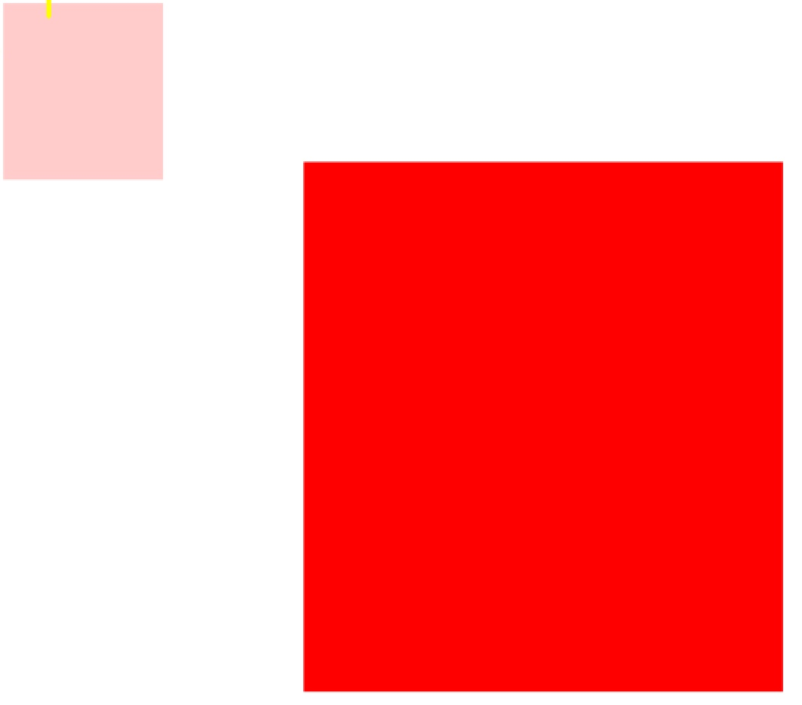
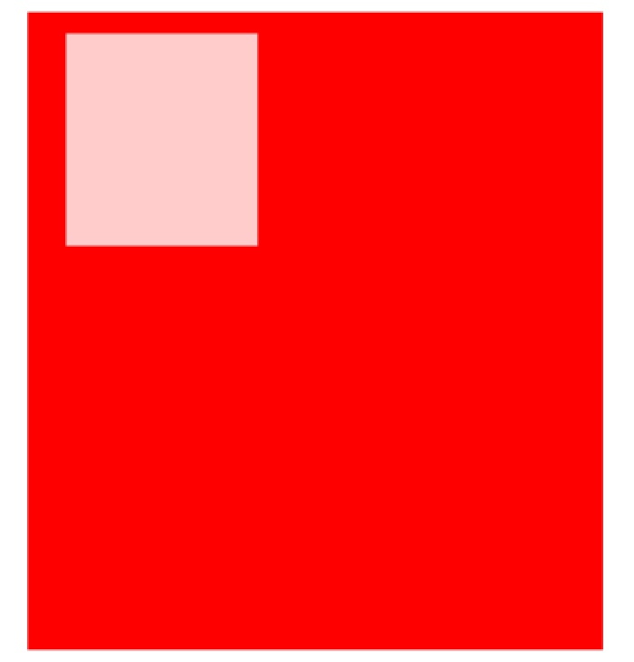

# CSS基础Day05_定位_Z-indext_定位盒子居中_CSS标签包含规范_网页布局规避脱标流_vartical-align属性_CSS元素可见性_LOGO内容移除_精灵图

[TOC]

## 定位（重点）
* 作用 ： 通过定位可以**移动元素位置**
* 移动位置的三种方式：定位 盒子模型 浮动

-----

###定位的使用场景
* 当界面中出现盒子压盒子效果时，推荐使用定位（定位可以改变界面的**层级关系**）

-----

###定位特点
* 定位体现的是元素之间的**层级关系** 

-----

###定位分类

属性 | 说明 | 属性值
---- | ---- | -----
position | 定位 | static静态定位 absolute绝对定位 relative相对定位 fixed固定定位
left | 往右边移动  | 30px

####静态定位

```CSS
    .box {
        position : static;
    }
```

* 注意：**静态定位不能移动元素位置**
* 静态定位的元素就是**标准流**元素的显示方式

-----

####绝对定位


```CSS
     .box {
        position : absolute;
        left:10px;
        top:0px;
    }

```

##### 绝对定位的位置移动特点
* 如果一个元素设置了 **绝对定位** 如果改该元素的**父元素**设置了**静态定位** 或 **没有定位** 那么当前子元素是**以body标签（浏览器）左上角进行移动**
* 

 
* 如果一个子元素设置了绝对定位，如果该子元素的**父元素**设置了**除静态定位**以为的其他定位，那么当前绝对定位的子元素是**以父元素的左上角进行移动的**



--------

##### 绝对定位的特点
* **绝对定位的元素脱表不占位置**
* 绝对定位可以实现**模式转换**

#####绝对定位的使用场景
* 当有盒子压住另一个盒子的效果是使用

-------

####相对定位


```CSS
    .box {
        position:relative;
    }
```

#####相对定位的特点
* 相对定位的元素的**占位置**的
* 相对定位元素是以**元素原来的位置为参照进行移动的**
* **不能实现模式转换**
* 一般情况下 要设置 **子绝父相**（保证子元素可以在父元素中移动位置的情况下 还可以保证父元素不脱标）

------

####固定定位


```CSS

    .box {
        position:fixed;
    }
    
```

#####固定定位特点
* 固定定位的元素**始终**是以**body**（浏览器）可视区域 **为参照**
* 固定定位的元素脱表**不占位置**
* 固定定位的元素可以实现**模式转换**


-------

## Z-indext
###定位元素的特点 
* （抛出静态定位）**只有定位的元素有层级关系** 
* 通过z-indext 改变层级关系

###层级关系特点
* 默认条件下 当给一个元素设置了定位，该元素默认的层级z-index 值是auto(0)
* 当z-indext值相同的情况下，**最后定位的元素** 层级**会高于前面定位的元素**（**后来居上**）
* 等z-index 值不同的情况下 值越大层级越高
* 如果元素的父元素设置了z-index 值 那么**父元素z-index值越大 该元素的层级越高**
 
------
 
##定位盒子居中
* 盒子居中： margin:0 auto;居中显示
* 定位盒子居中: 

```CSS
    .one {
        width: 200px;
        height:200px
        
        position:adsolute;
        /*父元素宽度的一半*/
        left: 50%; 
        /*向元素自己位置相反的方向*/
        margin-left: 元素自己宽度一半;
    }
```

-----

##CSS标签包含规范
* 段落中不能包含标题
* 段落标签中不能包含div 
* 行内元素最好不能包含块级元素


-----

##网页布局规避脱标流
* 网页布局有限考虑标准流
* 然后考虑使用浮动
* 最后使用定位
* 元素模式转换必须使用display

-----


##vertical—align 属性
* text—align 水平对齐
* vertical-align垂直对齐
* 默认情况下 **行内块元素**（img input） 有默认的vertical-align 属性值
* 只有行内块 和 table可以用

属性值 | 说明
----- | ------
baseline | 默认值基线对齐
top | 顶部对齐
middle | 中部对齐
bottom | 底部对齐


-------

##CSS元素可见性
* 元素的隐藏方式

* overflow:hidden 将溢出部分隐藏
* display:none; 元素隐藏（不占位置）
* display:block; 显示元素
* visibility:hidden；(占位置)

## logo 内容移除
* logo 一般推荐给 a 标签设置背景图片
* logo 中 a 标签最后设置文字
* 移除文字设置 text-indext

-----


##精灵图
* 精灵图是特殊的**背景图片**
### 使用精灵图
* 给元素设置精灵图设置背景图片
* 通过background-postion 移动图片


