# CSS基础Day06_滑动门_字符符号_vertical_尚合案例

[TOC]

##滑动门
* 作用： 制作**网页导航**
* 滑动门导航使用**背景图片**制作
* 滑动门导航内容**不能设置宽度**（让文字内容撑开）

###滑动门案例

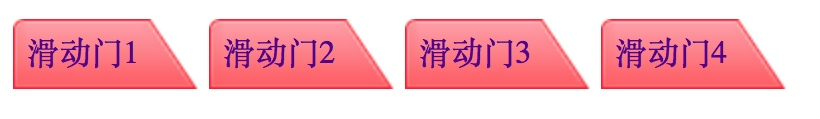

 * 1 滑动门案例项目结构

 
```html
    
    <div class="nav">
			<ul>
				<li> <a href=""> <span>滑动门1</span> </a> </li>
				<li> <a href=""> <span>滑动门2</span> </a> </li>
				<li> <a href=""> <span>滑动门3</span> </a> </li>
				<li> <a href=""> <span>滑动门4</span> </a> </li>
			</ul>	

	</div>

```

* 2 初始化样式 定义导航标签宽高


```CSS

    * {
			padding: 0;
			margin: 0; 
			list-style: none;
		}
		.nav {
			height: 50px;
			width: 450px;
			margin: 30px auto; 
		}

```

* 3 将标签li标签设置内容左侧浮动


```CSS
    .nav li {
			height: 50px;
			/* 设置左侧浮动 内容显示为一行*/
			float: left;
			margin-left: 5px;
		}
        
```

* 4 设置a标签background 


```CSS
    
    a {	
			height: 50px;
			background:url(bg_r1_c1.png) no-repeat;
			padding-left: 7px; 
			line-height: 35px;
			/*注意a标签是行内元素 行内元素不能设置宽高 要设置标签转换*/
			display: block;
			text-decoration: none;
		}
    
```


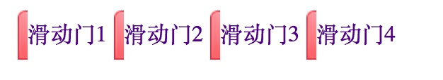


* 5 设置嵌套文字内容的span 标签background


```CSS
    
    span {
			height: 35px;
			padding-right: 30px;
			/*注意span 是行内标签*/
			display: block;
			background:url(bg_r1_c2.png) no-repeat right;
		}
    
```

* 6 设置hover 效果 


```CSS
    
    a:hover {
			background:url(blue_r1_c1.png) no-repeat;
		}		

    /* 当选中a标签时 span 标签连同背景 */
		a:hover span {
			background:url(blue_r1_c2.png) no-repeat right;
		}

```

###精灵图滑动门案例
##字符符号
##vertical
* 图片垂直居中显示 
* 给父容器设置行高 配合vertical：minddenr属性

##尚合案例

###创建文件夹 创建CSS文件
* base.css
* index.css

### 1 初始化样式
* 全局css
* 清除浮动
* 定义版心

```CSS

/* 全局css */

body,p,h1,h2,h3,h4,h5,h6,ul,ol,dl,dt,dd,li {
	 margin: 0;
	 padding: 0;
	 list-style: none;
	 font-size: 14px;
	 font-family: 宋体;
	 color: #000;
}

a {
	 color: #000;
	 text-decoration: none;
}

input,img {
	vertical-align: middle;
	border: 0 none;
	outline-style: none;
	padding: 0;
	margin: 0;
}
 
/* 清除浮动 */
.clearfix:after {
	 content: "";
	 height: 0;
	 line-height: 0;
	 display: block;
	 clear: both;
	 visibility: hidden;
}
.clearfix {
	 zoom: 1;
}


/* 版心 */
.w {
	width: 980px;
	margin: 0 auto;
}

```
  

### 2 logo开始

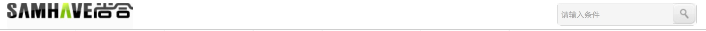


```html
    
     <div class="logo w  clearfix">

    	 	 <div class="left_logo">
    	 	 	<a href="#">上合</a>
    	 	 </div>

    	 	 <div class="right_search">
    	 	 	 <input type="text" value="请输入条件" class="search">
    	 	 	 <input type="button" class="btn">
    	 	 </div>
    	 </div>

```


* 调用版心样式
* 在index.css定义样式 创建logo


```CSS

.logo {

	padding-top: 10px;
	
}
.left_logo {
	 float: left;
}


```

* 创建盒子中内容 left_logo right_search 设置左右浮动 
* left_logo 定义 a 标签 创建logo样式


```CSS

.left_logo  a {
	 width: 179px;
	 height: 39px;
	 display: block;
	 background: url(../images/logo.jpg) no-repeat;
	 text-indent: -1000px;
}

```


### 3 搜索框
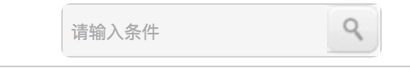


* right_search 设置边框
* 创建right_search 中 搜索框 和 按钮


```html

            <div class="right_search">
    	 	 	 <input type="text" value="请输入条件" class="search">
    	 	 	 <input type="button" class="btn">
    	 	</div>


```


* 设置 搜索框 大小 背景颜色 前景色 padding
* 设置按钮 大小 背景图片 设置浮动解决搜索框和按钮直接的间距
* 圆角属性 border-radius:7px;


```CSS

.right_search {
	 float: right;
	 border: 1px solid #D2D2D2;

	 /* 圆角 */

	 border-radius: 6px;
}

.right_search .search {
	 width: 159px;
	 height: 32px;
	 background-color: #F5F5F5;
	 color: #ACACAC;
	 padding-left: 5px;
	 float: left;
} 

.right_search .btn {
	 width: 33px;
	 height: 32px;
	 float: left;
	 background: url(../images/search2.jpg) no-repeat;
}

```

### 4 导航开始

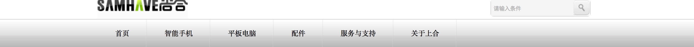


* 定义通栏盒子nav 由于logo盒子没有高度 logo盒子内容都是浮动所以要清除浮动


```html

<div class="logo w  clearfix">

```
* 在通栏盒子nav 设置版心盒子 设置ul列表


```html

<div class="nav">
    	 	 <div class="w">
    	 	 	  <ul>
    	 	 	  	<li><a href="#">首页</a></li>
    	 	 	  	<li><a href="#">智能手机</a></li>
    	 	 	  	<li><a href="#">平板电脑</a></li>
    	 	 	  	<li><a href="#">配件</a></li>
    	 	 	  	<li><a href="#">服务与支持</a></li>
    	 	 	  	<li><a href="#">关于上合</a></li>
    	 	 	  </ul>
    	 	 </div>
    	 </div>

```
* 通栏盒子nav 设置背景图片 背景图片 边框
* 设置li 浮动一行显示 文字垂直居中 设置背景图片 给a标签设置padding值 


```CSS
/* 导航开始 */
.nav {
	 height: 55px;
	 border-top: 1px solid #ccc;
	 background: url(../images/nav_bg.png);
}

.nav li {
	 float: left;
	 line-height: 55px;
	 background: url(../images/nav_bg-line.png) no-repeat right;
}
.nav li a {
	 padding: 0 35px;
}

```

### 5 广告区域

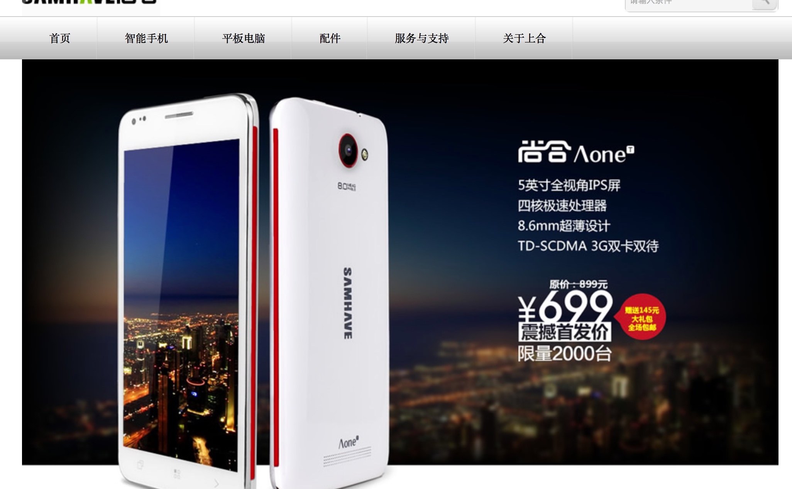


* 定义banner 设置版心 添加img图片


```html

<!-- banner部分开始 -->
    	 <div class="banner">
    	 	<div class="w">
    	 		<a href="#">
    	 	 	   
    	 	    </a>
    	 	</div>
    	 </div>
    	 
```

### 6 最新公告
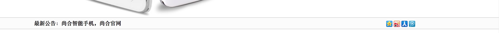


* 定义通栏盒子news 添加上线边框 高度 背景颜色 
* 添加版心盒子 设置左侧浮动盒子 右侧浮动盒子


```html

 <!-- 最新公告开始 -->
    	<div class="news">
    	 		
    	 	<div class="w">
    	 		
    	 		 <div class="left_news">
    	 		 	<h4> 最新公告：尚合智能手机，尚合官网</h4>
    	 		 </div>

    	 		 <div class="right_news">
    	 		 	 <a href="#">
    	 		 	 	 
    	 		 	 </a>
    	 		 	 <a href="#">
    	 		 	 	 
    	 		 	 </a>
    	 		 	 <a href="#">
    	 		 	 	 
    	 		 	 </a>
    	 		 	 <a href="#">
    	 		 	 	 
    	 		 	 </a>
    	 		 </div>
    	 	</div>
    	 
    	 </div>

```

* 由于在初始化样式中已经设置 **visibility: hidden**; 父元素中设置了行高所以图标是居中的


```CSS

/* 最新公告开始 */
.news {
	 height: 29px;
	 line-height: 29px;
	 border-top: 1px solid #ccc;
	 border-bottom: 1px solid #ccc;
	 background-color: #FBFBFB;
}

.left_news {
	 float: left;
}

.right_news {
	 float: right;
}


```

### 7 商品列表展示

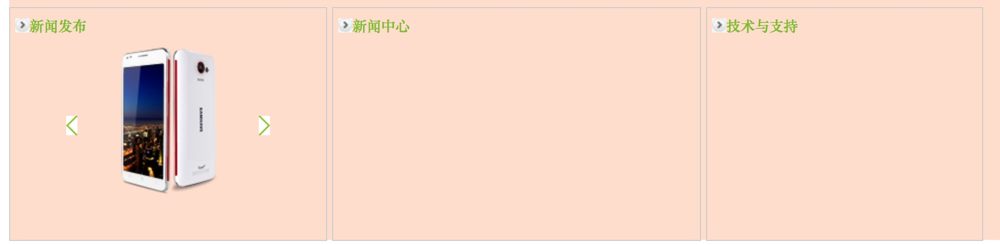


* 定义版心盒子 设置margin 
* 添加 左中右三个盒子 设置浮动 设置大小 边框  margin


```html

<!-- 商品列表 -->
	     <div class="product  w clearfix">
	     			
	     		 <!-- 左侧盒子 -->
	     		 <div class="l_box"></div>

			      <!-- 中间盒子 -->
	     		 <div class="m_box"></div>
	     		 
	     		 <!-- 右侧盒子 -->
	     		 <div class="r_box"></div>
	     		 
	     	</div>
	     		 

```

### 8 商品列表展示 新品发布盒子
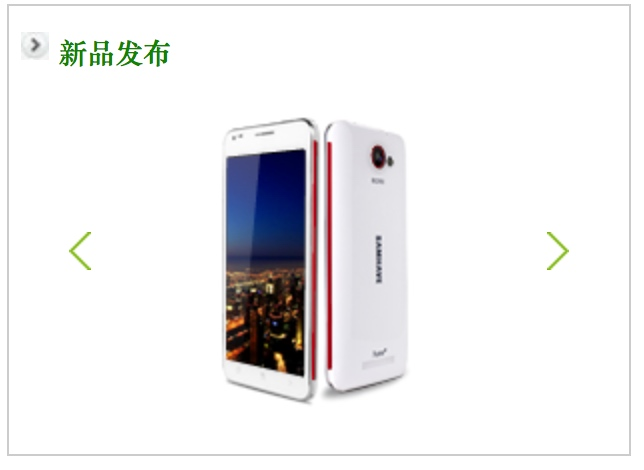


* 设置公共标题样式 

```CSS
    
.product .title  {
	 padding-top: 13px;
	 padding-left: 6px;
}

.product .title i {
	 width: 14px;
	 height: 14px;
	 display: block;
	 background: url(../images/o.jpg) no-repeat;
	 float: left;
	 margin-right: 5px;
}

.product .title h4 {
	 float: left;
	 color: green;
}

```

* 设置内容盒子 清除title浮动 

```html

<!-- 左侧盒子 -->
<div class="product  w clearfix">
	     		 <div class="l_box">
	     		 	 <div class="title clearfix">
	     		 	 	 <i></i>
	     		 	 	 <h4>新品发布</h4>
	     		 	 </div>
				
					 <div class="content">
					 	  

					 	  <a href="#" class="lpage">
					 	  	
					 	  </a>

					 	  <a href="#" class="rpage">
					 	  	 
					 	  </a>
					 </div>
	     		 </div>

```


* 设置产品图 和左右按钮图片 设置绝对定位 子绝父相


```CSS

.l_box {
	 float: left;
	 width: 310px;
	 height: 224px;
	 border: 1px solid #ccc;
}


.l_box .content  {
	 padding-top: 20px;
	 text-align: center;

	 position: relative;
}

.l_box .content a  {
	 position: absolute;
	 top: 80px;
}

.l_box .content .lpage {
	  left: 30px;
}

.l_box .content .rpage {
	 right: 30px;
	 text-decoration:none;
}

```

### 9  商品列表展示 新闻列表盒子
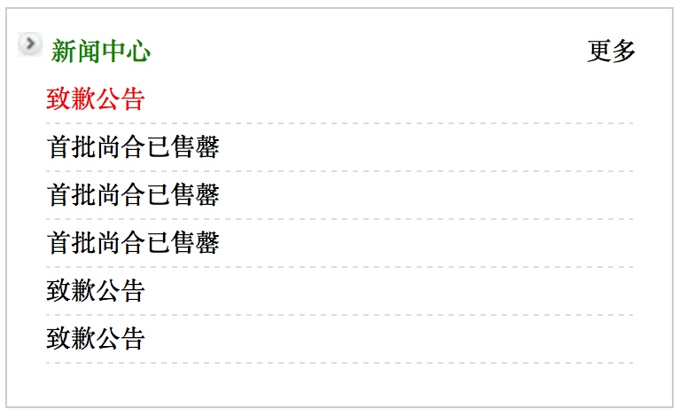


```HTML
 <!-- 中间盒子 -->
	     		 <div class="m_box">
	     		 	   <div class="title clearfix">
	     		 	 	 <i></i>
	     		 	 	 <h4>新闻中心</h4>

	     		 	 	 <a href="#">更多</a>
	     		 	   </div>

	     		 	   <div class="content">
	     		 	   	
	     		 	   	    <ul>
	     		 	   	    	<li><a href="#" style="color: red;">致歉公告</a></li>
	     		 	   	    	<li><a href="#">首批尚合已售罄</a></li>
	     		 	   	    	<li><a href="#">首批尚合已售罄</a></li>
	     		 	   	    	<li><a href="#">首批尚合已售罄</a></li>
	     		 	   	    	<li><a href="#">致歉公告</a></li>
	     		 	   	    	<li><a href="#">致歉公告</a></li>
	     		 	   	    </ul>
	     		 	   </div>
	     		 </div>
```

* 定义content盒子 创建列表
* 定义li样式 高度 大小 边框 行高


```CSS

/* 中间盒子 */
.m_box {
	 float: left;
	 height: 224px;
	 width: 375px;
	 border: 1px solid #ccc;
	 margin-left: 10px;
}
.m_box .content  {
	padding: 5px  22px 0 22px;
}

.m_box .content li {
	  height: 26px;
	  line-height: 26px;
	  border-bottom: 1px dashed #DCDCDC;
}

.m_box .title a {
	 float: right;
	 margin-right: 20px;
}

```

### 10 商品列表展示 技术与支持盒子 
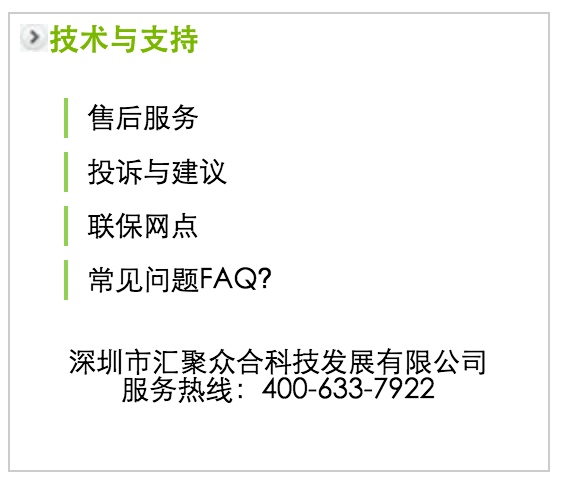


* 定义content盒子 创建列表 设置padding
* 定义li样式 高度 大小 边框 行高


```html

<div class="news_3">
			<div class="news_title">
				<h3>技术与支持</h3>
			</div>	

					<ul>
						<li>售后服务</li>
						<li>投诉与建议</li>
						<li>联保网点</li>
						<li>常见问题FAQ?</li>
					</ul>	
			<div class="news3_content">
				<p>深圳市汇聚众合科技发展有限公司</p>	
				<p>服务热线：400-633-7922</p>
			</div>
		</div>

```


```CSS

.news_3 ul {
	width: 215px;
	height: 75px;
	margin: 0 auto; 
}

.news_3 li {
	width: 215px;
	height: 20px;
	line-height: 20px;
	padding-left: 10px;
	margin-top: 7px;
	border-left: 2px solid #90d055;   
}

.news3_content {
	text-align: center;
	margin-top: 50px;
}

```

### 11 脚布局

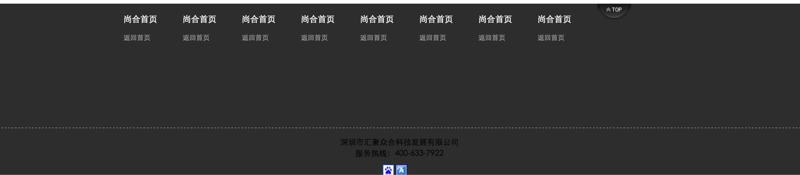


* 分为上下两个盒子 top_footer bot_footer
* 创建自定义列表 定义列表样式 


```html

<!-- 脚布局 -->
	 <div class="foot_box">
	 	<div class="foot_content">
	 		<div class="w">
	 			<dl>
	 				<dt>尚合首页</dt>
	 				<dd>返回首页</dd>
	 			</dl>

				<dl>
	 				<dt>尚合首页</dt>
	 				<dd>返回首页</dd>
	 			</dl>	

				<dl>
	 				<dt>尚合首页</dt>
	 				<dd>返回首页</dd>
	 			</dl>

				<dl>
	 				<dt>尚合首页</dt>
	 				<dd>返回首页</dd>
	 			</dl>

				<dl>
	 				<dt>尚合首页</dt>
	 				<dd>返回首页</dd>
	 			</dl>

				<dl>
	 				<dt>尚合首页</dt>
	 				<dd>返回首页</dd>
	 			</dl>	

				<dl>
	 				<dt>尚合首页</dt>
	 				<dd>返回首页</dd>
	 			</dl>

				<dl>
	 				<dt>尚合首页</dt>
	 				<dd>返回首页</dd>
	 			</dl>	 		 				 				 			 			
	 		</div>
	 		
	 	</div>
	 	<div class="foot_copyright">
	 		<p>深圳市汇聚众合科技发展有限公司<br>
			服务热线：400-633-7922</p>

			<div class="foot_copyright_icon">
		 		
		 		
		 	</div>			
	 	</div>
	 </div>

```

```CSS

.foot_content dl {
	float: left;
	width: 105px;
	margin-top: 20px;
}

.foot_content dt {
	color: #FFF;
	margin-bottom: 20px;
	font:15px "宋体";
}
.foot_content dd {
	color: #999999;
	font: 12px "宋体";
} 

```

* 由于p标签的margin-top属性会导致垂直外边距塌陷问题 所以要给foot_copyright盒子设置**overflow: hidden;**属性解决

```CSS

.foot_box {
	width: 100%;
}

.foot_content {
	width: 100%;
	height: 221px;
	background: #2d2d2d;
	border-bottom: 1px dashed #999999; 
}

.foot_copyright {
	width: 100%;
	height: 83px;
	overflow: hidden;
	background: #2d2d2d;
}

.foot_copyright p {
	text-align: center;
	line-height: 20px;
	margin-top: 15px; 
}

.foot_copyright_icon {
	width: 60px;
	margin: 10px auto; 
}

```


