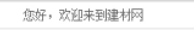

# CSS基础Day07_盒子边框_盒子大小_图片垂直居中_梅兰商贸_京东案例

[TOC]

##盒子边框问题 
* 问题描述:当并列的两个盒子同时设置边框 会导致中心边框宽度累加

* 解决方法 设置盒子 **margin-left: -1px;** 
* 当设置hover 时通过改变盒子层级的方式解决 边框被压的问题

```CSS

div {
			 	 width: 200px;
			 	 height: 200px;
			 	 border: 1px solid red;
			 	 float: left;

			 	 margin-left: -1px;

			 }

			 div:hover {
			 	 border-color: blue;
			 	 position: relative;
			 }

```

-------

##盒子大小问题


* 问题描述: 当盒子设置当鼠标悬停时才显示边框的效果时 在hover中添加边框盒子大小会改变
* 解决方式1: 在默认情况下设置透明边框 在 hover 中只改变边框颜色
* 解决方式2: 在 hover 中添加边框并通过box-sizing: border-box;改变盒子大小计算方式

```CSS

        .box:hover {
			 	 border: 5px solid green;
			
				 /* 改变盒子计算方式 */
			 	 box-sizing: border-box;	
			     /* 盒子的默认计算方式 */
			 	 /* box-sizing: content-box; */
			 }

```

--------

##图片垂直居中问题
* 问题描述:实现图片在盒子中垂直居中效果
* **解决方式1:** 在盒子先设置行高**line-height**为当前盒子高度 然后给图片设置**vertical-align:middle** 属性 

```CSS
        /*第一种方式*/
        .box {
			 	 width: 300px;
			 	 height: 300px;
			 	 border: 1px solid red;
			 	 text-align: center;
			 	 line-height: 300px
			 }
			 
			 img {
			 	 vertical-align: middle;
			 }

```

* **解决方式2:** 在盒子中添加span 标签 设置span标签高度为100% 注意模式转换,设置span标签**vertical-align:middle**属性, 然后给图片设置**vertical-align:middle** 属性


```CSS
        /*第二种方式*/
        .box {
			 	 width: 300px;
			 	 height: 300px;
			 	 border: 1px solid red;
			 	 text-align: center;
			 }
			 
			 span {
			 	 height: 100%;
			 	 display: inline-block;
			 	 vertical-align: middle;
			 } 

			 img {
			 	 vertical-align: middle;
			 }

```

* **解决方式3:** 通创建伪元素的方式设置
    
    ```CSS
    
        /*第三种方式*/   
        div:after {
			 	 content: "";
			 	 height: 100%;
			 	 display: inline-block;
			 	 vertical-align: middle;
			 }

    ```
    
* **解决方式4:** 推荐方式 由于在table中默认有vertical-align: middle;的属性 所以通过模拟table表格也可以做到垂直居中的效果


```html
        <div class="table">
    			 <div class="td">
    			 	 
    			 </div>
    		</div>
```
```CSS
        .table {
				 width: 300px;
				 height: 300px;
				 border: 1px solid red;
				 display: table;
			}
			
			.td {
				display: table-cell;
				text-align: center;
				vertical-align: middle;
			}
			
```


##梅兰商贸案例
###1 公共样式
* 创建网站根目录 CSS文件夹
* 创建公共样式 base.css  清除浮动 版心970px
* 引入样式 创建index.css文件


```CSS

/* 全局css */
body,p,h1,h2,h3,h4,h5,h6,ul,ol,dl,dt,dd,li {
     margin: 0;
     padding: 0;
     list-style: none;
     font-size: 14px;
     font-family: 宋体;
     color: #000;
}

a {
     color: #000;
     text-decoration: none;
}

input,img {
    vertical-align: middle;
    border: 0 none;
    outline-style: none;
    padding: 0;
    margin: 0;
}

/* 清除浮动 */
.clearfix:after {
    content: "";
    height: 0;
    line-height: 0;
    display: block;
    clear: both;
    visibility: hidden;
}
.clearfix {
    zoom:1;
}

/* 版心 */
.w {
    width: 970px;
    margin: 0 auto;
}

```

-------

###2 顶部开始


* 设置高度26px 加入底部边框 背景颜色#f7f7f7 设置行高
* 嵌套版心居中盒子 创建 左右浮动盒子



* 左浮动盒子加入标题 
* 右侧浮动盒子加入ul列表 li标签设置浮动一行显示


* 将有背景的li标签设置背景图片 sj.png right显示
* 给li标签设置padding值 左右10px; 

 
-------

###3 版心开始
* 创建主体main_box


-------

####logo部分开始
* 创建logo盒子 加入左浮动盒子 右浮动盒子 
* 左浮动盒子加入 a 标签 设置背景图片 去掉文字 宽度200px 高度84px 注意模式转换
* 右浮动搜索盒子 设置margin-top 29像素 添加input 输入框 宽419px 28px 设置边框
* 设置输入框按钮 背景search

-------


####导航开始 


* 请除浮动 创建nav盒子 设置高度 设置下边框 行高 margin-bottom   
* li标签设置浮动 a 标签设置高度 padding 转换 hover

-------


####banner开始
* 创建banner盒子 创建左中右三个盒子 使用子代选择器选择直接子代浮动


* 设置左盒子宽度200高度209 bgc 
* 添加自定义列表 设置dt 高度30 行高30 bgc 文字颜色 padding-left 字体加粗
* 设置dd标签设置 margin-left 加入背景图片 和高度38px  padding-left

-------


#####中间banner


* 添加img标签

-------


#####右侧盒子 
* 添加上下两个盒子 添加img图片

-------


####建筑材料title


* 由于样式重复 创建公共盒子public 清除浮动 
* 设置 高度34 行高 margin 边框 padding
* 添加标题标签 设置黑色 加粗

-------


####建材列表板块


* 设置 product_list盒子 添加 l_list r_list 盒子 设置左右浮动
* 左右盒子设置 边框 宽高 左宽727 左高344 右宽228

-------


#####l_list左侧盒子


* 上下两个盒子相同 左右两个盒子样式相同 定义一个公共样式盒子 
* 设置小盒子宽度320和高度143 设置margin 左26 上152 设置浮动


* 设置左右两盒子 设置浮动 左盒子设置上下盒子


* 左侧盒子 添加段落p1 p2 p3 p4 分别设置高度行高 文字大小等

* 创建横线盒子 设置margin 将横线些如中间

-------


##### r_list右侧盒子


* 创建自定义列表 设置dt高度 行高 边框 bgc 
* 设置dd 高度 行高 bgc padding-left 

 
-------

####儿童安全作业板块
* 添加title 样式 调用public title样式
* 添加左右浮动盒子


* 左盒子上下结构
* 下盒子放入 四个div 设置浮动
* 

 * 添加img 和 段落 

 * 右侧和上下布局设置两张图片

####工艺艺术品

### 脚布局

----------

##京东案例
###1 公共样式 版心
* 创建头部样式css 和脚布局样式footer index。css base.css
* 版心宽度 1190px

###顶部开始


* head 高度80px 
* div>a 设置a标签的背景图片

###头部导航


* 通栏导航 创建nav 盒子 设置bgc 高度30px 行高 
* 添加版心盒子 创建左右浮动盒子 
* 左浮动盒子 添加字符图标 北京 设置margin-ledt
* 右浮动盒子 添加ul列表 li标签左浮动 
* 使用li添加竖线 通过margin-top 移动竖线给竖线设置padding值

###头部视图

* 设置版心宽 高度140的盒子 依次创建6个盒子 
* a 标签设置logo 给父容器设置定位 将logo向上移动
* 设置搜索框 搜索框盒子 设置浮动 margin 移动盒子
* 设置购物车样式 角标用绝对定位 使用 **border-radius**：7px； 设置边框圆角
* 设置关键词列表 
* 设置导购列表

###首页样式
* index.css

####主体内容开始


* 创建背景盒子 加入a标签 宽度100% 高度484 设置背景图片 设置位置 top center 
* 设置绝对定位 让该盒子不占位置 

#####主体banner盒子开始
* 设置主体版心盒子 设置高度482 
* **注意主体版心盒子 如果不设置相对定位 层级比bg盒子要低** 
* 主体部分创建左中右三个盒子 设置浮动
* 左盒子设置ul列表

* 中部盒子 设置上下两个盒子
* 上盒子 


