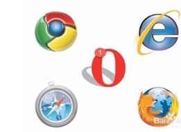
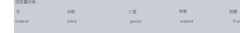
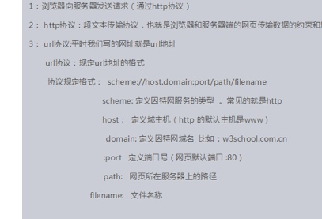
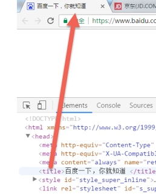

# Html基础Day01_多媒体标签_路径_超链接_锚链接_特殊字符

[TOC]

##网页介绍

    ☞ 组成： 文字，图片，按钮，输入框，视频。。元素   组成的
		  ☞ web标准
			 web标准： 制作网页的规范
		  ☞ web标准：
				  ◇ 结构标准   （html）
					◇ 表现标准   (CSS： 美化网页)
					◇ 行为标准   (JS)

###浏览器（了解）


 		内核： 渲染引擎


	     ◇浏览器与服务器之间的关系


		
		
##１.4	HTML
   ☞概念： Hyper  Text  Markup  Language (超文本标记语言)
		 ☞超文本： 在网页中能够实现页面跳转的文本 【超链接标签】
	 ☞ 标记： 在网页中显示的标签 【在网页中做记号】

		 ☞ 结构
			<!Doctype  html>  指定文档类型
			<html>  根标签
				  <head>
					   <title>网页标题</title>
					</head>
					<body>
						  在浏览器中看到的所有网页信息都要放到body标签中
				   </body>
			</html>

		
	  ☞ 结构中标签的分类
				◇ 单标签： 标签只有开始没有结束
				  如： <link>  ,
	
			  ◇ 双标签： 标签有开始有结束
				 如： <head></head>  <body></body>

	 ☞标签关系分类
			   ◇ 嵌套关系  （父子关系）
				 ◇ 并列关系  （兄弟关系）
		☞文件后缀名问题
			 1. 注意文件后缀名决定文件打开方式。
			 2. 网页的后缀名是.html 或者 .htm

			 

##１.5	开发工具介绍
    ☞ 新建文件
			    ◇ 通过 sublime新建文件
				  

			   ◇ ctrl+n  +   ctrl+s
				 注意： 在使用如下命令的时候，文件必须是一个html文件
						 ! + tab   或者  html:5 +tab


				◇ 新建文件夹
					    

				◇ 快捷键
				  ctrl+shift+d   快速复制
				  ctrl+f        快速查找
				  ctrl+h        查找替换
##１.6	HTML标签介绍
   ☞单标签（标记）
				◇注释标签   <!--注释信息 -->    ctrl+/
			◇换行标签      
		  ◇横线标签   


	   ☞双标签
			 	 ◇标题标签 
						 <h1></h1>  一号标题

		 注意：
				 1. 从语义化角度考虑一个网页中一号标题最好只出现一次

			 ◇ 段落标签
				 


			 ◇表示强调标签
			   	◆文本标签  
					    color：改变文字颜色属性
						  size： 改变文字大小属性
	

				  ◆ 文本加粗显示  
						<strong> </strong>
					    或
					  <b></b>

					◆文字斜体显示
					  <em></em>
						 或者
						<i></i>

				  ◆下划线标签
				     <ins></ins>
					 或者
					   <u></u>
				  ◆ 删除线
						 <del></del>
							或者
						 <s></s>

			 ☞没有语义的标签
				  ◇ 

    实现网页布局
				  ◇  在网页布局过程中使用
			  注意：
					　div 标签中可以包含任何标签
##１.7	 多媒体标签
  图片标签
		写法：
				 

	  属性：
				src: 设置一个要显示的图片路径
			  title： 设置鼠标悬停到图片上的文字提示
			  alt:  对图片的描述信息  为搜索引擎提供服务
			 width:  宽度
			height:  高度	 
##１.8	路径
   ☞绝对路径
				1. 带有磁盘目录的路径
			  2. 带有具体网址  http://www.baidu.com/img/1.jpg
		 ☞相对路径 

		    ◇如果资源文件（img）和当前文件(html)在同一个文件夹中,  src=”文件名”

			
			 ◇ 如果资源文件（img）和当前文件(html)不在同一个文件夹中, 如果页面在图片的上一级目录中， src=”图片所在文件夹名称加上”/”+图片名称。


	  ◇  如果资源文件（img）和当前文件(html)不在同一个文件夹中, 如果页面在图片的下一级目录中src=”../加上图片名称”
		  注意：
				 一个../代表返回一级

##１.9	 超链接
  写法：
			
	  作用：
			 跳转页面


		属性：
			  title：  设置鼠标悬停到超链接上的文字提示
			 target： _self    默认值在当前页面中打开新页面
						 _blank    在新窗口中打开页面

      超链接跳转页面的其他写法：
			
##１.10	 锚链接
		1.锚链接属于超链接的另外一种用法。实现的是本页面内部的跳转。
		  
##１.11	 特殊字符

##１.12	 HTML5（补充，不需要特别掌握）
   ☞ 过渡版本Transitional
			    可以包含所有的html元素或者属性

	   ☞ 严格版 strict
			  可以包含所有的html元素或者属性，但是不包含已经被废弃掉的标签 如： font,b，i 和 属性  align

	   ☞有语义的标签
		 

		 注意：以上标签与div的用法一样，只是具有一定的语言性。

