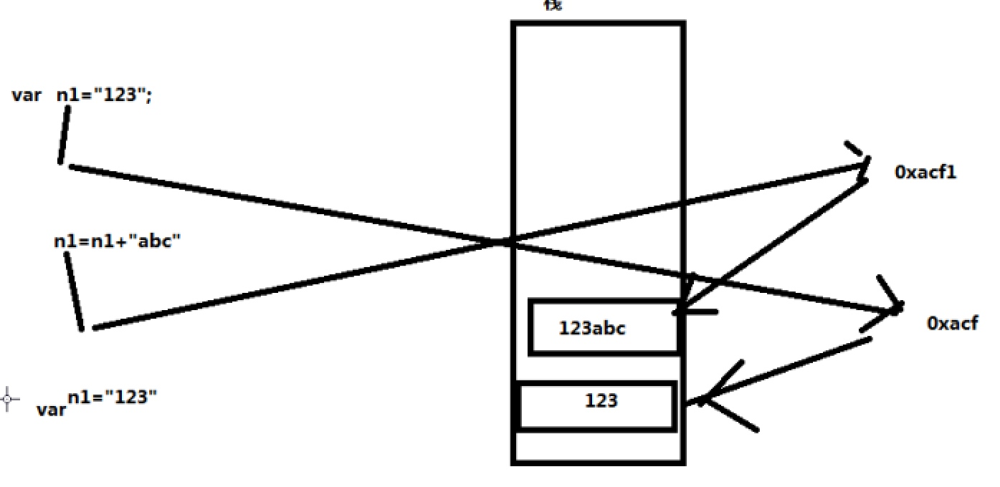

# JavaScript基础Day01_js书写位置_js属性介绍_js输出消息_变量_数据类型_运算符_数据类型判断

[TOC]

###概念： 
* 脚本编程语言
* 不需要通过web服务器直接在浏览器中就可以执行
* js可以被嵌入到HTML页面中执行

------

###组成
* 语法标准 ECMASCRIPT
* DOM操作 操作页面上的元素API
* BOM操作 操作浏览器的办法功能API

-----

###特点及使用范围
* 简单易用 提供封装好的方法属性
* **解释执行** js特点 
* 基于对象： 

-----

##Js书写位置

### 内嵌式写法
* 在界面任何位置加入 script标签 


```html
<!-- 内嵌式写法 -->
        <script type="text/javascript" >
        		// js代码
        </script>

```
  -----
  
### 外联式写法
* 新建一个js文件 后缀名js
* html界面 添加script标签设置src属性
* 外联式写法可以添加多个js文字


```html
    <!-- 外联式写法 -->
        <script type="text/javascript" src="1.js"></script>
        <script type="text/javascript" src="2.js"></script>
        <script type="text/javascript" src="3.js"></script>
```

------

### 行内（不常用）   

```html
      <div  Onclick="main"></div>
```

-------

##js属性介绍

属性 | 说明   
----| ----
async | 异步效果  注意属性是浏览器将外部js 文件下载完成后在立即执行 
defer | 延时执行

-----

##js中常用的输出消息方式

 
方法名 | 说明 | 参数
---- | ---- |----
alert(""); | 对话框显示 | string int
document.write(""); | 页面显示 |string int 
console.log(""); | 日志显示 | string 
prompt(""); | 接收用户输入消息 输入框 | string
confirm("确定退出吗？"); | 可点击对话框 | string

-----

##变量
* 概念：会变化的数据 用来存储数据的容器

* 变量定义： 

```javascript

    var 变量名 = 值;
    
```

* 注意 定义变量必须使用 var 关键字 
* “=” 赋值运算符
* 一个变量只能保存一个值 只能保存最后一次的赋值结果

------

###变量的命名规范
* 不推荐使用汉字定义变量
* 不能使用特殊字符
* 数字不能开头 或使用纯数字
* 变量名中间不能出现空格
* 不能使用关键字定义变量
* 不推荐使用保留字定义变量

------

###书写规范
* 注意 一行完整的代码结束后必须以 ; 结束
* js 是区分字母大小写的

##数据类型
* 概念 数据类型是用来确定变量的存储位置的

###数字类型 number
* 如果一个变量的值是纯数字，那么还变量的就是数字类型 
* 数字类型变量取值范围 
* 数字类型的表示方式 
    * 十进制表示法
    * 十六进制表示法 0x开头
    * 八进制 0开头

-----
    
###字符串类型 string 
* 如果一个变量的值使用双引号或者单引号都是字符串类型
* 字符串特性:不可变性 在内存中的不可变
* 注意 请不要大量的拼接字符串


------

####字符串属性

属性 | 说明 | 属性值 
---- | ---- | ----
length | 获取字符长度


------

####转义字符

```javascript

    /* 转义字符:"\" */
	alert("今天学习\"javascript\"."); 
	
```
* \r 回车符
* \n 换行符

------

###布尔类型 boolean
* 如果一个变量的值是 true 或者 false 那么该变量数据类型是布尔类型

------

###undefined类型
* 一个变量的值是 undefined 或者定义了一个变量,**没有给该变量赋值** 那么该变量的数据类型就是undefined

------

##运算符

###比较运算符
符号 | 含义 
--- | ---
  > | 大于
  < | 小于
== 或 === | 等于
!= | 不等于
>= | 大于等于
<= | 小于等于

* 通过比较运算符得到布尔类型的结果

-------

###算数运算符 
* 如果是数字字符串相减(相除) 最后结果是数字 由于进行了**隐式数据类型转换**
*  如果非数字的字符串相减(相除) 最后得到结果是NaN (NaN: not a number )
* 如果除数是0 结果是无穷大infinity

-------

###数据类型判断
* 使用方法 typeof(变量) 获取变量的数据类型
* 注意 一个变量值是NaN 那么该变量的数据类型是number 类型 
* 一个变量值是infinity 那么该变量的数据类型是number 类型 
* isNaN()是否 不是一个数字

------


