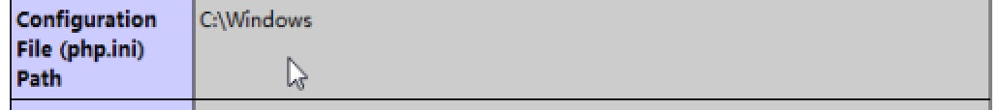
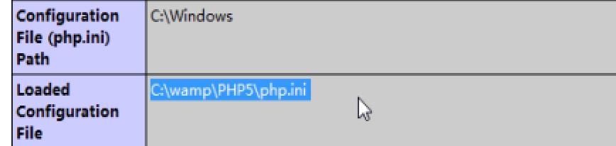

# PHP_Day02_语言基础_变量


[TOC]

##PHP5的配置设置(php.ini)
###PHP显示的时间 与 本机时间相差


* 修改PHP的配置文件

****

#### 1 产生PHP的配置文件

* 
* ==将php.ini-development 复制一份后 从新命名为php.ini==

****

#### 2 修改时区
* 修改PHP的配置文件 **php.ini**
* ==修改过php.ini文件后,必须重启 Apache服务==


****

#### 3 修改配置文件的路径
* 查看本机php.ini文件的真实路径 


* 修改Apache的主配置文件 **http.conf**
* ==当Apache启动时,指定php.ini文件路径==


* ==重启Apache==




****

##MySQL 数据库安装配置
###简介 
* MySQL 是瑞典 AB 公司现在被Oracle公司收购了开发的关系型数据库 通俗讲:就是存储数据的地方

 
###安装
####在CMD 模式下,测试MySQL是否安装
* /usr/local/mysql/bin/mysql -hlocalhost -uroot -p12345
* 


****

###使用PHP 去自动装载MySQl模块
* MySQL 对应PHP 来说也是它的一个模块或者插件
* ==修改PHP的配置文件 **php.ini**,使PHP 能够自动装载MySQL模块==

* 1 开启PHP拓展文件目录


* 2 开启


* 3 重启Apache

****

####测试PHP与MySOL是否连接


****

##PHP基础 
* PHP Hypertext Preprocessor 超文本预处理器,是嵌入到HTML文件中的服务器的脚本语言
* 一个PHP 文件中可以包含:HTML CSS JS jquery PHP MYSQL 代码


* ==PHP 主要应用于Web开发领域==
* PHP 特点:入门简单.免费的.可以连接多种数据库
* PHP的语法 与C JAVA  Perl JS 语法比较相似
* PHP是服务器端的脚本语言,脚本语言相对编程语言简单
* PHP只能运行在服务器端 在客户端看不到PHP任何代码
* PHP文件以.php后缀

****

###语言基础
* PHP 与 ASP JSP 一样都是嵌入到HTML文件中的服务器端脚本语言
* PHP 文件的后缀是.php
* PHP代码的标记

```php
<?php
  //PHP代码  
?>
```

* ==PHP中每行代码必须英文;号结尾==

* ==PHP语言是区分大小写的, **关键字**和**函数名****不区分**大小写==

****

### PHP文件访问方式
* ==访问PHP 文件,必须要经过域名来访问,每个域名对应一个虚拟空间(目录)==


* PHP程序代码,不会发往浏览器,发往浏览器,只有执行的结果


****

###语句结束符
* 每行PHP代码,必须英文下的分号结束
* 最后一行PHP代码分号可以省略
* 所有语法结构都不建议加分号: for  switch ...

****

### 注释
* 单行注释: `//` 或者 `#` 
* 多行注释: `/**/`多行注释不能嵌套

****

### 变量
* 变量是临时存储数据的容器
* 变量的存储内存当中
* ==网页执行完毕后,内存会被释放,变量值会消失==

####变量的命名规则
* 变量名称只能包含:字母,数字,下划线
* ==PHP变量名,必须以美元符号`$`开头,但`$`符号不是变量的一部分,只是声明变量名==

```php
    $name $school $Name  
```

* ==变量名是区分大小写的== 
* ==PHP中的变量不用声明,**直接赋值即可**==
* ==PHP的变量的类型,主要取决与赋值,赋什么值就是什么类型==
* 变量的命名规范 
    * 驼峰式命名
    * 下划线式命名:要求全小写
    

```PHP
    // 赋什么值就是什么类型
    // PHP的变量名是区分大小写的
    //"." 是连接变量和字符串的符号
    $name = "abc"; //字符串
    $Name = 200;   //整型
    echo $name."<br>".$Name;
    
```


```PHP

//声明网页的字符集:告诉浏览器用什么字符集翻译下面的字符
header("content-type:text/html;charset=utf-8");

//输出个人基本信息
//(1) 变量初始化: 声明变量并赋值
$name = "lifang";
$age = 18;
//(2) 程序的运行过程:在PHP中 双引号的变量可以直接解析
//在双引号内,可以用大括号来区分变量可以直接解析
$str = "<h2>{$name} 的基本信息 </h2>";  
$str .= "姓名: $name<br> "."年龄: $age";

echo $str;

```


