# PHP_Day03_变量操作_变量的值传递和引用传递_超全局变量
>PHP_基础_Day03知识点
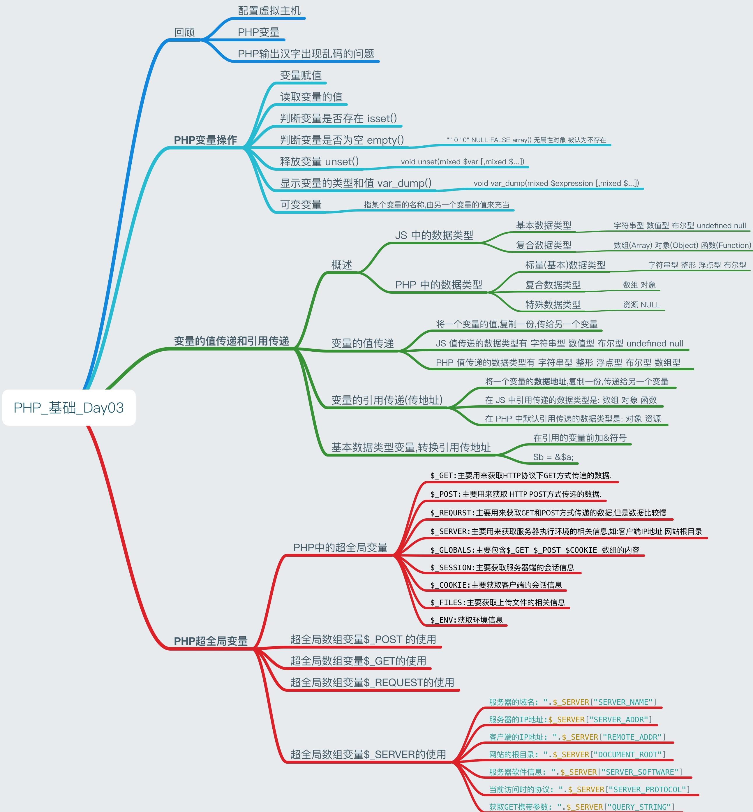


[TOC]

##配置虚拟主机
1. 本机域名解析 -- hosts
2. Apache主配置 ==httpd.conf==
    * 端口的设置 ==Listen== 默认端口号是80
    * 设置包含虚拟主机配置 ==Include conf==
3. Apache虚拟主机配置 ==httpd-vhosts.conf==
      * 第1个域名主机优先级最高
      
```Apache
# 声明虚拟主机IP地址和端口
NameVirtualHost *:80 

#配置www.2017.cn虚拟主机
<VirtualHost *:80>
    #给虚拟空间绑定域名
    SeverName www.2017.cn
    
    #默认首页
    DirectoryIndex index.html index.php
    
    #网页根目录
    DocumentRoot "C:/itcast/lesson/day03"
    
    #目录权限
    <Directory "C:/itcast/lesson/day03">
        #是否显示首页
        Options Indexes
        #禁止和允许的执行顺序
        Order deny,allow
        #设置允许权限
        Allow From All
    </Directory>
</VirtualHost>

```

****

##PHP变量
* 变量是**临时**存储数据的容器
* 变量只能存在**内存中**
* 网页执行完毕,该网页相关的变量都会释放
* PHP变量由:字母 数字 下划线 组成
* PHP变量名称必须以`$`符号开头 说明`$`之后是变量名称 `$`不属于变量的一部分
* PHP变量不能以数字开头命名

****

##PHP输出汉字出现乱码的问题
* 编辑器软件的模拟字符集 ,要与`<meat charset = utf-8>` 设置的字符集一致
* 纯PHP文件中 ,使用`header()`函数来声明网页字符集
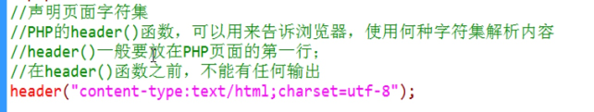

-------

##PHP变量操作
### 1 变量赋值
* 变量赋值使用 `=`  把`=`右边的运算结果,装到`=`左边的容器中

****

### 2 读取变量的值

```PHP
    //(1) 声明变量给变量赋值
    $ str = "一二三"

    //(2)程序运行过程
    $title = "<h2>".$str."</h2>";
    
    //(3)输出结果: 在浏览器输出结果
    echo $title."<hr>";

```

****

### 3 判断变量是否存在 isset()
* JS 中所有内容都是对象 Number Boolean String Date等
* PHP 中**没有内置对象**,但是可以自己定义对象
* PHP 中**系统函数**很多,大约 4000 多个函数

```PHP

    //描述:检测变量是否存在    
    //语法: bool isset(mixed $var [,mixed $...])
    //返回值: 检查变量是否设置,并且值不是NULL 返回TRUE 否则返回FALSE
    //注意: 只能用于检查变量,不能检测常亮
    //用法: isset()可以用来屏蔽变量不存在的错误
    
    $a = NULL;
    
    if(isset($a)){
        echo "变量a存在"
    }else {
        echo "变量a不存在"
    }
        
```
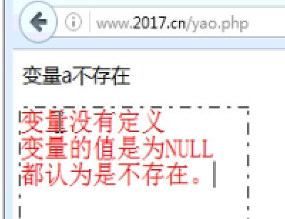

****

### 4 判断变量是否为空 empty()
* 检查一个**变量是否为空**
* 语法 `bool empty(mixed $var)`
* 通过var 是 非空或者非零的值 返回FALSE
* `"" 0 "0" NULL FALSE array()` 以及没有任何属性的对象都被认为不存在


```PHP

    $a = 0;         //int
    $a = "";        //String
    $a = "0";       //String
    $a = NULL;      //NULL
    $a = false;     //Bool
    $a = array();   //数组
    
    if(empty($a)){
        echo "变量a为空"
    }else {
        echo "变量a不为空"
    }

```

* JAVA属于强数据类型语言,在程序的运行过程中,变量的类型不能变
* PHP 和 JS 属于弱类型语言,在程序运行过程中,变量的类型随时可以变

****

### 5 释放变量 unset()

* 变量的释放 ,可以手动释放,或该网页执行完毕变量会全部释放
* 描述:释放给定的变量
* 语法:`void unset(mixed $var [,mixed $...])` 没有返回值 可以删除多个一存在的值 中间用`,`号隔开
* 提示:如果变量执行了unset()函数,则变量的值变成了NULL

```PHP

 $a = 100;
 $b = 200;
 echo $a + $b;
 //释放变量
 unset($a,$b);
       
```
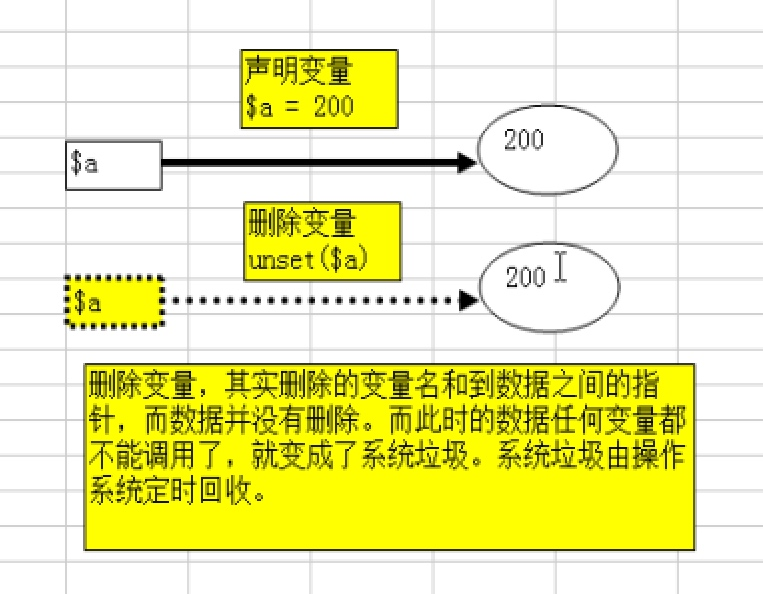

   
****
   
###6 显示变量的类型和值 var_dump()
* 描述: 打印变量的相关信息
* 语法: `void var_dump(mixed $expression [,mixed $...])` 
* 在JS 中打印变量类型是 typeof();


```PHP

$a = 100;
$b = "abc";
$c = true;
$d = 0.98;

var_dump($a,$b,$c,$d);

``` 

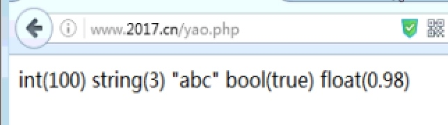


****

### 7 可变变量
* 可变变量: ==指某个变量的名称,由另一个变量的值来充当==
* ==语法: `$$a = 100`==

```PHP

$a = "hello";
$hello = "PHP"

echo $$a; //相当于$hello 输出的是PHP 

```

```PHP

$a = "b";
$b = "c";
$c = "结果";

echo $$$a; //$$$a >> $$b >>$c   

```

****

##变量的值传递和引用传递
### 1 概述 
####JS 中的数据类型

* JS 中的的**基本数据**类型: 字符串型 数值型 布尔型 undefined null
* JS中的**复合数据**类型: 数组(Array) 对象(Object) 函数(Function)

#### PHP 中的数据类型
* PHP中的**标量**数据类型: 字符串型 整形 浮点型 布尔型
* PHP中的**复合**数据类型: 数组 对象
* PHP中的**特殊**数据类型: 资源 NULL

****

###2 变量的==值==传递
* 值传递:将一个变量的值,==复制一份,传给另一个变量==,**修改其中一个**变量的值,另一个变量的值**不会改变**,因为是==两个独立的变量==


```PHP

//(1)值传递:将一个变量的值, 复制一份 传递给另一个变量

$a = 100;
$b = $a; //值传递: 将变量$a的值 传给$b
$a = 200; //将$a重新赋值
echo "\$a = $a , \$b = $b"; 
//输出的是$a = 200 , $b = 100 

```
* 传值的内存表现

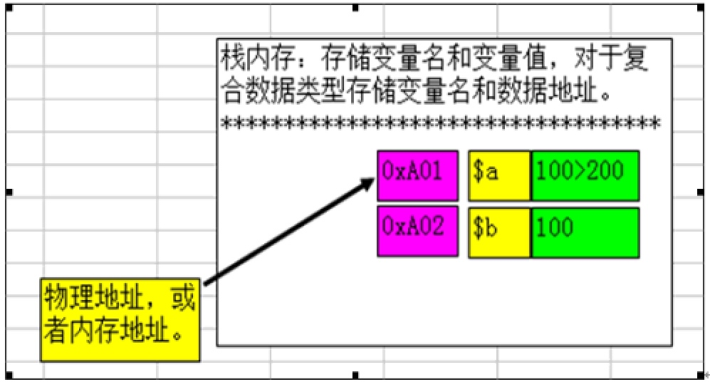


*  JS 值传递的数据类型有  字符串型 数值型 布尔型 undefined null
*  PHP 值传递的数据类型有 字符串型 整形 浮点型 布尔型 ==数组型==

****

### 3 变量的==引用==传递(传地址)
* 在 JS 中引用传递的数据类型是: 数组 对象 函数
* 在 PHP 中默认引用传递的数据类型是: 对象 资源
* 引用传递:将一个**变量的==数据地址==**,复制一份,传递给另一个变量,==这两个变量指向的是同一份数据==

* ==修改其中一个变量的值,另一个数据一定跟着变==

```JS

//引用传递
 var arr1 = [1,2,3,4,5];
 //将arr1的地址,复制一份,传给了arr2
 var arr2 = arr1;
 //arr1[0]赋值为100
 arr1[0] = 100; 
 
 document.write(arr2[0]); 
 //输出的是100
 
```

* 传地址内存表现
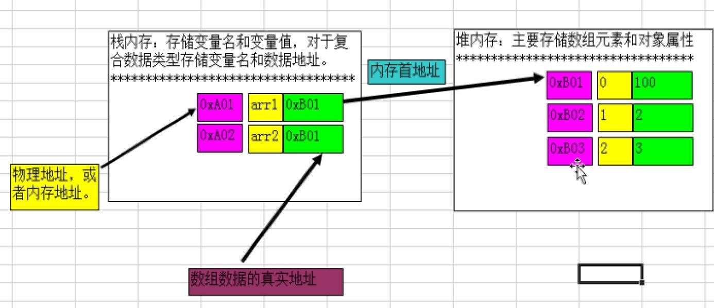

****

### 4 PHP基本数据类型变量,转换引用传地址
* 在PHP中 在引用的变量前加`&`符号

```PHP
header("content-type:text/html;charset=utf-8");


//基本数据类型的变量,变成引用传地址
$a = 100;
$b = &$a; //将变量$a 的地址,负责一份,传给$b


$a = 500; //给变量$a重新负责
echo "\$a = $a , \$b = $b"
//输出时 在单引号内只能输出变量名称 双引号内可以直接输出变量的值

//输出结果为: $a = 500 , $b = 500;

```

****

##PHP超全局变量

* JS 中变量分两类: 局部变量 全局变量  
* PHP 中变量分三类: 局部变量 全局变量 超全局变量
* **局部变量:**在**方法内部声明的变量**,就是局部变量,方法执行完毕,局部变量释放
* **全局变量:**在**方法外部声明的变量**,就是全局变量,网页执行完毕变量释放 ==在PHP中,**全局变量在函数中不能用**==
* ==**超全局变量:**是**系统定义的变量**,**该变量可以在任何地方直接使用**==,主要是函数内部,函数外部,类的内部,类的外部

****

###1 PHP中的超全局变量
| 变量名 | 含义 |  
| --- | --- | 
| `$_GET` | 主要用来获取HTTP协议下GET方式传递的数据. |
| `$_POST` | 主要用来获取 HTTP POST方式传递的数据. |
| `$_REQURST` | 主要用来获取GET和POST方式传递的数据,但是数据比较慢 |
| `$_SERVER` | 主要用来获取服务器执行环境的相关信息,如:客户端IP地址 网站根目录 |
| `$_GLOBALS` | 主要包含`$_GET $_POST   $COOKIE 数组的内容` |
| `$_SESSION` | 主要获取服务器端的会话信息 | 
| `$_COOKIE` | 主要获取客户端的会话信息 |
| `$_FILES` | 主要获取上传文件的相关信息 |
| `$_ENV` | 获取环境信息 | 

****

### 2 超全局数组变量==$_POST== 的使用
* **描述**: ==主要用来获取HTTP POST 方式传递到服务器的数据==
* POST提交特点
    1. **相对安全**,数据不在地址栏显示
    2. 可以发送海量数据
    3. 可以发送所有类型的文件 
    
   
```HTML

<form action="./login.php" method="post" name="form1">
		
		用户名: <input type="text" name="username">
		密码:  <input type="password" name="password">
		<input type="submit" value="提交表单">
		<!-- 创建隐藏域 作为表单提交的令牌 -->
		<input type="hidden" name="ac" value = "login">

	</form>
    
```


```PHP

<?php 
	//判断表单是否提交
	if (isset($_POST['ac']) && $_POST["ac"] == 'login') {
		//获取表单提交值
		$username = $_POST['username'];
		$password = $_POST['password'];

		echo "用户名: $username  密码: $password";
	} else {
		//如果表单没有提交就认为非法操作
		echo "ERROR!";
	}

	//打印method = post表单发送的文件
	//print_r($_POST);
 ?>

```
    
****    
    
####Print_r()打印数组或对象
* 描述: ==打印关于变量易于理解的信息==
* 语法: `bool Print_r(mixed $var)`
* `var_dump` 不太直观    
 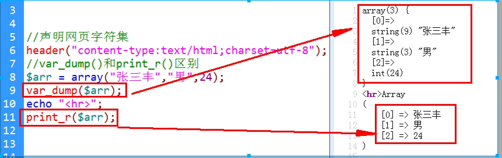
   

****

####实例:简单PHP计算器
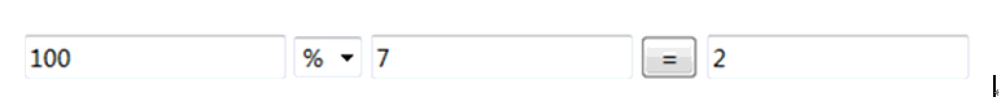
 

```html

<form action="" method="post" name="form1">
		
		<input type="text" name = "num1" value="<?php echo $num1 ?>">
		<select name = "operator" >
			<option value="+" <?php if($operator == '+') echo "selected" ?> > + </option>
			<option value="-" <?php if($operator == '-') echo "selected" ?> > - </option>
			<option value="*" <?php if($operator == '*') echo "selected" ?> > * </option>
			<option value="/" <?php if($operator == '/') echo "selected" ?> > / </option>
		</select>
		<input type="text" name = "num2" value="<?php echo $num2 ?>">
		<input type="submit" value = " = ">
		<input type="text" name = "result" value="<?php echo $result ?>">
		<!-- 加入表单隐藏域 -->
		<input type="hidden" name = "ac" value = "add">
	</form>


```


```PHP


<?php 
	header("content-type:text/html;charset=utf-8");
	//判断表单是否提交
	if (isset($_POST['ac']) && $_POST['ac'] == 'add') {

			echo "<pre>";
			print_r($_POST);
			echo "</pre>";

			//获取表单提交值
			$num1 	  = $_POST['num1'];
			$num2 	  = $_POST['num2'];
			$operator = $_POST['operator'];

			//根据运算符 进行运算
			switch($operator) {
				case "+":
					$result = $num1  + $num2;
					break;
				case "-":
					$result = $num1  - $num2;
					break;
				case "*":
					$result = $num1  * $num2;
					break;	
				case "/":
					$result = $num1  / $num2;
					break;												
			}

		}else {
			//如果第一次进入界面给变量默认值
			$num1 	  = "";
			$num2 	  = "";
			$operator = "-";
			$result  = "";
		}	

 ?>

```

****

### 3 超全局数组变量==$_GET==的使用
* ==$_GET主要用来获取HTTP GET 方式发送到服务器数据==
* GET方式的特点
    * 不安全 所有的数据都在地址栏显示
    * 只能发送有限的数据   
    * 只能发送字符串型数据 附件无法发送

****

#### 发送GET数据的方法总结
* 直接在地址栏之间输入
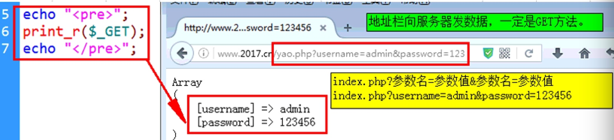
* 通过a标签发送GET请求

```PHP
    //通过<a> 标签向服务器发送GET数据
    echo "<a href= "?username=admin&pwd=123456">GET提交<a>"
```

* 通过JS 的location.href 来发送GET方式

```javascript
  if (window.confirm("你确定要跳转吗?")) {
		//使用JS的location地址栏对象的href属性来网页跳转
		location.href = "?username=admin&pwd=123456"
	}
```

* 表单发送GET数据

****   

### 4 超全局数组变量==$_REQUEST==的使用
* `$_REQUEST`全局数据,包含了`$_GET $_POST $COOKIE` 数组的内容 但速度比较慢

#### 表单同时发送GET和POST数据   
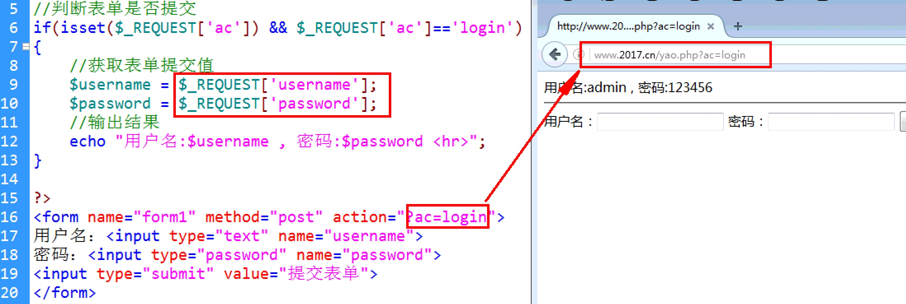

****

### 5 超全局数组变量==$_SERVER==的使用
* ==`$_SERVER` 可以获取服务器执行环境的相关信息==

```PHP

  //输出PHP服务器执行环境的相关信息
	echo "服务器的域名: ".$_SERVER["SERVER_NAME"];
	echo "<br>服务器的IP地址: ".$_SERVER["SERVER_ADDR"];
	echo "<br>客户端的IP地址: ".$_SERVER["REMOTE_ADDR"];
	echo "<br>网站的根目录: ".$_SERVER["DOCUMENT_ROOT"];
	echo "<br>服务器软件信息: ".$_SERVER["SERVER_SOFTWARE"];
	echo "<br>当前访问时的协议: ".$_SERVER["SERVER_PROTOCOL"];
	echo "<br>获取GET携带参数: ".$_SERVER["QUERY_STRING"];

```

```PHP

//打印所有$_SERVER 数组中的信息
echo "<pre>";
print_r($_SERVER);
echo "</pre>";	

```

    
    
    
    


   
   


