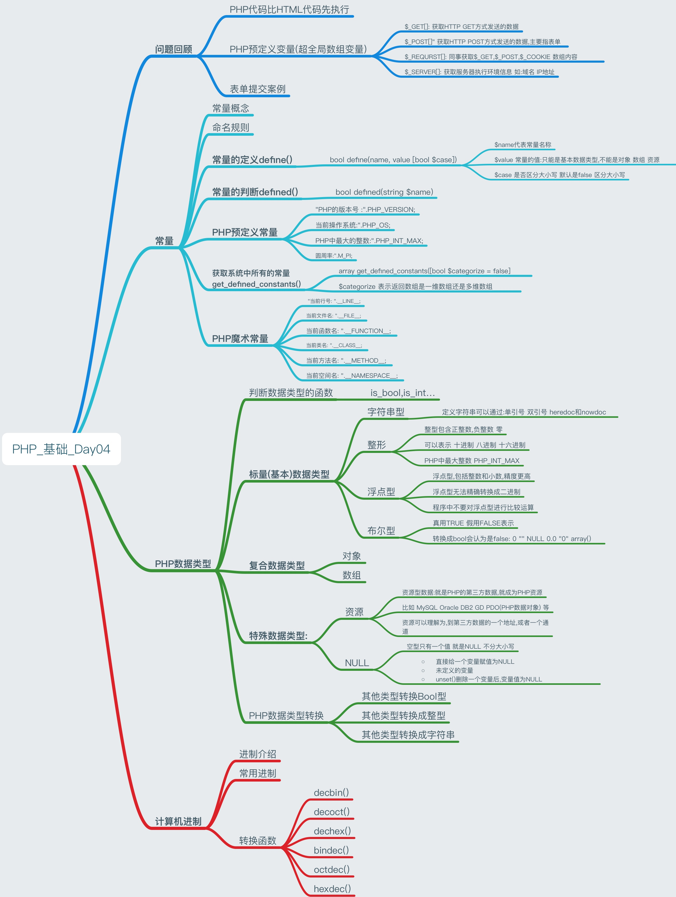

# PHP_Day04_常量_数据类型_计算机进制
>PHP_基础_Day04知识点



[TOC]

##问题回顾
###PHP代码比HTML代码先执行
* PHP代码先执行
* PHP是服务端的脚本语言,把结果处理完成后,送往客户端
* HTML是前端内容,一定是在浏览器(客户端)执行的

****

###PHP预定义变量(超全局数组变量)
* PHP预定义变量,PHP定义好的变量,可以直接使用
* PHP的预定义变量,都是一个一个的数组
    * `$_GET[]`: 获取HTTP GET方式发送的数据
    * `$_POST[]`" 获取HTTP POST方式发送的数据,主要指表单
    * `$_REQURST[]`: 同事获取`$_GET,$_POST,$_COOKIE` 数组内容
    * `$_SERVER`: 获取服务器执行环境信息 如:域名 IP地址
  
 **** 
 
###表单提交案例


```HTML
<!DOCTYPE html>
<html lang="en">
<head>
	<meta charset="UTF-8">
	<title>Document</title>
</head>
<body>
	<form action="" method="post" name="form1">
		
		<table align="center" border = "1" bordercolor = "#CCC" rules = "all">
			<tr>
				<td>用户名:</td>
				<td><input type="text" name="username"></td>
			</tr>
			<tr>
				<td>密码:</td>
				<td><input type="password" name="pwd"></td>
			</tr>	
			<tr>
				<td>确认密码:</td>
				<td><input type="password" name="pwdE"></td>
			</tr>	
			<tr>
				<td>性别</td>
				<td><input type="radio" name="sex" value="男">男
				<input type="radio" name="sex" value="女">女</td>
			</tr>	
			<tr>
				<td>爱好</td>
				<td>
				<!-- 爱好的name 属性值为 hobby[] 写法
					 在HTML 中没有特殊意义 ,就是一个名字
					 但是PHP会将该数据解析成数组
				 -->
				<input type="checkbox" name="hobby[]" value="电脑">电脑
				<input type="checkbox" name="hobby[]" value="游戏">游戏
				<input type="checkbox" name="hobby[]" value="PHP">PHP
				</td>
			</tr>
			<tr>
				<td>学历</td>
				<td>
					<select name="edu">
						<option value="蓝翔">蓝翔</option>
						<option value="蓝翔">蓝翔</option>
						<option value="蓝翔">蓝翔</option>
						<option value="蓝翔">蓝翔</option>
					</select>
				</td>
			</tr>	
			<tr>
				<td><input type="submit" value="提交"></td>
				<td><input type="hidden" name="ac" value="ac"></td>
			</tr>													
		</table>

	</form>
</body>
</html>

```


```PHP
<?php  
	if (!empty($_POST) && $_POST['ac'] == "ac") {
		//获取表单提交值
		// echo "<pre>";
		// print_r($_POST);

		//直接输出结果
		$str = "";
	 	$str .= "爱好".implode($_POST['hobby'], ",");
	 	echo $str;			
	
		
	}else {

	}
?>
```

****
    
##常量
* 常量就是==值拥有不变的量== 如:圆周率,身份证号码等
* 所谓常量值是永远不变的量,是指在一次完整的HTTP请求的过程中
* 常量在运行过程中,**不能修改,不能删除**
* 常量比变量执行速度快
* 常量在脚本的==任何地方都可以使用==:函数内 函数外 类内 类外
* 只要删除变量的函数`unset()` 但==没有删除常量的函数==


****

###命名规则
* 常量的命令与变量名几乎一样
* 常量名称可以包含: 字母 数组 下划线
* ==变量以`$`开头,常量不需要==
* 常量可以用字母,下划线开头,但不能以数字开头
* 常量名称尽量全大写,其目的与变量名区分开 如`PHP_INT_MAX, DB_HOST`

****

###常量的定义`define()`
* 描述: `define`定义一个常量 
* 语法: `bool define(name, value [bool $case])`
* 参数: 
    * `$name`代表常量名称
    * `$value` 常量的值:只能是**基本数据类型**,不能是对象 数组 资源
    * `$case` 是否区分大小写 默认是false 区分大小写

    
```PHP

header("COntent-type:text/html;charset=utf-8");
	//定义常量
	define("DB_HOST","localhost",true); //不区分大小写
	define("DB_USER","root"); 			//区分大小写
	define("DB_PASS","112345");

	//输出常量 双引号内不解析常量,可以解析变量
	$str = "<h2>".DB_HOST."</h2>";
	$str .= "主机名:".DB_host;
	$str .= "<br>用户名:".DB_USER;
	$str .= "<br>密码:".DB_PASS;

	echo $str;

```

****

###常量的判断`defined()`
* 描述:`defined()`检查某个名称的常量是否存在
* 语法:`bool defined(string $name)`
* 案例:定义常量连接数据库

```PHP

header("Content-type:text/html;charset=utf-8");
	//(1)定义常量
	define("DB_HOST", "localhost");
	define("DB_USER", "root");
	define("DB_PASS", "12345");

	//(2)判断常量是否存在 注意defined参数是字符串类型
	if (defined("DB_HOST") && defined("DB_USER") && defined("DB_PASS")) {

		//连接MySQL数据库 ,如果连通MySQL返回资源型数据
		$link = mysql_connect(DB_HOST,DB_USER,DB_PASS);
		//资源型变量.转换成bool永远为true
		
		//打印变量的类型和值
		var_dump($link);
	}

```

****


###PHP预定义常量
* PHP中预定义很多常量,大约800个左右

```PHP

//PHP的预定义常量
	echo "PHP的版本号 :".PHP_VERSION;
	echo "<br> 当前操作系统:".PHP_OS;
	echo "<br> PHP中最大的整数:".PHP_INT_MAX;
	echo "<br> 圆周率:".M_PI;

```


###获取系统中所有的常量 `get_defined_constants()`
* 返回所有常量的关联数组
* 语法:`array get_defined_constants([bool $categorize = false])`
* 参数: `$categorize` 表示返回数组是一维数组还是多维数组


```PHP

//打印所有的常量: 自定义常量 系统常量
	echo "<pre>";
		print_r(get_defined_constants());
	echo "</pre>";
	
	//在PHP中,统计数组长度count()函数
	$arr = get_defined_constants();
	echo "<hr>共有".count($arr)."个常量";

```
****

###PHP魔术常量
* 首先,常量的值运行过程中不会改变 但是 魔术常量 对随着所在位置的不同而改变


```PHP

//魔术常量 对随着所在位置的不同而改变
	function abc() {
		echo "当前行号: ".__LINE__;
		echo "<br> 当前文件名: ".__FILE__; 
		echo "<br> 当前函数名: ".__FUNCTION__; 
		echo "<br> 当前类名: ".__CLASS__; 
		echo "<br> 当前方法名: ".__METHOD__; 
		echo "<br> 当前空间名: ".__NAMESPACE__; 
	
	}
	//函数调用
	abc();

```

****

##PHP数据类型
* PHP属于**弱类型语言**,==变量在运行过程中,变量类型是可以变的.==
* ==变量就是一个容器,变量本身并没有类型,变量的类型取决于值的类型.==
* PHP中的**标量(基本)**数据类型: 字符串型 整形 浮点型 布尔型
* PHP中的**复合数据**类型: 数组 对象
* PHP中的**特殊数据**类型: 资源 NULL

****

###判断数据类型的函数

| 函数名 | 说明 | 返回值  |
| --- | --- | --- |
| `is_bool` | 判断变量是否bool  |  |
| `is_int` | 判断变量是否整型 ||
| `is_string`|||
| `is_float` |||
| `is_numeric` |判断变量是不是数值型或者数字字符串||
|`is_array`|||
|`is_null`|||
|`is_resource`| 判断变量是不是资源型 ||


* ==注意:通过地址栏 或者 表单向服务传递的数据 都是字符串类型==
* ==变量只存在于内存 离开内存都是字符串==
* 案例


```PHP
header("COntent-type:text/html;charset=utf-8");
	//判断输入的年龄是否符合当兵的要求
	
	//(1) 通过地址栏向服务器传年龄参数
	//(3) 年龄要求必须是整数
	//(2) 获取和判断
	
	//http://127.0.0.1/demo7.php?age=20
	//判断地址栏是否传递了age参数
	//注意:通过地址栏 或者 表单向服务传递的数据 都是字符串类型
	//变量只存在于内存 离开内存都是字符串
	
	//通过is_numeric()函数 判断 $_GET['age']是否是数值类型
	if (isset($_GET['age']) && is_numeric($_GET['age'])) {
		//如果age >= 18 && age <= 25 就可以当兵
		if ($_GET['age'] >= 18 && $_GET['age'] <= 25) {
			echo "你可以当兵";
		}else {
			echo "年龄超出范围";
		}
	}else {
		echo "非法输入";
	}

```

****

###整型
* 整型包含正整数,负整数 零
* 可以表示 十进制 八进制 十六进制
* PHP中最大整数 `PHP_INT_MAX`

```PHP

//PHP中整型表示,在网页中输出的一律都是10进制
	echo 100; //十进制表示
	echo 067; //八进制表示: 以0开头的整数,
	echo 0x9af; //十六进制表示; 以0x开头的整数

```

```PHP
    //两个整数相互运行 结果超出了`PHP_INT_MAX`的范围 结果类型会会变成浮点型
   $a = PHP_INT_MAX + 1;
	var_dump($a); //输出float(9.2233720368548E+18) 
		
```

****

###浮点型
* 浮点型,包括整数和小数,精度更高
* 关于浮点数的问题
 
```PHP

//关于浮点型的问题

/*所有数据都要转换成二进制才能运算 但是浮点型无法精确转换成二进制
	这种现象是二进制的缺陷造成的
	因此不要对浮点型进行比较运算*/
 <?php
	//在PHP中对.浮点型运算,进行了简单的处理(四舍五入)
	var_dump((0.1 + 0.7) * 10); //输出为 float(8)
	echo "<hr>" ;
 ?>

<script>
	//在JS中,没有对浮点数运算做处理,输出的是原始值
	//这个浮点数是无限循环小数
	document.write((0.1 + 0.7) * 10); //输出为 7.999999999999999  
</script>


```    

```PHP

//程序中不要对浮点型进行比较运算
	if (8.1/3 == 2.7) {
		echo "相等";
	}else {
		echo "不相等";
	}

	//解决方法:将浮点型转换成整数.再进行比较运算,会更可靠
	//所有整数,都能完整转换成二进制
	$a = 8.1 * 10;
	$b = 2.7 * 10;
	if ($a/3 == $b) {
		echo "相等";
	}else {
		echo "不相等";
	}

```

****

###字符串型
* 定义字符串的四种方式
* 用单引号可以定义一个字符串; 如:`$a = 'abc'`
* 用双引号来定义一个字符串; 如:`$a = "abc"`
* 定义长字符串:`heredoc`和`nowdoc`


```PHP

  //单引号定义的字符串
	//单引号内不解析变量的值 , 直接输出变量名称
	//单引号内转义符,只能是单引号
	$name = 'abc';
	$str = '<h2>$name \' 的基本信息';
	echo $str; //输出为: $name ' 的基本信息

//-------------------------------	

	//双引号内可以直接解析变量值
	//双引号内,所有的转义符号都可以使用: \\ \' \" \$ \
	//\r \n \t 表示源代码的换行 <br>是网页效果的换行
	$name = "abc";
	$str = "<h2>\" $name \" 的基本信息";
	echo $str; //输出为: " abc " 的基本信息*/

//--------------------------------

//双引号内.变量后跟一个非空字符
	//用 {} 将变量包起来,与其他符号分开
	$name = "abc";
	$age = 20;
	$str = "<h2>{$name}的基本信息如下<h2>";
	//变量之后的标点符号,不会当成变量的一部分
	$str .= "姓名: $name<br>年龄: $age";
	
	echo $str; 

	/*输出为:
	abc的基本信息如下

	姓名: abc
	年龄: 20*/


``` 

****

####长字符串的处理`heredoc` 和 `nowdoc`

```PHP

//长字符串的处理
	
	/*
	(1)将一个长字符串放在"<<<heredoc"和"heredoc"之间
	(2)heredoc这个名称,可以自己定义
	(3)"<<<heredoc"是字符串的开始标记,不带结束符分号
	(4)heredoc; 必须单独另起一行 顶头书写
	(5)字符串内容:HTML CSS JS PHP变量
	 */

$name = "abc";
$sex = "男";
$age = 20;	
	
$str = <<<heredoc
	
<!DOCTYPE html>
 <html lang="en">
 <head>
 	<meta charset="UTF-8">
 	<title>Document</title>
 	<script>
 		
 	//添加网页背景色
 	window.onload = function(){
 		document.body.bgColor = "pink";
 	}

 	</script>
 </head>
 <body>
 	<h2 style="color:red">{$name}的基本信息</h2>
 	姓名: $name<br>
 	性别: $sex<br>
 	年领: $age
 </body>
 </html>

heredoc;

echo $str;

<<<'heredoc' //相当于单引号不解析PHP里面的变量
heredoc

<<<"heredoc" //相当于双引号不解析PHP里面的变量
heredoc      //加双引号和不加引号的效果是一样的

```

****

###布尔型
* 真用`TRUE` 假用`FALSE`表示
* bool 主要应用在条件判断中
* 那些值转换成bool会认为是false: `0` `""` `NULL` `0.0` `"0"` `array()` 

****

###NULL型
* 空型只有一个值 就是`NULL` 不分大小写
* 那些情况是空: 
    * 直接给一个变量赋值为`NULL`
    * 未定义的变量
    * `unset()`删除一个变量后,变量值为`NULL`

****
        
###资源型
* 资源型数据:就是PHP的==第三方数据==,就成为PHP资源
* 比如 `MySQL` `Oracle` `DB2` `GD` `PDO(PHP数据对象)` 等
* 资源可以理解为,到第三方数据的一个地址,或者一个通道

****

###连接MySQL数据库

```PHP

$db_host = "localhost";
	$db_user = "root";
	$db_pass = "12345";

	//PHP连通MYSQL 将返回资源型数据 如果连接失败返回FALSE
	//资源转换成bool型 永远为TRUE
	
	$link = mysql_connect($db_host,$db_user,$db_pass);
	echo $link."<hr>";
	var_dump($link);

	/*输出为:
	Resource id #3
	resource(3) of type (mysql link) 
	*/

```

****

###案例基本数据类型应用

```PHP

//(1)变量初始化
	$name = "张三";
	$sex = 1; //1为男 0为女
	$age = 24;
	$edu = "本科";
	$isMarried = "true"; 
	$school = "蓝翔";

	//(2) 构建一个字符串
	$str = "<h2>\" <font color = \"red\">{$name}</font>\"的基本信息</h2>";
	$str .= "姓名: $name";
	$str .= "<br> 性别: ".(sex ? "男" : "女");
	$str .= "<br> 年龄: $age";   
	$str .= "<br> 学历: $edu";   
	$str .= "<br> 婚否: ".($isMarried ? "以婚" : "未婚");
	$str .= "<br> 学院: ".(isset($school) ? $school : "未填写");	
	//(3)输出结果
	echo $str;

```

****

##PHP数据类型转换
* ==变量必须是同类型才能进行运算==
* 如果变量的类型不相同,则必须转换成同类型才可以运算
* 变量的类型转换分: 自动转换 和 手动转换
* PHP大部分情况下,都是自动转换, 有时候需要测试会手动转换

###强制转换(手动转换)
* 通过PHP的指定运算符,可以实现变量类型的强制转换

```PHP
//强制转换的运算符
	(bool) 	  $var //强制转换成Bool型
	(int) 	  $var //强制转换成整型
	(string)  $var //强制转换成字符串型
	(float)   $var //强制转换成浮点型
	(array)   $var //强制转换成数组型
	(object)  $var //强制转换成对象
```
  
  * 其他类型转换Bool型
  
```PHP

   $a = 0;  
	$a = 0.0;
	$a = "";
	$a = NULL;
	$a = array();
	//上述内容转换成Bool 都是FALSE

```

* 其他类型转换成整型

```PHP

  $a = true;       //1
	$a = false;      //0
	$a = 10.98;      //10
	$a = .98;        //1 //浮点转转换整型 直接保留整数
	$a = "";		     //0	
	$a = "120px";	 //120 //相当于JS 中paresInt();
	$a = "abc";		 //0
	$a = null;		 //0		

```

* 其他类型转换成字符串
 
```PHP

   //其他类型转换成字符串
	$a = true;	  //转换为"1"
	$a = false;	  //转换为""
	$a = 0;		  //转化为"0"
	$a = NULL;    //转换为""

```


##计算机进制
###进制介绍
* 计算机只能识别二进制,其他所有的数据,都要转换成二进制才能被计算机识别
* 进制就是进位制 X进制 就是逢X进一 

###常用进制
* **10进制**:有10个基本数 分别1-9 逢十进一
* **8进制**:有8个基本数 分别0-7 逢八进一
* **16进制**:有16个基本数 分别0-9,a-f 逢十六进一
* **2进制**: 有2个基本数,分别是0和1 逢二进一
 
###转换函数
* 使用系统函数`decbin()`进行 10进制转2进制
* 使用系统函数`decoct()`进行 10进制转8进制
* 使用系统函数`dechex()`进行 10进制转16进制
* `bindec()`可以将2进制转换10进制
* `octdec()`可以将8进制转换10进制 
* `hexdec()`可以将16进制转换10进制  


