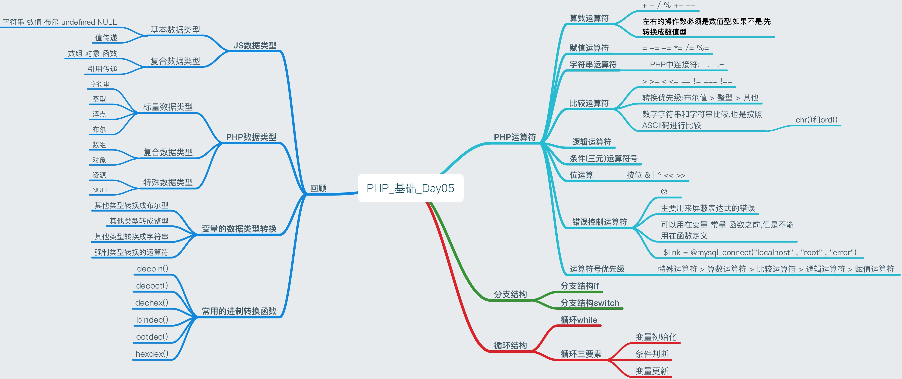
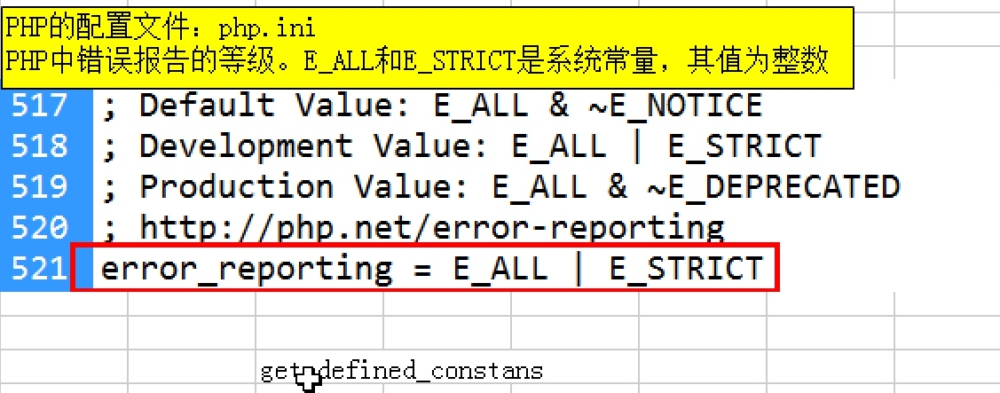
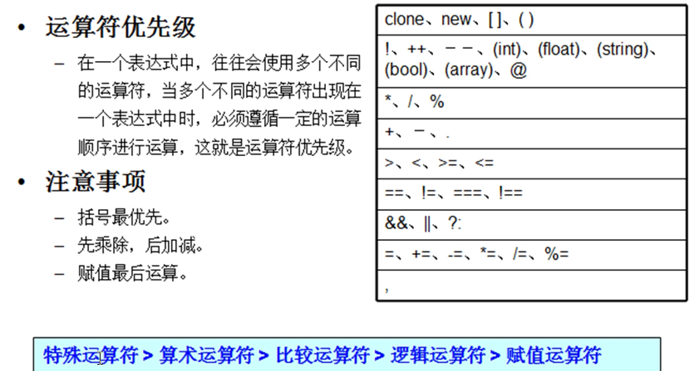

# PHP_Day05_运算符号_分支结构_循环结构
> PHP_基础_Day05知识点



[TOC]

##回顾
###PHP变量的数据类型
####JS数据类型
* JS 的数据类型分两大类 基本数据类型 复合数据类型    
    * **基本数据类型**(只有一个值): 字符串 数值 布尔 undefined NULL
    * **复合数据类型**(可以多个值) : 数组 对象 函数
* JS 中**基本数据类型**都是**值传递** 复合数据类型是引用传递(传地址) 

####PHP数据类型
* PHP数据类型分为三大类:标量数据类型 复合数据类型 特殊数据类型 
    * **标量数据类型**: 字符串 整型 浮点 布尔
    * **复合数据类型**: 数组 对象
    * **特殊数据类型**: 资源 NULL   
* PHP中默认情况下,**值传递**的数据类型有:字符串 整型 浮点 布尔 数组
* PHP中引用传递的数据类型: 资源 对象 
* PHP中值传递的数据类型的变量前加`&`符号,该变量就变成的引用传递

****

####整型
* 整型可以用10进制 8进制 16进制来表示整型
* PHP 最大整数的是: `PHP_INT_MAX`
* 所有的整数,都可以直接转换成二进制

####浮点型
* 浮点型包含整数和小数,浮点型比较结果不可靠,由于二进制的缺陷造成的

####字符串
* 单引号 双引号 长字符串表示`heredoc` 长字符串`nowdoc`
* 单引号内不能解析变量,单引号内只允许`\`转义符号
* 双引号内可以解析变量,所有的转义符号都可以使用`\\` `\` `\t` `\r` `\n` `\$`
* ==双引号内不能解析常量== 只能`$a = "操作系统:".PHP_OS`
* 在双引号内,如果变量后跟一个非空字符,则无法使PHP解析 使用`{}`将变量包裹

####布尔型
* 表示真假,是否状态TRUE FLASE表示 常用于调节判断

####资源
* PHP本身功能很有限,添加了很多第三方扩展,这些扩展就是PHP的资源
* 资源:就是第三方数据的引用地址 
* 资源,默认的就是引用传递(传地址)

####NULL
* 没有定义变量,值默认就是NULL
* 也可以给一个变量,赋一个NULL值
* Unset()删除变量,变量的值,将变成NULL

****

###变量的数据类型转换 
* 其他类型转换成布尔型
    * 那些认为是FALSE: `0`,`""`, `FALSE`,`NULL`,`0.0` ,`0`,`array()`,空对象
    * 资源转换成布尔,永远为TRUE
    
* 其他类型转成整型
    * 非数字开头的字符串,转换成整型为0
    * 数据开头的字符串,把整数提取出来,后面舍去
    * 布尔转整型: `TRUE>>1` `FAKSE>>0`
    * `NULL>>0`
    * 浮动点型转整型:直接去除小数部分
    
* 其他类型转换成字符串   
    * `true>>"1"` `false>>""`
    * `NULL >> ""`
    
* 强制类型转换的运算符: `(bool)$a (object)$a`

****
     
###常用的进制转换函数
* 10to2 `decbin()`
* 10to8 `decoct()`
* 10to16 `dechex()`
* 2to10 `bindec()`
* 8to10 `octdec()`
* 16to10 `hexdex()`

****

##PHP运算符
* 运算符,又称操作符,就是对数据进行各种运算的符号.

### 1 算数运算符
* `+` `-` `/` `%` `++` `--`
* ==运算符左右两个操作数,必须是同类型,才可以运算==
* ==算数运算符,左右的操作数**必须是数值型**,如果不是,**先转换成数值型**,再进行算数运算,其他类型不能运算==


```PHP

    $a = 10;
	$b = "100px" + $a; //与java不同,先自动转换成整型后相加
	echo $b; //输出: 110

```

****

####`%`运算
* `%`取模运算符号,两个数相除去余数
* 用来判断两个数是否能除尽,如果能除尽余数为0 
* 如果左右两个浮点型取模,先转换成整数,再取模运算 
* `%`运算结果的符号,去余结果的符号由**被除数**绝定,与除数无关

****

####`++`和`--`运算符
* `++` 加1运算符号`++` 做前缀`++$a` 做后缀`$a++`
* 例如: `$a++` `$a = $a + 1`
* 如果单独使用没有其他运算,则`$a++`和`++$a`的结果是一样
* 如果与其他表达式混合,则`$a++`和`++$a`的结果不同

```PHP

//如果与其他表达式混合,则`$a++`和`++$a`的结果不同
	$a = 10;
	$b = $a++; //先将$a赋值给$b,然后$a+1
	echo "$b"; //输出: 10

	$a = 10;
	$b = ++$a; //先将$a+1,则$a的结果赋值给$b
	echo "$b"; //输出: 11	
	
	//举例(1)
	$a = 10;
	echo $a    ++; //输出: 10 现将$a值输出,在将$a+1
	echo "<br>".$a; //输出: 11


 //举例(2)
 $a = 10;
 $b = $a++ + 10; //先$a+10,结果赋值给$b 在将$a+1;
 

```

* `++`和`--`的表达方式是一样的,都是单独使用和混合使用


****

### 2 赋值运算符
* `=` `+=` `-=` `*=` `/=` `%=`
* 将`=` 右边的运算结果,赋值给`=`左边的变量
    * `=`就是赋值号,赋值的优先级最低
    * `$a += 10;` 展开后`$a = $a + 10;` 先加后等
    * 注意:赋值运算符是一个整体没有空格

****

### 3 字符串运算符
* ==PHP中连接符:`.` `.=`==
* JS中连接符: `+`
* 如:`str = "<hr>".$name."</hr>";`

****

####实例隔行变色

```PHP

<?php 
	header("Content-type:text/html;charset=utf-8");
	// (1)制作最基本的表格 2行3列
	// (2)循环普通行
	// (3)在循环过程中,找到每一个偶数行给<tr>加背景色
	

	$str = "<table width='1000' border='1' align='center' rules='all'>"; //初始化字符串
 	$str .= "<tr bgcolor = '#CCC'>";
 	$str .= "<th>编号</hr>";
 	$str .= "<th>新闻标题</hr>";
 	$str .= "<th>发布时间</hr>";
 	$str .= "</tr>";


 	for ($i=1; $i<= 10000 ; $i++) { 
 		//如果
 		if ($i % 2 == 0) {
 			$str .= "<tr bgcolor = 'pink'>";
 		}else {
 			$str .= "<tr>";
 		}

	 		$str .= "   <td>{$i}</td>";
	 		$str .= "   <td>&nbsp;</td>";
	 		$str .= "	<td>&nbsp;</td>";
	 	$str .= "</tr>";

 	}

 	$str .= "</table>";

 	echo $str;
 ?>


```

****

### 4 比较运算符
* `>` `>=` `<` `<=` `==` `!=` `===` `!==`
* 比较结果一定是布尔值`(true false)`
* 比较运算运算符左右两个操作数可以是:整型,字符串 布尔值 NULL
* `=`是赋值 ==`==`是等于.只管两个变量的值是否相等,不管类型是否一致==如:`10 == "10" //结果为TRUE`
* ==`===`全等于,即管两个变量的值是否相等,也管类型是否一致== 如 `10 === "10" //结果FALSE`

****

####字符串比较
* ==字符串是按照每个字符的ASCII编码值进行比较,一个一个字符比较,一旦确定了大小,后边就不在比较==
    * 数值ACCII值:48-57
    * 大写字母:65-90
    * 小写字母:97-122
* 数字字符串和字符串比较,也是按照ASCII码进行比较
* ==如果有**整数**参与比较,全部转换成整型在进行比较==
* 如果有**布尔值**参与比较,则全部转换成布尔值进行比较
* ==转换优先级:布尔值 > 整型 > 其他==

****

####chr()和ord()
* `ord()`返回字符的ASCII码值如:`ord("a") 值为 97`
* `chr()`返回ASCII对应的字符如:`chr(ord('a'))`


****

### 5 逻辑运算符 
* 逻辑运算符的结果,一定是布尔值
* `&&` `||` `!`
* 逻辑与`&&` 两个操作数都为`TRUE`只要有一个为`FALSE`结果为`FALSE`
* 逻辑`||`两个操作数只要有一个为`TRUE`则结果为`TRUE` 如:`100||null`
* 逻辑`!` 取反操作 如:`!100`

****

### 6 条件(三元)运算符号
* 一元运算符: `$a++` `$a--` 只有一个操作数
* 二元运算符: 应该有两个操作数 `$a + $b`
* 三元运算符: 有三个操作数 `10>5?"ok":"no";` 
* 语法:`条件判断 ? 表达式1 : 表达式2;`如果条件为TRUE 则执行表达式1的代码 否则执行表达式2

****


### 7 位运算
* 位运算,就是对计算机内存的**二进制位进行运算**
* 位运算就是以字节为单位, 1 个字节由8位二进制构成,如果位数不够前面补0
* 位运算只能对整数进行运算,速度非常快



#####按位与`&`
* 两个整数的对应二进制位,如果都是1,则结果为1 否则 结果为0

#####按位或`|`
* 两个整数的对应二进制位,如果有一个为1 则结果为1 否则结果为0

#####按位异或`^`
* 两个整数的对应二进制位,如果不相同,则结果为1 否则结果为0

#####左移位运算`<<`
* 将左侧操作数对应的二进制位,向左移动指定位数,移动的位数,由右边操作数决定

#####右移位运算`>>`
* 将左侧操作数对应的二进制位,向右移动指定位数,移动的位数,由右边操作数决定

**** 

### 8 错误控制运算符`@`
* 作用: 主要用来屏蔽表达式的错误
* 可以用在变量 常量 函数之前,但是不能用在函数定义

```PHP

//屏蔽函数的错误
	$link = @mysql_connect("localhost" , "root" , "error")

```

****

### 9 运算符号优先级


****

##分支结构`if`
* 只判断`TRUE`

```PHP
if(条件表达式){
    //如果条件为TRUE,执行代码
}
```

* 即判断`TRUE` 也判断`FALSE`

```PHP
if(条件表达式){
    //如果条件为TRUE,执行代码
}else {
     //如果条件为FALSE,执行代码
}
```

* 多条件判断

```PHP
if(条件表达式1){
    //如果条件1为TRUE,执行代码
}else if(条件表达式2){
    //如果条件2为TRUE,执行代码
}
```

****

##分支结构`switch`
* switch语法结构

```PHP
    //每次执行switch 语法时,将变量的值,与每个case语句的值进行比对,
    //若条件为TRUE就执行该case语句的代码
    //每个case语句,必须以break结束,否则switch会自动向下执行
    //Default以上所有CASE条件都不满足,默认执行程序代码
    
    switch(变量){
    
        case 值1:
            执行代码;
            break;
        case 值2:
            执行代码;
            break;
        default:
            默认执行的代码;   
    }

```
* if可以用于一个范围的判断,switch只能用于某项定值的判断,switch速度相对比if快
* 提示:能使用switch的地方,不要使用if语句

* `date()` 格式化一个本机时间 参数`N`代表星期1-7


****

##循环`while`

```PHP
//while循环的语法结构

初始化变量
while(条件判断,结果是布尔值){
    循环体代码
    变量更新
}

```

****

### 循环三要素
* 变量初始化 在循环开始前执行一次,循环开始后就 不再执行
* 条件判断:通过条件为TRUE则循环体代码,如果条件为FALSE则退出循环
* 变量更新,两次循环$i变量值,如果一样,一定是死循环
* while 只有一条语句可以不用加`{}`


    


