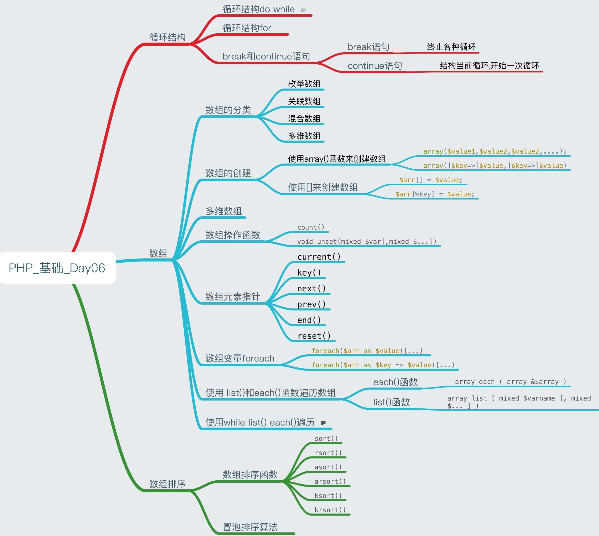
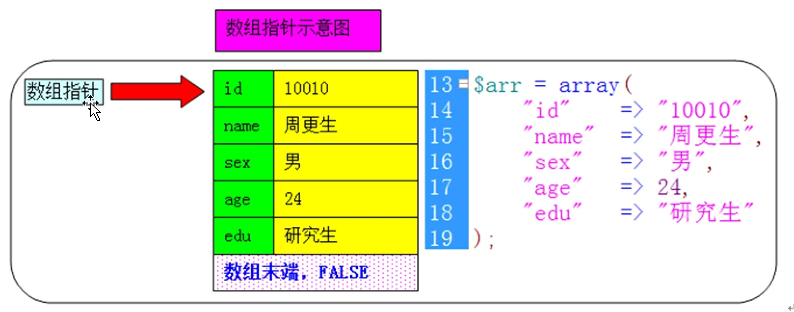
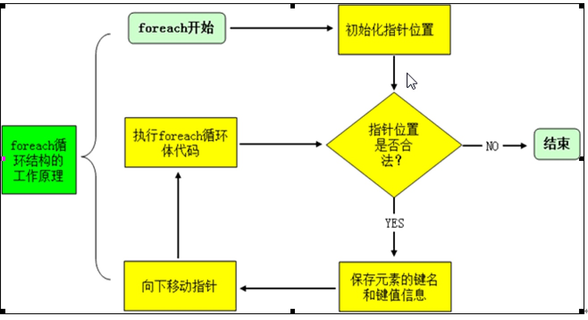
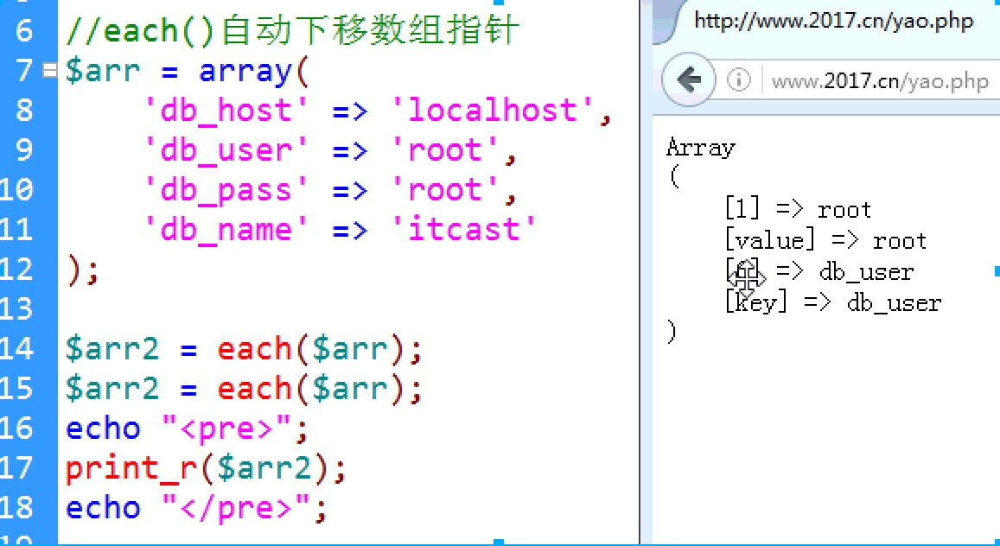
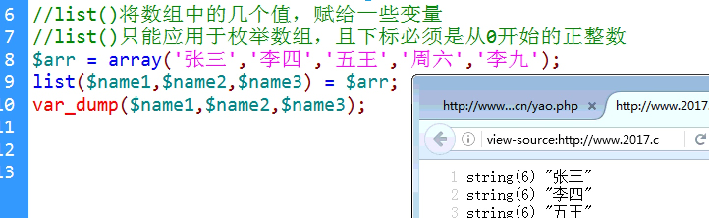
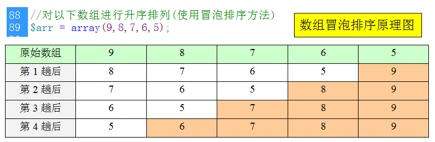

# PHP_Day06_循环结构_数组_数组排序
> PHP_DAY06_知识点



[TOC]

## 回顾
### 双引号的问题
* 注意双引号内只能解析变量,不能进行各种运算

```PHP

$a = 10;
$b = 20;
echo "总分:  $a+$b 分<br>";
echo "总分: ".($a + $b)."分<br>";

```

****

## 循环结构`do while`
* **先执行循环体一次**,再进行条件判断,决定是否要进行第2次循环
* `while`是先进行条件判断,如果条件为FALSE循环体一次都不会执行
* `do while`结束符`;`不能省略

```PHP

//do while语法结构
//变量初始化
do {
	//循环代码
	//变量更新:保证两次变量循环变量不一样

}while(条件判断);

```

****


##循环结构`for`

```PHP
for(变量初始化① ; 条件判断② ; 变量更新④){
    //循环体代码③
}
```

* 变量初始化①:只在循环开始前,执行一次,以后就不在执行了
* 条件判断②:如果条件为FALSE就不在执行循环体
* 变量更新④:循环体结束后变量更新,保证两次循环变量的值不一样

* 注意:`for`结构的三个表达式都可以省略,但分号不可以
* 如果循环体只有一条语句`{}`可以省略

* 如果省略第二个表达式,会造成无限循环,如果需要手动退出循环可以使用`break`


****

##`break`和`continue`语句
### `break`语句
* 终止各种循环:`while do while for foreach switch`
* 语法:`break[n]`
* 参数N:表示退出第几层循环,是一个从1开始的正整数,省略参数n,则退出当前循环

###`continue`语句
* 结构当前循环,开始一次循环
* `continue` 之后的循环体代码,不在执行,直接跳过,去开始下次循环
* 语法:`continue[n]`
* 参数:n代表要退出的循环层数,可以省略,默认为1
* 提示:在使用`continue`之前要加入条件判断

****

##数组
* **数组的概述**: 数组是一组数的集合.如:`$arr = array(1,2,3,4,5)`
* ==标量数据类型是一个值的容器,而数组就是多个值的容器==

****

###数组的分类
* **枚举**数组:数组元素的**下标**,是**从0开始的正整数**`$arr = array(1,2,3,4,5)`
* **关联**数组:数组元素的**下标**,是**字符串**.如`$arr['edu'] = "蓝翔"`
* **混合**数组:**两种下标**都有的数组,就是混合数组`$arr = array(100, 'edu'=>'蓝翔')`
* **多维**数组:数组元素的值,是一个数组,还可以理解为,**数组嵌套数组**.`$arr[5][2] = 100`

****

###数组的创建
#### 使用`array()`函数来创建数组
* ==数组元素的值没有类型限制==
* ==但下标只能是**整型**和**字符串**类型==

```PHP

        语法1:$arr = array($value1,$value2,$value2,....);
语法2:	$arr = array([$key=>]$value,[$key=>]$value)

```


```PHP

   //语法:$arr = array([$key=>]$value,[$key=>]$value)
	//其中$Key是重新给数组元素,指定一个下标
	//下标和元素的值之间的连接号是 => 又称 重载元素下标
	//如果$key省略,就用默认下标,从最大整数下标下+1
	//$key的类型只能是字符串,下标不能是其他类型
	

	$arr = array(
			"a" => 100,
			"b" => 200,
			20 => 300,
			23 => 400,
			500 //如果没有指定下标,下标为最大整数下标加1
		);


	//打印数组各元素
	echo "<pre>";
	print_r($arr);
	echo "</pre>";	

	/*
		Array /
		(
		    [a] => 100
		    [b] => 200
		    [20] => 300
		    [23] => 400
		    [24] => 500
		)
	 */

```

****

####使用[]来创建数组

```PHP

语法1 : $arr[] = $value;
语法2:  $arr[%key] = $value;

```

* 如果数组`$arr`不存在 **先创建数组**,并添加第1 个数组元素,第一个元素下标为0
* 如果数组已经存在,添加新的数组元素,新的数组元素的下标,**是最大的整数下标+1**
* PHP可以属于空的`[]`创建数组,但是JS并不支持


```PHP

    $arr[] = 10; //下标为0
	$arr[] = 20; //下标为1

	$arr[10] = 10;
	$arr['a'] = 20;
	$arr[] = 30; //下标为11

	//打印数组各元素
	echo "<pre>";
	print_r($arr);
	echo "</pre>";	

	/* 输出为: 
			Array
			(
			    [0] => 10
			    [1] => 20
			    [10] => 10
			    [a] => 20
			    [11] => 30
			)
	 */	


```

****

###多维数组
* 数组的元素的的值,是一个数组也就是**数组嵌套数组**


```PHP

//(1)使用array()函数创建多维数组
	$arr1 = array(
		array(1,2,3,4,5,),
		array(11,22,33),
		array("a","B","C")
	);


	echo "<pre>";
	print_r($arr1);
	echo "</pre>";	

```


```PHP

//(2)使用中括号[]创建多维数组
	$arr2[][] = array(10,20); //下标0.0
	//创建数组arr2 并且将索引1 赋值数组
	$arr2[][] = "abc"; //下标1,0

```

****

###数组操作函数
* `count()`计算数组中的单元数目或对象属性个数
* 语法: `int count(mixed $var[,int $mode = COUNT_NORMAL])`
* 参数: 
    * `$var`是指对象或数组
    * `$mode`第二个参数为1.表示递归多维数组的个数.默认为零只统计当前数组的个数
    * 与JS的length属性一致
    * ==JS对空元素也会统计,而PHP不会==

****

####释放变量unset()
* 描述:删除变量,或数组元素
* 语法:`void unset(mixed $var[,mixed $...])`
* 相当于JS的`delete`运算符
* 与JS一样,删除元素后,最大下标依然保留
* JS删除元素后数组元素的个数不会改变,PHP删除元素后,数组元素的个数也或发生改变


****

###数组元素指针
> 数组指针理解


* 数组指针函数:`current() key() next() prev() end() reset() `


| 函数名 | 说明  |
| --- | --- |
| `current()` | 返回当前指针处元素的值 |
| `key()` | 返回当前指针处元素的键名,不会移动指针 | 
| `next()` | 返回下一个元素的值,将指针下移一步,指针移动到下一个元素的开头 | 
| `prev()` | 返回上一个元素的值,执行向上移动一步 |
| `end()` | 返回最后一个元素的值,指针移动到数组的最后一个元素 |
| `reset()` | 返回第1个元素的值,指针移到数组的第1个元素的值 |

****

###数组变量foreach
* `foreach` 只能用来遍历数组和对象
* `foreach`循环的语法格式

```PHP
    
   语法1: foreach($arr as $value){...} 
    语法2: foreach($arr as $key => $value){...}
    
```

> foreach循环结构运行原理
 

  
****  
      
###使用 `list()`和`each()`函数遍历数组
####`each()`函数
* 返回数组中的当前的键/值对并将数组指针向前移动一步
* **语法**:`array each ( array &$array )`
* **返回值**:键值对被返回为四个单元的数组。单元 0 和 key 包含有数组单元的键名，1 和 value 包含有数据。



####`list()`函数
* 把数组中的值赋给一些变量
* 语法:`array list ( mixed $varname [, mixed $... ] )`

* list()函数只能应用于枚举数组,且下标必须是从0开始的正整数
* 


****

####使用while list() each()遍历

```PHP

$arr = array(
		"db_host" => "localhost",
		"db_user" => "root",
		"db_pass" => "12345",
		);

	while ( list($key,$value) = each($arr)) {
		echo "{$key} = $value <br>";
	}

```

****

###数组排序
* `sort()`: 数组中元素的值进行**升**序排序,**不保留索引关系**
* `rsort()`: 对数组元素的值**降**序排序,不保留索引关系


-------


* `asort()`: 数组元素按值**升**序排序,**保留索引关系**
* `arsort`: 数组元素按值**降**序排序,保留索引关系


-------


* `ksort`: 按照**键名****升**序排序,并保留索引关系
* `krsort`: 按照**键名****降**序排序,并保留索引关系


-------

###冒泡排序算法
####冒泡排序的思想
* 它重复地走访过要排序的数列，一次比较两个元素，如果他们的顺序错误就把他们交换过来。走访数列的工作是重复地进行直到没有再需要交换，也就是说该数列已经排序完成。

****

####冒泡排序的工作原理
* 比较相邻的元素。如果第一个比第二个大，就交换他们两个。

****

####冒泡排序注意事项
* 确定数组必须是一个**枚举数组**，且下标是从0开始的正整数
* 确定数组元素总个数为n
* 需要比较的“趟数”为n-1；
* 每一趟要比较的总次数要比前一趟少一个，公式为：`n-1-$i ，$i`代表当前趟数(从0开始计数)
* 每一次比较，如果发现“左边数据”大于“右边数据”，就对这两者进行交换位置




```PHP

	$arr = array(3,4,2,1,7,6,9,5,8,9); //356789
	$len = 5;

	for ($i= 0; $i < $len -1; $i++) { 
		for ($j = 0; $j < $len - $i -1; $j++) { 
			if ($arr[$j] > $arr[$j+1]) {
				//如果左边大于右边,在进行交换
				$temp = $arr[$j];
				$arr[$j] = $arr[$j + 1];
				$arr[$j + 1] = $temp;
			}
		}
	}

```


****


