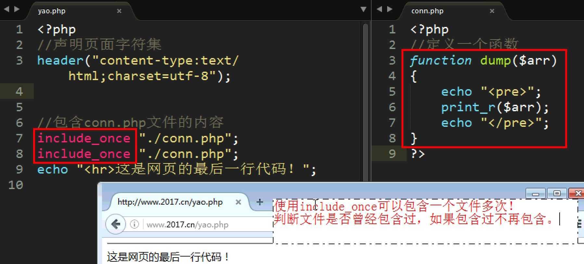

# PHP_Day07_包含_错误配置_函数_变量作用域_递归

>PHP_基础_Day07知识点


[TOC]

##PHP终止脚本运行`die()`和`exit()`
* 描述:==输出一个消息并且退出当前脚本==
* 语法:`void exit([string $str])`

```PHP

    //PHP连接MYSQL数据库
	$link = @mysql_connect("ldocalhost","root","12345");

	//判断数据库是否连通
	if (!$link) {
		exit("PHP连接MySql失败");	//输出错误信息,并且终止脚本向下执行
		//以下所有内容都不会执行:HTML CSS JS PHP 都不会执行
	}

	echo "正在读取数据库数据"	

```  

****

##PHP服务端包含
* **描述**: 在服务器端把其他文件包含
* **服务器端包含**: 将其他页面的内容包含的当前页面来执行,相当于复制,以下四个的语法结构,不函数

****

* `include "相对文件路径"`,当包含的文件不存在,会报**警告错误,脚本不会终止**
* `require "文件路径"`当包含文件不存在,会**报致命错误,脚本会立即停止**


****

* `include_once`:包含文件一次,如果第二次包含不在执行,相当于if判断,其他情况与include一样
* `require_once`:包含文件一次,如果第二次包含不在执行,其他情况与require一样



****

##PHP错误相关配置
###程序错误分类
* **语法错误**:你写的代码,与PHP的脚本引擎的规则不一样,如:没有结束分号
* **编译错误**
    * **提示性错误(Notice)**:轻微错误:如:变量没有定义
    * **警告错误(Warning)**:如:include包含不存在的文件
    * **致命错误(Fatal Error)**:最严重的错误.以下脚本不再执行 
* **逻辑错误**:是人为错误,程序的运行结果,与预期结果不一致 

****

###display_errors开启关闭报错
* 线上产品,所有的错误显示都应该关闭
* PHP配置文件:`PHP.ini`
* `display_errors`:取值`on`或`off`


****

###`ini_set()`函数
* 描述:为应该配置选项设置一个值
* 语法:`string ini_set(string $varname,string $newvalue)`
* `$varname`配置名称.`$newvalue`配置的值
* 注意:`ini_set()`对PHP配置的修改属于**脚本级**,只对当前脚本有效
* 修改`php.ini`文件,属于**全局配置**,全局配置时,`appche`服务上的所有主机都生效


```PHP

//脚本级配置:只针对当前脚本有效,不会对其他站点造成影响
//不需要重启Apche服务
//重启Apche服务配置,属于全局配置,所有的虚拟主机都会受到影响
ini_set("display_errors", "off");

phpinfo();//显示PHP所有的配置信息

```


****

###error_reporting报告错误的等级
* 当PHP有错误发生时,允许显示那些错误


```PHP
//设置PHP报告的错误等级 当前设置:只报提示性错误,其他错误不报告
ini_set("error_reporting", E_NOTICE);
//E_ALL E_WAPNING E_ERROR E_PARSE E_NOTICE  
//error_reporting 值设置为零,将屏蔽所有错误
//error_reporting 的设值为常量

phpinfo();//显示PHP所有的配置信息

```

****


##PHP函数
* 函数是一段命名的代码段
* 减省重复的代码,方便后期维护

****

###函数定义格式

```PHP
function funcName(形参1,形参2){
    //函数的功能代码
    [return 参数]
}
```

* `function`定义函数关键字.不区分大小写
* `funcName`函数名称,命名规则与变量一样,不带`$`符号
* 小括号`()`,主要用来接受传递过来的参数
* 定义函数时的参数,就是形参(形式参数),是一个临时容器
* `return` 语句可选,向调用的函数者返回一个值

****

* **实参**:调用函数时,传递参数就是实参,
* **形参**:定义函数时的参数


```PHP

//求一个枚举数组元素的和
//注意数组是值传递 加&后是引用传递
function getSum(&$arr2){
	$sum = 0;
	foreach ($arr2 as $key => $value) {
		$sum += $value;
	}
	return $sum;
}

 //函数调用
 $arr = array(1,2,3,4,5);
 echo getSum($arr);

```

****

### 函数的参数传递
#### 值传递
* 函数的参数的值传递,就是将参数的值,复制一份,传到函数中

****

#### 引用传递
* 把变量的地址传递到函数中 
* 值传递速度比较慢,但修改其中一个不会影响另一个
* 引用传递速度比较快,但是修改其中一个,另一个也回改变
* **引用传递**,是将一个变量的地址复制一份,传递到函数中

****

### 默认参数
* ==如果**实参个数少于形参**时,可以用一个默认参数来代替==
* **默认参数**,只能用在定义函数是的参数
* **默认参数的位置**,必须放置在非默认参数的右边
* **默认参数的值**,只能是基本数据类型,不能是变量

```PHP

function showInfo($name,$action="开挖掘机"){
	echo "{$name}正在{$action}<br>";
}

//调用函数
showInfo("李四");

```

****


###函数可变数量参数
* `array func_get_ages(void)`:返回参数列表的枚举数组.参数数组的下标是从0开始的
* `array func_get_arg(int $index)`:返回参数数组中,指定下标的参数的值
* `int func_num_args(void)`:返回实参的个数
* 以上三个系统函数,只能在函数定义中来使用

```PHP

function getSum1(){
	$arr = func_get_args(); //获取所有参数列表的数组
	$len = func_num_args();	//获取参数个数
	$sum = 0;
	for ($i=0; $i < $len; $i++) { 
		$sum += func_get_arg($i); //根据下标从参数数组中取值
	}

	return $sum;
}

```

****

###函数返回值return
* 函数的返回值,通过return语句实现
* 将函数的执行结果,返回给了**函数的调用者**
* `return`语句**一旦执行,函数立即结束**,函数剩余的代码不再执行
* `return`语句有中断函数,退出函数
* `return`不能同时返回多个值,只能返回一个值如果想返回多个值,可以放置在数组中返回

****

###可变函数
* 在调用函数时,函数的名称是一个变量,该变量的值是一个字符串的函数名 如: `$a()`
* 一个函数名是一个变量,在这种情况下,也可以传递参数
* 注意:字符串的函数名,不能带小括号

```PHP

function showInfo($n){
	echo"这个一个可变函数的简单应用 $n";
}

$a = "showInfo"; //字符串的函数名,不能带小括号,相当于函数传地址
				 //可变函数也可以传递参数
$a(100);//调用函数

```

****

####程序的执行过程
1. 语法检查
2. 给函数或类代码开内存空间
3. 一行一行的解析代码


* 注意:函数代码和类代码.都是要提前驻留内存的


###匿名函数
* 没有名字函数,就是匿名函数
* 匿名函数不能单独定义,也不能单独调用
* 匿名函数,一般是做为数据,给变量赋值的
* 匿名函数,结束大括号的分号,不能省略


```PHP

//匿名函数:没有名字的函数
//匿名函数,一般作为赋值用
$a = function($name,$age){
	echo "{$name}的年龄是{$age}岁";
};//注意添加分号

//调用函数
$a("abc",29);

//给数组元素赋匿名函数
$arr[] = function(){
    echo "将匿名函数作为数据,赋值给数组元素";
};

echo $arr[0]();//$arr[0]是一个函数,加口号,就是调用函数

```

****


##变量作用域
* **全局变量**:的作用范围.在**函数外部定义的变量**都是**全局变量**
* 网页执行完毕全局变量就消失了
* **局部变量**: 局部变量的作用范围,在**函数内部定义变量**,就是局部变量
* 函数执行完毕局部变量就消失了
* **超全局变量**:在网页的任何地方,都可以使用的变量

****

* 在JS中全局变量可以直接在函数内边来使用,但是在PHP中,全局变量不能直接在函数内边使用
* 在PHP中,函数内和函数外是不通的 

****

###全局变量
####在PHP中全局变量,不能直接在函数内部使用


****

####在局部作用域中访问全局变量
#####`global`关键字
* 在PHP中全局变量,不能直接在函数中使用
* 使用`global`关键字,来实现,**将全局变量引入到函数中使用**
* `global`在声明为全局变量时,不能直接赋值
* **只能在函数内部来使用**
* `global`与JS中的全局变量的功能不同,可以理解为,**引用传地址**
 

* ==注意:`global` 是引用传地址==


****

#####`$GLOBALS`超全局数组
* **超全局数组变量**:`$_GET $_POST $_REQUEST $_FILES $_COOKIE $_SESSION $GLOBALS`
* **超全局数组变量**,可以在网页的任何地方都能使用
* ==`$GLOBALS`数组中包含:`$_GET $_POST $_COOKIE $_FILES`和 全局变量==
* `$GLOBALS['name'] = '张三丰'`将$name声明为里外都可以用的全局变量
* `echo $GLOBALS['name']`输出name的全局变量的值


****

###静态变量`static`关键字
* `static`关键字修饰的变量,就是静态变量
* `static`关键字只能在函数内或者方法内部使用

****

> 函数中变量,在函数执行完毕,就消失了.如何实现函数执行完毕,局部变量不消失?


****

###函数递归调用
####递归思想
* 递归就是一种编程的思想;
* 递归是讲一个大的比较复杂的问题,分解成若干相似的小问题,来进行解决 `阶乘 n(n-1)`

>求5的阶乘?
>


****

####函数递归调用
* 函数嵌套:在函数定义中,调用了一个**其他的函数**
* 函数递归:在函数定义中,**函数自己调用自己**
* 如: 阶乘 文件递归显示 商品的无限极分类

****

####递归实现的条件
* ==确定递归的公式==
* ==确定递归的退出条件==,如果没有退出条件,将是函数的无限递归调用

>实例:求n的阶乘


* 递归作用:用最少的代码,解决的最复杂的问题,缺点运行效率太低


****


 


