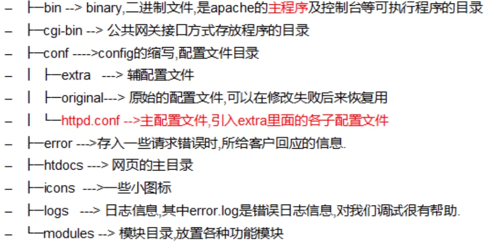
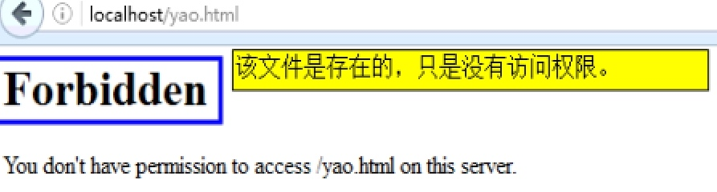
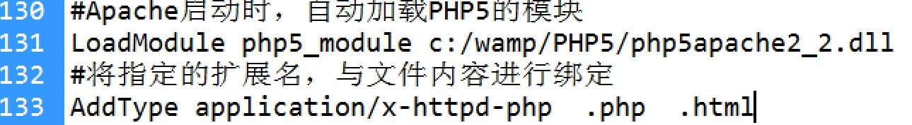

# PHP_开发环境搭建_Day01

[TOC]

## 网络基本概念

### 前端描述
* 内容:网站的核心.
* HTML:主要负责网页结构.
* CSS: 主要负责网页的样式
* JS: 主要负责网站交互 特效

---------

### 后端描述


 

-------

### IP地址
* internet Protocol Address 网际协议地址
* 互联网上的每个主机都有一个身份号码 就是IP地址
* IP地址是由32位**二进制构成**,分成4段,每段8位
* IP地址通常用"**点分十进制**"方法 进行书写 a.b.c.d
* 其中a.b.c.d的取值是0-255
* 每台计算机都有一个==本地的IP地址 **127.0.0.1**== 主要**用于本地网站测试**,或者进程通信
* **127.0.0.1地址 只能是自己访问自己**


****

### 域名
* 计算机只能识别IP地址的请求,其他方式的访问.计算机不识别
* IP地址不方便记忆,使用字母组合来代替一个主机,这个字母组合就是**域名**

#### 域名的构成
* 字母 数字 中划线组成 
* 域名提供商: 万网(net.cn) 新网 西部数据]

#### 域名的层级
* www 网络名字
* sina 域名主体
* com 商业公司 edu教育 org非盈利 gov政府 mil军事 cn中国 jp日本 tw台湾 hk香港

#### 特殊域名
* ==localhost 代表本机 外网无法访问==

****

### DNS解析
* 互联网上的每台主机,都只能直接识别IP地址的访问,不能直接识别 
* DNS(Domain Name System 域名解析系统) ==负责将域名翻译成IP地址==
* DNS是运行在互联网上的一台主机.一台主机可以有多个IP地址
* DNS也是一台服务器,主要职责==将域名转换IP地址==


* DNS 是一个数据库,==存储域名和IP地址对应关系的数据库== 


****

####host 本机DNS
* Hosts 是一个本地的一个隐藏文件,没有扩展名的文件 
* 主要用来设置IP地址和域名的对应关系的
 
 

****

## PHP网页的工作原理
### 访问静态网页


* 注意: 图片是浏览器根据图片路径地址去请求的

### 访问PHP文件


****

## Apache服务器
* Apache是当前最流行的服务端软件之一
* 基于文件配置:Apache可以搭建虚拟主机,可以搭建虚拟主机, 其他IIS nginx 等

****

### 安装
* Wamp: Win+Apache+mysql+PHP

****

### 测试
在浏览器输入localhost 

****

### 启动和退出
* 单机任务栏的apcche的图标
* 使用命令启动 和 停止

命令 | 说明 | 平台
---- | ---- | ---
net start apache2.2 | 开启 | Win
net stop apache2.2 | 停止 | Win 
sudo apachectl start | 开启 | Mac
sudo apachectl restart | 重启 | Mac
sudo apachectl stop | 停止 | Mac

****

### Apache目录结构



### 配置文件语法检查
* Apache 的主要配置文件 : httpd.conf 
* 如果主配置文件出现问题,那么Apache将无法启动
* 配置文件一旦修改,Apcche服务必须重启
* **通过httpd.exe -t 检查语法错误**

****

### Apache基本配置
* Apache 主配置文件**httpd.conf**
* Apache 虚拟主机配置文件**http-vhosts.conf**
* 本机DNS 配置文件 **hosts**
* 在主配置中的配置是全局配置 在虚拟主机配置文件是局部配置 
* 如果设置了虚拟主机配置 要高于全局配置

****

#### Listen 监听
* 当Apache启动后 ==**监听自己电脑的IP**地址或端口的访问 并且为其提供服务== 

```//
语法: listen IP地址[:端口号]

举例: listen 127.0.0.1:80 //监听127.0.0.1 自己的 80端口请求
listen 80 //监听所有自己IP的80端口的请求
listen 192.168.0.10 
```


****

##### 端口的含义
* 每台计算机都有若干个服务,每个服务都有一个对应的数字编号 就是所谓的端口号. 
* **端口号的取值范围 0-65536**
* 100以下的都已经被系统服务所占用
* www服务:80 FTP服务:21 MYSQL:3306 邮件服务:25


****

#### DocumentRoot 设置网站的根目录
* 设置网站的根目录 一般不建议放在C盘下
* 安装完成后 默认的网站根目录 "/Library/WebServer/Documents"


* 注意访问权限问题 同时设置Directory 路径




****

#### DirectoryIndex 设置默认首页 
* 描述:设置网站的默认首页 
* ==如果虚拟主机没有配置默认首页,会继承全局配置中的默认首页==


```//
    语法: DirectoryIndex fileName1 fileName2 fileName3 
    //可以同时设置多个首页文件名,哪个先存在 先执行哪个 多个首页文件名用空格隔开
    
``` 

```//
# DirectoryIndex: sets the file that Apache will serve if a directory
# is requested.
#
<IfModule dir_module>
    DirectoryIndex index.html 
</IfModule>
```

****

#### <Directory></Directory>目录权限


* 网站根目录,必须要指定目录权限 否则无权访问
* 目录权限是一个配置段 ==<Directory dir-path></Directory>==
* 其中dir-path 是设置哪个目录的访问权限,一般要与DocumentRoot目录一致


* **Options**:指定Apache启用那些服务器特性 
    *  ALL 启用所有飞服务器特性 
    *  NONE 没有任何访问权限 
    *  Indexes 如果首页文件不存在 显示文件列表
    
    


    
* **Order** 指定Allow 和 deny执行顺序


*  **Allow** 运行哪些外部IP地址访问我的主机 
    * **Allow from All** 所有外部的IP都可以访问
    * Allow from 192.168.0.10  192.168.0.8   //只有指定的IP可以访问你的主机
    * Allow from 192.168.0     //指定一个网段可以访问你的主机

    
* **Deny** 禁止那些外部IP地址访问你的主机 
    * **Deny from All** 


****

## Apache 虚拟主机配置
###虚拟主机介绍
* 专业的服务器(主机) 市场价几十万左右一台 专业服务器太贵 小公司一般可以租用小空间 租用100MB\200mb 大概价格1元\1MB\年 大公司,买一台专业服务器分割成1000个小空间 每个空间收300元\年 但是1万个小网站共享 Apache服务 PHP 服务 MYSQL数据库服务

****

### NameVirtualHost 
* 虚拟主机分为两种 基于**域名**的虚拟主机 基于**IP**的虚拟主机
* 基于**域名**的虚拟主机: ==多个域名,对应一个IP地址==
* 基于**IP**的虚拟主机: ==一个IP,对应一个域名==
* **NameVirtualHost**是配置**基于域名**的虚拟主机的**必须的命令**

****

###<VirtualHost> </VirtualHost> 配置段
* 描述: <VirtualHost> ==是配置虚拟主机的配置段==
* 提示:一个虚拟主机有一对<VirtualHost>标记,两个虚拟主机有两对<VirtualHost>标记,依次类推

****

### 虚拟主机配置步骤
#### 需求
* 配置www.aaa.com 指定网站根目录 c:\a 配置www.bbb.com指定网站根目录 c:\b 当前IP地址127.0.0.1

****

#### 解析
##### 1 更改本地DSN - hosts文件
* 更改更改本地DSN - hotos文件 对应IP域名关系


****

##### 2 修改Apache的主配置文件
* 配置端口号Listen
 

* 把虚拟主机配置文件代码,包含到主配置中


****

##### 3 配置虚拟主机 更改 httpd-vhosts.conf 文件
* ==文件路径**extra\httpd-vhosts.conf**==


****


## PHP脚本程序配置
* PHP解压安装

### 在CMD运行PHP脚本
* 文件路径php 
* 相关参数: 
    * -f 运行指定的PHP文件
    * -M查看php加载了那些模块
    * -v查看php的版本   
    
    
****

### 配置Apache处理PHP脚本
* Apache 主配置文件**httpd.conf**
* Apache 虚拟主机配置文件**http-vhosts.conf**
* 本机DNS 配置文件 **hosts**

#### LoadModule 
* Apache 加载PHP5 处理模块 :当Apache 服务启动时自动启动PHP5模块


****

#### AddType 
* 将指定的扩展名 与文件的内容类型 进行一个绑定 设置PHP只能出来的什么类型的文件

```//
# 将指定扩展名 与文件内容进行绑定
 AddType application/x-httpd-php .php .phtml

```





****


