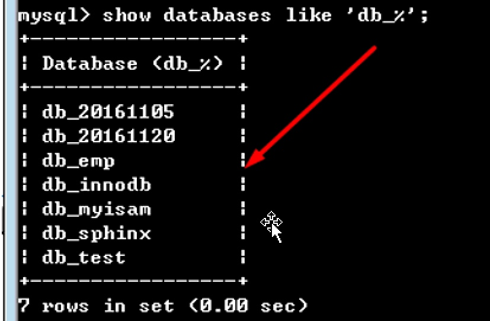

# MYSQL_Day01_概述_启动停止_库操作_表操作_数据增删改查_字符集_校对集


[TOC]

## (一)MySQL概述
### 1 什么是数据库
* 存储数据的容器,如: 电话簿 Excel
* 广义:存储数据的容器
* 狭义:存储和处理数据的介质(磁盘 + 内存)

****

### 2 数据库分类
* **关系型数据库**,以关联模型建立的数据库(硬盘)
* **非关系型数据库**,除了关系型数据库,其他的数据库都叫非关系型数据库(内存)
* 两者之间是主要在于存数介质的不同

* 效率: 非关系型数据库的运输效率要快于关系型数据库
* 安全:关系型数据库的安全性要高于非关系型,但是非关系型数据库也可以把数据库转移到硬盘中

****

### 3 常用的数据库
* 关系型数据库
* 小型:Access数据库(ASP + ACCESS)
* 中型:SQL Server(MSSQL) , SyBase ,MySQL(LAMP环境)
* 大型:Qracle(甲骨文) DB2

****

* 非关系型数据库
* memcached,redis,mongodb

****

### 4 MySQL学习阶段
1. MySQL基础(5天)
2. MySQL高级(针对百万,千万并发,索引,优化,分区,分表)
3. MySQL架构(MySQL集群)

****

### 5 为什么学习MySQL
 

****

##(二)启动与停止MySQL
### 1 MySQL的结构
* MySQL是基于C/S(Client客户端/Server服务器端)的架构软件

****

### 2 MySQL的执行流程


### 3 启动MySQL服务端
* 在CMD终端中,启动MySQL
* 基本语法: `net start|stop|restsrt 服务名称` 

****

### 4 使用CMD终端连接MySQL服务端
* 连接的基本语法

```MySQL

mysql -h localhost 或 127.0.0.1 -P 3306 -u root -p 密码

//注意在应用过程中 -h 和 -P是可以不写
```  

* 注意: 实际工作中,不建议输入明文密码


****

### 5 退出MySQL
* 语法:`quit` 或 `exit`


****

## (三) 编写SQL语句(数据库操作) 
### 1 数据库对象
* **数据库管理系统(DBMS)** = 数据库管理系统 + 数据库(DataBase)
* **DBA**:数据库管理员
* **数据库的组成部分**: 
    * ①数据库(Database) 
    * ②数据表(Table) 
    * ③列(字段) 
    * ④行(记录)


****

### 2 使用SQL语句查看数据库
#### ①显示所有数据库 
* 基本语法

```sql
-- 显示所有数据库
show databases; 

```

* 特别注意: 没一条SQL语句的末尾必须加分号(英文状态下)

>示例代码


****

#### ②显示指定数据库

```sql
-- 查看指定数据库
show databases like '匹配符'

```

* `%`:匹配任意一个字符,如`info%`
* `_`:匹配任意某个字符,只匹配一个字符,如`o_`

>示例代码


****

### 3 创建数据库(create)

```sql
--创建数据
create database 数据库名称 [库选项];

```

* **[库选项]**: 
* **字符集**: utf-8,gbk 创建数据时需要使用的字符集,`utf8` 或 `gbk`
* **校对集**: 数据比较时所使用的比对规则 `_bin`,`_ci`,`_cs` 一般式默认的
    
> 实例代码


* 使用show database查看创建的数据库


****

### 4 修改数据库(alter)
* 注意: 在MySQL 中,数据库的名称是固定的,不能修改,只能删除,我们所谓修改,都是针对编码格式


```sql

    alter database 数据库名称 charset 字符集;


```

> 实例代码


* 使用`show create database`指令查看结果


****

### 5 删除数据库(drop)


```sql

    drop database 数据库名称;

```


****


### 6 数据库操作的执行流程
* ①创建数据库 db_shop

```sql

    create database db_shop;

```


* ② 数据的创建过程
* 在数据库创建语句执行完毕后，其会自动在数据库目录data文件夹中创建与数据库同名的目录。


* ③查看 db.opt 使用编辑软件（如EditPlus或Sublime Text）


****

### 7 数据库创建时的关键字
* ① 默认情况下不能使用关键字作为数据库的名称

* ② 如果一定想使用关键字或中文作为数据库的名称，可以使用``点（Esc下面的~键的英文字符）


****

## (四)编写SQL语句(数据表操作)
### 1 创建数据表

```sql

create table 数据表名称(
    字段名称 数据类型 [字段约束]
    ...
) [表选项]

```

* **[表选项]**
* **数据表引擎**: `Myisam` 与 `InnoDB`引擎
* **字符集**: `utf8` 或 `gbk`
* **校对集**: `_bin`,`_ci`,`_cs`

> 示例代码:

```sql
-- 以手机为例子 设计数据表
-- 数据表名称: sh_goods
-- 字段:
-- 编号(id) 字段类型(int) 
-- 标题(title): 字段类型(varchar(40))
-- 描述(desc): 字段类型(varchar(255))
-- 价格(price): 字段类型(decimal(11,2))总长度是11位其中两位小数点 
-- 内容(content): 字段类型(text)

--第一种创建方式：直接指定数据库的名称
create table db_shop.sh_goods(
    id int,
    title varchar(40),
    desc varchar(255),
    price decimal(11,2),
    content text
) engine = myisam default sharset=utf8;

```


```sql
--第二种创建方式：隐式创建，需要使用use关键字
use db_shop;
create table if not exists sh_goods(

);

```


****

### 2 以复制方式创建数据表

```sql

create table 要创建的表名 like 要复制的表名;

```

>示例代码:


****

### 3 查看数据表(查看表名)
#### ①查看所有表名

```sql
    show tables;
```
>示例代码


#### ②使用like 模糊查询

```sql
    
    show tables like `匹配符`;

```

* `%`:匹配任意个字符
* `_`:匹配一个字符

>示例代码


****

### 4 查看数据表结构

```sql

desc | describe | show columns from 来查看表结构

```
>示例代码：


* 在实际应用中,如果想查看数据表的引擎或编码格式


```sql

show  create  table   数据表名称;

```

>示例代码


****

### 5 表结构以外的信息


****

### 6 修改数据表(数据的名称)

```sql
-- 修改数据表名称
rename table 数据表旧名 to 数据表新名称;

```

****

### 7 修改数据表的(字段信息 ①名称 ②类型)
#### ①修改数据表的字段-添加字段(add)
```sql

alter table 数据表名称 add column 字段名称 字段类型 first | after 如果是after 后面要跟字段名称

```

****

#### ②修改数据表的-字段名称(change)
```sql

alter table 数据表名称 change 旧字段名称 新字段名称 字段类型;

```

#### ③修改数据表的-字段类型(modify)
```sql 

alter table 数据表名称 modify 字段名称 字段新类型;

```

#### ④删除数据表-字段信息(drop)
```sql

alter table 数据表名称 drop 字段名称;

```

### 8 数据表操作的执行流程
* ① 使用create 关键词创建数据表
* ②创建成功后,硬盘中又三个文件
* ③每个文件的功能
    1. `*.frm`数据表的结构文件,存放自动的结构信息
    2. `*.MYD`MYSQL DATA 缩写,主要存放的是数据信息
    3. `*.MYL` mySQL index 主要存放的是索引信息 


### 9 删除数据表

```sql 

drop table 数据表名;

```


### 10 数据表中的其他操作
* 在数据表中,还可以实现对引擎,编码格式和校对集的修改


```sql

alter table 数据表名称[charset 新编码格式 |character set 新的编码格式] [collate 校对集] [engine = 新引擎(Myisam 或 InnoDB)]

```

****

## (五)编写SQL语句(数据的增删改查)<=重点
### 1 增加数据

```sql

insert into 数据表[字段名称1,字段名2 ] values(数据1,数据2)
-- 针对整形,浮动性可以不加单引号或双引号 但是如果是字符串类型 必须使用单引号或双引号括起来
```

****

#### ①不指定字段插入信息


```sql

insert into sh_goods1 values (1,'我是手机1title','我是描述1',2333,'内容');


```

****

#### ②指定字段插入信息

```sql

insert into sh_goods1(id,title) values (1,'我是手机4');

```
****

### 2 查询数据

```sql

select * | [字段名称1,字段名称2...] from 数据表名称\G

```

* **基本语法**

```sql
--数据量大的情况下一般不用此种方式
select * from sh_goods1;

--读取产品的信息纵向显示
select * from sh_goods1\G
```

* **只显示指定的信息**

```sql

-- 读取指定字段的信息
select id,title from sh_goods1;

```

****

### 3 修改数据
```sql

update 数据表名称 set 字段名称 = 新字段的值[,字段名称 = 新字段的值] where 字段名称 = 字段值;

--基本语法

update sh_goods1 set price = 998.00 where id = 1;

```

****

### 4 删除数据

```sql

delete from 数据表 where = 字段=字段值

delete from sh_goods1 where id = 4;

```

* 在开发中删除或修改一定要指定条件


****

## (六) MySQL中的字符集
### 1 为什么要学习字符集
* 在打开终端,没有设置set names GBK的情况 ,插入数据


* 出现以上问题的原因在于字符集错误

****

### 2 什么是字符集
* 字符集就是计算机中数据的表示方式,数据在计算机的底层都是通过二进制进行储存的.看是通过0或1 来进行储存的,但是是二进制表示的内容比较少,通常使用字节来表示基本单位,最小单位叫做 ==位(bit) 1字节=8bit(位)==
* 早期,美国开发一套自己的字符的表示规则(字符集),ASCII码 在计算机中占用1个字节长度,总共可以表示2^8=256个字符
* 中国人自己开发的一套字符集表示规则,GBK,一个汉字占用2个字节,可以表示2^8* 2^8 = 65536个字符
* 但是GBK还是不能表示所有的字符,后来世界标准化组织开发出了UTF8编码格式,用来表示所有字符

****

### 3 查看MySQL中的字符集
* 基本语法:`show character set;`

****

### 4 查看MySQL中的默认字符集
基本语法 `show variables like 'character_set%'`


****

### 5 使用字符集解决乱码问题
* ①告诉服务器端,客户端传递的是什么格式(插入操作有效果)'set characher_set_client = GBK'
* ②告诉服务器端,客户端只能接受GBK格式(查询操作有效果)'set character_set_results = GBK'
* set只能是临时的,只会当前会话中有效,下次重新打开CMD终端无效
* 但是实际应用中,不需要单独设置以上两个选项

```sql

set name 字符集格式; 

```
****

## (七)MySQL中的校对集
* 校对:实际上就是对数据进行比较,校对集就是MySQL数据的比较方式
* `_bin`:二进制校对集,使用二进制对数据进行比较(ASCII码)
* `_ci` case insensitive 比较时对大小写不敏感,不区分大小写
* `_CS` case sensitive 

****

### 1 查看MySQL 中的校对集

```MySQL

show collation;

```

****

### 2 MySQL校对集效果


****

### 3 对数据进行排序操作

```sql
select * from 数据表 order by 字段名[asc | desc]

```

* asc: 升序排序,0-100
* desc:降序排序,100-0

* sh_bin排序结果：


* sh_ci排序结果：
 


