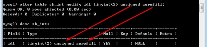
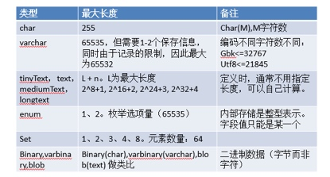

# MYSQL_Day02_整数型_小数型_字符串型_时间型_字段约束


[TOC]

## (一)字段类型
### 1 创建数据表的基本语法

```sql

create table 数据表名(
    字段名称 字段类型 字段约束,
    ....
)[表选项]

```

* 在应用中,数据表的创建需要我们提供相应的字段名称,字段类型 和 字段约束

****

### 2 字段类型关联表 
 
 

 
 
## (二)整数型
* 整数其实就是整型数字

### 1 整数的常见数据类型

| 类型 | 字节 | 区间 |
| --- | --- | --- |
| tinyint | 1 | 无符号 0 - 255 有符号 -127 - 128|
| smallint | 2 | 无符号 0 - 65535 有符号 -32768 - 32767|
| mediumint | 3 | 无符号 16777215 有符号-8388608 |
| int | 4 | 无符号4394967295 有符号-2147483648 |
| bigint | 8 | 很大 |  

****

### 2 整数类型的演示
* ① 创建数据表


* ② 使用desc查看字段类型


* ③ 插入数据测试数据


* ④ 如果插入的数值超过了字段能容纳的最大值


****

### 4 设置无符号型
* 在MySQL 中,如果默认没有为字段指定约束(是否有符号),默认该字段是有符号的

```sql

--创建无符号约束
create table 数据表名称(
	字段名称 int unsigned
)[表选项];

```


```sql

-- 修改自动的类型
alter table 数据表名称 modify 字段名称 字段类型 unsigned;

```


****

### 5 zerofill 零填充
* ①使用`desc`查看数据表结构,每个字段后都有数组


* ②`zerofill`零填充 
* 在MySQL 整形后面的数值只和`zerofill`有关,==代表0填充==,如果当前是无符号型,默认长度为4 但实际数据只有2位 会再前面自动补零



* ③ 插入测试数据：


****

### 6 插入科学技术法

```sql

-- 插入科学技术法-------------
insert into sh_int_demo(id3) values(1.23e5);

```

****

## (三)小数型
* 小数型就是带小数点的数值

****

### 1 小数型的常用数据类型

| 类型 | 字节 | 区间 | 类 |
| --- | --- | --- | --- |
| float | 4  | 能表示的十进制有效位8位 | 浮点型 |
| double | 8 | 16位 | 浮点型 |
| decimal(M,D) | 占用空间不固定 变长 |  | 定点型 |

* `M`代表总长度(包括整数 + 小数部分)
* `D` 小数点后面的位数
* ==记住：M代表总长度（包括整数部分+小数部分），D小数点后面的位数。==

****

### 2 小数类型演示
* **①浮点类型有没有指定(M,D)情况**

```sql

create table sh_float(
	f1 float,
	f2 float(5,2)
);

```

* **②定点类型没有指定(M,D) 的情况**

```sql

-- 创建定点类型数据
create table sh_decimal(
	f1 decimal,
	f2 decimal(5,2)
);

```


* 如果定点类型没有指定(M,D) 会省略小数位,并值会四舍五入
* 由此可知，如果decimal没有指定M与D，则默认返回整数，小数位会自动采用四舍五入。


****

* **③整数部分超过指定的M值**


* ==由以上运行结果可知，在小数类型中，其M值一定不能超过指定的M值，否则无法插入数据==

* **④小数部分超过指定的D值**


* ==由以上运行结果可知，在小数类型中，如果D值超过了指定的D值，其是可以正常插入的，但是其结果会进行四舍五入==

* **⑤如果整数位 + 小数位超过了 M**整数部分没有越界 小数部分越界 查看结果


****

### 4 实际开发中的小数应用
* 在计算机内存中 其浮点数是采用浮点运算方式的,而定点数是采用定点运算方式的 ==所以定点类型用于更高的精度,不会出现误差==

#### **浮点类型数据的误差问题**
* 在MySQL 中 float 其中有效长度为 8 为 double 为16位
* 使用float类型与decimal类型存储，65536 * 2 = 131072，示例代码：131072.32


* ==注意: 在应用中,对应货币等精度要求比较高的情况下,不要使用浮点型,**要使用定点型**==

****

##(四)字符串类型

* 字符串 就是 字符信息

### 字符串常见的数据类型



### 1 char 和 varchar类型
* **char(M) 类型**: 定长 M的最大值为255对编码格式没有要求
* **varchar(M) 类型**: 变长 M理论上65535 
    * 但是还有特别注意 其中还需要 1-2 个字节存储长度信息
    * 而且还需要1个字符左右存储额外信息如(isNull) 
    * 他实际可存数据大约65532 另外M还与编码格式有关 如果GBK格式 除2 UTF8除3
    
* char固定长度 varchar 代表变长


| 值 | char(4)类型 | vrcher(4)类型 |
| --- | --- | --- |
| 'ab' | 4字符  | 2字符 + 1字符  |
| 'ab + 两个空格' | 4字符 | 4 + 1 字符 |

#### ①基本操作,示例代码


#### ② 演示超过字符串存储长度


#### ③ char 与 varchar的区别
* ==存储方式不同==
    * char固定长度，先开辟内存空间，然后在存储数据。如果数据没有填充满M长度，则会造成空间的浪费。
    * varchar变长，先开辟内存空间，根据存储的数据调整空间大小，避免空间的浪费


-------

* ==效率也不同==
    * char是固定长度，不需要额外的计算，所以其效率要高于varchar类型。


------- 

* ==对空格的处理方式不同==


* 在查看空格时，我们可以借助于MySQL中的系统函数concat连接字符串。

* ==char类型：会自动去除元素的首位空格==
* ==varchar类型：会自动保留元素的首位空格==


 
### 3 text文本类型
* 如果varchar类型空间有限,可以使用text文本类型用于存储数据


```sql

    create table sh_article(
    	id mediumint,
    	title varchar(40),
    	descr varchar(255),
    	content text
    );

```

>示例代码
>

****

### 4 blob二进制类型
* blob可以保存二进制数据,可以保存图片,附件等资源,但是使用较少,实际资源数据一般是用路径方式进行保存,使用该类型对空间太浪费

****

### 4 enum枚举类型(多选一)

```sql

    create table sh_uservip(
	id int,
	username varchar(10),
	password char(32),
	age tinyint unsigned,
	sex enum('男','女','保密'),
	address varchar(255)
) engine = myisam default charset = utf8;

```


* ==如果没有与enum项匹配的结果,其数据无法正常插入==
* ==注意 enum选项的数量是有限制的 ,数量为65535==

-------

### 5 set 集合类型(复选结果)
* 复选框情况在实际保存时: 项1 , 项2 , 项3...
* 多选项数量是有限制 数量为 64 

```sql

create table sh_uservip(
	id int,
	username varchar(10),
	password char(32),
	age tinyint unsigned,
	sex enum('男','女','保密'),
	address varchar(255),
	hobby set('吃饭','睡觉');
) engine = myisam default charset = utf8;

```


****

## (五) 时间类型
### 1 常用的时间类型
* 时间的选择通常是看格式的,根据显示的时间格式选取相应的数据类型


* date ：日期，年-月-日，2017-04-03
* time ：时间，小时:分钟:秒，15:11:20


### 2 时间类型演示


```sql
create table sh_time(
	dt datetime,
	ts timestamp,
	d date,
	t time,
	y year
)engine = myisam default charset= utf8;

```


-------


### 3 时间类型的相关细节
#### ①datetime 与 timestamp 类型的区别
* **范围不同**,datetime范围更广
* **默认值**,timestamp不能为空，其拥有默认值，默认值为当前服务器的时间，而且在当前记录更新时，其时间字段也会随之更新


-------

    
#### ②在实际开发中 我们一般选择那种时间类型呢?
* 用int

```php

<?php
	$addtime = time();
    echo ‘datetime：’.date(‘Y-m-d H:i:s’,$addtime);
?>

```

****

## (六) varchar 类型的最大值 

```sql

create  table  sh_gbk(
    v  varchar(65535)
) engine=myisam default charset=gbk;

```


* 设置32767:


* 算法：32767 * 2 = 65534 + 2 = 65536 > 65535，所以减一


****

##(七)字段约束
* 所谓的字段约束就是按我们定义的字段遵循某种规则

### 1 是否为空约束
```sql

create table sh_goods1(
	id int not null,
	title varchar(40) not null,
	descr varchar(255),
	price decimal(11,2) not null,
	content text,
	addtime int 
)engine = myisam default charset = utf8;


```


* 插入异常数据：


### 2 主键约束(primary key)
* 强调数据不能为空,强调数据不能重复


```sql

create table sh_goods2(

	id int not null primary key
	
)engine = myisam default charset= utf8;


--第二种方式
alter table sh_goods2 add primary key(id);


--第三种方式

create table sh_goods2(

	name varchar(20),
	primary key(name)

)engine = myisam default charset= utf8;

```


* 主键冲突


-------


### 3 自动增长(auto_increment)
* 在实际应用中,对编号信息是不需要手工输入的,应该让给MySQL自动进行编号


```sql

create  table  sh_goods5(

   id int not null auto_increment
  
  );

```

*  如果删除了id为2的这条记录，在插入一条数据，其编号是多少呢？


* 查看系统步长


```sql

    show variables like 'auto_increment%';

```

* 设置系统步长

```sql
    set auto_increment_increment = 5; //    设置初始化步长
    set auto_increment_offset = 5;          设置偏移量

```

* 设置起始值

```sql

    alter table sh_goods auto_increment = 60;
    
```

### 4 默认值(default)


```sql

create table sh_user(
	sex enum('男','女') default '男'
);

```

* 两种触发方式 插入数据时不设置默认值的字段
* 插入数据时,默认值字段用default


### 5 字段配注(comment)


```sql

create table sh_user(
	字段名称 类型 约束 conmment '字段备注'
);

```

### 6 唯一键约束(unique key)
* 主键: 不能为空,不能重复
* 唯一键强调: 不能重复,**但是可以为空**,为空字段会自动忽略


```sql

create table sh_user(
	id int unique key
)[数据表选项]

--第二种
create table sh_user(
	id int, 
	unique key(id)
)[数据表选项]

--第三种
alter table 数据表名称 add unique key(id);

```

### 7 主键和唯一键删除

```sql
-- 主键删除
alter table 数据表名称 drop primary key;

-- 唯一键删除
alter table 数据表名称 drop index 唯一键字段名称;

```

* 在MySQL 中 主键不能为空,不能重复 一个表中只能有一个
* 唯一键可以为空但不能重复,一个表中可以有多个

## (八) 京东首页案例
* ① 设计网站页面
* ② 创建一个虚拟主机


* ③ 更改本地DNS文件(hosts)
* ④ 创建项目目录(htdocs\jd)
* ⑤ 把JD首页复制到jd文件夹
* ⑥ 设计数据库
    * 1 创建数据库
    * 
    * 2 创建数据表与字段类型
    * 
    * 3 插入测试数据
    * 
* ⑦ 开启php_mysql.dll(php/php.ini)
* ⑧ PHP连接MySQL
    * 1 PHP连接MySQL
    * 

    * 2 选择数据库
    * 

    * 3 设置编码格式
    * 

    * 4 把服务器端返回的数据转化为关联数组`$data（我是数组） = mysql_fetch_assoc($res); 没执行一次返回一条`
        
    * 5 对返回结果进行遍历
    * 
    * 


    
    
     


