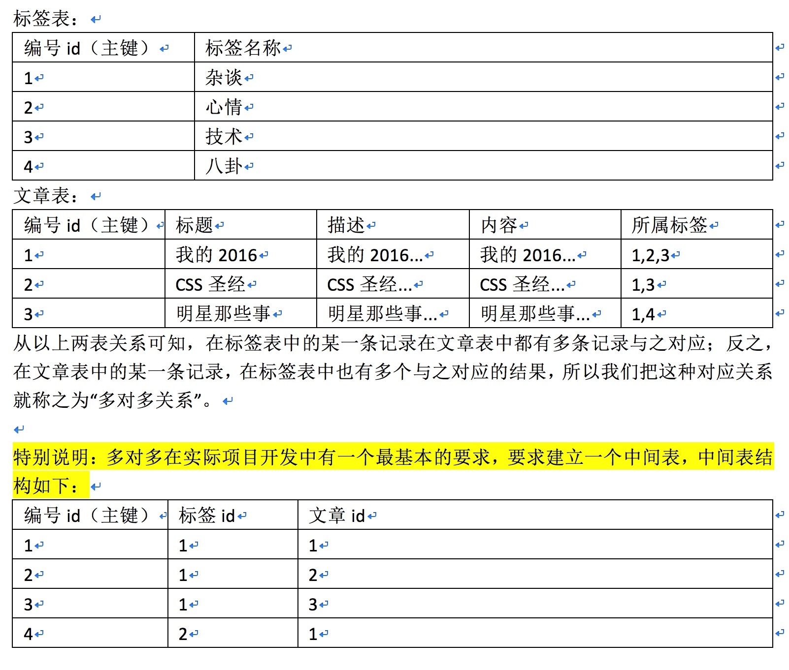

# MYSQL_Day03_自动增长_表关系_引擎_外键_三范式_高级增删改查


[TOC]

## (一) 自动增长
* 就是自动编号

```sql
create table sh_goods3(
	id int unsigned not null auto_increment,
	primary key(id)
);

```


-------


### 2 自动增长起始值的更改


```sql

alter table sh_goods3 auto_increment = 60; 

```

-------


### 3 使用系统变量更改起始值与步阶

```sql

--查看系统变量与 (auto_increment)
show variables like 'auto_increment%';

--修改
set auto_increment_increment = 200;
set auto_increment_offset = 100;

```

* auto_increment_increment :增长因子 每次增长多少
* auto_increment_offset: 偏移量 从哪里开始
* ==特别说明: 增长的偏移量不能小于增长因子,否则会自动忽略==
* ==使用的set 指令的生命周期 是当前窗口的会话时间==

-------

## (二) MySQL中的多表(两张表)关系
### 1 一对一关系
* 在实际应用中,我们通常会把常用的数据保存在一张表中,不常用的保存另一张中


-------


### 2 一对多关系


-------

### 3 多对多关系



* 多对多在实际项目开发中又一个最基本的要求,要求键一个中间表

-------

## (三)MySQL 引擎

### 1 概述
* `engine = myisam defult charset = UTF8`
* 所谓的MySQL引擎 就是数据的存储方式 
* 常用的数据库引擎


-------


### 2 Myisam 与 innoDB引擎的区别
* ==① 批量插入与查询速度==
    *  Myisam 相对于 innoDB 插入与查询速度略快

-------

* ==② 两者的存储方式不同==
    * (1)Myisam : 在数据生成时会自动生成3个文件
        * `.frm` 结构文件 
        * `.MYD` 数据文件
        * `.MTI` 索引文件

    * (2)innoDB :在数据生成时只会生成一个`.frm` 文件,存入数据会保存在`ibdata1`文件中
    
-------

* ==③ 两者支持的功能也是不同的==
    *  Myisam 不支持**事务处理**,而innodb支持事务处理(maysql 5,6 以后Myisam也支持)
    *  Myisam支持**全文索引** 但innodb在mysql5.5 以后才支持
    *  Myisam支持**表锁** 而 innodb支持**行锁**
    *  Myisam不支持**外键** 而 innodb支持
    
    
-------

## (四) 外键的概念

### 1 外键概念
* 在MySQL数据库中, 表和表之间如果存在联系 


* 外键的前提
    * ① 必须是两个表的关联字段
    * ② 这个字段在从表中充当从键   
    

-------


### 2 外键的基本语法

```sql

    create table 数据表名称(
    	id int not null auto_increment,
    	title varchar(40) not null,
    	category id int,
    	primary key(id),
    	foreign key(category id) references (主表)主键 on delete cascade(关联删除) | set null 
    												  on update cascade(关联更新) | set null
    )engine = innodb default charset = utf8;


    -- 语法二
    
    alter table 数据表名称 add constraint 外键字段 foreign key(当前表要设置的外键字段) 
references 主表(字段)  on delete cascade | set null  --关联删除
					  on update cascade | set null  -- 关联更新

```

-------

### 3 外键操作的4种情况
#### ① `cascade`级联操作
* `on update cascade`主表数据被更新（主键值更新），从表也被更新（外键值更新）
* `on delete cascade`主表记录被删除，从表相关记录也被删除。

#### ② `set null` 设置为null
* `on update set null`主表数据被更新（主键值更新），从表的外键被设置为null
* `on delete set null`主表记录被删除，从表相关记录外键被设置成null
* 但注意，要求该外键属性，没有not null属性约束。

#### ③`restrict` 拒绝父表删除和更新 默认情况
* `on update restrict` 和 `on delete restrict`

#### ④`no action` 同上


-------

### 4 外键案例
* 案例: 创建商品分类表 和 商品表 并将其关联
* ① 创建商品分类表

```sql

--创建分类表
create table sh_day03_category(
	id int not null auto_increment,
	category_title varchar(20),
	descr varchar(40),
	primary key(id)
)engine = innodb default charset = utf8;

```

* ② 创建商品表

```sql

-创建产品表
create table sh_day03_goods(
	id int not null auto_increment,
	title varchar(20),
	goodsdesc varchar(40),
	price decimal(5,2),
	category int(2),

	primary key(id),
	foreign key(category) references sh_day03_category(id)
)engine = innodb default charset = utf8;

```

* ③ 关联外键

```sql

--关联外键
alter table sh_day03_goods add constraint category foreign key(category) 
references sh_day03_category(id) on delete cascade on update cascade;

```

* ④ 查看结果

```sql

--查看结果
show create table sh_day03_goods;

```

* ⑤ 关联外键 重新设置 当类别更改或删除 外键致空

```sql

-- 设置关联删除致空
alter table sh_day03_goods add constraint category_fx_1 foreign key(category) 
references sh_day03_category(id) on delete set null on update set null;

```

* ⑥ 关联外键 重新设置 当类别更改或删除 设置关联拒绝父表删除和更新

```sql

-- 设置关联拒绝父表删除和更新
alter table sh_day03_goods add constraint category_fx_2 foreign key(category)
references sh_day03_category(id) on delete restrict;

```


-------


## (五)是数据库设计的三范式
### 1 什么是范式 
* 所谓范式就是数据库设计要遵循的一种规则,理论上数据设计的方一共有6种 1 - 6没一种都要求更加严格
* 但在设计中,我们只需要实现

-------

### 2 范式
#### 1NF 
* 就是数据表中每一列要满足原子性,不能再划分


-------

#### 2NF 
* 在满足1NF的基础上 实体属性应该完全依赖于主关键字。而不能是对主关键字形成部分函数依赖


-------

#### 3NF 
* 满足2NF的基础上 要求不能出现传递依赖，也就是不能出现属性依赖于非主属性的
* 简单讲:一张表只能有一种关联关系，直接关联。如果出现传递依赖（A依赖B，B依赖C），则代表你设计的数据表不满足第三范式


-------


## 高级数据操作
### 1 新增操作
#### ① 基本插入操作:

```sql

insert into 数据表名称(字段) values(值);

```

-------

#### ② 批量插入(速度要快于基本操作)

```sql

insert into jb_string values(null,'a'),(null,'b');

```

-------

#### ③ 主键冲突
* (1)解决冲突insert
    
```sql

--该操作并不是直接更新冲突记录,而是先删除后添加(更新)
insert into jb_string values(1,'e') on duplicate key update 字段 = 字段值;

```

* (2)解决冲突replace

```sql

replace into 数据表(字段) values (值);
--如果数据表中不存在这条记录,则添加
--如果有,则更新
--但其效率并不高

```

-------

#### ④ 蠕虫复制
* 就是一种会分裂的小虫子 所谓的蠕虫的复制就是

```sql

--只复制表结构
create table 数据表名称 like '新数据表名称'; 

--蠕虫复制
insert into 数据表(忽略主键的字段) select 字段 from 新数据表名称;
insert into jb_string(name) select name from jb_string;
--蠕虫复制的目的是测试数据库的承载能力,性能等等 	
```

-------

### 2 删除操作
#### ① 基本删除操作

```sql

    --基本删除操作
    delete from 数据表名称 where 删除条件;	
```

-------

#### ② 清空表


```sql

    --清空表
    truncate 数据表名称;
    truncate jb_string;

```

* `delete from 数据表名称` 与 `truncate` 的区别 ==对于数据结构中的自动增长处理不同==
* ==`truncate` 会重新从1开始==
* ==`delete from 数据表名称` 会继续编号==


-------

#### ③ 高级删除操作(order by | limit)

```sql

-- order by字段[asc | desc]对某个字段进行排序 asc升序 desc降序
-- limit[num]: 指定要删除的数量 limit 语句在SQL语句中放置在最后端
delete from 数据表名称 where 条件 order by 字段 [asc|desc];
 
-- 高级删除操作
delete from jb_string where name = 'a' order by id asc limit 2;

-- 案例2
delete from sh_day03_demo where title = 'a' order by title asc limit 1;

```


-------

### 3 更新操作

```sql

--基本更新操作
update 数据表名称 set 字段 = 字段值[,字段 = 字段值] where 更新的条件;

--高级更新操作
update jb_string set name = 'e' order by id desc limit 2;

```

* `order by 字段 [asc | desc]`
* `limit[num]`


-------

### 4 查询操作 
#### ① SQL语句中的五子句


```sql

--SQL语句中的五子句	
select * from 数据表名称 
	where[条件] 
	group by[分组条件] 
	having[条件]
	order by 字段[asc | desc] 
	limit[offset,length]

-- offset:偏移量 默认从0开始

```

-------

#### 二 `where`子句
##### 运算符
* **算数运算符**:`>` `<` `=` `<>`(不等于) `!=` `>=` `<=`
* **逻辑运算符**: and(&&) or(||) 非(!)
* **布尔运算符** : `is null` `is not null`


```sql
-- 查询年龄大于18的
select * from jd_student where age > 18;
-- 查询年龄不等于22的
select * from jd_student where age <> 22;
--选择id 等于1 或 3的
select * from jd_student where id = 1 or id = 3; 

```

-------

##### `in` 与 `not in`

```sql

--同时查询多条语句
select * from 数据表名 where 字段名 in (字段值,字段值,字段值...);

-- 同时删除多条语句
delete from 数据表 where 字段 in (字段值,字段值..);

-- not in 反项选择

```

-------

##### `between...and..` 或 `not between...and...`

```sql

---`between...and..` 或 `not between...and...`
-- 使用	between...and.. 基本要求 between后面的值要小于 and后面的值
-- 两者是一个闭区间
select * from jd_student 数据表名称 where age between 18 and 20;
--选择年龄18 到 20周岁的
select * from jd_student where age between 18 and 20;
select * from jd_student where age >= 18 and age <= 20; 

```

-------

##### 'all 与 distinct'

* distinct去除重复

-------

```sql

    -- 去除重复
    select distinct * from jd_char; 	
```
 
-------


