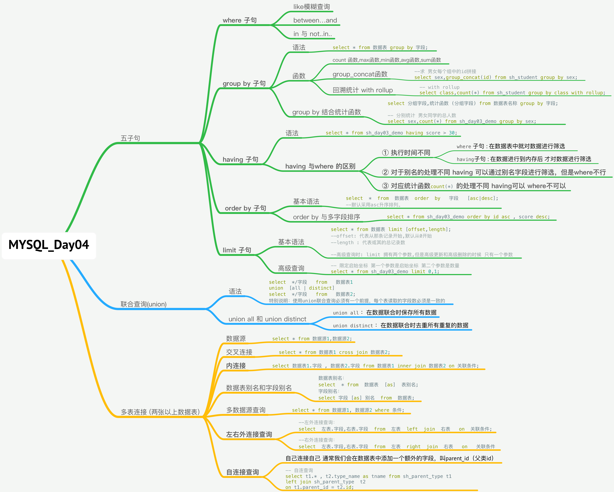
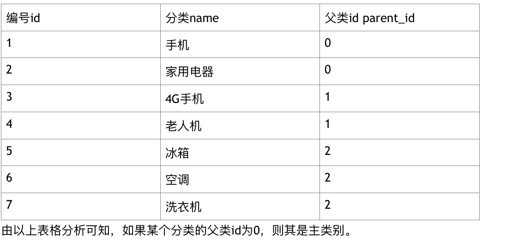
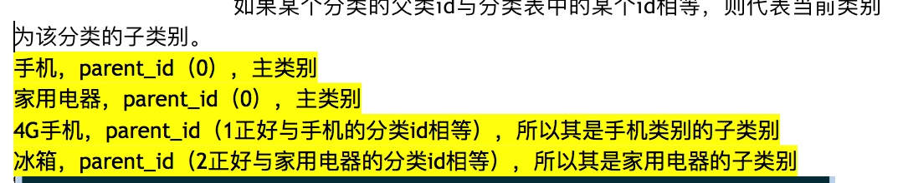
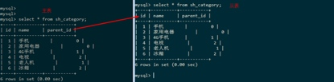
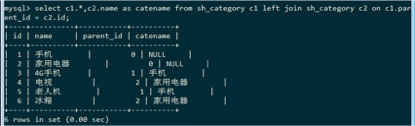

# MYSQL_Day04_五子句_联合查询_内连接_左右外连接_自连接_多数据查询_多表连接



[TOC]


## (一)MySQL中的五子句
### 1 五子句概述


```sql

select */字段 from 数据表 
	where 子句 
	group by 子句
	having 子句
	order by 子句
	limit 子句
;

```

-------


### 2 like 模糊查询
* like 主要用于数据的搜索,like有两个匹配符
* `%`: 匹配任意个字符
* `_`: 只能匹配任意的一个字符


```sql

--like 语句%的使用
select * from sh_day03_demo where descr like 'a%';

-- _ 的使用 查询
select * from sh_day03_demo where descr like 'a_';

-- 特殊情况 如果要查询的关键词中包含%和_ 要使用\反斜杠进行转义
select * from sh_day03_demo where descr like '%\_';

```


-------


### 3 between..and..
* ① between 后面的字符要小于and前面的
* ② between..and..条件要是个闭区间


```sql

-- 查询id 7 - 10
select * from sh_day03_demo where id between 7 and 10;

```

-------


### 4 in 与 not..in..
* in:与逻辑运算符`or`是同义的

```sql

-- 查询 id 为 3 5 6 的
select * from sh_day03_demo where  id in(3,5,6);

```

* 批量删除可以使用in

-------


##(二) group by 子句
### 1 group by概念
* 主要功能就是实现对数据的分组功能

```sql

select * from 数据表 group by 字段;	

```

* 如果仅仅使用group by 对某个字段分组操作 则每个组只会返回一条记录

-------

### 2 group by 分组的意义
* 在于实现的数据进行统计 可以使用如下函数:
* `count(*/字段)` : 获取数据表中的总记录数
* `max(字段)`: 获取某个字段的最大值
* `min(字段)`:某个字段的最小值
* `avg(字段)`:获取某个字段的平均值
* `sum(字段)`:获取某个字段的和 


#### ① `count(*/字段)`函数

```sql
-- 求数据表中的总记录数
select count(*) from sh_day03_demo;

```


-------


#### ② 表别名和字段别名


```sql

--设置表别名
select */别名.字段 from 数据表名称 as 别名;
select */别名.字段 from 数据表名称  别名;


select s.id,s.title from sh_day03_demo  as s;

```

* 设置字段别名作用 
    * (1) 给字段起一个更有意义的名字 如:count(*) 起名字为 num 
    * (2) 如果多表关联 ,解决出现同名字段,后面的字段会覆盖前面的问题(PHP读取MySQL时),避免产生字段冲突的问题

```sql

--设置字段别名
select count(*) as num from sh_day03_demo;
select count(*) num from sh_day03_demo;

```


-------


#### ③ count 函数与 null
* `count(*)` 代表统计所有的记录,还可以统计字段所有记录,但遇到null 就回自动忽略掉

#### ④ max函数 获取最大值
 
 ```sql
 -- 获取id最大值
select max(id) from sh_day03_demo;
 ```
 
#### ⑤ min函数 获取最小值

```sql

-- 获取id最大值
select min(id) from sh_day03_demo;

```


#### ⑥ avg函数 求平均值

```sql
--求平均值
select avg(score) from sh_day03_demo;	

```


#### ⑦ sum函数 求和
```sql

--求和
select sum(score) from sh_day03_demo;

```


-------

### 3 group by 执行原理图
* 当我们对某个字段进行分组时,系统会自动在内存中划分多块区域,用于存放分组数据


-------

### 4 group by 结合统计函数


```sql
select 分组字段,统计函数 (分组字段) from 数据表名称 group by 字段;

-- 分别统计 男女同学的总人数
select sex,count(*) from sh_day03_demo group by sex;

```


-------

### 5 使用group by 对多字段进行分组
* 多字段分组的执行原理
* 首先 对第一个字段进行分组 在对每个单独的组 再次进行分组


-------

### 6 使用 group by 补充 

#### ① group_concat函数
* 把获取的记录数拼接成字符串
* php 把数组转换为字符串 implode函数 
* php 把字符串转换成数组 explode函数


```php

<?php
	
	//定义一个数组
	$data = array("a","b","c");
	//把数据拼接为字符串
	$str = implode($data ,",");
	echo $str;
	
	
	//将字符串拆分成数组
	$data1 = explode(",",$str);
	print_r($data1);
	
?>

```


* group_concat 函数 

```sql

--求 男女每个组中的id拼接
select sex,group_concat(id) from sh_student group by sex;


```


#### ② 回溯统计 with rollup(分组后的数据汇总)
* 回溯统计就是把分组后的结果进行汇总,得到最终的结果

```sql

-- with rollup
select class,count(*) from sh_student group by class with rollup;

```


## (三) having子句

### 1 having概述
* having 子句 和 where 子句的功能是一致的 ,都是用于实现对数据的筛选两种唯一的区别的发生的顺序不同
* `where` 子句 : 在数据表中就对数据进行筛选
* `having`子句 : 在数据进行到内存后 才对数据进行筛选


### 2 having基本用法

```sql

-- 筛选成绩大于30的
select * from sh_day03_demo where score > 30;
select * from sh_day03_demo having score > 30;

```

### 3 having 与where 的区别
* `where` 子句 : 在数据表中就对数据进行筛选
* `having`子句 : 在数据进行到内存后 才对数据进行筛选

#### ① 对于别名的处理不同
* `having` 可以通过别名字段进行筛选，但是`where`不行

```sql

--① 对于别名的处理不同 
错误:select score as s from sh_day03_demo where s > 30; 
正确:select score as s from sh_day03_demo having s > 30;

```

#### ② 对应统计函数的处理不同`having`可以  `where`不可以
* having可以处理统计函数，但是where不行

```sql

-- 统计总数大于1的分组
select sex,count(*) from sh_day03_demo where count(*) > 1 group by sex;
select sex,count(*) from sh_day03_demo  group by sex having count(*) > 1;

```


## (四) order by 子句
#### 1 `order by`  概述
* 就是实现对某个字段或者多个字段进行排序 ,有两个排序参数 asc 升序 desc 降序

#### 2 基本语法 和 order by与多字段排序

```sql

select  *  from  数据表  order  by   字段   [asc|desc];
--默认采用asc升序排列。


-- order by 与多字段排序
-- 对 id 从小到大排序 对 score 从大到小排序
-- 查询 按年龄升序  同时 按成绩降序列表
select class , name , age , score from sh_student order by age asc , score desc;


```


## (五) limit 子句
#### limit概述
* 注意是用于限定查询的记录数

#### 基本语法


```sql

select * from 数据表 limit [offset,length];
--offset: 代表从那条记录开始,默认从0开始
--length : 代表或其的总记录数

--高级查询时: limit 拥有两个参数,但是高级更新和高级删除的时候 只有一个参数


--限定数量
select * from sh_day03_demo limit 3;

-- 限定启始坐标 第一个参数是启始坐标 第二个参数是数量
select * from sh_day03_demo limit 0,1;

-- 查询id启示 为 10 到 15 的同学
select * from sh_student limit 9 , 6;

```

#### 分页的原理limit


## (六) 联合查询(union)
### 1 联合查询概述
* 所谓的联合查询就是将满足条件的结果进行拼接到同一张标中

### 2 基本语法


```sql

select  */字段   from   数据表1
union  [all | distinct]
select  */字段   from   数据表2;
特别说明：使用union联合查询必须有一个前提，每个表读取的字段数必须是一致的

```


### 3 union all与union distinct的使用
* `union  all` ：在数据联合时保存所有数据
* `union  distinct` ：在数据联合时去重所有重复的数据


### 4 union的意义
* 主要用于大数据的存储,数据分表(针对大数据)
* 数据库维护发现某个数据表（如产品表共有1亿条记录），运行非常缓慢。这个时候我们可以采用数据分表操作。把数据平均分成N份，每个数据表存储1/N数据量。


## (八) 多表连接 (两张以上数据表)
### 1 数据源
* 就是一张提供数据的二维表

```sql

select * from 数据源1,数据源2;

```

* 但是实际应用中,数据源可以是多个 `from`后面的数据源可以同时有多个,两个数据源的情况

* ① 返回的字段数 = 数据源1 + 数据源2;
* ② 返回的记录数 = 数据源1 * 数据源2;(笛卡尔积)


### 2 交叉连接 cross join
* 基本语法

```sql

select * from 数据表1 cross join 数据表2;
--交叉连接 与 多数据源(无where条件时)返回的结果的一模一样的


--例
select * from sh_student cross join sh_class;

```

* 特别说明: 虽然在Mysql中存在交叉连接和数据源连接(无jwhere条件时)返回的结果是一样的,结果的笛卡尔积,结果是无意义的,在实际开发中,要避免出现以上情况
 

### 3 内连接 inner join 

```sql

select * from 数据表1 inner join 数据表2 on 关联条件;
或
select 数据表1.字段 , 数据表2.字段 from 数据表1 inner join 数据表2 on 关联条件;

--- 内连接
select s.*, c.id as cid, c.class_name from sh_student s 
inner join sh_class  c on s.class = c.id;

```

* ① 字段数 = 数据表1 + 数据表2;
* ② 返回结果 = 只获取两个表中关联条件的结果

* 运行结果：虽然产品表中有4条记录，但是第4条记录在分类表中没有对应的结果，不满足关联条件，如果使用inner  join...on....系统会自动忽略这条记录。


### 4 数据表别名 与 字段别名

```sql

数据表别名：
select  * from  数据表  [as]  表别名;
字段别名：
select 字段 [as] 别名  from  数据表;


```

* 字段冲突产生的后果就是后一个字段会覆盖前一个字段（PHP读取MySQL数据库），遇到以上情况必须对字段定义别名：


### 5 多数据源查询(功能与 inner join...on 类似)


```sql

select * from 数据源1, 数据源2 where 条件;

--多数据源查询
select sh_student.* , sh_class.id as cid , sh_class.class_name from
 sh_student,sh_class where sh_student.class = sh_class.id;

```


### 6 左右外连接查询(left  join 和  right  join )
* ① 明确两个基本概念 左表和右表的概念
* ② 在连接查询中,处于左侧的表,我们称为左表,右边同理


```sql

--左外连接查询：
select  左表.字段,右表.字段  from  左表  left  join  右表   on  关联条件;
--右外连接查询：
select  左表.字段,右表.字段  from  左表  right  join  右表   on   关联条件


select s.*, c.id cid , c.class_name from sh_student s left join sh_class c 
on s.class = c.id;

```

* ① 内连接查询是只读取两个表中满足条件的结果，不满足条件的结果会自动忽略。
* ② 左外连接查询：以左表作为主表，读取其所有记录，然后去右表中进行数据匹配，满足条件，则获取匹配的记录，不满足条件则显示NULL。
* ③ 右外连接查询：以右表作为主表，读取其所有记录，然后去左表中进行数据匹配，满足条件，则获取匹配的记录，不满足条件则显示NULL

### 7 自连接查询
* 自连接查询: 就是自己连接自己
* 多级分类是如何实现的，通常我们会在数据表中添加一个额外的字段，叫parent_id（父类id）


* 说明


* 示例代码：查询每个分类的上级分类名称（sh_category当成两张表用，选择外连接）




```sql

-- 自连查询
select t1.* , t2.type_name as tname from sh_parent_type t1 
left join sh_parent_type  t2 
on t1.parent_id = t2.id; 

```

