# MYSQL_Day05_子查询_事务_视图_触发器_数据备份还原_忘记密码
## (一) MySQL子查询

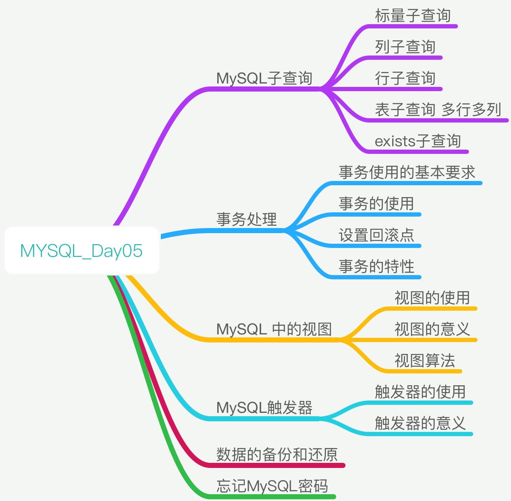


[TOC]

### 概念
* 子查询: 指的是一个查询语句被其他语句包裹

```sql

select * from 数据表 where class_id (select id from 数据表 where 条件);

``` 

****

## 子查询的分类
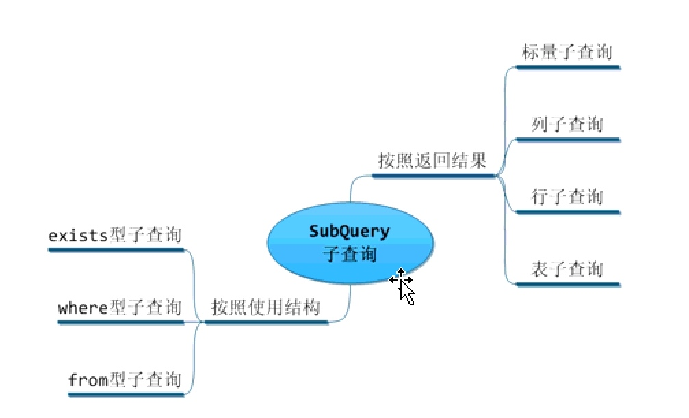

* 标量子查询: 返回结果是固定的某个结果
* 列子查询: 返回某个字段列(一列信息)
* 行子查询: 返回一行记录信息(只有一条记录)
* 表子查询: 返回一个表的数据

****

## 子查询演示
### 标量子查询 
* ① 标量子查询,子查询返回结果是固定的,

```sql

-- 标量子查询
-- 解析:子查询都是分段解析和执行的
-- ① 求出 挖掘机班 中的id信息
select id from sh_class where class_name = "挖掘机班";
-- ② 查询挖掘机班的同学
select * from sh_student where class = 
(select id from sh_class where class_name = "挖掘机班");

```

****

### 列子查询

```sql

-- ③ 列子查询中的 all , any(任意) , some 语句的应用
-- all : 只有满足all中的所有结果,其语句才会生效
-- 例: 10 > all(1,3,5) 必须同时满足 其三个结果

-- any(some 同义) : 只要满足any或者 som中的某一个结果,语句生效
-- 10 > any(1,20,30)只要大于其中任何一个数字, 结果生效

-- 查询所有未入班的学员信息
select * from sh_student where class = all(select id from sh_class);  
--相对于  class=1, and ,class=2, and ,class=3  

select * from sh_student where class = any(select id from sh_class);
-- 相当于 class=1, or ,class=2, or ,class=3

```

****

### 行子查询

```sql

--⑤ 行子查询 
select * from sh_class;

-- 求学员age最大 score最高的
select age,score from sh_student order by age desc,score desc limit 1;

-- 获取学员的信息
select * from sh_student where (age,score) = 
(select age,score from sh_student 
	order by age desc,score desc limit 1);

```

****

### 表子查询 多行多列

```sql


--⑥ 表子查询 多行多列
-- 求每个班级中年年龄最大的同学
select * from sh_student as new_t order by age desc;

select t.class,t.name, max(age) from sh_student t group by class;

-- 获取所有班级
select id from sh_student;
select * from sh_student where class in (select id from sh_student);

-- 每个班级中年龄最
select * from (select * from sh_student where class in (select id from sh_student)) as newtable order by  age desc;

select * from (
	select * from (
		select * from sh_student where class in (
			select id from sh_class
		)
	) as new_student order by age desc
) as new_student2 group by class;	

```

****

### exists 子查询
* exists : 判断内容是否存在
* 如果子查询返回1条以上的记录，mysql就认为其返回为true，反之，如果返回结果为空，则mysql就认为其返回false


```sql

    
select * from sh_student where exists(子查询);

```

* 子查询大多数都是把内层的子查询返回结果拿到外层的子查询中去运算
* exists执行原理:其是把外层查询中的所有记录，通过loop遍历循环的方式一条一条拿出来与exists中的返回结果进行比对，如果exists返回true，则显示此记录，反之，则不显示此记录。


```sql
-- 案例 

--求 学生表中有班级的学生

select * from sh_student t where exists(
	select id from sh_class s where t.class = s.id  
);

```

****

## (二) 事务处理
### 概念
### 事务使用的基本要求
* ==使用innoDB引擎==
* 手工事务 和 自动事务

****

### 事务的使用
* ① 关闭系统中的自动事务（需要使用系统变量）
 
```sql
-- 查看系统自动事务是否开启
show  variables  like "autocommit%";

-- 开启自动事务
set autocommit = OFF;

```

* ② 执行操作(提交与回滚)
    * 如果所有操作都执行完毕，代表事务执行成功，则提交（commit）
    * 如果某个操作执行失败，代表事务执行失败，则回滚（rollback）

```sql
commit; --提交操作
rollback; --回滚操作
```

****

### 设置回滚点


```sql

-- 设置回滚点
savepoint sp1;
-- 回滚到sp1点
rollback to sp1;

```

****

### 事务特性
#### 原子性 (Atomicity)
* 事务是一个不可分割的工作单位，事务中的操作要么都发生，要么都不发生。

#### 一致性 (Consistency)
* 事务前后数据的完整性必须保持一致。

#### 隔离性 (Isolation)
* 多个用户并发访问数据库时，一个用户的事务不能被其它用户的事物所干扰，多个并发事务之间的数据要相互隔离。

#### 持久性 (Durability)
* 一个事务一旦被提交，它对数据库中的数据改变就是永久性的。

****

### 临时事务
* 事务的生效时间只在`commit`之前或`rollback`之前。
* 一旦事务`commit`或`rollback`之后，临时事务接结束了。

* ① 开启事务`start  transaction`
* ② 提交事务`commit`
* ③ 回滚事务`rollback`

****

## MySQL 中的视图
### 概念
* 所谓的视图就是一张虚拟表。
* 结构上：与真实的数据表类似
* 数据上：并不是真实存在的，所有的数据都来源于基表

****

### 创建视图

```sql
--创建视图
create view 视图名 as select * from 基表;

--选择创建方式 创建视图
create algorithm = undefined|merge|temptable  view 视图名 as
select * from 基表;

```


```sql 

--例子

create view vw_student as
select t.*, c.class_name from sh_student t 
left join sh_class c on t.class = c.id;

```

### 查看视图
* ① 查看数据表和视图`show tables`
* ② 查看视图创建方式`show create view 视图名`
* ③ 查看视图结构`desc 视图名`

### 删除视图

```sql 
drop view 视图名;
```

### 更新视图


```sql

alter view 视图名 as select 语句;

```

****

### 视图的意义
#### ① 简化SQL语句
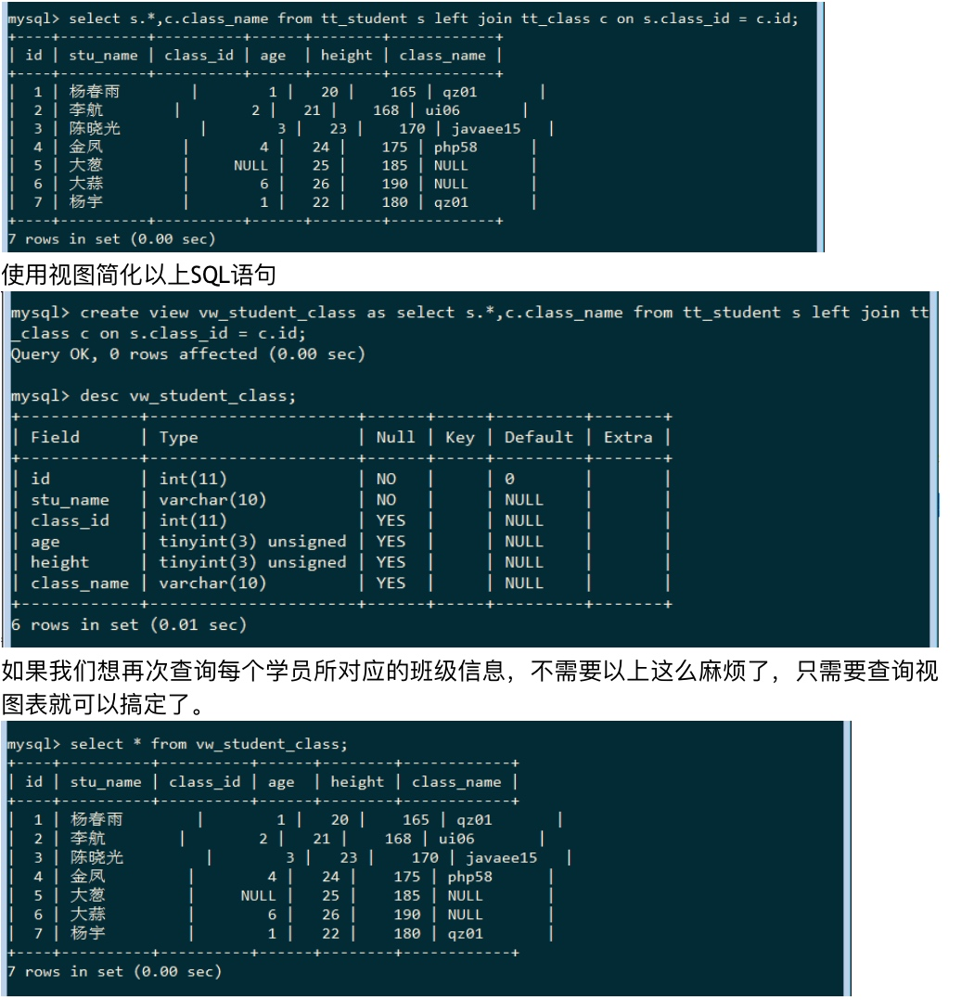

* 注意,不能在视图插入更新数据
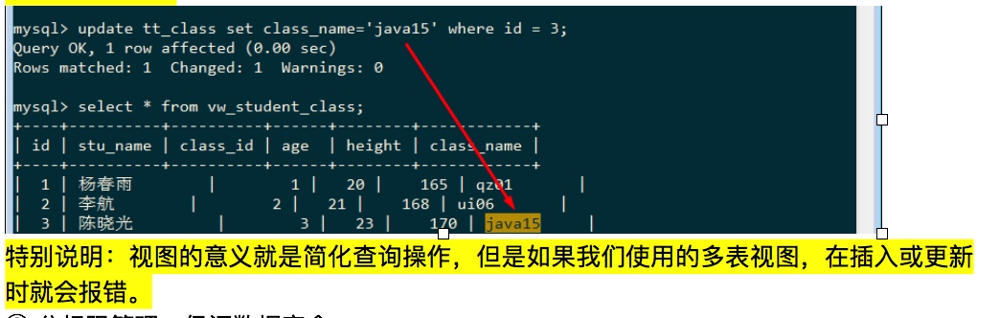


>如果基表中的数据更新了，视图是否也会随之更新呢？
答：会，因为视图结构基于SQL查询的，数据都是来源于基表的，所以基表改变了，视图也会随之改变。

****

#### ② 分权限管理、保证数据安全
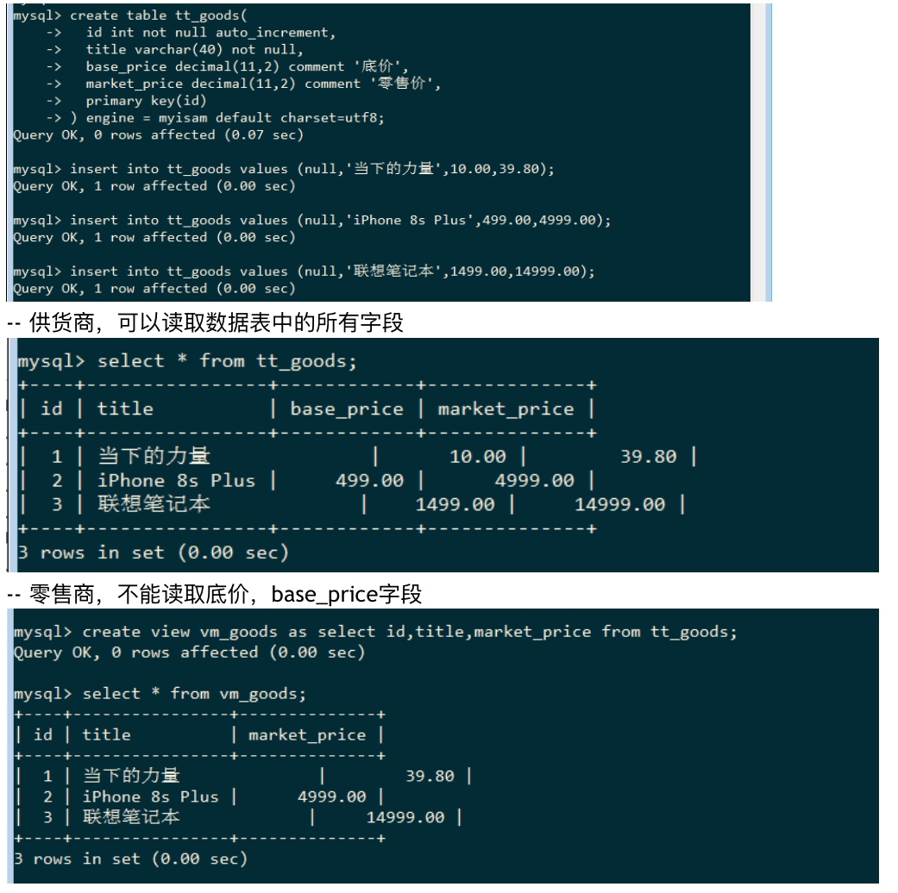

****

### 视图算法

```sql

create algorithm = undefined|merge|temptable  
	view  视图名称  as  select查询语句;

```

* **undefined** ：并不是真正的算法，其核心算法只有两种merge与temptable，undefined代表算法默认由MySQL系统决定，优先采用merge算法。
* **merge** ：合并算法，首先把当前视图的SQL语句与要执行的SQL语句进行合并，然后在返回结果。
* **temptable** ：临时表算法，首先把视图本身的SQL语句先执行，在返回结果的基础上在进行SQL语句的查询。

****

#### merge算法
* 把视图的SQL语句与我们要执行的SQL语句先合并，然后在返回结果
* ① 创建视图

```sql


create algorithm = merge view vw_student1 as
select * from sh_student;

```

* ② 在视图`vw_student`的基础上进行分组 排序
 
```sql

select * from vw_student group by class order by age desc;

```

* ==特别说明：以上返回的结果并不正确，因为我们使用的视图算法为merge算法，merge算法的功能是先把视图的SQL语句与我们要执行的SQL语句先合并，然后在返回结果。==

****

#### temptable算法：
* ① 更新视图

```sql

alter algorithm = temptable view vw_student as
select * from sh_student order by age;

```

* ② 查询表数据

```sql
select * from vw_student group by class;
```
****

## (四)MySQL触发器
### 概念
* 预先在数据库中定义一个操作，当这个操作被触发时，就会执行相应的功能

### 语法 


```sql

-- ① 定义结束符
delimiter  结束符
-- ② 创建触发器
create  trigger  触发器名称   触发时间   触发类型  on  作用的表  for  each  row
begin
	触发要实现的功能;
end
结束符

```

* 参数说明
* 触发事件一共有两种形式，before|after
* 触发类型一共有三种形式，insert|update|delete


```sql 
--例子

-- 例子
-- ① 定义结束符号
delimiter $$

-- ② 插入新产品时 向log表插入记录
create trigger tg_goods1 after insert on tt_goods for each row
	begin 
		insert into sh_log values(null,"插入数据");
	end
	$$		

-- ③ 转换 结束符号
delimiter ;


-- ④ 插入数据
insert into tt_goods values(null,"新疆葡萄",15,100);

-- ⑤ 查看数据
select * from sh_log;	

-- ⑥ 查看触发器
select * from information_schema.triggers\G

-- ⑦ 删除触发器
drop trigger tg_goods1;

```

### 查看触发器


```sql

-- 查看触发器
select * from information_schema.triggers\G


```

### 删除触发器


```sql

-- 删除触发器
drop trigger 触发器名;

```

### 触发器的意义
* 下单减库存效果

```sql

-- 例子 产品库存 和 定单的关系
-- ① 创建产品表
create table tt_goods(
    id int not null auto_increment,
    title varchar(40) not null,
    price decimal(11,2),
    stock int,
    primary key(id)
)engine = myisam default charset = utf8;

-- ② 插入测试数据
insert into tt_goods values
	(null, "洗手液",30,100)
	,(null,"牙刷",30,10)
	,(null,"毛巾",30,10);

-- ③ 定义订单表
create table tt_order(
    id int not null auto_increment,
    goods_id int,
    goods_num int,
    total decimal(11,2),
    user_id int,
    primary key(id)
)engine = myisam default charset = utf8; 

-- 要求 每次下单时，其对应的库存也要相应的减少

-- ④ 创建触发器
delimiter $$
-- 当订单表插入数据 产品表也随着更新 
create trigger tg_order after insert on tt_order for each row 
	begin 
		update tt_goods set stock = stock - new.goods_num
			where id = new.goods_id;
	end 
	$$		

delimiter ;

-- ⑤ 插入定单表新数据
insert into tt_order values(null , 1 , 10,300,6);

-- ⑥ 查看产品表 库存是否减少
select * from tt_goods;
 

```


### new 和 old 

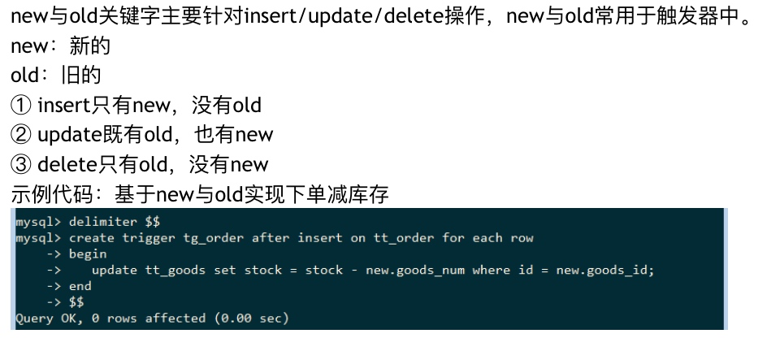

 
```sql

-- 加入撤单 加库存功能
-- ① 创建触发器
delimiter $$

create trigger tg_order2 after delete on tt_order for each row
	begin 
		update tt_goods set stock = stock + old.goods_num 
			where id = old.goods_id;
	end
	$$			

delimiter ;

-- ② 删除数据
delete from tt_order where id = 2;

-- ③ 查询数据
select * from tt_goods;	

```

## 数据的备份和还原
### 针对数据引擎进行备份
* MyISAM引擎 ：三个文件`(*.frm、*.MYI、*.MYD)`
* InnoDB引擎 ：二个文件`(*.frm、ibdata1)`

* MyISAM引擎备份与还原非常简单，直接保存文件夹本身即可。

* InnoDB引擎：只有二个文件，结构文件都保存在*.frm文件中，但是所有的InnoDB引擎的数据文件都保存ibdata1中，如果想使用文件进行保存，基本不现实。


### 生成SQL文件
#### 导出：
* 以下所有功能都是在没有进入mysql之前实现的：
* ① 导出一张表：Mysqldump -u用户名 -p密码 库名 表名 > 文件名(D:/a.sql)
* ② 导出多张表： Mysqldump -u用户名 -p密码 库名 表名1 表名2 表名3 > 文件名(D:/a.sql)
* ③ 导出所有表：Mysqldump -u用户名 -p密码 库名 > 文件名(D:/a.sql)
* ④ 导出一个库：Mysqldump -u用户名 -p密码 -B 库名 > 文件名(D:/a.sql)


-------

* 示例代码：导出所有表（没有create database，只有create table）


* 示例代码：导出数据库（拥有create  database）
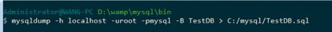


-------

#### 导入：

* mysql登录情况，可以使用source进行数据导入，要求制定数据库。
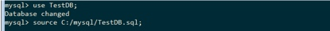

* mysql不登录情况，也可以使用mysql指令导入数据


### 导出文本文档(用的少)

```sql
-- 导出文本文档：
select */字段  into  outfile  'C:/mysql/db.sql' from 数据表;


```


```sql
-- 导入文本文档：
load  data  infile 'C:/mysql/db.sql' into table 数据表;


```


-------


## 忘记MySQL密码
### ① 停止mysql服务
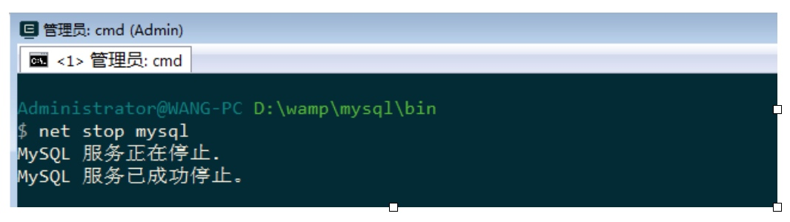

### ② 启动mysqld服务，添加选项--skip-grant-tables
* mysqld ：服务名称（mysql的服务名称）
* --skip-grant-tables ：跳过所有权限权限
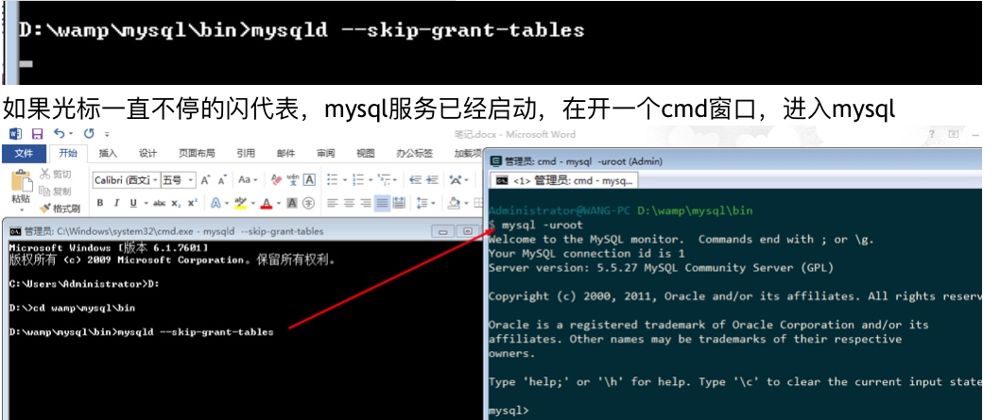


### ③ 更改mysql密码
* ① 更改密码
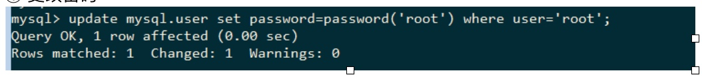

* ② 更新权限表,让其立即生效
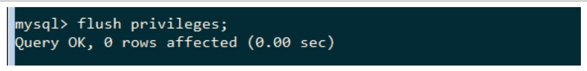

* ③ 退出mysql


* ④ 关闭mysqlid服务
* ⑤ 重启mysql服务


