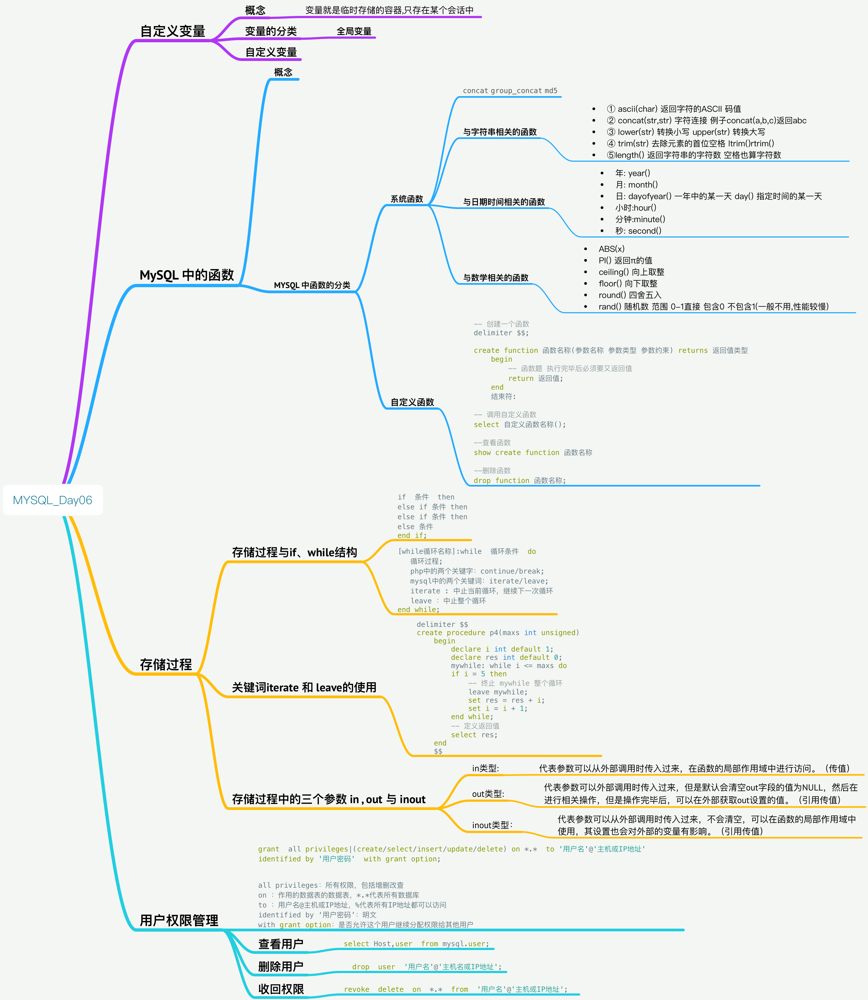

# MySQL_Day06_自定义变量_MySQL中的函数_储存过程_用户权限管理



[TOC]

## 自定义变量
### 概念
* 变量就是临时存储的容器,只存在某个会话中

### 变量的分类
#### 全局变量
* 在系统中默认存在的变量,比如 auto_increment,autocommit
* ① show variables like 变量信息;
* ② select @@变量名称
* ③ 设置方式
    * `set @@变量名称 = 值;`
    * `set global 变量名称 = 值`
    
    
### 自定义变量
* 语法: `set @变量名称 = 值;`
* 在MYSQL中 `=` 代表等于 不是赋值
* mysql中赋值号是`:=` 例:`set @变量名称 := 值`
* 把某个字段值存储到变量中 `select stu_name from student where id = 9 into @name` 查询 `select @name;` 返回结果是个固定值


## MySQL 中的函数
### 概念
* 函数是一个被命名的,独立的,完成特定功能的代码段,并可能给调用它的程序一个返回值
* 函数的功能要专一,就是为了完成某个功能而定义d
* 函数可能具有返回值 return


### MYSQL 中函数的分类
#### 系统函数
* `concat` `group_concat` `md5`

##### 与字符串相关的函数
* ① `ascii(char)` 返回字符的ASCII 码值
* ② `concat(str,str)` 字符连接 例子`concat(a,b,c)`返回abc
* ③ `lower(str)` 转换小写 `upper(str)` 转换大写
* ④ `trim(str)` 去除元素的首位空格 `ltrim()``rtrim()` 
* ⑤`length()` 返回字符串的字符数 空格也算字符数

##### 与日期时间相关的函数
* 年: `year()`
* 月: `month()` 
* 日: `dayofyear()` 一年中的某一天 `day()` 指定时间的某一天
* 小时:`hour()`
* 分钟:`minute()`
* 秒: `second()` 


##### 与数学相关的函数
* `ABS(x)` 
* `PI()` 返回π的值
* `ceiling()` 向上取整
* `floor()` 向下取整 
* `round()` 四舍五入
* `rand()` 随机数 范围 0-1直接 包含0 不包含1(一般不用,性能较慢)

 
#### 自定义函数
* 所谓的自定义函数就是根据我们的需求人为定义的函数


##### 基本语法

```sql

-- 创建一个函数
delimiter $$;

create function 函数名称(参数名称 参数类型 参数约束) returns 返回值类型
	begin 
		-- 函数题 执行完毕后必须要又返回值
		return 返回值;
	end 
	结束符:	

-- 调用自定义函数
select 自定义函数名称();

--查看函数
show create function 函数名称

--删除函数
drop function 函数名称;

```

* 例 函数参数的定义和使用


```sql

delimiter $$

-- 创建一个带参数的函数
create function simpleFunc(name  varchar(10)) returns varchar(20)
begin 
	return concat("hollo , ",name);
end 
$$


-- 调用带参函数
select simpleFunc("admin");

```


* 例 根据圆的半径求圆的面积(定义函数)


```sql

create function getAcreFunc(r  int unsigned) returns decimal(11,2)
	begin 
		return pi() * r * r;
	end
	$$	 

-- 调用函数
select getAcreFunc(2);

```

##存储过程

```sql

-- 存储过程
-- 没有返回值类型的函数

create procedure 存储过程的名称(参数名称 参数类型,...)
	begin 
		-- 函数体
		select 返回值;
	end
	结束符	
	
	-- 存储过程的调用
    call 存储过程的名称;
    
    
-- 查看存储过程
show create procedure 存储过程名称;

-- 删除存储过程
drop procedure 存储过程名称;

```


* 例 带参数存储过程 求圆的面积


```sql

create procedure getAcreFunc(r int unsigned )
	begin	 
		select pi() * r * r;
	end
	$$

call getAcreFunc(2);

```

### 存储过程与if、while结构
#### if基本语法 
```sql

if  条件  then
else if 条件 then
else if 条件 then
else 条件
end if;


```

#### while 基本语法

```sql

[while循环名称]:while  循环条件  do
   循环过程;
   php中的两个关键字：continue/break;
   mysql中的两个关键词：iterate/leave;
   iterate : 中止当前循环，继续下一次循环
   leave ：中止整个循环
end while;


```

* 在begin与end内部，如果要定义变量，其都是局部变量，定义语法：

```sql

declare  变量名称  变量类型  default  默认值;


```

* 例 求1- 100 的和


```sql

-- 例子 求 1-100 的和
-- 在begin 与 end 内部 定义变量都是局部变量
-- 语法 declare 变量名称 变量类型 default 默认值 
delimiter $$
create procedure p3(maxs int unsigned)
	begin
		declare i int default 1;
		declare res int default 0; 
		mywhile: while i <= maxs do
			set res = res + i;
			set i = i + 1;
		end while;
		-- 定义返回值
		select res;
	end
	$$	

-- 调用
delimiter ;
call p3(10);

```

### 关键词iterate 和 leave的使用

```sql


delimiter $$
create procedure p4(maxs int unsigned)
	begin
		declare i int default 1;
		declare res int default 0; 
		mywhile: while i <= maxs do
		if i = 5 then
			-- 终止 mywhile 整个循环
			leave mywhile;
			set res = res + i;
			set i = i + 1;
		end while;
		-- 定义返回值
		select res;
	end
	$$	

```


### 存储过程中的三个参数 in , out 与 inout 
* in类型：代表参数可以从外部调用时传入过来，在函数的局部作用域中进行访问。（传值）
* out类型：代表参数可以外部调用时传入过来，但是默认会清空out字段的值为NULL，然后在进行相关操作，但是操作完毕后，可以在外部获取out设置的值。（引用传值）
* inout类型：代表参数可以从外部调用时传入过来，不会清空，可以在函数的局部作用域中使用，其设置也会对外部的变量有影响。（引用传值）


##用户权限管理

```sql

grant  all privileges|(create/select/insert/update/delete) on *.*  to '用户名'@'主机或IP地址'  
identified by '用户密码'  with grant option;


all privileges：所有权限，包括增删改查
on ：作用的数据表的数据表，*.*代表所有数据库
to ：用户名@主机或IP地址，%代表所有IP地址都可以访问
identified by ‘用户密码’：明文
with grant option：是否允许这个用户继续分配权限给其他用户

```

### 查看用户

```sql

select Host,user  from mysql.user;

```

### 删除用户

```sql  

    drop  user  '用户名'@'主机名或IP地址';

```

### 收回权限


```sql

revoke  delete  on  *.*  from  '用户名'@'主机或IP地址';


```


      

