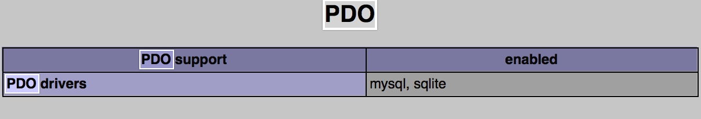

#PHP_Day10_{PDO}_{PDO预处理}_{PDO错误处理模式}_{sql语句预处理}_{PDOStetement}_{命名空间}


[TOC]

##命名空间
### 什么是命名空间


* 一个项目中,可能用到N多个类,有些类是第三方类,如果我们自己的类名和第三方的类冲突
* 在文件系统中,目录充当了解决文件名冲突的角色,这个目录的角色拿到程序设计中就是命名空间的含义
* 命名空间,是一种封装事物的方法,类也是封装事物的方法,都是一段代码块
* **命名空间,主要用来解决类名冲突的问题,可以与类的自动加载搭配使用**


### 命名空间的要求
* 使用**namespace**关键字来声明没有命名空间
* 在命名空间中,所有的PHP合法代表都可以存在,但是只有三种代码会受到空间的影响:类,函数,常量
* 不受空间的应用的代码,成为全局代码

```php

namespace 空间名称;
	//所有的php合法代码 
	//只有 类 函数 常量代码会受空间的影响
	//其他成为全局代码

```

* `namespace`代表空间名称 命名方式与变量相似
* 空间名称不能带`$`符号


* 空间声明必须是网页的第一行代码,前面不能有任何东西
* 第2个以后声明的命名空间,不会报错空间中

> 定义命名空间

```php
//声明命名空间 一些所有内容都属于空间中的内容
namespace app; 
//① 声明一个常量 空间中的常量只能是const声明的常量(局部常量) 
const TITLE = "我是常量";
//define()声明的常量为全局常量 只存在根空间中	
define("const111","我也是常量");
//② 定义一个学生类
class Student{
	private $name = "旺财";
	private $age = 23;
	public function __construct(){
		echo "{$this->name}的年龄是{$this->age}岁";
	}
}
//③ 定义一个函数
function dump($arr){
	echo "<pre>";
	print_r($arr);
	echo "</pre>";
}
//④ 定义普通代码
$a = 100;

```

> 使用命名空间

```php

//包含space.php文件代码
	require_once("./demo.php");
	//① 创建学生类对象
	$obj = new App\student();
	//② 方法空间中的常量
	echo const111;
	//③ 访问空间中的函数
	App\dump($_SERVER);
	//④ 访问根空间的代码
	echo "你的分类为: $a";

```

> 当存在两个相同类名的类


```php

	//包含space.php文件代码
	require_once("./demo.php");
	
	class Student{
		private $name = "小强";
		private $age = 21;
		public function __construct(){
			echo "{$this->name}的年龄是{$this->age}岁";
		}
	}
	
	
	//① 创建学生类对象
	$obj = new App\student();
	$obj2 = new student();

```

## 定义子命名空间
### 定义子命名空间->描述
* 如果a.txt文件位于子目录b中,则如何访问,各个目录中用`/`隔开:`curDir/b/a.txt`
* 如果定义子命名空间是使用`\`将不同的空间隔开 例如:``

> 定义子命名空间

```php
//声明一个子命名空间,其中Controller空间是 App空间的子空间
//空间名称和子空间的命名不能加引号
//子空间的定义的中的斜线 要用\反斜杠
	namespace App\Controller;
	
	class Student{
		private $name = "旺财";
		private $age = 24;
		
		public function __construct(){
			echo "{$this->name}的年龄是{$this->age}岁";
		}
	}
```

> 使用子命名空间


```php

//包含space.php文件代码
	require_once("./space.php");
	$obj = new App\Controller\Student();

```

##同一个文件同时定义多个命名空间
> 定义多个命名空间

```php

//声明一个子命名空间,其中Controller空间是 App空间的子空间
//空间名称和子空间的命名不能加引号
//子空间的定义的中的斜线 要用\反斜杠
	namespace App\Controller;
	
	class Student{
		private $name = "旺财";
		private $age = 24;
		
		public function __construct(){
			echo "{$this->name}的年龄是{$this->age}岁\n";
		}
	}
	
	//定义第二个命名空间
	namespace App\Model;
	
	class Student{
		private $name = "小强";
		private $age = 12;
		
		public function __construct(){
			echo "{$this->name}的年龄是{$this->age}岁\n";
		}
	}

```

> 使用命名空间


```php

//包含space.php文件代码
	require_once("./space.php");
	$obj = new App\Controller\Student();
	$obj2 = new App\Model\Student();

```

### 定义多个命名空间->大括号法

```php

//声明一个子命名空间,其中Controller空间是 App空间的子空间
//空间名称和子空间的命名不能加引号
//子空间的定义的中的斜线 要用\反斜杠
	namespace App\Controller{
	
		class Student{
			private $name = "旺财";
			private $age = 24;
			
			public function __construct(){
				echo "{$this->name}的年龄是{$this->age}岁\n";
			}
		}
	}
	
	//定义第二个命名空间
	namespace App\Model{
	
		class Student{
			private $name = "小强";
			private $age = 12;
			
			public function __construct(){
				echo "{$this->name}的年龄是{$this->age}岁\n";
			}
		}
	}
	

```

### 不包含在命名空间的代码

```php

//定义第二个命名空间
	namespace App\Model{
	
		class Student{
			private $name = "小强";
			private $age = 12;
			
			public function __construct(){
				echo "{$this->name}的年龄是{$this->age}岁\n";
			}
		}
	}
	
	//创建App\Controller\Student()类的对象
	$obj = new App\Controller\Student();
	//Fatal error: No code may exist outside of namespace {}
	//在大括号语法下,全局代码不能放在大括号之外

```

* 在大括号之外的全局代码,用一个没有名字的命名空间包括起来,总之,在大括号内所有的代码要在大括号之内

```php

  //定义第3个没有名字的空间 放置全局代码
  //所有的普通代码,都会自动运行
	namespace{
		//创建App\Controller\Student()类的对象
		$obj = new App\Controller\Student();
	}


```

##使用命名空间
### 文件系统中访问文件的方式
* 相对文件名,如果若访问`a.txt` 访问的路径为`curDir/a.txt`
* 相对目录名,若访问`text/a.txt` 访问路径为`curDir/text/a.txt`
* 绝对路径.若访问`/show/text/a.txt`文件 访问路径为:`/show/text/a.txt`


### 访问命名空间中元素的方式
* 非限定方式(**不带任何前缀**),若访问 `$obj = new Student()`,完整的访问方式`$obj = new curSpace\Stutent()`
* 限定方式(**带相对前缀的**)若访问`$obj = new Controller\Student()`完整的访问方式`$obj = new curSpace\Controller\Student()`
* 完全限定方式(**带绝对前缀**).若访问`$obj = new \App\controller\Student()` 与完整访问方式一致

> 举例说明


```php

namespace App{
	
		class Student{
			private $name = "旺财";
			private $age = 24;
			
			public function __construct(){
				echo "{$this->name}的年龄是{$this->age}岁\n";
				//创建教师类的对象
				$obj = new Model\Teacher();
			}
		}
	}
	
	//定义第二个命名空间
	namespace App\Model{
	
		class Teacher{
			private $name = "小强";
			private $edu = "蓝翔";
			
			public function __construct(){
				echo "{$this->name}的学校是{$this->edu}\n";
				
			}
		}
	}
	
	//定义第3个没有名字的空间 放置全局代码
	namespace{
		
		$obj = new App\Student();
	}
	

``` 

## namespace关键字
* 用来声明一个命名空间 `namespace App\Controller`
* `namespace` 与 `self`关键字类似,调用本空间中的元素`new namespace\Studnet()`


```php
	namespace App{
		
		const TITLE = "我是常量";
		
		class Student{
			private $name = "旺财";
			private $age = 24;
			
			public function __construct(){
				//namespace关键字 ,可以访问当前空间中的元素
				$str = namespace\TITLE;
				echo "$str \n{$this->name}的年龄是{$this->age}岁\n";
			}
		}
	}
	
	
	//定义第3个没有名字的空间 放置全局代码
	namespace{
		//创建App\Controller\Student()类的对象
		$obj = new App\Student();
	}

```

## 魔术常量__NAMESPACE__
* `__NAMESPACE__`当前空间的名称的字符串形式

```php

    namespace App{
		
		const TITLE = "我是常量";
		
		class Student{
			private $name = "旺财";
			private $age = 24;
			
			public function __construct(){
				
				$str = namespace\TITLE;
				echo "$str \n{$this->name}的年龄是{$this->age}岁\n";
			}
		}
		//创建学生类对象
		$className = __NAMESPACE__."\Student";
		echo $className;
		$obj = new $className();

```

## 命名空间的别名和导入
### 命名空间的别名和导入->描述
* 使用'别名',可以将导入的类进行简化访问
* 首页use关键字来引入导入类名;
* 还可以使用as关键字给其起个别名(间断的名称)
* 注意:只有空间中的类可以使用use来导入并起别名,常量和函数不能导入

> 命名空间的别名和导入 举例说明

```php

//包含space.php文件代码
	require_once("./space.php");
	//导入空间中的类,并使用别名
	use \App\Controller\Student as Student1;
	use \App\Model\Student as Student2;
	
	$obj = new Student1();
	$obj2 = new Student2();

```

##命名空间在项目中的使用

```php

    //类的自动加载 
	define("DS",DIRECTORY_SEPARATOR); //目录分隔符根据操作系统会改变
	spl_autoload_register(function($className){
		//构建类文件的路径
		//./App/bilr/Student.class.php

		$filename = "./".str_replace("\\",DS,$className).".class.php";
		
		if(file_exists($filename)){
			require_once($filename);
		}
	});
	
	//创建类的对象
	$obj = new App\bilr\Student();
	$obj = new App\bilr\Student();

```

## PDO概述
### PDO简介
* 大型网站可以连接多个数据库操作要定义要多个数据库操作类.因此数据库操作类中,8成代码都是重复的
* 操作不同的数据库,使用数据库扩展不一样,如:mysql 扩展 mssql扩展 oracle扩展
* PDO PHP Date Object PHP
* PDO 也是PHP的扩展
* PDO还是一个PDO的类
* PDO扩展,是操作不同数据库的中间部件
* 通过PDO扩展,是操作各种数据库
* 有了PDO类以后,不在定义各种数据库类
* 有了PDO类,所有操作数据库的函数,都可以不记了

### PDO访问流程图


* PDO提供了,操作不同数据库统一的方法,统一的途径

### 开启PDO扩展

```php
//打开PHP.ini 去掉前面;号
extension=php_pdo_mysql.dll

```


### PDO连接MYSQL
* 描述:PDO::__construct — 创建一个表示数据库连接的 PDO 实例
* 语法:`PDO::__construct ( string $dsn [, string $username [, string $password [, array $driver_options ]]] )`
* 参数: 
    * `dsn` (DATA source name) 数据源名称 到数据库的连接信息
    * 语法格式: `$dsn = "dbtype:dbhost=主机名; dbport=端口号; dbname=数据库名;charset=字符集"`
    * 举例:`$dsn = "mysql:dbhost=localhost; dbpost=3306; dbname=itcast; charset=utf8";`

    * `$username`用户名
    * `$password` 密码
* 返回值:如果连接成功,返回PDO对象 如果失败返回FALSE


```php

//数据库的配置信息
	$dsn = "mysql:dbhost=localhost;dbpost=3306;dbname=itcast;charset=utf8";
	$username = "root";
	$password = "12345";
	//创建PDO类对象
	$pdo = new PDO($dsn,$username,$password);

	
	var_dump($pdo);

```
     
     
### PDO对象的常用方法  
#### exec()
* 描述: PDO::exec — 执行一条 SQL 语句，并返回受影响的行数
* 语法: `int PDO::exec ( string $statement )`
* 参数:`statement`就是要执行的sql语句
* ==注意:不会从一条 SELECT 语句中返回结果。对于在程序中只需要发出一次的 SELECT 语句，可以考虑使用 PDO::query()==

#### query()
* 描述:执行一条SELECT SHOW 的语句 并返回一个数据库对象
* 语法:`public PDOStatement PDO::query ( string $statement )`
* 参数:`$statement` 一条SELECT 或者 show 语句

```php

//数据库的配置信息
	$dsn = "mysql:dbhost=localhost;dbpost=3306;dbname=itcast;charset=utf8";
	$username = "root";
	$password = "12345";
	//创建PDO类对象
	$pdo = new PDO($dsn,$username,$password);
	
	$sql = "SELECT * FROM student";
	$obj = $pdo->query($sql);
	
	var_dump($obj);

```

#### lastInsertId()
* 描述:PDO::lastInsertId — 返回最后插入行的ID或序列值
* 语法:`string PDO::lastInsertId ([ string $name = NULL ] )`

```php

//数据库的配置信息
	$dsn = "mysql:dbhost=localhost;dbpost=3306;dbname=itcast;charset=utf8";
	$username = "root";
	$password = "12345";
	//创建PDO类对象
	$pdo = new PDO($dsn,$username,$password);
//插入一条记录,并返回id值
	$sql = "INSERT into student values(null,'旺财','男',24,'大专',2000,300,'北京')";
	$pdo->exec($sql);
	
	echo "最后插入的id是".$pdo->lastInsertId();

```


#### setAttribute
* 描述 PDO::setAttribute — 设置属性
* 语法:`bool PDO::setAttribute ( int $attribute , mixed $value )`
* 参数:
    * `attribute` 属性名称 
    * `value`属性值
    * PDO中的属性名和属性值都是常量


    

     
## PDOStatement操作
### fetch
* 描述:获取一行并下移指针
* 语法:`mixed PDOStatement::fetch([int $fetch])`
* 


* 返回一维数组


```php
//数据库的配置信息
	$dsn = "mysql:dbhost=localhost;dbpost=3306;dbname=itcast;charset=utf8";
	$username = "root";
	$password = "12345";
	//① 创建PDO类对象
	$pdo = new PDO($dsn,$username,$password);
	//② 执行sql语句 获取结果集对象
	$sql = "SELECT * FROM student";
	$PDOStatement = $pdo->query($sql);
	//③ 获取一行数据
	$arr = $PDOStatement->fetch(PDO::FETCH_ASSOC);
	//④ 指针下移再取出一行
	$arr = $PDOStatement->fetch(PDO::FETCH_ASSOC);
	
	print_r($arr);

```

### fetchALL
* 描述:获取一个结果集中所有行的数组
* 语法:`array PDOStatement::fetchAll ([ int $fetch_style [, mixed $fetch_argument [, array $ctor_args = array() ]]] )`
* 提示:返回二维数组


```php
//数据库的配置信息
	$dsn = "mysql:dbhost=localhost;dbpost=3306;dbname=itcast;charset=utf8";
	$username = "root";
	$password = "12345";
	//① 创建PDO类对象
	$pdo = new PDO($dsn,$username,$password);
	//② 执行sql语句 获取结果集对象
	$sql = "SELECT * FROM student";
	$PDOStatement = $pdo->query($sql);
	//③ 获取多行数据
	$arr = $PDOStatement->fetchAll(PDO::FETCH_ASSOC);

	
	print_r($arr);

```

### fetchColumn
* 描述:从结果集中获取一行中的某一列并下移行指针
* 语法:`string PDOStatement::fetchColumn ([ int $column_number = 0 ] )`
* 参数:
    * `$column_number` 列的索引编号,第1个列的索引为0

```php

//数据库的配置信息
	$dsn = "mysql:dbhost=localhost;dbpost=3306;dbname=itcast;charset=utf8";
	$username = "root";
	$password = "12345";
	//① 创建PDO类对象
	$pdo = new PDO($dsn,$username,$password);
	//② 执行sql语句 获取结果集对象
	$sql = "SELECT * FROM student";
	$PDOStatement = $pdo->query($sql);
	//③ 获取一行中的某个列,并下移指针 一行中只能获取一列,不能同时获取
	$name = $PDOStatement->fetchColumn(1); //第1行的第2列
	$sex = $PDOStatement->fetchColumn(2); //第2行的第3列
	
	print_r($name);

``` 
> 统计记录数


```php

//数据库的配置信息
	$dsn = "mysql:dbhost=localhost;dbpost=3306;dbname=itcast;charset=utf8";
	$username = "root";
	$password = "12345";
	//① 创建PDO类对象
	$pdo = new PDO($dsn,$username,$password);
	//② 执行sql语句 获取记录数
	$sql = "SELECT count(*) FROM student";
	$PDOStatement = $pdo->query($sql);
	//③ 获取一行中的某个列,并下移指针 一行中只能获取一列,不能同时获取
	$resords = $PDOStatement->fetchColumn(); //默认第0列
	
	print_r($resords);

```


### rowCount
* 描述:返回受上一个 SQL 语句影响的行数
* 语法: `int PDOStatement::rowCount ( void )`
* 返回值:返回上一个由对应的 PDOStatement 对象执行DELETE、 INSERT、或 UPDATE 语句受影响的行数。


```php

$dsn = "mysql:dbhost=localhost;dbpost=3306;dbname=itcast;charset=utf8";
	$username = "root";
	$password = "12345";
	//① 创建PDO类对象
	$pdo = new PDO($dsn,$username,$password);
	//② 执行sql语句 获取记录数
	$sql = "SELECT * FROM student";
	$PDOStatement = $pdo->query($sql);
	$resords = $PDOStatement->rowCount();
	
	print_r($resords);

```

### colunmCount
* 描述:返回结果集中的列数
* 语法:`int PDOStatement::columnCount ( void )`
* 返回值: 返回由 PDOStatement 对象代表的结果集中的列数。


```php

//数据库的配置信息
	$dsn = "mysql:dbhost=localhost;dbpost=3306;dbname=itcast;charset=utf8";
	$username = "root";
	$password = "12345";
	//① 创建PDO类对象
	$pdo = new PDO($dsn,$username,$password);
	//② 执行sql语句 获取总列数
	$sql = "SELECT * FROM student";
	$PDOStatement = $pdo->query($sql);
	$resords = $PDOStatement->columnCount();
	
	print_r($resords);

```

## PDO错误处理模式
### 错误处理模式概述
* 当PDO执行SQL语句时报错,错误有三种处理方式
* `Silent`(静默模式)当错误发生时,不报错(默认方式)
* `warning`(警告模式)当错误发生时,会按PHP标准来报告错误
* `exception`(异常模式)当错误发生时,先抛出异常,然后在捕获异常
* 通过`PDO::setAttribute()`方法设置错误的报告模式

### 静默模式

```php

//数据库的配置信息
	$dsn = "mysql:dbhost=localhost;dbpost=3306;dbname=itcast;charset=utf8";
	$username = "root";
	$password = "12345";
	//① 创建PDO类对象
	$pdo = new PDO($dsn,$username,$password);
	//② 设置PDO的错误报告模式 默认为静默模式
	$pdo->setAttribute(PDO::ATTR_ERRMODE,PDO::ERRMODE_SILENT);
	//③ 执行错误的sql语句
	$sql = "SELECT * FROM student where id = abc";
	$PDOStatement = $pdo->query($sql);
		
	var_dump($PDOStatement);//bool(false)

```

### PDO::errorCode()
* 描述:获取跟上一次语句句柄操作相关的 SQLSTATE
* 语法:`string PDOStatement::errorCode ( void )`
* 提示:如果状态码是`00000`就没有错误


### PDO::errorinfo()
* 描述:返回错误的文本信息

```php

//数据库的配置信息
	$dsn = "mysql:dbhost=localhost;dbpost=3306;dbname=itcast;charset=utf8";
	$username = "root";
	$password = "12345";
	//① 创建PDO类对象
	$pdo = new PDO($dsn,$username,$password);
	//② 设置PDO的错误报告模式 默认为静默模式
	$pdo->setAttribute(PDO::ATTR_ERRMODE,PDO::ERRMODE_SILENT);
	//③ 执行错误的sql语句
	$sql = "SELECT * FROM student where id = abc";
	$PDOStatement = $pdo->query($sql);
	
	var_dump($PDOStatement);//bool(false)
	echo "\n错误码为".$pdo->errorCode();
	echo "\n错误为";
	print_r($pdo->errorinfo());

```

### 警告模式
* 将sql语句的错误新,在网页直接显示出来,先设置错误报告模式为'警告模式'

```php

//数据库的配置信息
	$dsn = "mysql:dbhost=localhost;dbpost=3306;dbname=itcast;charset=utf8";
	$username = "root";
	$password = "12345";
	//① 创建PDO类对象
	$pdo = new PDO($dsn,$username,$password);
	//② 设置PDO的错误报告模式 设置为警告模式
	$pdo->setAttribute(PDO::ATTR_ERRMODE,PDO::ERRMODE_WARNING);
	//③ 执行错误的sql语句
	$sql = "SELECT * FROM student where id = abc";
	$PDOStatement = $pdo->query($sql);
	
	var_dump($PDOStatement);//bool(false)
	

Warning: PDO::query(): SQLSTATE[42S22]: Column not found: 1054 Unknown column 'abc' in 'where clause' in /Library/WebServer/Documents/Demo1/PHP_DAY08/App/Untitled 2.php on line 12
bool(false)

```

### try...catch...语法结构

> 基本语法

```php

    try{
		//试图正常执行的程序代码
		//如果程序代码有错误,会自动跳转到catch模块
	}catch(PDOException $e){	
		//在catch代码段.会使用PDOException异常类来捕获异常
		//然后再对异常所谓,进行处理简单处理
		//所有的PDO异常都要在这里处理
	}

```

### 异常模式
* 首先设置错误的报告模式为 异常模式
* 异常模式:先抛出异常,然后再捕获异常

```php
//数据库的配置信息
	$dsn = "mysql:dbhost=localhost;dbpost=3306;dbname=itcast;charset=utf8";
	$username = "root";
	$password = "12345";
	//① 创建PDO类对象
	$pdo = new PDO($dsn,$username,$password);
	//② 设置PDO的错误报告模式 默认为静默模式
	$pdo->setAttribute(PDO::ATTR_ERRMODE,PDO::ERRMODE_EXCEPTION);
	//捕捉错误代码
	try{
		//③ 执行错误的sql语句
		$sql = "SELECT * FROM student where id = abc";
		$PDOStatement = $pdo->query($sql);
		
		var_dump($PDOStatement);//bool(false)
		
	}catch(PDOException $e){	
		//PDO异常类有以下方法
		echo "错误行号".$e->getLine();
		echo "\n错误编号".$e->getCode();
		echo "\n错误文件".$e->getFile();
		echo "\n错误信息".$e->getMessage();
	}

```

##sql语句预处理


* 相同的SQL语句查询时,只有第1次正常执行,并把结果进行缓存,第二次执行相同的SQL查询从缓存读取,因此速度很快,使用的时间很少
* 但是插入时,每次执行的sql语句都不一样,这样,他们插入的时间都是一样的

* 一条sql语句执行大致分为两个阶段,先**编译和执行**

## PDO预处理的步骤
* 先提取相同结构的sql部分


### ① 提取相同结构的SQL语句以添加数据为例

```php
//制作相同结果的插入的SQL语句
//其中':title'和':content'是占位符 不是真正的数据
	//也可以使用'?'当成占位符
	$sql = "INSERT into news(title,content) values(:title,:content)";	
	$sql = "INSERT into news(title,content) values(?,?)";
```

### ② PDO::prepare()
* 描述:将相同结构的SQL语句 交给Mysql预先编译一次


```php

//数据库的配置信息
	$dsn = "mysql:dbhost=localhost;dbpost=3306;dbname=itcast;charset=utf8";
	$username = "root";
	$password = "12345";
	//① 创建PDO类对象
	$pdo = new PDO($dsn,$username,$password);
	//② 制作预编译的相同结构的SQL语句
	$sql = "INSERT into student values(null,:name,:sex,:age,:edu,:salary,:bonus,:city)";	
	//$sql = "INSERT into student values(null,?,?,?,?,?,?,?)";	
	//③ 预先编译SQL语句
	$PDOStatement = $pdo->prepare($sql);	

```

### ③ $PDOStatement::bindValue
* 描述:将真正的数据,与占位符进行绑定
* 语法:`bool PDOStatement::bindValue ( mixed $parameter , mixed $value [, int $data_type = PDO::PARAM_STR ] )`


```php

//数据库的配置信息
	$dsn = "mysql:dbhost=localhost;dbpost=3306;dbname=itcast;charset=utf8";
	$username = "root";
	$password = "12345";
	//① 创建PDO类对象
	$pdo = new PDO($dsn,$username,$password);
	//② 制作预编译的相同结构的SQL语句
	$sql = "INSERT into student values(null,:name,:sex,:age,:edu,:salary,:bonus,:city)";	
	//$sql = "INSERT into student values(null,?,?,?,?,?,?,?)";	
	//③ 预先编译SQL语句
	$PDOStatement = $pdo->prepare($sql);	
	
	//④ 将真正的数据与占位符参数,绑定在一起
	$PDOStatement->bindValue("name","旺财财");
	$PDOStatement->bindValue("sex","男");
	$PDOStatement->bindValue("age",24);
	$PDOStatement->bindValue("edu","大专");
	$PDOStatement->bindValue("salary",4000);
	$PDOStatement->bindValue("bonus",500);
	$PDOStatement->bindValue("city","北京市");
	
	//如果占位符为问号
	$PDOStatement->bindValue(1,"旺财财");
	$PDOStatement->bindValue(2,"男");
	$PDOStatement->bindValue(3,24);
	$PDOStatement->bindValue(4,"大专");
	$PDOStatement->bindValue(5,4000);
	$PDOStatement->bindValue(6,500);
	$PDOStatement->bindValue(7,"北京市");

```

### ④ PDOStatement::execute
* 描述: 执行一条预处理的sql语句
* 语法: `bool PDOStatement::execute ([ array $input_parameters ] )`


```php

//数据库的配置信息
	$dsn = "mysql:dbhost=localhost;dbpost=3306;dbname=itcast;charset=utf8";
	$username = "root";
	$password = "12345";
	//① 创建PDO类对象
	$pdo = new PDO($dsn,$username,$password);
	//② 制作预编译的相同结构的SQL语句
	$sql = "INSERT into student values(null,:name,:sex,:age,:edu,:salary,:bonus,:city)";	
	//$sql = "INSERT into student values(null,?,?,?,?,?,?,?)";	
	//③ 预先编译SQL语句
	$PDOStatement = $pdo->prepare($sql);	
	
	//④ 将真正的数据与占位符参数,绑定在一起
	$PDOStatement->bindValue("name","旺财财");
	$PDOStatement->bindValue("sex","男");
	$PDOStatement->bindValue("age",24);
	$PDOStatement->bindValue("edu","大专");
	$PDOStatement->bindValue("salary",4000);
	$PDOStatement->bindValue("bonus",500);
	$PDOStatement->bindValue("city","北京市");
	
	//如果占位符为问号
//	$PDOStatement->bindValue(1,"旺财财");
//	$PDOStatement->bindValue(2,"男");
//	$PDOStatement->bindValue(3,24);
//	$PDOStatement->bindValue(4,"大专");
//	$PDOStatement->bindValue(5,4000);
//	$PDOStatement->bindValue(6,500);
//	$PDOStatement->bindValue(7,"北京市");
	
	//⑤ 执行绑定数据的SQL语句
	if($PDOStatement->execute()){
		echo "执行成功";
	}else{
		echo "执行失败";
	}


```

## 综合作业：使用PDO完成新闻的管理
> 创建新闻数据库myNews
> 创建数据表news，字段包括：编号、标题、作者、来源、点击率、内容、发布时间


```sql

create table newsList(
	id int not null auto_increment,
	title varchar(20) not null,
	author varchar(10),
	source varchar(20),
	clickrate int,
	content text,
	starttiem int,
	primary key(id)
)engine = myisam default charset = utf8;

```


```php

+-----------+-------------+------+-----+---------+----------------+
| Field     | Type        | Null | Key | Default | Extra          |
+-----------+-------------+------+-----+---------+----------------+
| id        | int(11)     | NO   | PRI | NULL    | auto_increment |
| title     | varchar(20) | NO   |     | NULL    |                |
| author    | varchar(10) | YES  |     | NULL    |                |
| source    | varchar(20) | YES  |     | NULL    |                |
| clickrate | int(11)     | YES  |     | NULL    |                |
| content   | text        | YES  |     | NULL    |                |
| starttiem | int(11)     | YES  |     | NULL    |                |
+-----------+-------------+------+-----+---------+----------------+

```

新闻添加add.php
新闻列表：index.php，并实现分页效果
新闻删除：del.php
新闻修改：update.php
新闻内容详细页面：content.php


