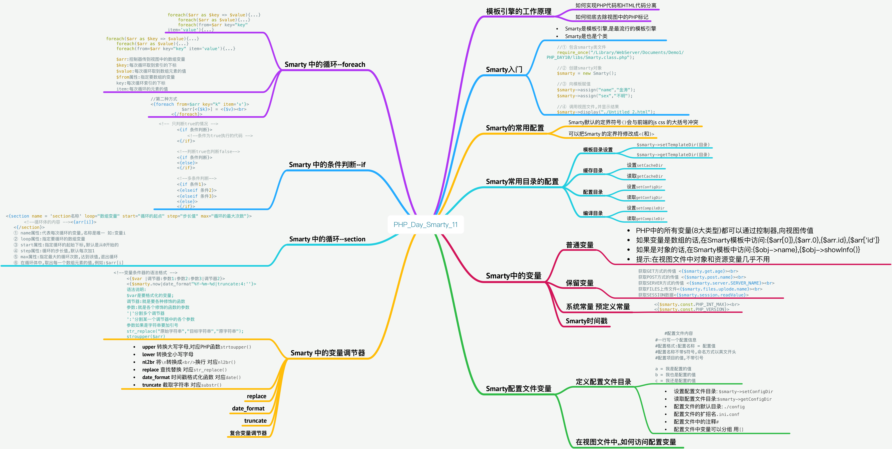

# PHP_Day_11_{Smarty}_{Smarty常用配置}_{Smarty中的变量}_{Smarty中的循环foreach}_{Smarty中的条件判断if}_{Smarty中的变量调节器}




[TOC]

## 模板引擎的工作原理
### 如何实现PHP代码和HTML代码分离
* 首先,网站分前端和后端,相应的就回有前端设计人员,后端程序员之分
* 相应的我们可以把网站开发分成两个部分;HTML页面制作,PHP后端程序
* 前端人员,主要负责前端页面制作,包括HTML CSS JS 
* 后端人员,主要负责PHP程序开发,业务逻辑,数据库操作
* 对于大型项目,都是分工合作.`index.php`
* 在开发阶段分开,在运行阶段合并
* 分离HTML代码和PHP分离的最终效果,一个页面只有HTML代码,另一个页面PHP代码

### 如何彻底去除视图中的PHP标记
* 视图文件(view.html):就是HTML页面,前端文件
* 控制器文件(controller.php):控制程序的业务逻辑,就是PHP页面,调度中心,控制中心
* 视图文件不能手动访问,只能通过控制器文件,来吊样视图文件


* 虽然上述代码实现了HTML和PHP界面的分离,但并不彻底,应该实现view.html中一个PHP标记都不能存在 
* 将视图文件中的PHP输出`<?php echo $username?>`转换为`{$username}`


> 以上问题如何让PHP识别某种某种标记呢?

* 将视图文件中`{`替换成PHP识别的`<?php echo` 
* 将视图文件中的`}`替换成`?>`


###PHP常用的模板引擎 


##Smarty入门
### Smarty是什么
* Smarty是模板引擎,是最流行的模板引擎
* Smarty是也是个类

> Smarty文件目录简介


### Smarty赋值案例

> 后端文件

```php

//① 包含smarty类文件
	require_once("/Library/WebServer/Documents/Demo1/PHP_DAY10/libs/Smarty.class.php");
	
	//② 创建smarty对象
	$smarty = new Smarty();
	
	//③ 向模板赋值
	$smarty->assign("name","金涛");
	$smarty->assign("sex","不明");
	
	//④ 调用视图文件,并显示结果
	$smarty->display("./Untitled 2.html");

```

> 前端文件

```html

<!DOCTYPE html>
<html>
	<head>
		<meta charset="UTF-8">
		<title></title>
	</head>
	<body>
		姓名: {$name}<br>
		性别: {$sex}<br>
	</body>
</html>

```

> 自动生成的编译文件


## Smarty的常用配置
###左右定界符
> 问题描述


* Smarty默认的定界符号`{}`会与前端的js css 的大括号冲突
* 可以把Smarty 的定界符修改成`<{`和`}>`

```php

	//② 修改Smarty的左右定界符号
	$smarty->left_delimiter = "<{";
	$smarty->right_delimiter = "}>";
	
```


```html

  <body>
		姓名: <{$name}><br>
		性别: <{$sex}><br>
	</body>

```


## Smarty常用目录的配置
### 模板目录设置
* 设置模板目录 `$smarty->setTemplateDir(目录)`
* 读取模板目录 `$smarty->getTemplateDir(目录)`

### 缓存目录
* 设置`setCacheDir`
* 读取`getCacheDir`

### 配置目录
* 设置`setConfigDir`
* 读取`getConfigDir`

### 编译目录
* 设置`setCompileDir`
* 读取`getCompileDir`


> 设置视图文件存放的目录


```php 

//① 包含smarty类文件
	require_once("/Library/WebServer/Documents/Demo1/PHP_DAY10/libs/Smarty.class.php");
	
	//② 创建smarty对象
	$smarty = new Smarty();
	
	//③ 修改Smarty的左右定界符号
	$smarty->left_delimiter = "<{";
	$smarty->right_delimiter = "}>";
	
	//④ 设置视图文件存放的目录
	$smarty->setTemplateDir(".".DS."App");
	var_dump($smarty->getTemplateDir());
	
	//⑤ 向模板赋值
	$smarty->assign("name","金涛");
	$smarty->assign("sex","不明");
	
	//⑥ 调用视图文件,并显示结果
	$smarty->display("./Untitled 3.html");

```


## Smarty中的变量
### 普通变量
* PHP中的所有变量(8大类型)都可以通过控制器,向视图传值
* 如果变量是数组的话,在Smarty模板中访问:`{$arr[0]},{$arr.0},{$arr.id},{$arr['id']}`
* 如果是对象的话,在Smarty模板中访问:`{$obj->name},{$obj->showInfo()}`
* 提示:在视图文件中对象和资源变量几乎不用


```php

class Student{
		public $sex = "不明";
		public function showInfo(){
			 return $sex;
		}
	}
	
	//⑤ 向模板赋值
	$sex = new Student();
	$smarty->assign("name",array('金涛','金姜来'));
	$smarty->assign("sex",$sex);
	
	//⑥ 调用视图文件,并显示结果
	$smarty->display("./Untitled 3.html");

```


```html

 <body>
		姓名: <{$name.0}><br>
		性别: <{$sex->sex}><br>
	</body>


```

### 保留变量
* PHP的九大超全局数组变量可以在视图中直接使用,不需要传值


```html

<body>
		获取GET方式的传值 <{$smarty.get.age}><br>
		获取POST方式的传值 <{$smarty.post.name}><br>
		获取SERVER方式的传值 <{$smarty.server.SERVER_NAME}><br>
		获取FILES上传文件<{$smarty.files.uplode.name}><br>
		获取SESSION数据<{$smarty.session.readValue}>
	</body>

```


### 系统常量 预定义常量


```php

<{$smarty.const.PHP_INT_MAX}><br>
<{$smarty.const.PHP_VERSION}>

```

### Smarty时间戳


##Smarty配置文件变量
* 如果视图中要使用一些简单的变量,就不用PHP控制器向视图传值,前端人员可以自行定义

### 定义配置文件目录
* 设置配置文件目录: `$smarty->setConfigDir`
* 读取配置文件目录:`$smarty->getConfigDir`
* 配置文件的默认目录: `./config`
* 配置文件的扩招名`.ini.conf`
* 配置文件中的注释`#`
* 配置文件中变量可以分组 用`[]`


```conf

#配置文件内容
#一行写一个配置信息
#配置格式:配置名称 = 配置值
#配置名称不带$符号,命名方式以英文开头
#配置项目的值,不带引号

a = 我是配置的值
b = 我也是配置的值
c = 我还是配置的值

```

### 在视图文件中,,如何访问配置变量


### 配置文件变量分组(./config/config)


## Smarty 中的循环--foreach
* 可以遍历所有类型的数组,枚举 关联 混合

> 语法说明 

```php
foreach($arr as $key => $value){...}
	foreach($arr as $value){...}
	foreach(from=$arr key="key" item='value'){...}

```


```php
foreach($arr as $key => $value){...}
	foreach($arr as $value){...}
	foreach(from=$arr key="key" item='value'){...}
	
	$arr:控制器传到视图中的数组变量
	$key:每次循环取到索引的下标
	$value:每次循环取到数组元素的值
	$from属性:指定要数组的变量
	key:每次循环索引的下标
	item:每次循环的元素的值

```

> 输出一维数组


```php
//① 包含smarty类文件
	require_once("/Library/WebServer/Documents/Demo1/PHP_DAY10/libs/Smarty.class.php");
	
	//② 创建smarty对象
	$smarty = new Smarty();
	
	//修改左右的定界符号
	$smarty->left_delimiter = "<{";
	$smarty->right_delimiter = "}>";
	
	//向视图文件赋值
	$arr = array(
		'db_host' => 'localhost',
		'db_user' => 'root',
		'db_pass' => '12345',
		'db_name' => 'itcast',
	);
	
	$smarty->assign("arr",$arr);
	
	//⑥ 调用视图文件,并显示结果
	$smarty->display("./Untitled 2.html");
```


```html

    <body>
		<{foreach $arr as $key=>$value }>
			$arr[<{$key}>] = <{$value}><br>	
		<{/foreach}>
	</body>

```


```html

//第二种方式
<{foreach from=$arr key="k" item='v'}>
			$arr[<{$k}>] = <{$v}><br>	
		<{/foreach}>

```


> 循环二维数组


```php

//① 包含smarty类文件
	require_once("/Library/WebServer/Documents/Demo1/PHP_DAY10/libs/Smarty.class.php");
	
	//② 创建smarty对象
	$smarty = new Smarty();
	
	//③ 修改左右的定界符号
	$smarty->left_delimiter = "<{";
	$smarty->right_delimiter = "}>";
	
	//向视图文件赋值
	$arr = array(
		array(1,"旺财","男",24),
		array(2,"小强","男",23),
		array(3,"金涛","男",22)
	);
	
	$smarty->assign("arr",$arr);
	
	// 调用视图文件,并显示结果
	$smarty->display("./Untitled 2.html");


```


```html

<!--变量二维数组-->
	<table width='400' border ='1' >
	<{foreach $arr as $arr2}>
		<tr>
		<{foreach $arr2 as $value}>
			<td>
				<{$value}>
			</td>
			<{/foreach}>
		</tr>
		<{/foreach}>	
	</table>

```


### foreach的常用属性应用


```php

//① 包含smarty类文件
	require_once("/Library/WebServer/Documents/Demo1/PHP_DAY10/libs/Smarty.class.php");
	
	//② 创建smarty对象
	$smarty = new Smarty();
	
	//③ 修改左右的定界符号
	$smarty->left_delimiter = "<{";
	$smarty->right_delimiter = "}>";
	
	//向视图文件赋值
	$arr = array(
		'db_host'=>'localhost',
		'db_user'=>'root',
		'db_pass'=>'12345',
		'db_name'=>'itcast'
	);
	
	$smarty->assign("arr",$arr);
	
	// 调用视图文件,并显示结果
	$smarty->display("./Untitled 2.html");

```

```html


<table width='600' border ='1' >
		
		<{foreach $arr as $value}>
		<{if  $value@first}>
		<tr>
			<th>索引</th>
			<th>值</th>
			<th>从0计数</th>
			<th>从1计数</th>
			<th>是否是第1行</th>
			<th>是否是最后1行</th>
			<th>循环次数</th>
		</tr>
		<{/if}>
		
			<tr>
				<td>
					<{$value@key}>
				</td>
				<td>
					<{$value}>
				</td>
				<td>
					<{$value@index}>
				</td>
				<td>
					<{$value@iteration}>
				</td>
				<td>
					<{$value@first}>
				</td>
				
				<td>
					<{$value@last}>
				</td>
				
				<td>
					<{$value@total}>
				</td>

			</tr>
		<{/foreach}>	
	</table>
	</body>


```


###Smarty 中的循环--section
> Section概述和语法结构

* section 循环 与PHP中的for循环几乎一样
* for循环的特点:指定循环起点,指定循环的步长值,指定循环的最大次数
* section 循环只能循环枚举数组,下标是从0开始的枚举数组


```html

<!--变量二维数组-->
	<{section name = 'section名称' loop="数组变量" start="循环的起点" step="步长值" max="循环的最大次数"}>
		<!--循环体的内容 --><{arr[i]}>
	<{/section}>
	① name属性:代表每次循环的变量,名称是唯一 如:变量i
	② loop属性:指定要循环的数组变量
	③ start属性:指定循环的起始下标,默认是从0开始的
	④ step属性:循环的步长值,默认每次加1
	⑤ max属性:指定最大的循环次数,达到该值,退出循环
	⑥ 在循环体中,取出每一个数组元素的值,例如:$arr[i] 

```

> 使用section遍历一维枚举数组


```php

//向视图文件赋值
	$arr = array(11,'旺财','男',24,'研究猪');
	
	$smarty->assign("arr",$arr);
	
	// 调用视图文件,并显示结果
	$smarty->display("./Untitled 2.html");

```

```html

<!-- section遍历一维枚举数组 -->
	<{section name = 'i' loop = $arr}>
		<{$arr[i]}><br>
	<{/section}>

```

> 使用section遍历二维数组


```php

//向视图文件赋值
	$arr = array(	
			array(11,'旺财','男',24,'研究猪'),
			array(11,'小强','男',24,'研究猪'),
			array(11,'金涛','男',24,'研究猪')
	);

	
	$smarty->assign("arr",$arr);
	
	// 调用视图文件,并显示结果
	$smarty->display("./Untitled 2.html");

```

```html

<{section name='i' loop=$arr}>
		<tr>
			<{section name='j' loop=$arr[i]}>
			<td> 
				<{$arr[i][j]}> 
			</td>
			<{/section}>
		</tr>
	<{/section}>

```


> 控制步长


```php
//向视图文件赋值
	$arr = array(1,2,3,4,5,6,7,8,9,10,11,12,13,14,15);

	$smarty->assign("arr",$arr);
	
	// 调用视图文件,并显示结果
	$smarty->display("./Untitled 2.html");

```


```html

<!-- 循环的起始  步长 最大循环次数 -->
	<{section name='i' loop = $arr start = 3 step=2 max=3}>
		<{$arr[i]}>,
	<{/section}>

```


##Smarty 中的条件判断--if
### if的三种结构

```html

    <!-- 只判断true的情况 -->
		<{if 条件判断}>
			<!--条件为true执行的代码 -->
		<{/if}>
		
		<!--判断true也判断false-->
		<{if 条件判断}>
		<{else}>
		<{/if}>
		
		<!--多条件判断-->
		<{if 条件1}>
		<{elseif 条件2}>
		<{elseif 条件3}>
		<{else}>
		<{/if}>

```

### if 中的运算符
* PHP中所有的运算符,都可以在


    
> if 的简单应用

```php

<{if $smarty.get.age >= 18 && $smarty.get.age <= 25}>
		你当兵吧
	<{else}>
		你去死吧
	<{/if}>

```    

> 表格隔行变色


```php

<table border="1" width="400">
		<{foreach $arr as $value}>
			<{if $value % 2 == 0}>
				<tr bgcolor = 'pink'>
			<{else}>
				<tr>
			<{/if}>
				<td>&nbsp;</td>
				<td>&nbsp;</td>
				<td>&nbsp;</td>
			</tr>
		<{/foreach}>	
		</table>

```

## Smarty 中的变量调节器
* 对变量进行格式化输出

```php

<!--变量条件器的语法格式 -->
		<{$var |调节器:参数1:参数2:参数3|调节器2}>
		<{$smarty.now|date_format"%Y-%m-%d|truncate:4:''}>
		语法说明: 
		$var是要格式化的变量;
		调节器:就是要各种修饰的函数
		参数:就是各个修饰的函数的参数
		'|'分割多个调节器
		':'分割某一个调节器中的各个参数
		参数如果是字符串要加引号
		str_replace("原始字符串","目标字符串","原字符串");
		stroupper($arr)


```


### 常用的变量调节器
* **upper** 转换大写字母,对应PHP函数`strtoupper()`
* **lower** 转换全小写字母
* **nl2br** 将`\n`转换成`<br/>`换行 对应`nl2br()`
* **replace** 查找替换 对应`str_replace()`
* **date_format** 时间戳格式化函数 对应`date()`
* **truncate** 截取字符串 对应`substr()`


```html

     转换全大写 <{$str|upper}><br>
		转换全小写 <{$str|lower}><br>
		转换网页的换行符<{$str|nl2br}>

```

### replace调节器的应用 


* 语法:`<{$var|replace:搜索的字符串:替换成的字符串}>`

> 案例


```php

$str = "select  from student \n order by ID";
	$smarty->assign("str",$str); 
	
	
	// 调用视图文件,并显示结果
	$smarty->display("./Untitled 2.html");

```

```html
<{$str|replace:'student':'newsList'}>

<!--select from newsList order by ID  -->

<{$str|replace:'student':'newsList'}>
		<{str_replace("student","newsList",$str)}>

```

### date_format 调节器的参数和应用
* 


```php

PHP时间戳格式化<{date("Y-m-d H:i:s",$smarty.now)}><br>
		smarty<{$smarty.now|date_format:'%Y-%m-%d %H:%M:%S'}>

```

###truncate


* 语法:`<{$str|truncate:截取的长度:代替的字符串}>`默认是按照字节截取.单个汉字就会被截断

> truncate如果要按字符截取,需要开启一个扩展 

* 开启mbstring扩展 修改php.ini文件
 

```php

<{$str|truncate:40:'...'}>

```

###复合变量调节器
* 描述:一个变量,可以使用多个修饰函数进行进行修饰


```php

<{$smarty.now|date_format:'%Y年%m月%d日'|truncate:5:''}>

```


