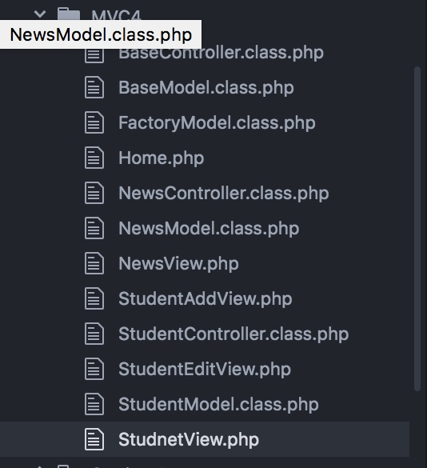
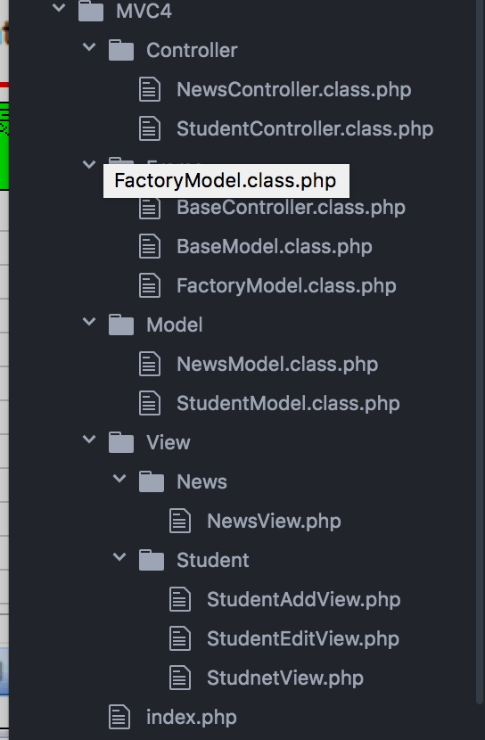
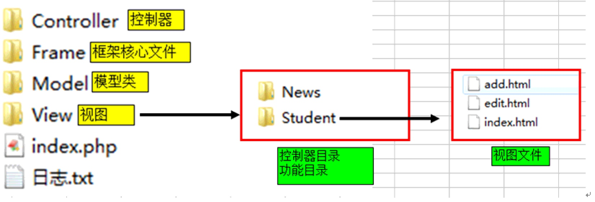

# PHP_MVC_DAY02

https://mj@192.168.1.107/svn/mycode/
svn://192.168.1.107/mycode

[TOC]

## MVC思想
* MVC是一种软件设计思想,是一种组织代码的方式
* MVC是Model view controller三个模块构成,每个模块只做自己的事情
* Controller(控制器)负责与用户达交道,具体说,接收客户请求(GET和POST)返回请求结果,业务逻辑,调用Model处理数据(增删改查),调用VIew格式化数据
* Model(数据模型)负责处理各种数据,主要负责与数据库打交道,Model是一模型类
* View(视图):负责数据格式化,主要涉及的技术:HTML,CSS,JS
* 一个项目由若干的功能构成 如:学生管理,新闻管理,产品管理,留言管理
* 一个网站,只对应一个控制器
* 一个控制器,只对应一个模型类;
* 一个模型类,只对应一张数据表
* 一个控制器,对应多个视图,如 add.html edit.html index.html


## MVC 8 基础控制器类的实现
> 封装基础控制器


>需求 :封装基础控制器类

* ① 创建基础控制器BaseController.class.php
* ② 在其他控制器类中 包含 继承 基础控制器

> ① 创建基础控制器

```php

<?php
header("Content-type:text/html;charset=utf-8");
//包含工厂模型类文件
require_once("/Library/WebServer/Documents/Demo1/PHP_DAY11/MVC4/FactoryModel.class.php");
// 抽象的基础控制器类
abstract class BaseController{
    /*
    构造方法
    */
    public function __construct(){
      // 声明网页字符集

    }

    /*
    跳转方法
    */
    protected function jump($msg,$url="?",$time=3){
            echo "<h2>$msg</h2>";
            header("refresh:$time;url=$url");
            exit();
    }

}

?>

```

> ② 在其他控制器类中 包含 继承 基础控制器


```php

require_once("./BaseController.class.php");
class NewsController extends BaseController{

```


```php

require_once("./BaseController.class.php");
class StudentController extends BaseController{

```


```php

        if($modelobj->del($id)){
            $this->jump("删除成功");
        }else{

            $this->jump("删除失败");
        }

```

## MVC 9 学生信息的修改
*  ① 学生信息列表页 添加修改点击事件 ?ac=edit&id="+id;
*  ② 学生控制器 中添加显示修改界面的函数 StundentController::edit();
*  ③ 学生模型类 定义fetchonce函数 查询学生信息 StudentModel::fetchonce($id)
*  ④ 创建修改学生信息表单   form action="?ac=update"
*  ⑤ 控制器类添加学生修改信息方法 StundentController::update();
*  ⑥ 学生模型类 创建更新学生信息方法  StudentModel::update($data,$id)

> ① 学生信息列表页 添加修改点击事件 ?ac=edit&id="+id;

```html
  <a href="#" onclick="confirmUpd(<?php echo $value[0]; ?>)">修改</a>
```

```js

  function confirmUpd(id){
        location.href = "?ac=edit&id="+id;
      }

```

* ② 学生控制器 中添加显示修改界面的函数 StundentController::edit();

```php

//显示修改的表单
      public function edit(){
        $modelObj = FactoryModel::getInstance("StudentModel");
        $id = $_GET['id'];
        $arr = $modelObj->fetchonce($id);

        include "./View/Student/StudentEditView.php";

      }
```


```php
//调用 显示修改的表单
//获取用户的动作参数
$ac = isset($_GET['ac']) ? $_GET['ac'] : "index";
$SCObj = new StudentController();

$SCObj->$ac();//同可变函数

```


> ③ 学生模型类 定义fetchonce函数 查询学生信息 StudentModel::fetchonce($id)

```php

  //获取单行数据
    public function fetchonce($id){
      //② 执行sql语句 获取结果集对象
      $sql = "SELECT * FROM student where id = $id";
      $PDOStatement = $this->pdo->query($sql);
      //获取单行数据
      return $PDOStatement->fetch();
    }

```

> ④ 创建修改学生信息表单   form action="?ac=update"


```html

<!DOCTYPE html>
<html>
  <head>
    <meta charset="utf-8">
    <title></title>
    <style media="screen">
      .title{
        text-align: center;
        padding: 10px 0px;
      }

    </style>
  </head>
  <body>
    <a href="./StudentController.class.php">学生管理</a>
    <a href="./NewsController.class.php">信息管理</a>
    <div class = "title" >
      <h2>修改学生信息</h2>
      <a href="javascript:history.go(-1)">返回</a>
  </div>

  <form action="?ac=update" method="post" name="form1">
      <table border="1" bordercolor="#CCC" rules="all" align="center" width="400">
          <tr>
              <td width="80" align = "right">姓名: </td>
              <td><input type="text" name="name" value = "<?php echo $arr['name']; ?>"></td>
          </tr>
          <tr>
              <td width="80" align = "right">性别: </td>
              <td><input type="radio" name="sex" value="男" <?php if($arr['sex'] == '男') echo ' checked' ?> >男
              <input type="radio" name="sex" value="女" <?php if($arr['sex'] == '女') echo ' checked' ?> >女</td>
          </tr>

          <tr>
              <td width="80" align = "right">年龄: </td>
              <td><input type="text" name="age" value = "<?php echo $arr['age'] ?>"></td>
          </tr>

          <tr>
              <td width="80" align = "right">学历: </td>
              <td>
                  <select name="edu" >
                      <option value="初中" <?php if($arr['edu'] == '初中') echo ' selected' ?> >初中</option>
                      <option value="高中" <?php if($arr['edu'] == '高中') echo ' selected' ?> >高中</option>
                      <option value="大专" <?php if($arr['edu'] == '大专') echo ' selected' ?> >大专</option>
                      <option value="大本" <?php if($arr['edu'] == '大本') echo ' selected' ?> >本科</option>
                      <option value="研究生" <?php if($arr['edu'] == '研究生') echo ' selected' ?> >研究生</option>
                  </select>
              </td>
          </tr>
          <tr>
              <td width="80" align = "right">工资: </td>
              <td><input type="text" name="salary" value = "<?php echo $arr['salary']  ?>"></td>
          </tr>
          <tr>
              <td width="80" align = "right">奖金: </td>
              <td><input type="text" name="bonus" value = "<?php echo $arr['bonus']  ?>"  ></td>
          </tr>
          <tr>
              <td width="80" align = "right">籍贯: </td>
              <td><input type="text" name="city" value = "<?php echo $arr['city']?>" ></td>
          </tr>

          <tr>
              <td width="80" align = "right"></td>
              <td><input type="hidden" name="id" value="<?php echo $id ?>">
              <input type="submit" value ="提交"></td>

              <!-- <td><input type="hidden" name="ac" value ="<?php echo $_SESSION['randValue']; ?>"></td> -->
          </tr>

      </table>

  </form>
  </body>
</html>


```

> ⑤ 控制器类添加学生修改信息方法 StundentController::update();

```php

//更新学生信息
      public function update(){

          $id = $_POST['id'];
          $data = array();
          $data['name'] = $_POST['name'];
          $data['sex'] = $_POST['sex'];
          $data['age'] = $_POST['age'];
          $data['edu'] = $_POST['edu'];
          $data['salary'] = $_POST['salary'];
          $data['bonus'] = $_POST['bonus'];
          $data['city'] = $_POST['city'];

          //调用模型类对象的insert()方法写入数据
          $modelobj = FactoryModel::getInstance("StudentModel");
          if($modelobj->update($data,$id)){
            $this->jump("学生信息修改成功","./Controller/StudentController.class.php");
          }else{
            $this->jump("学生信息修改失败");
          }

      }

```

> ⑥ 学生模型类 创建更新学生信息方法  StudentModel::update($data,$id)

```php

  public function update($arr,$id){
      $str = "";
      foreach ($arr as $key => $value) {
          $str .= "$key = '$value',";
      }

      $str = rtrim($str,",");

      $sql = "UPDATE studnet set {$str}   WHERE id = {$id}";
      echo $sql;die();
      //执行语句返回结果
      return $this->pdo->exec($sql);
    }

```


## MVC 10 文件分目录
* 文件多,不好管理,将文件安装MVC目录划分
    * Model 目录 
    * View 目录
    * Controller 目录
    * Frame 框架目录 放置公共的类文件

> 原始状态



> 分目录效果


> 分目录示例



> 首页文件的处理

* ① 将所有require_once 包含的文件,全部移动到index界面
* ② 将获取用户动作参数的代码,移动到index文件中

> ① 将所有require_once 包含的文件,全部移动到index界面

```php 
//index.php 或 Home.php
require_once("./Frame/BaseController.class.php");
require_once("./Frame/BaseModel.class.php");
require_once("./Frame/FactoryModel.class.php");
require_once("./Controller/NewsController.class.php");
require_once("./Controller/StudentController.class.php");
require_once("./Model/NewsModel.class.php");
require_once("./Model/StudentModel.class.php");

```

> ② 将获取用户动作参数的代码,移动到index文件中

```php

require_once("./Frame/BaseController.class.php");
require_once("./Frame/BaseModel.class.php");
require_once("./Frame/FactoryModel.class.php");
require_once("./Controller/NewsController.class.php");
require_once("./Controller/StudentController.class.php");
require_once("./Model/NewsModel.class.php");
require_once("./Model/StudentModel.class.php");


//获取用户的动作参数
$ac = isset($_GET['ac']) ? $_GET['ac'] : "index";
$SCObj = new StudentController();

$SCObj->$ac();//同可变函数

```

## MVC 11 前段控制器(请求分发器)
> 描述 

* 前端控制器或者请求分发器,就是指index文件
* 请求分发器的作用,创建那个控制器对象,调用哪个控制器对象的方法
* 以后请求index.php文件,一定要带两个参数(1)控制器名称(2)用户动作
* 访问格式:`index.php?c=控制器名称&a=用户动作&其他参数`
* 其中c就是Controller的简写,代表访问控制器的名称 不是控制器类 `StudentController.class.php` 不带 `Controller`后缀
* a就是action的简写,代表用户的动作.
* 提示:c参数可以省略,但一定要指定一个默认控制器,A参数也可以省略,但是必须指定一个默认动作(a=index).

> 改造index.php文件


```php

//获取用户的动作参数
$c = isset($_GET['c']) ? $_GET['c']: "Student"; //控制器名称参数
$a = isset($_GET['a']) ? $_GET['a']: "index" ; //用户动作参数
$ControllerClassName = $c."Controller";
$controllerObj = new $ControllerClassName(); //StudentController
//调用控制器对象的方法
$controllerObj->$a();//同可变函数

```

>> 修改所有视图文件的链接地址
>


## MVC 12 平台概念的引入
> 描述

* ==一个独立的应用可以称之为平台==
* 一个独立的应用,可以包含很多功能,如:新闻管理,用户管理,产品管理等
* 一个网站至少有两个独立的应用: 网站前台,网站后台
* 网站前台:主要用来展示数据,显示数据,显示数据,格式化数据主要针对客户
* 网站后台:主要用来管理数据:添加数据,删除数据,修改数据,展示数据,主要针对网站管理员
* 如果引入平台概念,用户在每次请求时,要传递三个参数
    * p(platform)平台 p=Home(前台) , p=admin(后台),如果省略Home可以作为默认平台
    * c(Controller)控制器 c=Student 
    * a(action)用户动作,a=index 
* 请求格式:`index.php?p=home&c=Student&a=index`

> MVC目录结构的最终划分


> 目录划分实现
> 修改视图文件
> 所有视图文件的链接参数
> 后台控制器的链接


## MVC 13 类的自动加载
> 修改index文件


## MVC 14 常用常量设置
> 修改index文件


## MVC 15 


