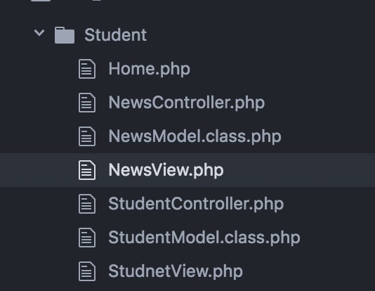
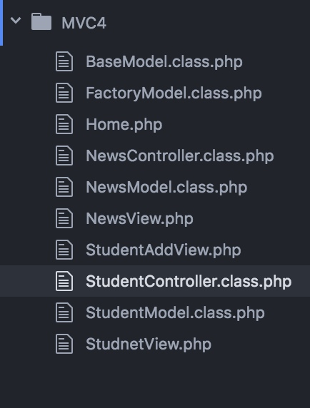

# PHP_MVC_Day01

[TOC]

## MVC框架原理
* MVC有 Model View Controller 三个部分构成
* MVC也是一种软件设计的思想
* MVC用Model(数据模型) View(视图) Controller(控制器) 来组织代码
* 每个模块只处理自己专业的内容,不是自己的工作不管.与前端无关,客户能看的只有Controller其他两个模块都看不到

## MAC各部分功能
* **Controller(控制器)**:主要负责与客户打交道,接受客服请求,返回客户请求结果,业务处理,调用Model来获取数据,在调用View来展示数据
* **Model(数据模型)**:主要负责数据的管理(负责与数据库打交道)
* **View(视图)** 主要用来格式化数据,或者展示,或者包装数据,视图技术,就是前端技术JS,jquery等

> MVC示意图


##实例 MVC思想的简单实例
* 需求分析
* 在网页上显示,三个链接,点击不同的链接显示不同的时间日期信息
* 链接1,显示日期信息
* 链接2 显示时间信息
* 链接3,显示日期信息时间信息


> Controller.php


```php

//包含模型类文件
require_once("/Library/WebServer/Documents/Demo1/PHP_DAY11/Model.class.php");
//①获取地址栏传递的参数
$type = isset($_GET['type'])? $_GET['type'] : 3;
//②创建模型类对象
$model = new DateTime2();
//②根据客户传递的参数,向Model取数据
switch($type){
  case 1:
    $str = $model->getYear();
    break;
  case 2:
      $str = $model->getTime();
    break;
  case 3:
        $str = $model->getTimeYear();
    break;
  }

//载入视图文件
include_once("/Library/WebServer/Documents/Demo1/PHP_DAY11/View.php");

```
> Model.php


```php

class DateTime2{
  //返回日期信息
  public function getYear(){
    return date("Y-m-d");
  }

  public function getTime(){
    return date("H:i:s");
  }

  public function getTimeYear(){
    return date("Y-m-d H:i:s");
  }
}

```


> View.php

```html

<!DOCTYPE html>
<html>
  <head>
    <meta charset="utf-8">
    <title>MVC_DEMO</title>
  </head>
  <body>
    <a href="?type=1">显示当前日期</a>
    <a href="?type=1">显示当前时间</a>
    <a href="?type=1">显示当前时间和日期信息</a>
    <h2> <?php echo $str ?> <h2>
  </body>
</html>


```

##MVC原理实例
### 使用MVC展示学生列表数据

> C

```php

header("Content-type:text/html;charset=utf-8");
//(1)包含模型类文件
require_once("/Library/WebServer/Documents/Demo1/PHP_DAY11/Student/StudentModel.class.php");
//(2)创建模型类对象
$modelobj = new StudentModel();

//(3)获取多行数据(返回二维数组)
$arr = $modelobj->fetchAll();
//(4)调用视图文件展示结构
require_once("/Library/WebServer/Documents/Demo1/PHP_DAY11/Student/StudnetView.php");


```

> M

```php

<?php
//定义单例的模型文件
final class StudentModel{

    //数据库的配置信息
    private $dsn = "mysql:dbhost=localhost;dbpost=3306;dbname=itcast;charset=utf8";
    private $username = "root";
    private $password = "12345";
    //返回结果集
    private $arr = array();

    //获取多行数据的方法
    public function fetchAll(){

      //① 创建PDO类对象
      $pdo = new PDO($this->dsn,$this->username,$this->password);
      //② 执行sql语句 获取结果集对象
      $sql = "SELECT * FROM student";
      $PDOStatement = $pdo->query($sql);
      //③ 获取多行数据
      $this->arr = $PDOStatement->fetchAll(PDO::FETCH_NUM);

      return $this->arr;
    }

}


?>

```

> V

```php

  <?php
          foreach ($arr as $key => $value) {

        ?>
        <tr align="center">
          <td> <?php echo $value[0] ?></td>
          <td> <?php echo $value[1] ?></td>
          <td> <?php echo $value[2] ?></td>
          <td> <?php echo $value[3] ?></td>
          <td> <?php echo $value[4] ?></td>
          <td> <?php echo $value[5] ?></td>
          <td> <?php echo $value[6] ?></td>
          <td> <?php echo $value[7] ?></td>
        
          <td>
            <a href="#">修改</a>
            <a href="#">删除</a>
          </td>
        </tr>

        <?php } ?>

```

### 使用MVC思想删除

> V 

```html

        <!--添加onclick属性-->
        <td>
            <a href="#">修改</a>
            <a href="#" onclick="confirmDel(<?php echo $value[0]; ?>)">删除</a>
          </td>
          
          <!--添加js函数-->
          
          <script type="text/javascript">
              //定义js删除的函数
              function confirmDel(id){
                if(window.confirm("你确认删除吗?")){
                  //由于包含关系跳转到当前控制器 传递用户参数
                  location.href = "?ac=del&id="+id;
                }
              }
         </script>

```

> C


```php


header("Content-type:text/html;charset=utf-8");
//(1)包含模型类文件
require_once("/Library/WebServer/Documents/Demo1/PHP_DAY11/Student/StudentModel.class.php");
//获取用户的动作参数
$ac = isset($_GET['ac']) ? $_GET['ac'] : "";
//(2)创建模型类对象
$modelobj = new StudentModel();
//根据用户的不同动作,调用模型类的不同方法
if($ac =='del'){
  //调用模型类的删除方法
  $id = $_GET['id'];
  if($modelobj->del($id)){
      echo "删除成功";
      //停顿3秒 跳转当前列表页
      header("refresh:3;url=?");
  }else{
      echo "删除失败";
      header("refresh:3;url=?");
  }

}else{
  //调用模型类的获取多行数据的方法
  //(3)获取多行数据(返回二维数组)
  $arr = $modelobj->fetchAll();
  //(4)调用视图文件展示结构
  require_once("/Library/WebServer/Documents/Demo1/PHP_DAY11/Student/StudnetView.php");
}


```

> M


```php

    <?php
//定义单例的模型文件
final class StudentModel{

    //数据库的配置信息
    private $dsn = "mysql:dbhost=localhost;dbpost=3306;dbname=itcast;charset=utf8";
    private $username = "root";
    private $password = "12345";
    //返回结果集
    private $arr = array();

    private $pdo = null;
    public function __construct(){
      //创建数据库对象
      $this->pdo = new PDO($this->dsn,$this->username,$this->password);
    }

    //获取多行数据的方法
    public function fetchAll(){

      //② 执行sql语句 获取结果集对象
      $sql = "SELECT * FROM student";
      $PDOStatement = $this->pdo->query($sql);
      //③ 获取多行数据
      $this->arr = $PDOStatement->fetchAll(PDO::FETCH_NUM);
      return $this->arr;
    }

    //删除记录的方法
    public function del($id){
      $sql = "DELETE from student where id=$id";
      echo $sql; die();
      return $this->pdo->exec($sql);
    }

}


?>

```

-------


### MVC总结
* 一个网站有很多功能 学生管理,新闻管理,用户管理等
* 一个功能,只有一个控制器
* 一个控制器,只能对应一个模型类
* 一个模型类,只对应一张数据表
* 一个数据表,对应若干的视图,例如`add.html`,`edit.html`,`list.html`;


-------


## MVC第1个版本:整合学生模块的新闻模块

> 文件示意图



>> 需求

* ① 添加一个首页文件,首页文件跳转到StudentController.php界面
* ② 在每个视图文件中添加两个链接,一个指向学生管理 一个指向新闻管理
* ③ 视图文件添加导航栏
* ④ 添加删除学生信息数据的功能

>> ① 添加一个首页文件,首页文件跳转到StudentController.php界面

> 创建 index.php 文件

```php

    header("location:./StudentController.php");

```

>> ② 在每个视图文件中添加两个链接,一个指向学生管理 一个指向新闻管理
 
> NewsView.php 和 StudnetView.php 添加导航

```php

    <a href="./StudentController.php">学生管理</a>
    <a href="./NewsController.php">信息管理</a>
    <hr>

```

> ④ 添加删除信息数据功能 NewsController.php


```php

<?php
header("Content-type:text/html;charset=utf-8");
//(1)包含模型类文件
require_once("/Library/WebServer/Documents/Demo1/PHP_DAY11/Student/NewsModel.class.php");
//获取用户的动作参数
$ac = isset($_GET['ac']) ? $_GET['ac'] : "";

//(2)创建模型类对象
$modelobj = new NewsModel();
//根据用户的不同动作,调用模型类的不同方法
if($ac =='del'){
  //调用模型类的删除方法
  $id = $_GET['id'];
  if($modelobj->del($id)){
      echo "删除成功";
      //停顿3秒 跳转当前列表页
      header("refresh:3;url=?");
  }else{
      echo "删除失败";
      header("refresh:3;url=?");
  }

}else{
  //调用模型类的获取多行数据的方法
  //(3)获取多行数据(返回二维数组)
  $arr = $modelobj->fetchAll();
  //(4)调用视图文件展示结构
  //print_r($arr);
  require_once("/Library/WebServer/Documents/Demo1/PHP_DAY11/Student/NewsView.php");

}

?>


```


> 添加删除信息数据功能 NewsModel.php

```php

<?php
//定义单例的模型文件
final class NewsModel{

    //数据库的配置信息
    private $dsn = "mysql:dbhost=localhost;dbpost=3306;dbname=itcast;charset=utf8";
    private $username = "root";
    private $password = "12345";
    //返回结果集
    private $arr = array();

    private $pdo = null;
    public function __construct(){
      //创建数据库对象
      $this->pdo = new PDO($this->dsn,$this->username,$this->password);
    }

    //获取多行数据的方法
    public function fetchAll(){

      //② 执行sql语句 获取结果集对象
      $sql = "SELECT * FROM news";
      $PDOStatement = $this->pdo->query($sql);
      //③ 获取多行数据
      $this->arr = $PDOStatement->fetchAll(PDO::FETCH_ASSOC);
      return $this->arr;
    }

    //删除记录的方法
    public function del($id){
      $sql = "DELETE from student where nid=$id";
      return $this->pdo->exec($sql);
    }

}


?>

```

> 添加删除信息数据功能 NewsView.php


```html

<!DOCTYPE html>
<html>
  <head>
    <meta charset="utf-8">
    <title>新闻信息管理中心</title>
    <style media="screen">
      .divtitle{
        text-align: center;
        padding: 10px 0px;
      }
    </style>
    <script type="text/javascript">
      //定义js删除的函数
      function confirmDel(id){
        if(window.confirm("你确认删除吗?")){
          //由于包含关系跳转到当前控制器 传递用户参数
          location.href = "?ac=del&id="+id;
        }
      }
    </script>
  </head>
  <body>
    <a href="./StudentController.php">学生管理</a>
    <a href=".//NewsController.php">信息管理</a>
    <hr>
    <div class="divtitle">
        <h2>新闻信息管理中心</h2>
        <a href="javascript:void(0)">添加新闻</a>
        共有 250 条记录
    </div>

    <table border="1" width='600' align='center' rules='all'>
        <tr>
          <th>编号</th>
          <th>标题</th>
          <th>作者</th>
          <th>点击率</th>
          <th>发布时间</th>
          <th>操作选项</th>
        </tr>
        <?php
          foreach ($arr as $key => $value) {

        ?>
        <tr align="center">
          <td> <?php echo $value['nid'] ?></td>
          <td> <?php echo $value['title'] ?></td>
          <td> <?php echo $value['author'] ?></td>
          <td> <?php echo date("Y-m-d",$value['addate'])?></td>
          <td> <?php echo $value["hits"] ?></td>
          <td>
            <a href="#">修改</a>
            <a href="#" onclick="confirmDel(<?php echo $value[0]; ?>)">删除</a>
          </td>
        </tr>

        <?php } ?>
    </table>
  </body>
</html>


```

## MVC 2 基础模型类
> 需求

* ① 将多个模型类的公共部分提取出来,封装到基类中
* ② 其他模型类继承基础类


> ① 创建基础模型类文件 BaseModel


```php

<?php
abstract class BaseModel{

  //数据库的配置信息
  private $dsn = "mysql:dbhost=localhost;dbpost=3306;dbname=itcast;charset=utf8";
  private $username = "root";
  private $password = "12345";
  //返回结果集
  private $arr = array();

  protected $pdo = null;
  public function __construct(){
    //创建数据库对象
    $this->pdo = new PDO($this->dsn,$this->username,$this->password);
  }
  
}
?>

```


> ② StudentModel NewsModel extends BaseModel


```php

//包含基础模型类
require_once("./BaseModel.class.php");
//定义单例的模型文件
final class StudentModel extends BaseModel{

```

```php

//包含基础模型类
require_once("./BaseModel.class.php");
//定义单例的模型文件
final class NewsModel extends BaseModel{    

```


## MVC 3 模型类的单例工厂类

>>需求

* 创建一个单利工厂类,是单例又是工厂
* 应该是模型类的单例工厂类
* 创建不同类对象的方法
* 创建一个工厂模型类文件 FactoryModel.class.php
* 类文件中,定义一个公共的静态的创建模型类对象的方法 getInstance()
* 保证,每个模型类,只有一个对象,不能重复创建多个对象
* 提示:工厂类本身不创建对象,创建模型类对象不能带参数

* ① 创建单例工厂类
* ② NewsController.php 和 StudentController.php 控制器 使用单例工厂类创建对象

> 创建FactoryModel.class.php

```php

<?php
spl_autoload_register(function($className) {
    $arr[] = "/Library/WebServer/Documents/Demo1/PHP_DAY11/MVC4/$className.class.php";
    //$arr[] = "/Library/WebServer/Documents/Demo1/libs/$className.class.php";
    foreach($arr as $filename){
        if(file_exists($filename))require_once($filename);
    }
});

//最终的单例工厂类
final class FactoryModel{
  //私有的静态的保存对象数组
  private static $obj = array();
  //公共的静态的创建不同模型类对象的方法
  public static function getInstance($className){
    //判断对应的模型类对象是否存在
    if(!isset(self::$obj[$className])){
        self::$obj[$className] = new $className;
    }
      //返回相应的模型类对象的
      return self::$obj[$className];
  }

}

?>


``` 

> NewsController.php 和 StudentController.php 控制器 创建对象


```php

//(1)包含模型类文件
require_once("/Library/WebServer/Documents/Demo1/PHP_DAY11/MVC4/FactoryModel.class.php");
//(2)包含类文件
$modelobj = FactoryModel::getInstance("StudentModel");
$modelobj = FactoryModel::getInstance("NewsModel");

```


## MVC 4 控制器类的实现
>>需求

* 当前控制器,变成一个控制器类
* 控制器类文件名修改为studentControler.class.php
* 首页文件中index.php中文件路径修改
* 所有视图中相关链接的地址进行修改

* ① 对NewsController.php 和 StudentController.php控制器进行封装 封装成NewsController.class.php 和 StudentController.class.php


>  对StudentController.php封装成类 StudentController.class.php

```php

<?php
header("Content-type:text/html;charset=utf-8");
//(1)包含模型类文件
require_once("/Library/WebServer/Documents/Demo1/PHP_DAY11/MVC4/FactoryModel.class.php");

class StudentController{
  //显示首页方法
    public function del(){
      $modelobj = FactoryModel::getInstance("StudentModel");
        //调用模型类的删除方法
        $id = $_GET['id'];
        if($modelobj->del($id)){
            echo "删除成功";
            //停顿3秒 跳转当前列表页
            header("refresh:3;url=?");
        }else{
            echo "删除失败";
            header("refresh:3;url=?");
        }
     }
     //删除学生的方法
    public function index(){
       $modelobj = FactoryModel::getInstance("StudentModel");
        //调用模型类的获取多行数据的方法
        //(3)获取多行数据(返回二维数组)
        $arr = $modelobj->fetchAll();
        //(4)调用视图文件展示结构
        require_once("/Library/WebServer/Documents/Demo1/PHP_DAY11/MVC4/StudnetView.php");
      }
      //显示添加表单
      public function add(){
        include "./StudentAddView.php";
      }

      //添加数据到数据库
      public function insert(){
        // 获取表单提交的数据
        //print_r($_POST);exit();
        $data = array();
        $data['name'] = $_POST['name'];
        $data['sex'] = $_POST['sex'];
        $data['age'] = $_POST['age'];
        $data['edu'] = $_POST['edu'];
        $data['salary'] = $_POST['salary'];
        $data['bonus'] = $_POST['bonus'];
        $data['city'] = $_POST['city'];

        //调用模型类对象的insert()方法写入数据
        $modelobj = FactoryModel::getInstance("StudentModel");
        if($modelobj->insert($data)){
          echo "学生信息添加成功";
          header("refresh:3;url=./StudentController.class.php");
          exit();
        }else{
          echo "学生信息添加失败";
        }

      }

}

//获取用户的动作参数
$ac = isset($_GET['ac']) ? $_GET['ac'] : "index";
$SCObj = new StudentController();

$SCObj->$ac();//同可变函数
/*
//根据用户的不同动作,调用模型类的不同方法
if($ac =='del'){
  $SCObj->del(); //控制器对象的del方法
}else if($ac =='add'){
  $SCObj->add(); // 调用控制器对象的add方法
}else if($ac =='insert'){
  $SCObj->insert();
}else{
  $SCObj->index();
}
*/

?>


```


> 对NewsController.php 封装成NewsController.class.php


```php

<?php
header("Content-type:text/html;charset=utf-8");
//(1)包含模型类文件
require_once("/Library/WebServer/Documents/Demo1/PHP_DAY11/MVC4/FactoryModel.class.php");

class NewsController{

    public function del(){
        //(2)创建模型类对象
        $modelobj = FactoryModel::getInstance("NewsModel");
        //调用模型类的删除方法
        $id = $_GET['id'];
        if($modelobj->del($id)){
            echo "删除成功";
            //停顿3秒 跳转当前列表页
            header("refresh:3;url=?");
        }else{
            echo "删除失败";
            header("refresh:3;url=?");
        }
      }

      public function indext(){
        //(2)创建模型类对象
        $modelobj = FactoryModel::getInstance("NewsModel");

        //调用模型类的获取多行数据的方法
        //(3)获取多行数据(返回二维数组)
        $arr = $modelobj->fetchAll();
        //(4)调用视图文件展示结构
        //print_r($arr);
        require_once("/Library/WebServer/Documents/Demo1/PHP_DAY11/MVC4/NewsView.php");
      }
}

//获取用户的动作参数
$ac = isset($_GET['ac']) ? $_GET['ac'] : "indext";

$NCObj = new NewsController();
//根据用户的不同动作,调用模型类的不同方法
$NCObj->$ac();

?>


```

## MVC 5 添加学生信息逻辑
>> 需求

* ① V 定义当在显示列表点击添加学生事件 当点击添加学生后向服务请求
* ② V 创建添加学生界面 StudnetView.php
* ③ C 在学生信息控制器类中实现,添加学生信息方法 add
* ④ V 定义当点击学生信息提交事件
* ⑤ C 在学生信息控制器类中实现,将上传的学生信息储存的方法 insert
* ⑥ M 实现模型层将数据插入到数据库中的方法

> ① 定义当在显示列表点击添加学生事件 当点击添加学生后向服务请求


```html
        <h2>学生信息管理中心</h2>
        <a href="?ac=add">添加学生</a>
```

> ② V 创建添加学生界面 StudnetView.php


```html

<!DOCTYPE html>
<html>
  <head>
    <meta charset="utf-8">
    <title></title>
    <style media="screen">
      .title{
        text-align: center;
        padding: 10px 0px;
      }

    </style>
  </head>
  <body>
    <a href="./StudentController.class.php">学生管理</a>
    <a href="./NewsController.class.php">信息管理</a>
    <div class = "title" >
      <h2>添加学生</h2>
      <a href="javascript:history.go(-1)">返回</a>
  </div>

  <form action="?ac=insert" method="post" name="form1">
      <table border="1" bordercolor="#CCC" rules="all" align="center" width="400">
          <tr>
              <td width="80" align = "right">姓名: </td>
              <td><input type="text" name="name"></td>
          </tr>
          <tr>
              <td width="80" align = "right">性别: </td>
              <td><input type="radio" name="sex" value="男">男
              <input type="radio" name="sex" value="女">女</td>
          </tr>

          <tr>
              <td width="80" align = "right">年龄: </td>
              <td><input type="text" name="age"></td>
          </tr>

          <tr>
              <td width="80" align = "right">学历: </td>
              <td>
                  <select name="edu" >
                      <option value="初中">初中</option>
                      <option value="高中">高中</option>
                      <option value="大专" selected>大专</option>
                      <option value="大本">本科</option>
                      <option value="研究生">研究生</option>
                  </select>
              </td>
          </tr>
          <tr>
              <td width="80" align = "right">工资: </td>
              <td><input type="text" name="salary"></td>
          </tr>
          <tr>
              <td width="80" align = "right">奖金: </td>
              <td><input type="text" name="bonus"></td>
          </tr>
          <tr>
              <td width="80" align = "right">籍贯: </td>
              <td><input type="text" name="city"></td>
          </tr>

          <tr>
              <td width="80" align = "right"></td>
              <td><input type="submit" value ="提交"></td>
              <!-- <td><input type="hidden" name="ac" value ="<?php echo $_SESSION['randValue']; ?>"></td> -->
          </tr>

      </table>

  </form>
  </body>
</html>


```

> ③ C 在学生信息控制器类中实现,添加学生信息方法 add


```php
//class StudentController 中添加以下方法
//显示添加表单
      public function add(){
        include "./StudentAddView.php";
      }

```


```php

$SCObj = new StudentController();

$SCObj->$ac();//同可变函数
/*
//根据用户的不同动作,调用模型类的不同方法
if($ac =='del'){
  $SCObj->del(); //控制器对象的del方法
}else if($ac =='add'){
  $SCObj->add(); // 调用控制器对象的add方法
}else if($ac =='insert'){
  $SCObj->insert();
}else{
  $SCObj->index();
}
*/

```

> ④ V 定义当点击学生信息提交事件

```html

<form action="?ac=insert" method="post" name="form1">

```

> ⑤ C 在学生信息控制器类中实现,将上传的学生信息储存的方法 insert

```php
//class StudentController 中添加以下方法
//添加数据到数据库
      public function insert(){
        // 获取表单提交的数据
        //print_r($_POST);exit();
        $data = array();
        $data['name'] = $_POST['name'];
        $data['sex'] = $_POST['sex'];
        $data['age'] = $_POST['age'];
        $data['edu'] = $_POST['edu'];
        $data['salary'] = $_POST['salary'];
        $data['bonus'] = $_POST['bonus'];
        $data['city'] = $_POST['city'];

        //调用模型类对象的insert()方法写入数据
        $modelobj = FactoryModel::getInstance("StudentModel");
        if($modelobj->insert($data)){
          echo "学生信息添加成功";
          header("refresh:3;url=./StudentController.class.php");
          exit();
        }else{
          echo "学生信息添加失败";
        }

      }

```

> ⑥ M 实现模型层将数据插入到数据库中的方法


```php

    //插入数据的方法
    public function insert($data){
          $fields = "";
          $values = "";
          //构建字符列表字符串和值列表字符串
          print_r($data);
          foreach ($data as $key => $value) {
            $fields .= "$key,";
            $values .= "'$value',";
          }
          //清除字符串末尾的逗号
          $fields = rtrim($fields,",");
          $values = rtrim($values,",");
          //构建插入的sql语句
          $sql = "INSERT into student($fields) values($values)";
          //执行sql语句并返回结果
          //echo $sql; exit();
          return $this->pdo->exec($sql);
    }

```

> 文件结构例



## MVC 6 控制器进一步优化

* class StudentController 控制层中 对以下代码进行改造

```php

$SCObj->$ac();//同可变函数
/*
//根据用户的不同动作,调用模型类的不同方法
if($ac =='del'){
  $SCObj->del(); //控制器对象的del方法
}else if($ac =='add'){
  $SCObj->add(); // 调用控制器对象的add方法
}else if($ac =='insert'){
  $SCObj->insert();
}else{
  $SCObj->index();
}
*/

```


