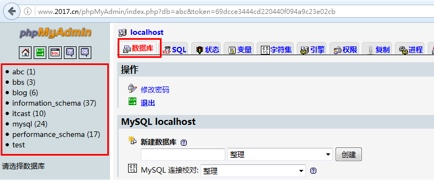
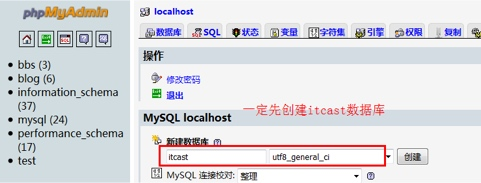
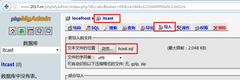
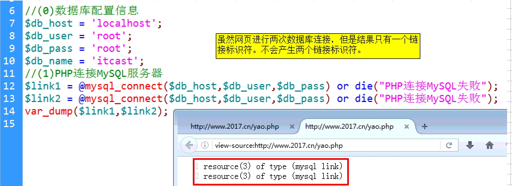
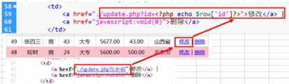

# PHP_典型应用Day_01_[PHP连接MYSQL]_[结果集取数据]_[学生信息管理]


[TOC]

## MySQL数据库的操作步骤
1. 连接数据库`mysql -hlocalhost -uroot -proot `
2. 选择自己的数据库`use 数据库名`
3. 设置字符集`set names 字符集`
4. 执行各种SQL语句

****

## 导入测试数据 itcast.sql
### php my admin 简单使用
* 是一个网页版的数据管理软件
* 无需安装 直接复制到网站根目录下
* phpmyadmin 有首页在地址栏输入 127.0.0.1 /phpmyadmin




****

### 使用php my admin导入测试数据
* 在导入itacst数据之前 一定 要创建一个数据库,假设数据库名为itcast




****


## PHP + MySQL数据库编程步骤
* ① PHP 连接MySQL服务器`$likn = mysql_connect("localhost","root","12345")`
* ② 选择数据库`mysql_select_db("itcast")`
* ③ 设置字符集 `mysql_query("set numes utf8")`
* ④ 执行各种SQL语句`mysql_query()`
    * 插入数据 `$sql = "insert into student values(...)"` 
    * 查询数据 `$sql = select * from student order by age desc`
    * 更新数据`$sql = update news set name = "新的值" where id = 1`
    * 删除数据`$sql = delete from news where id = 10`


-------


### PHP连接MySQL服务器
#### 1 mysql_connect()
* 描述: 打开一个到MySQL服务器的连接

```sql 

resource mysql_connect ([ string $server [, string $username [, string $password ]]] )


```

* 参数: 
    * $server 服务器名称,可以带端口号,例如localhost:3306
    * $username 用户名 root超级管理员 
    * $password 用户密码
    
* 返回值: 如果连通数据库,将返回一个资源数据库,如果连接失败返回 fales


-------


```php

<?php 
	
	//① 数据库的配置信息
	$db_host = "localhost";
	$db_user = "root";
	$db_pass = "12345";
	$db_name = "itcast";


	//② PHP 连接MySQL服务器
	$link = @mysql_connect($db_host,$db_user,$db_pass);

	//③ 打印变量
	 
	 var_dump($link);

 ?>

```

-------

#### 2 exit() 和 die()
* 描述:输出一个消息并且退出当前脚本
* 语法:`void exit ([ string $status ] )`
* 参数: $status 可选 ,如果省略,只会中断输出一条语句

```php

//① PHP 连接MySQL服务器
	$link = @mysql_connect($db_host,$db_user,$db_pass);
	
	if(!$link){
		//判断数据库服务器,是否连接
		exit("PHP连接MySQL服务失败");
	}
	
	
	//② PHP 连接MySQL服务器
	$link = @mysql_connect($db_host,$db_user,$db_pass) or die("PHP连接MySQL失败");

```


-------


#### 3 mysql_error()
* 描述: 返回上一个MySQL操作的文本错误信息
* 语法`string mysql_error ([ resource $link_identifier ] )`
* 参数:`$link_identifier` 是当前的活动连接,可以省略
    
 
     

```php

//② PHP 连接MySQL服务器
	$link = @mysql_connect($db_host,$db_user,$db_pass) or die("PHP连接MySQL失败,详情为".mysql_error());

```

-------

#### 4 mysql_select_db()
* 描述: 选择mysql数据库
* 语法:`bool mysql_select_db(string $database_name[,resource $link_identifier])`
* 参数:
    * `$database_name` 代表要选择数据库名称
    * `$link_identifier`代表当前的活动连接,可以忽略
* 返回值:如果数据库选择成功 返回true 选择失败返回false


```php

//② PHP 连接MySQL服务器
	$link = @mysql_connect($db_host,$db_user,$db_pass) or die("PHP连接MySQL失败,详情为".mysql_error());
	
	//③ 选择某一个数据库
	if(!mysql_select_db($db_name)){
		
		echo "选择数据库{$db_name}失败了!".mysql_error();
		die();//中断程序向下运行
	}

```
 
****

#### 5 mysql_query()
* 描述:发送一条mysql语句,发到mysql服务器执行
* 语法:`resource mysql_query ( string $query [, resource $link_identifier = NULL ] )
`
* 注意: 所有的sql语句,只有mysql 服务器才能识别执行
* 字符集utf8 要与网页的字符集设置一致,否则或乱码
    * 参数$query 各种SQL语句
    * $link_identifier 代表当前的活动连接
     
* 返回值
    * mysql_query() 仅对 `select` `show` `describe` `explain` 和其他语句 语句返回一个 `resource`(结果集) 如果查询出现错误则返回`FALSE`
    * 对于其他类型的SQL语句, 比如 `insert` `update` `delete` `drop` `set` 之类 执行成功返回 `TRUE` 错误返回 `FALSE`

```php

// ④ 设置返回数据的字符集,要与网页的字符集一致
	mysql_query("set names uft8");
	
	
	// ⑤ 执行查询查询的SQL语句
	$sql = "select * from student";
	$result = mysql_query($sql);
	var_dump($result); // 返回资源地址 
	//resource(6) of type (mysql result)
		
	// ⑥ 执行添加的SQL语句
	$sql = "INSERT INTO student VALUES(null,'江大','男',24,'大专','default','default','山东');";
	$result = mysql_query($sql);
	var_dump($result);
		
	
```


-------


### 从结果集中取出数据
#### 1 mysql_fetch_row()
* 描述:从结果集中取得一行作为枚举数组
* 语法:`array mysql_fetch_row ( resource $result )
`
* 返回值: 从指定的标示关联结果集中取得一行数据并作为数组返回,相当于下移指针

```php


	// ⑤ 执行查询
	$sql = "select * from student";
	$res = mysql_query($sql);
	$arr = mysql_fetch_row($res);
	
	
	<?php 
		// ⑥ 循环取出数据
		while($row = mysql_fetch_row($res)){
		
	 ?>
 		<tr>
 			
 			<td><?php echo $row[0] ?></td>
 			<td><?php echo $row[1] ?></td>
 			<td><?php echo $row[2] ?></td>
 			<td><?php echo $row[3] ?></td>
 			<td><?php echo $row[4] ?></td>
 			<td><?php echo $row[5] ?></td>
 			<td><?php echo $row[6] ?></td>
 			<td><?php echo $row[7] ?></td>
 		
 		</tr>

	<?php 
		}
	 ?>

```

****

#### 2 mysql_fetch_assoc()
* **描述**:从结果集中取出一行作为关联数组(字段名作为下标)
* 语法:`array mysel_fetch_array()`
* 返回值: 关联数组,没有更多则返回`FALSE`,指针下移

```php

// ⑤ 查询
	$sql = "select * from student order by age desc;";
	$res = mysql_query($sql);
	// ⑥ 从结果中取出一行最为关联数组
	$row = mysql_fetch_assoc($res);
	
	print_r($row);`

```

****

#### 3 mysql_fetch_array()
* 描述:从结果集中取得一行作为混合数组
* 语法:`array mysql_fetch_array(resource $result [, int $result_type]) `
* 参数:
    * `$result` 结果集资源  
    * `$result_type` 返回的数组类型 ,其值是一个常量
    * `MYSQL_BOTH` 两种下标都有
    * `MYSQL_NUM` 数组下标
    * `MYSQL_ASSOC` 字符下标 `MYSQL_NUM | MYSQL_ASSOC`
    * 获取所有的常量:`get_defined_constants()`
 
 
```php

// ⑥ 从结果中取出一行作为数组返回
	$row = mysql_fetch_array($res,MYSQL_BOTH); // 混合数组
	$numRow = mysql_fetch_array($res,MYSQL_NUM); // 枚举数组
	$assocRow = mysql_fetch_array($res,MYSQL_ASSOC); //关联数组
	$row1 = mysql_fetch_array($res,MYSQL_NUM | MYSQL_ASSOC);  // 混合数组
	
    	
```

****

### 从结果集中取出记录数
#### 1 mysql_num_rows()
* 描述: 取得结果集中的行数,仅对`SELECT`语句有效
* 语法:`int mysql_num_rows(resoures $result)`


```php

//⑥查询到记录总数
	$records = mysql_num_rows($res);

```

****

#### 2 mysql_affected_rows
* **描述**: 取得前一次MySQL操作所影响的记录行数
* **语法**: `int mysql_affected_rows ([res $link_identifier = null])`
* 返回值: 取得最近一次 `INSERT` ``

```php


$sql = "UPDATE student SET salary = salary+200 WHERE name LIKE '张%'";
	$res = mysql_query($sql);

	//⑥查询到记录总数
	$records = mysql_affected_rows();

```

****


-------


### 学生信息的管理
#### 1 公共的连接数据文件

```php

<?php 

	header("Content-type:text/html;charset=utf-8");

	//① 数据库的配置信息
	$db_host = "localhost:3306";
	$db_user = "root";
	$db_pass = "12345";
	$db_name = "itcast";

	// ② 连接MySQL
	 $link = @mysql_connect($db_host,$db_user,$db_pass);
	 if(!$link) die ("连接MYSQL服务器失败".mysql_errno());

	// ③ 选择数据库
	if(!@mysql_select_db($db_name)) die ("选择数据库失败");	 


	// ④ 设置字符集
	mysql_query("set names utf8");

	// ⑤ 打印数据或对象的函数
	function dump($arr){

		echo "<pre>";
		print_r($arr);
		echo "</pre>";

	}

 ?>

```


-------


#### 2 读取学生信息 list.php

* 读取学生数据

```php

<?php 
	// 包含连接数据库的公共文件 conn.php
	require_once("./conn.php"); // 注意 加 ./
	//var_dump($link);

	$sql = "SELECT * FROM student ORDER BY id DESC";
	$res = mysql_query($sql);
	
	//获取记录总数
	$record = mysql_num_rows($res);

 ?>

```


```php

<?php  
		$i  = 1; 
		//循环从结果集中取出数据, 取出一行记录,作为关联数组返回
		while($row = mysql_fetch_array($res,MYSQL_NUM | MYSQL_ASSOC)){
			// 隔行变色
			if ($i % 2 == 0) {
				echo "<tr align = 'center' bgcolor = 'pink'>";
			}else {
				echo "<tr align = 'center'>";
			}

			$i++;
	?>
			<td><?php echo $row[0] ?></td>
			<td><?php echo $row[1] ?></td>
			<td><?php echo $row[2] ?></td>
			<td><?php echo $row[3] ?></td>
			<td><?php echo $row[4] ?></td>
			<td><?php echo $row[5] ?></td>
			<td><?php echo $row[6] ?></td>
			<td><?php echo $row[7] ?></td>
			<td><a href="./updateStudent.php? id = <?php echo $row['id'] ?> ">修改</a>|
				<a href="#" onclick="confirmDel(<?php echo $row['id'] ?>)">删除</a>
			</td>
			
		</tr>
	<?php } ?>

```


-------


#### 3 添加学员信息 add.php
* （1）列表文件list.php添加学生链接

```php

<div style = "text-align: center; padding-bottom: 10px" >
		
		<h2>学生信息管理中心</h2>
		<a href="./addStudent.php">添加学生</a>
		共有 <?php echo $record ?>个学生

	</div>

```

* （2）由add.php页面，返回上一步

```php

<a href="javascript:history.go(-1)">返回到上一页</a>

```

* (3) 添加学生信息的处理代码


```php

<?php 
	require_once("./conn.php");

	 if (isset($_POST['ac']) && $_POST['ac'] == "add") {
		
		// 获取表单提交值
		 foreach($_POST as $key => $value){

		 	$$key = $value; 

		 }

		 // 构建插入的sql语句
		 
		 $sql = "INSERT into student VALUES(null,'$name','$sex','$age','$edu','$salary','$bonus','$city')";

		 // 执行sql
		 if(mysql_query($sql)){
		 		//跳转到学生列表
		 		header("refresh:3;url=./list.php");
		 		exit(); // 终止程序运行
		 } 

	 }
	
 ?>

```


-------


#### 4 更新学生信息 update.php

* (1)学生信息列表list.php


```php

<td><a href="./updateStudent.php? id = <?php echo $row['id'] ?> ">修改</a>|

```

* （2）学生信息更新页面update.php
* 第1步：根据ID获取到对应的学生信息，把对应的字段信息写入到表单元素中,

```php

$id = $_GET['id_'];
			$sql = "SELECT * from student where id = $id";
			$res = mysql_query($sql); 
			$row = mysql_fetch_array($res,MYSQL_ASSOC);

```

* 第2步：对表单元素中的信息进行修改，并提交表单，完成数据更新


```php

<input type="hidden" name="id" value="<?php echo $id?>">

```

```php

$sql = "UPDATE student SET name = '$name', sex = '$sex', age = $age ,edu = '$edu' , 
			salary = $salary,bonus = $bonus,city = '$city' WHERE id = $id";

		
			if (mysql_query($sql)) {
				echo "<h2> id = {$id} 的记录修改成功</h2>";
				header("refresh:3;url=./list.php"); //3秒后跳转
				exit();			
			}else {
				echo "存在错误数据    ".$sql;
			}

```


-------


#### 5 删除学员delete.php

* (1) 列表页list.php主要代码


```php

<a href="#" onclick="confirmDel(<?php echo $row['id'] ?>)">删除</a>

```

* (2) 删除页面的主要代码 delete.php


```php

<?php 

	require_once("./conn.php");
	
	if ($_GET['id_']) {


		$id = $_GET['id_'];
		$sql = "DELETE from student WHERE id = $id";

		$res = mysql_query($sql);
		if ($res) {
			echo "<h2>id = {$id} 的记录已经删除<h2>";
			header("refresh:1;url =./list.php");
			exit();
		}else {
			echo "语句执行错误";
		}

	}else {
		echo "id为空";
	}


 ?>

```


### 界面跳转的三中方式
* 使用JS进行界面跳转
* 使用PHP进行界面跳转
* 


