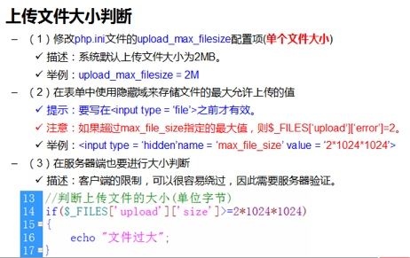

# PHP_典型应用_Day_04_{创建图像}_{图像操作}_{生成随机码}_{添加水印}_{文件上传}


[TOC]

## PHP图像处理
### 图像处理概述
#### 1 开启GD2图像chul
* php通过调用第三方扩展GD图像扩展来进行图像处理
* GD图像扩展,是C语言编写,开发源代码
* 打开PHP的配置文件`php.ini`
 


-------

#### 2 验证是否成功开启


-------

### 创建图像的大致步骤
* ① 创建画布
* ② 绘制画布
* ③ 输出图像
* ④ 释放资源


-------

### 画布的坐标系


-------

## 创建图像
#### ① 创建图像(基于现有的图像) imagecreatefromjpeg()
* **描述**:`imagecreatefromjpeg` — 由文件或 URL 创建一个新图象。
* **语法**: `resource imagecreatefromjpeg ( string $filename )`
* **说明**:imagecreatefromjpeg() 返回一图像标识符，代表了从给定的文件名取得的图像。
* **参数**:`$filename` 真实的文件路径
* **返回值**:成功后返回图象资源,失败后返回 FALSE 。
* 其他类型图片还有两个函数
    * imagecreatefrompng()
    * imagecreatefromgif()

    
> 例: 基于已知画布 创建一个画布
 
```php

header("content-type:text/html;charset=utf-8");

//基于已知画布 创建一个画布
$filename = "./1.jpg";
$img = imagecreatefromjpeg($filename);
var_dump($img);

```   

-------

#### ② 创建图像(空画布) imagecreatetruecolor()
* **描述**:`imagecreatetruecolor` — 新建一个真彩色图像
* **语法**:`resource imagecreatetruecolor ( int $width , int $height )`
* **说明**:imagecreatetruecolor() 返回一个图像标识符，代表了一幅大小为 x_size 和 y_size 的黑色图像。
* **参数**
    * `width` 图像宽度。
    * `height` 图像高度。 

* **返回值**:成功后返回图象资源,失败后返回 FALSE 。   

> 例: 创建空画布

```php
    $img = imagecreatetruecolor(400, 300);
	var_dump($img);	
```

-------

#### ③ 销毁图像 imagedestroy() 

* **描述**:imagedestroy — 销毁一图像
* **语法**:`bool imagedestroy ( resource $image )`
* **说明**:imagedestroy() 释放与 image 关联的内存。image 是由图像创建函数返回的图像标识符，例如 imagecreatetruecolor()。

> 例:释放图像占用内存资源


```php

    $img = imagecreatetruecolor(400, 300);
	//释放资源
	imagedestroy($img);
	var_dump($img);	

```

-------

#### ④ 例输出图像到网页

> 输出图像到网页

```php

//声明网页内容类型为图像格式
header("content-type:image/jpeg");

//基于已知画布 创建一个画布
$filename = "./1.jpg";
$img = imagecreatefromjpeg($filename);
 
//输出图像到浏览器
imagejpeg($img);

//释放资源
imagedestroy($img);

```

-------

## 图像操作

### 为图像分配颜色 imagecolorallocate()
* **描述**:imagecolorallocate — 为一幅图像分配颜色
* **语法**:`int imagecolorallocate ( resource $image , int $red , int $green , int $blue )`
* **说明**:imagecolorallocate() 返回一个标识符，代表了由给定的 RGB 成分组成的颜色。red，green 和 blue 分别是所需要的颜色的红，绿，蓝成分。这些参数是 0 到 255 的整数或者十六进制的 0x00 到 0xFF。imagecolorallocate() 必须被调用以创建每一种用在 image 所代表的图像中的颜色。
* **参数**
    * `$image` 图像资源
    * `$red`(0-255) 使用16进制(0x00-0xFF);  

> 例:为图像分配颜色

```php

$filename = "./2.png";
$img = imagecreatefrompng($filename);

//分配颜色
$blue = imagecolorallocate($img,0,0,255);
$red = imagecolorallocate($img, 0xFF, 0x00, 0x00);

```

-------


### 输出图像 imagejpeg() imagepng() imagegif()
* **描述**:imagejpeg — 输出图象到浏览器或文件。
* **语法**:`bool imagejpeg ( resource $image [, string $filename [, int $quality ]] )`
* **说明**:imagejpeg() 从 image 图像以 filename 为文件名创建一个 JPEG 图像。
* **参数**:
    * `image` 图像资源
    * `filename`要保存的图像路径和文件名
    * `quality` 指定图像的质量(0-100) 0 质量最差 100质量最好
    * `quality` 只有jpg有该参数 png和gif没有


> 例:保存图片到本机


> 例: 输出高质量图片

```php

header("content-type:image/jpeg");
$filename = "./2.png";
$img = imagecreatefrompng($filename);

//分配颜色
$blue = imagecolorallocate($img,0,0,255);
$red = imagecolorallocate($img, 0xFF, 0x00, 0x00);

//输出图片 质量默认为75
imagejpeg($img,null,100);

//imagejpeg($img);
imagedestroy($img);

```

-------


### 区域填充颜色 imagefill()
* **描述**:imagefill — 区域填充
* **语法**:`bool imagefill ( resource $image , int $x , int $y , int $color )`
* **说明**:imagefill() 在 image 图像的坐标 x，y（图像左上角为 0, 0）处用 color 颜色执行区域填充（即与 x, y 点颜色相同且相邻的点都会被填充）。
* **参数**
    * `image`: 图片资源
    * `x`和`y` 填充颜色的启动坐标,但是对于空画布来说,坐标都一样
    * `$color` 要填充的颜色
     
> 例:区域填充颜色
     


-------

### 水平划一行字符串 imagestring()
* **描述**:imagestring — 水平地画一行字符串
* **语法**:`bool imagestring ( resource $image , int $font , int $x , int $y , string $s , int $col )`
* **说明**:imagestring() 用 col 颜色将字符串 s 画到 image 所代表的图像的 x，y 坐标处（这是字符串左上角坐标，整幅图像的左上角为 0，0）。如果 font 是 1，2，3，4 或 5，则使用内置字体。
* 参数:
    * `image` 图像资源
    * `font` 字体大小 1-5
    * `x` 和 `y` 写字符串的起点坐标
    * `s` 写入的字符串 不能是汉字
    * `col` 文字颜色
    
> 例:在图片上写一行字 
    
```php

header("content-type:image/jpeg");
$m = imagecreatetruecolor(300,300);
$c = imagecolorallocate($m, 255, 0,255);
imagestring($m, 5, 50, 50, "hello",$c);
imagejpeg($m);
imagedestroy($m);

``` 

-------

### 取得画布的宽度和高度 imagesx() 和 imagesy()
* **描述**:取得画布的宽度和高度
* **语法** :`int imagesx ( resource $image )`
* **说明**:获取画布的大小

-------

### 取得字体的宽和高 imagefontwidth 和 imagefontheight
* 描述:imagefontwidth — 取得字体宽度
* 语法:`int imagefontwidth ( int $font )`
* 说明:返回指定字体一个字符宽度的像素值。
* 参数:`font` 字号

-------

### 实例:在图像中让文本居中

> 例: 在图像中让文本居中

```php

header("content-type:text/html;charset=utf-8");
header("content-type:image/jpeg");
//初始化变量
$str = "hello";
$fontsize = 5;
//① 创建画布
$img = imagecreatefromjpeg("./1.jpg");

//② 获取画布宽高
$imgWid = imagesx($img);
$imgHei = imagesy($img);

//③ 获取字号的大小
$fontWid = imagefontwidth($fontsize);
$fontHig = imagefontheight($fontsize);

//④ 分配颜色
$black = imagecolorallocate($img, 0, 0, 0);
$red = imagecolorallocate($img, 255, 0, 0);

//⑤ 计算字符串的起始坐标
// x = (画布宽 - 字符串的宽) / 2
$x = ($imgWid - $fontWid * strlen($str)) / 2;  
$y = ($imgHei - $fontHig) / 2;

//⑥ 写入字符串
imagestring($img,$fontsize,$x,$y,$str,$red);

//⑦ 输出图像
imagejpeg($img);

//⑧ 释放
imagedestroy($img);

```

-------

### 实例:随机验证码
#### 产生一个指定范围的数值 range()
* **描述**:range — 建立一个包含指定范围单元的数组
* **语法**:`array range ( mixed $start , mixed $limit [, number $step = 1 ] )`
* **说明**:建立一个包含指定范围单元的数组。
* **参数**:
    * start 序列的第一个值。
    * limit 序列结束于 limit 的值 
    * step 如果给出了 step 的值，它将被作为单元之间的步进值。step 应该为正值。如果未指定，step 则默认为 1
* 返回一个枚举数组

-------


#### 将多个数组合并array_merge();
* 描述: array_merge — 合并一个或多个数组
* 语法:`array array_merge ( array $array1 [, array $... ] )`
* 说明:array_merge() 将一个或多个数组的单元合并起来，一个数组中的值附加在前一个数组的后面。返回作为结果的数组


-------

#### 从数组中随机取出一个或多个单元 array_rand()
* 描述:从数组中随机取出一个或多个单元
* 语法:`mixed array_rand ( array $input [, int $num_req = 1 ] )`
* 说明:从数组中取出一个或多个随机的单元，并返回随机条目的一个或多个键。
* 参数:
    * input 输入的数组。 
    * num_req 指明了你想取出多少个单元。如果指定的数目超过了数组里的数量将会产生一个 E_WARNING 级别的错误。
* 返回值: 如果你只取出一个，array_rand() 返回一个随机单元的键名，否则就返回一个包含随机键名的数组。这样你就可以随机从数组中取出键名和值。 

-------

#### 将元素数组打乱 shuffle()
* 描述:shuffle — 将数组打乱
* 语法:`bool shuffle ( array &$array )`


-------

#### 取出随机整数 mt_rand()
* 描述:mt_rand — 生成更好的随机数
* 语法:`int mt_rand ( int $min , int $max )`


-------

#### 图片随机验证码

> 例:图片随机验证码

```php

//初始化变量
$str = ""; 
$fontsize = 5;

//① 生成随机的验证码字符串
$arr_list = array_merge(range('A','Z'),range(1,9),range('a','z'));
shuffle($arr_list);
//② 随机从数组中取出四个下标
$index_list = array_rand($arr_list,18);
//③ 打乱数组
shuffle($index_list);
//④ 根据下标取出值
foreach ($index_list as $value) {
	$str .= $arr_list[$value];
}
//⑤ 创建画布
$img = imagecreatetruecolor(200, 32);
//⑥ 分配颜色
$color = imagecolorallocate($img, mt_rand(60 ,255), mt_rand(0 ,255), mt_rand(0 ,255));
//⑦ 获取画布宽高和字体宽高
$imgWid = imagesx($img);
$imgHei = imagesy($img);

$fontWid = imagefontwidth($fontsize);
$fontHig = imagefontheight($fontsize);
//⑧ 计算字符串起始坐标
$x = ($imgWid - $fontWid * strlen($str)) / 2;
$y = ($imgHei - $fontHig) / 2;
//⑨ 将验证码写入
imagestring($img, $fontsize, $x, $y, $str, $color);
//⑩ 输出
imagejpeg($img);
//释放内存
imagedestroy($img);

```

-------

### 在图像中写入汉字 imagettftext() 
* 在图像上写入一行TTF字体的文本;
* TTF字体(true type font) 每个TTF字体是一个独立的文件
* **描述**:imagettftext — 用 TrueType 字体向图像写入文本
* **语法**:`array imagettftext ( resource $image , float $size , float $angle , int $x , int $y , int $color , string $fontfile , string $text )`
* 说明:使用 TrueType 字体将 指定的 text 写入图像。
* **参数**
    * `image` 图像资源
    * `$size` 字号大小
    * `angle` 选择角度
    * `x`和`y`绘制文字的起点坐标 文本的(0.0)在文本的左下角
    * `color` 文字的颜色
    * `fontfile` 字体文件路径
    * `text` 绘制的文本
    
    > 例
    
    

 
-------
   
### 获取图像的相关信息 getimagesize()
* 描述:getimagesize — 取得图像大小
* 语法:`array getimagesize ( string $filename [, array &$imageinfo ] )`
* 参数:
    * `filename` 图像文件名
    * `imageinfo` 是一个常量 
* 返回值:返回一个具有四个单元的数组。索引 0 包含图像宽度的像素值，索引 1 包含图像高度的像素值。索引 2 是图像类型的标记：1 = GIF，2 = JPG，3 = PNG，4 = SWF，5 = PSD，6 = BMP，7 = TIFF(intel byte order)，8 = TIFF(motorola byte order)，9 = JPC，10 = JP2，11 = JPX，12 = JB2，13 = SWC，14 = IFF，15 = WBMP，16 = XBM。这些标记与 PHP 4.3.0 新加的 IMAGETYPE 常量对应。索引 3 是文本字符串，内容为"height="yyy" width="xxx""，可直接用于 IMG 标记。 


-------

### 为画布分配一个透明度的颜色 imagecolorallocatealpha()
* 描述:imagecolorallocatealpha — 为一幅图像分配颜色 + alpha
* 语法:`int imagecolorallocatealpha ( resource $image , int $red , int $green , int $blue , int $alpha )`
* 参数:`alpha`指定透明度 取值0-127 0完全透明 127完全透明


-------

### 制作图像水印效果
> 例:图像水印效果


```php

$filename = "./2.png";
function addImageWaterMask($filename){
	//定义图像扩展名的数组
	$arr_ext = array(
		1 => "gif",
		2 => "jpeg",
		3 => "png"
	);

	//取出文件扩展名
	$image_info = getimagesize($filename);
	$ext = $image_info[2];

	//创建图像(基于已知图像创建) 使用可变函数
	$from = "imagecreatefrom".$arr_ext[$ext];
	$img = $from($filename);

	//分配透明度颜色
	$color = imagecolorallocatealpha($img, 200, 0, 0, 75);
	//往图片上写入文字
	$font = 28;
	$fontfile = "./华文仿宋.ttf";
	$str = "BY 115273ZANG@WEIBO.COM";
	imagettftext($img,$font,0,50,50,$color,$fontfile,$str);
	//imagestring($img,5,0,0,$str,$color);
	//输出图像
	header("content-type:image".$arr_ext[$ext]);
	$imageecho = "image".$arr_ext[$ext];
	$imageecho($img);
	imagedestroy($img);
}

//调用函数
addImageWaterMask($filename);

```

-------

### 图像等比例缩放 imagecopyresampled()
* 描述:imagecopyresampled — 重采样拷贝部分图像并调整大小
* 语法:`bool imagecopyresampled ( resource $dst_image , resource $src_image , int $dst_x , int $dst_y , int $src_x , int $src_y , int $dst_w , int $dst_h , int $src_w , int $src_h )`
* 参数: 
    * `dst_image` 目标图像资源
    * `src_image` 原图像资源
    * `dst_x`和 `dst_y` 目标图像的启点坐标
    * `src_x`和`src_y` 源图像的起点坐标
    * `dst_w`和`dst_h` 目标图像的宽和高
    * `src_w`和`src_h` 源图像的宽和高

> 例:将图片调整为原有图片的一半

```php

// 创建画布
	$src_img = imagecreatefromjpeg($filename);//原图像
	$src_W = imagesx($src_img);
	$src_H = imagesy($src_img);

	//目标图像的宽高
	$det_w = $src_W * 0.5;
	$det_H = $src_H * 0.5;

	$dst_img = imagecreatetruecolor($det_w, $det_H);

	//将原图缩放为一半
	imagecopyresampled($dst_img, $src_img,0,0,0,0, $det_w, $det_H, $src_W,$src_H);
	header("content-type:image/jpeg");
	imagejpeg($dst_img);
	imagedestroy($dst_img);
	imagedestroy($src_img);

```   

> 通过查询 GD 和图像处理 函数 实现更多功能


-------

## 文件上传
### 上传文件的原理
* 客户端有一个上传文件的表单
* 表单的提交方式 method 的值 必须为POST
* 表单的enctype的属性值`multipart/form-data`
* enctype的默认值为`application/x-www-form-urlencoded`
* enctype的含义:表单数据的编码方式
* 服务器获取上传文件的信息,数据并转存到自己网站的目录下


```html

    <form  name="form1" method="post" enctype="multipart/form-data" action="">
	用户名 <input type="text" name = "username">
	上传图片: <input type="file" name="uplode" >
		<input type="submit" value = "提交表单">
	</form>

```


-------

### 超全局数组$_FILES
* 表单提交的附件信息不会进入到`$_POST`数组中,只有普通元素的信息,才会进入`$_POST`
* 附件信息是进入到`$_FILES`数组中


-------

### 上传文件的错误代码


* 上传文件错误的代码不为 0 表示上传的文件一定有问题


-------
      
### 查看上传临时文件夹
* `win`上传的临时文件位置: c:/windows/temp
* `mac`上传的临时文档位置: /private/var/tmp/phpSrPNVR
* 上传的临时文件,在网页执行完毕就被删除了


-------

### 修改上传文件的临时目录
* 打开 php.ini 


-------


### 将上传的文件移动到新位置 move_uploaded_file
* 在临时文件被删除前,永久的移动到新的位置,一般是指网站根目录(./upload/)
* 描述:move_uploaded_file — 将上传的文件移动到新位置
* 语法:`bool move_uploaded_file ( string $filename , string $destination )`
* 参数
    * filename 上传的临时文件的文件名。 
    * destination 移动文件到这个位置。
* 返回值: 成功时返回 TRUE。

> 例 上传文件移动到新位置

```php

header("content-type:text/html;charset=utf-8");
//将上传的临时文字移动到文件夹中

//判断上传的文件是否有错误
if ($FILES['uplode']['error'] != 0) {
	echo "上传文件有错误发送";
	exit();
}
//判断上传文件的大小,是否超过规定(以1MB为例)
if ($_FILES['uplode']['size'] > 1024*1024) {
	echo "上传文件超出1MB";
	exit();
}

//将临时文件移动到当前根目录下uplode
$srcName = $_FILES['uplode']['tmp_name'];
$decName = $_FILES["uplode"]['name'];
if (!move_uploaded_file($srcName,"./abc/$decName")) {
	echo "上传文件失败";
	exit();
}
echo "上传成功";

``` 


-------

### 关于上传的配置



 


-------

### uniqid()
* **描述**: uniqid — 生成一个唯一ID 上传的文件名,在服务端,不能是中文
* **语法**:`string uniqid ([ string $prefix = "" [, bool $more_entropy = false ]] )`
* **说明**:获取一个带前缀、基于当前时间微秒数的唯一ID。
* **参数**
    * `$prefix` 指定随机字符串的前缀
    * `$more_entropy` 指定随机字符串的后缀
    * 如果两个参数都省略,将返回一个13个字符的随机字符串


-------
    
### 上传文件类型判断(扩展名)
> 例:上传文件类型判断(扩展名)

```php

header("content-type:text/html;charset=utf-8");

//判断上传围巾是否是图形
$arr_ext = array("jpeg","png","gif","jpg");
//获取上传文件的扩展名
$index = strrpos($_FILES['uplode']['name'],"."); //最后小数点的索引位置
$ext = substr($_FILES['uplode']['name'], $index+1);
	

//判断上传文件是否是图像
if (!in_array($ext, $arr_ext)) {
	echo "上传文件不是图像";
	exit();
}else {
	//移动上传的临时文件,
	$srcName = $_FILES['uplode']['tmp_name'];
	$det = "./abc/".uniqid()."$ext";
	if (!move_uploaded_file($desName,$det)) {
	 	echo "上传文件失败";
	 	exit();
	 }else {
	 	echo "上传文件成功";
	 }
}

```    

-------

     

