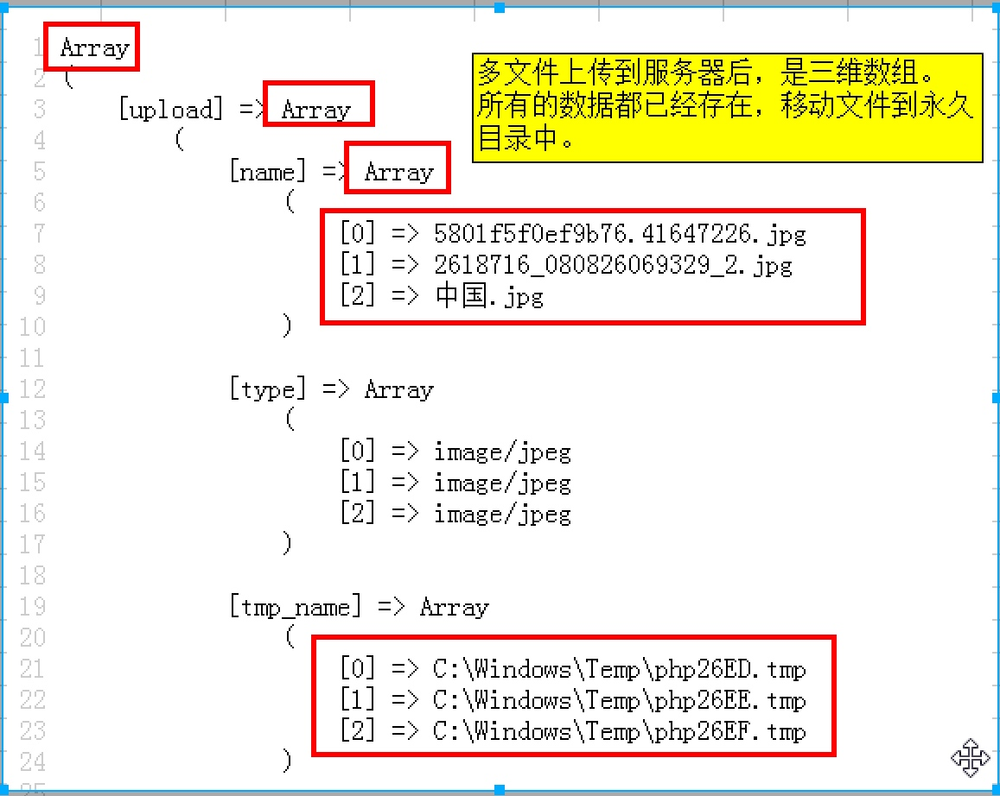
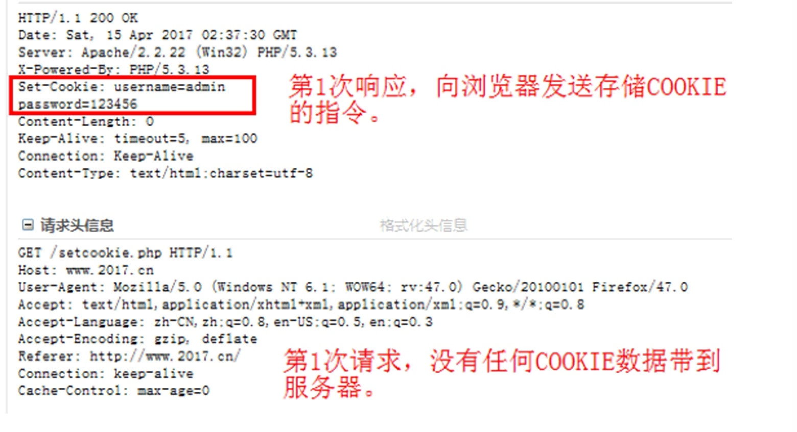
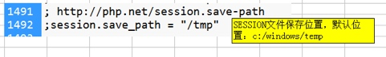
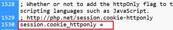
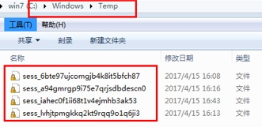
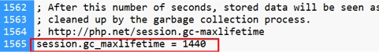
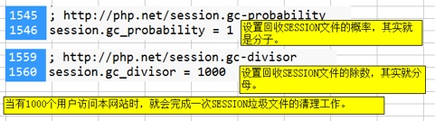

# PHP_典型应用_Day_05_{多文件上传}_{COOKIE操作}_{SESSION操作}


[TOC]

## 返回文件路径信息 pathinfo()
* **描述**: pathinfo — 返回文件路径的信息
* **语法**:`mixed pathinfo ( string $path [, int $options = PATHINFO_DIRNAME | PATHINFO_BASENAME | PATHINFO_EXTENSION | PATHINFO_FILENAME ] )`
* **说明**: pathinfo() 返回一个关联数组包含有 path 的信息。返回关联数组还是字符串取决于 options。
* **参数**:
    * path 要解析的路径。 
    *  $options 是个常量
    * PATHINFO_DIRNAME 所在的目录名称
    * PATHINFO_BASENAME 文件名 不含路径
    * PATHINFO_EXTENSION 文件扩展名 不含点
    * PATHINFO_FILENAME 文件主名
* **返回值**:如果没有传入 options ，将会返回包括以下单元的数组 array：dirname，basename 和 extension（如果有），以 及filename。 

> 例 获取文件信息


> 例 获取文件扩展名


-------

## 多文件上传
* 多文件上传的表单部分

```html

    <form name="form1" method="post" enctype="multipart/form-data" action="./Day05zy.php">
	用户名 <input type="text" name = "username">
	上传图片1: <input type="file" name="uplode[]" >
	上传图片2: <input type="file" name="uplode[]" >
	上传图片3: <input type="file" name="uplode[]" >

	<input type="submit" value = "提交表单">
	</form>

```
> 表单上传多文件 




> 例 多文件上传实例

```php

Array
(
    [uplode] => Array
        (
            [name] => Array
                (
                    [0] => 笔记.pages
                    [1] => 环境变量
                    [2] => 20170405.torrent
                )

            [type] => Array
                (
                    [0] => 
                    [1] => application/octet-stream
                    [2] => application/octet-stream
                )

            [tmp_name] => Array
                (
                    [0] => 
                    [1] => /private/var/tmp/phpyyKQuF
                    [2] => /private/var/tmp/phplIydyP
                )

            [error] => Array
                (
                    [0] => 1
                    [1] => 0
                    [2] => 0
                )

            [size] => Array
                (
                    [0] => 0
                    [1] => 405
                    [2] => 12340
                )

        )

)

```


```php

//多文件上传
	//提示网上下载一个JS插件 进行多文件选择
	//传统的文件域,每次只能选择一个文件
	function inceptimgs(){
		//将上传的三维数组,变成二维数组
		$arr = $_FILES["uplode"];

		//循环遍历二维数组
		foreach ($arr["tmp_name"] as $key => $value){

			if ($value != "") {
				//临时文件路径
				$tmp_filename = $value; 
				//目标文件路径
				$dst_name = "./abc/".uniqid("abc_").".".pathinfo($arr["name"][$key],PATHINFO_EXTENSION); 
				//将上传的临时文件,移动到永久目录下
				if(move_uploaded_file($tmp_filename,$dst_name)){
					echo "上传成功";	
				}else {
					echo "上传失败";	
				}		
			}

		}
	}

```

-------

## COOKIE 概述
### 什么是COOKIE
* COOKIE 是一种会话技术
* COOKIE 将用户的会话数据,临时存储在客户端电脑上
* COOKIE 是由服务器端生成的,发送给浏览器,浏览器将COOKIE数据存在本机中
* 有了COOKIE 用户可以实现自动登录 网站有针对性的推荐产品电子商务网站才可以发展
* COOKIE 存储在本地中,但是其中的数据是加密的

-------

### 使用COOKIE 的好处
* 用户可以实现自动登录,可以记住登录的用户名的密码,方便下次简化登录
* 电子商务网站,可以记录的曾经选择的商品,在结账时可以选择商品调出来
* 可以记录用户的访问习惯 网页停留的时间 喜欢什么样的商品 进行什么搜索 也是网络营销的一种手段


-------

### COOKIE 的工作原理


> 第一次请求 设置COOKIE



> 第二次请求 


-------


## COOKIE操作
### 设置COOKIE setcookie()
* **描述**:setcookie — Send a cookie 向浏览器发送一个COOKIE
* **语法**:`bool setcookie ( string $name [, string $value [, int $expire = 0 [, string $path [, string $domain [, bool $secure = false [, bool $httponly = false ]]]]]] )`
* **参数**: 
    * `$name` 必填项: cookie的名称 命名方式与变量一致
    * `$value` 设置cookie的值 值的类型只能是基本数据类型
    * `$expire`设置cookie数据的过期时间
    * `$path` 设置COOKIE的有效路径
    * `$domain` 设置COOKIE的有效域名
    * `$secure` 设置COOKIE是否只能通https来使用
    * `$httponly`设置哪些程序可以使用COOKIE

> 例: 设置COOKIE 

```php

//创建一个COOKIE 并传递给浏览器	
		setcookie('username','admin');
		setcookie('password','12345');

```   

### 读取COOKIE数据 
* 读取COOKIE 数据是通过`$_COOKIE`全局变量读取的

> 例: 读取COOKIE数据


> COOKIE的工作原理


-------

    
### 有效性(即时性 永久性)
* 语法: `bool setcookie ( string $name [, string $value [, int $expire = 0] )`

#### 即时性COOKIE
* 当浏览器关闭后 该COOKIE数据就删除了

> 例: 创建即时性COOKIE

```php
     //即时性COOKIE当浏览器关闭后COOKIE就被删除
		//省略第三个参数就是即时性COOKIE
		setcookie('username','admin');
		setcookie('password','12345');
```  

-------

#### 有效性
* 设置第3个参数,就是COOKIE的过期时间
* 一般的设置方法是:在当前的时间戳上+N秒
* 例如`time() + 3600 //一个小数后过期`

> 设置一个COOKIE的过期时间 

```php

     //有效性 一个小时后过期
		setcookie('username','admin',time() + 3600);
		setcookie('password','12345',time() + 3600);

```

-------

#### 永久性

> 设置永久的COOKIE 

```php
      //设置永久COOKIE PHP_MAX_INT
		setcookie("username","admin",time() + PHP_INT_MAX);
		setcookie('password','12345',time() + PHP_INT_MAX);
```

-------

#### COOKIE有效路径
* 描述:设置COOKIE数据,只能在那个路径可以用
* 语法:`bool setcookie ( string $name [, string $value [, int $expire = 0 [, string $path]`
* 说明:`$path` 指定生效的目录 如果省略 默认值为`/` 在网站根目录和所有子目录都能用
* 举例: `/upload` 当前COOKIE只能在upload 目录及其子目录下有效
* 原因: 一个网站有很多目录,每个忽略有很多文件,每个文件都会设置COOKIE数据
* 好处:可以节省网络开销
* 注意:可以在当前域名的任何目录中,来设置COOKIE数据 但是只能在对于的目录中使用COOKIE数据

> 例: 设置读取COOKLE的有效路径 

```php
     //COOKIE路径有效性: 默认为'/' 在根目录的子文件 
		setcookie("username","admin","/upload");
		setcookie("password","12345","/upload");
```


-------

### COOKIE域名有效性
* **描述**: 该COOKIE数据只能在制定的域名下来使用
* **语法**: `bool setcookie ( string $name [, string $value [, int $expire = 0 [, string $path [, string $domain `
* **参数**: `$domain`默认值为当前域名 只能在当前域名下使用
    * 如果设置为 2017.cn 域名主体,则可以在所有的子域名下使用
    * 2017.cn 域名主体
    * www.2017.cn 一级域名
    * image.2017.cn 二级域名
    * news.image.2017.cn 三级域名
* 如果设置为www.2017.cn 一级域名,则只能在当前域名下使用 二级和三级域名都不能使用该Cookie

> 例: COOKIE设置域名有效性

```php
//COOKIE域名有效性 
		setcookie("username","admin","/","image.2017.com");
		setcookie("password","12345","/","image.2017.com");
```
> 例: 设置二级域名COOKIE有效性 后 一级域名无法解析该COOKIE 


-------

### 是否仅限https 可以发送 COOKIE
* **语法**:`bool setcookie ( string $name [, string $value [, int $expire = 0 [, string $path [, string $domain [, bool $secure = false`
* **描述**:是否仅限https可以发送COOKIE
* **参数**: `$secure` 是一个布尔值,值TRUE只能通过HTTPS来发送COOKIE 值FALSE 可以使用

> 例:设置在安全模式下也可以解析COOKIE

```php

    //是否仅限https发送COOKIE
		setcookie("username","admin","/","image.2017.com",true);
		setcookie("password","12345","/","image.2017.com",true);

```

* 浏览器默认是http协议

-------

### 是否只能通过http协议使用 COOKIE
* **描述**:除了http协议来使用cookie外,其他程序是否也可以使用该COOKIE
* **语法**:`bool setcookie ( string $name [, string $value [, int $expire = 0 [, string $path [, string $domain [, bool $secure = false [, bool $httponly = false ]]]]]] )`
* **说明**:如果值为false 则其他程序也可以使用该COOKIE

> 

```php
//设置则其他程序也可以使用该COOKIE
		setcookie("username","admin","/","www.2017.com",fales,fales);
		setcookie("password","12345","/","www.2017.com",fales,fales);
```

```js
<script>
	//当网页加载后通过js读取COOKIE数据
	window.onload = function(){
		//弹出COOKIE数据
		window.alert(docment.cookie);
	}
</script>
```

-------


### 删除COOKIE
* ① 设置有效期为过去的时间

>  设置COOKIE为过去的时间 实现删除COOKIE

```php
     //设置COOKIE为过去的时间 实现删除COOKIE
		setcookie("username","admin",time()-1);
		setcookie("password","12345",time()-1);
```

* ② 将COOKIE的值设置为FALSE
* ③ 将COOKIE的值设置为空字符串
* ④ 不设置COOKIE的值


-------

### COOKIE的缺点
* 数据不太安全
* 存储的数据类型只能是字符串
* 文件是由容量限制大于4KB


-------

## SESION操作
### SESSIPN概述
* SESSIPN 也是一种会话技术
* 数据存在服务端,相对安全
* SESSION 技术的基于COOKIE 没有COOKIE 也就没有SESSION
* 服务器将SESSION 数据保存在服务器上,而将SESSION 的用户id存储在客户端的电脑上
* SESSION存储的数据类型,除了资源外的数据类型都可以
* SESSION 文件没有大小限制

-------

### SESSION工作原理


-------

### 开启SESSION会话功能 session_start
* 除了`$_SESSION`超全局数组外,其他超全局数组变量都可以直接使用
* 使用`$_SESSION`超全局数组变量,必须要开启SESSION会话功能
* **描述**: 开启SESSION会话,或者重用SESSION会话 产生一个新的 SESSION的id 或者重用原来的SESSION的id
* **语法**:`bool session_start ( void )`


> 例: 开启SESSION会话功能

```php

// 开启SESSION 产生一个新的SESSIONID 或者重用原有的SESSIONID
		// SESSION不能重复开启
		// 在每个页面 都需要用到$_SESSION数组,该页面必须开启SESSION会话
		session_start();
		echo "<pre>";
		print_r($_SESSION);

```

> 开启SESSION的执行流程


-------

### SESSION 的操作
#### 添加 SESSION 数据
* SESSION 的操作就是对 `$_SESSION`数组的操作

```php
    session_start();
		//添加SESSION数据
		$_SESSION['username'] = "root";
		$_SESSION['password'] = "12345";

```

-------

#### 读取 SESSION 数据


-------

#### SESSION存储位置
* SESSION 在服务端的保存位置 temp文件目录


-------

#### 删除SESSION数据
* 使用`unset()`可以删除某一个session 数据
* 也可以使用`unset()`释放整个session数组


-------


#### 销毁当前的SESSION文件 session_destroy
* 描述: session_destroy — 销毁一个会话中的全部数据
* 语法:`bool session_destroy ( void )`
* 说明: session_destroy() 销毁当前会话中的全部数据， 但是不会重置当前会话所关联的全局变量， 也不会重置会话 cookie。 如果需要再次使用会话变量， 必须重新调用 session_start() 函数。
* 相当于安全退出按钮


-------

#### 获取当前的SESSION-ID值
* 描述:获取当前的SESSIONID
* 语法:`string session_id ([ string $id ] )`
* 用法:`echo session_id();`

#### 获取当前的SESSION的COOKIE名称
* 语法:`string session_name ([ string $name ] )`
* 用法: `echo session_name();`

-------

## SESSION 设置 php.ini
### 修改SESSION 保存位置 session.save_path
 

* 使用`ini_set()`函数设置 设置后只针对当前站点有效


### 修改SESSION 名称(session.name)


### 修改SESSION的COOKIE配置
* ① 过期时间的设置


* ② 修改有效路径的设置


* ③ 有效域名


* ④ 是否仅限于https 协议来使用COOKIE


* ⑤ 是否仅限于http协议来使用COOKIE
 


### SESSION的垃圾回收
* 什么是SESSION垃圾
* 很多人上网后,没有选择安全退出,造成了很多SESSION垃圾




#### SESSION 垃圾回收的时间(session.gc_maxlifetime)
* 修改PHP配置文件php.ini



#### 回收的概率(session.gc_probability,session.gc_divisor)




### 如果COOKIE禁用了,如何传递SESSIONID
* ① 可以将SESSIONID 放在超链接的后面,当成参数传递到服务器
    * 如:`<a href="get.php?PHPSESSID=23lk244j2342lkjfs"> 发送SESSIONID </a>`
* ② 可以将SESSIONID放到表单的隐藏域中,当表单提交时一起发到服务器
    * 如:`<input type = "hidden" name = "PHPSESSID" value = "...">` 
    

