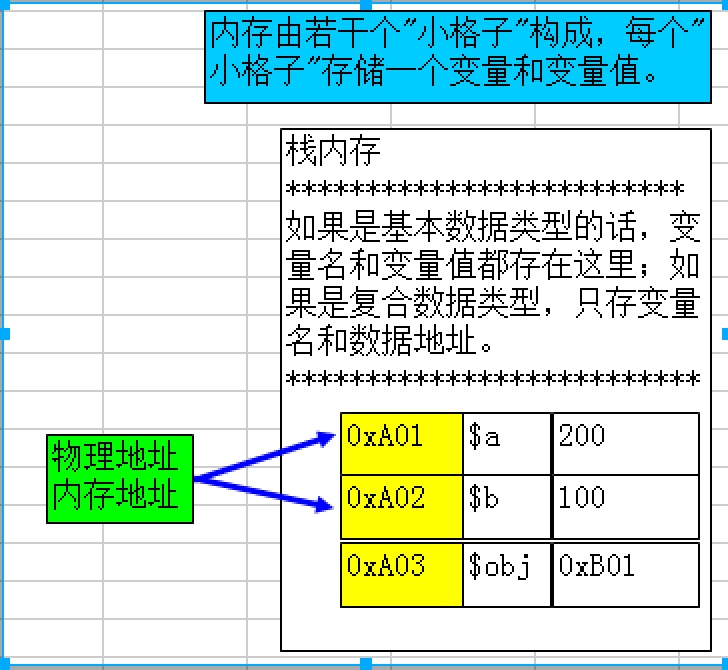

# PHP_面向对象_Day_07_{值传递}_{引用传递}_{封装}_{继承}_{多态}_{parent}_{方法重写}_{final}_{abstract}


[TOC]

## OPP中内存的分布


> 内存分布图


## 值传递
* **JS有8种数据类型** 基本数据类型 复合数据类型
    * **基本**(只有一个值) 字符 数值 布尔 undefined null
    * **复合**(可能多个值) 数组 对象 函数 
    * JS 中基本数据类型都是值传递
    * 复合数据类型都是引用传递
* **PHP有8种数据类型** 标量 复合 特殊
    * **基本**: 字符串 整形 浮点 布尔
    * **复合**: 数组 对象 
    * **特殊**: 资源 null
    * 在PHP 中标量和数组 默认是值传递
    * 对象和资源 默认是引用传递
    
> 值传递示意图
     


## 引用传递
* 引用传递: 将一个变量的数据地址 复制一份传递给另一个变量 两个变量都指向同一份数据
* 如果其中一个数据改变了,两个变量的数据都会跟着变


```php
//将一个变量的地址复制一份 传递给另一个变量

class Student{
    public $name
    public $age
    
    public function show(){
    }
}

//创建学生类的对象
$obj1 = new Student;
$obj2 = new Student;

```
> 引用内存占用示意图


```php

//传递学生类的对象
$obj1 = new Student;
$obj2 = $obj1; //将对象1的地址 复制一份 传递给$obj2
$obj1->name = "旺财";
echo $obj2->name;

```

## 其他类型转换引用传递
* 在引用的比变量前,加`&`符号可以将标量变成引用传递

> 例: 给函数外的数组,添加一个数据

```php

//给函数外的数组添加一个数组
//注意:在php中数组默认是值传递
function addElement(&$arr=array(),$school=null){
	//添加一个数组元素
	$arr[] = $school;
}

//调用函数
$arr = array("旺财","男");
$school = "蓝翔";
addElement($arr,$school);	

//在函数外打印数组
print_r($arr);

```

## 三大特性:封装 基础 多态
### 封装性
* 封装性: 将敏感数据保护起来,不被外界访问
* 隐藏类中成员属性 提供对外公共访问方法
* 类的封装性,通过权限修饰符来实现 
* 对成员属性,成员方法,静态属性,静态方法 没有常量 添加权限修饰符
* 成员方法利用省略,默认public 不建议省略

> 访问权限修饰符的介绍

* public(公共权限)在任何区域都可以访问
* private(私有) 只能在本类中访问 类外和子类都无法访问
* protected(受保护) 只能在本类和子类中被访问,在类外不能被访问

-------

### 类的继承性
> 继承的概念

* CSS样式继承,元素的样式,可以被子元素继承,样式只有一份,可以被两个元素来使用
* 如果一个B类拥有了A类的全部特征信息,我们就可以 B类继承了A类 

> 为何要继承?

* 功能的升级和扩展   

> 继承的语法格式

```php
    //创建子类并继承父类的所有功能
	class SubClass extends ParentClass{
		//子类的功能代码
	}

```

> 单继承和多继承

* 单继承:只能从一个父类继承 大部分编程语言都是单继承
* 多继承:同时可以从多个父类来继承 如C++


> 例 继承案例

```php
    class Student{
		public $name = "旺财";
		public $age = 24;
		public function show(){
			echo "{$this->name} 的年龄是{$this->age}岁";
		}
	}
	
	//创建蓝翔学生类
	class BlueStudent extends Student{
		//继承可以理解为引用传地址 
	}
	
	$obj = new BlueStudent();
	$obj->show();

```

> 构造方法和析构方法的继承

* 构造方法和析构方法也都会被子类继承

```php
    class Student{
		protected $name = "旺财";
		protected $age = 24;
		//构造方法:属性初始化
		public function __construct($name,$age){
			$this->name = $name;
			$this->age = $age;
		}
		public function show(){
			echo "{$this->name} 的年龄是{$this->age}岁";
		}
	}
	
	//创建蓝翔学生类
	class BlueStudent extends Student{
		//继承可以理解为引用传地址 
	}
	
	$obj = new BlueStudent("小强",20);
	$obj->show();

```

#### parent关键字
* Self 代表当前类,parent代表父类
* self 和 parent都只能在方法中使用
* self 调用本类的内容:常量,静态属性,静态方法
* parent 调用父类的内容,父类的常量 静态属性 静态方法 成员方法
* self 和 parent 除了成员属性外都可以调用
* self 的用法 `self::类常量|静态属性|静态方法`
* parent 的用法`parent::类常量|静态属性|静态方法|成员方法`

> 例 parent关键字的使用

```php

    class Student{
		const TITLE = "蓝翔挖掘机飙车技巧";
		protected static $name = "旺财";
		protected $age = 24;
		
		protected static function showinfo(){
			return "父类静态方法";
		}
		protected function readMe(){
			return "父类的成员方法";
		}
		
	}
	//创建蓝翔学生类
	class BlueStudent extends Student{
		
		public function showMe(){
			$str = self::TITLE."\n";
			$str .= parent::$name."\n";
			$str .=  $this->age."\n";
			$str .= $this->readMe()."\n";
			$str .= parent::showinfo();
			echo $str;
				
		}
	}
	
	$obj = new BlueStudent();
	$obj->showMe();

```


-------


### 类的多态
* 类的多态,就是多种形态 主要指,方法重载和方法重新
* ==方法重载: 一个类中定义两个同名方法参数不同 PHP不支持 语法会报错==
* ==方法重写: 在子类中定义一个,与父类重名的方法==
* 方法重写的作用:功能的升级就是方法的重写

> 方法重写的要求

* 子类中重写的方法名称,必须与父类方法同名
* 子类中重写的方法参数个数,必须与父类方法参数个数一致
* 子类中重写的方法权限,不能低于(>=)父类中方法的权限
* 若父类中的方法权限为private 子类无法继承 也不能重写
* 子类重新的方法类型,要与父类的方法类型一致 静态重写静态 成员重写成员

> 例 重写方法

```php

    class Student{
			
		protected function showInfo($name,$age){
			return "{$name} 的年龄是 {$age}岁!";
		}
		
	}
	//创建蓝翔学生类
	class BlueStudent extends Student{
		public function showInfo($a,$b){
			$str = parent::showInfo("旺财",24);
			echo $str."毕业于{$a},{$b}系";
		}
	}
	
	$obj = new BlueStudent();
	$obj->showInfo("蓝翔","拖拉机飙车技术");

```
> 例 重写方法的注意事项


-------

#### 构造方法重写
* 成员属性只能继承,不能重写
* private 权限的元素不能重写
* 其他成员都可以重写
* ==构造方法也可以重写,但是构造方法的参数可以不一致==

> 案例 构造方法重写

```php
    class Student{
		//私有的成员属性	
		private $name;
		private $age;
		//构造方法
		protected function __construct($name,$age){
			$this->name = $name;
			$this->age = $age;
		}
		//显示方法
		protected function showInfo(){
			$str = "姓名 $this->name\n";
			$str .= "年龄:$this->age\n";
			return $str;
		}
		
	}
	//创建蓝翔学生类
	class BlueStudent extends Student{
		//私有的成员属性
		private $edu;
		private $school;
		//重写父类的构造方法
		public function __construct($name,$age,$edu,$school){
			parent::__construct($name,$age);//向父类传递参数
			$this->edu = $edu;
			$this->school = $school;
		}
		
		public function showInfo(){
		 	$str = parent::showInfo();
			$str .= "学历:$this->edu\n";
			$str .= "学校:$this->school\n";
			echo $str;
		}
	}
	
	$obj = new BlueStudent("旺财",24,"研究猪","蓝翔");
	$obj->showInfo();

```


-------

## 最终类最终方法
> 概述

* final 关键字修饰类,就是最终类
* final 关键字修饰方法,就是最终方法
* 最终类:该类不能继承,只实例化,如 数据库类
* 最终方法,该方法十分完善了,不需要重写了

> 例 最终类和最终方法


-------

_## 抽象类和抽象方法
_
> 简介

* abstract 关键字修饰的类就是抽象类
* abstract 修饰的方法就是抽象方法
* 抽象类:只能继承 不能实例
* 抽象方法:该方法必须先继承后重写
* 抽象类中,所有的元素都可以存在
* 抽象方法:没有方法体 没有大括号 没有参数限制
* 抽象方法的作用: 就是方法的命名规范
* ==所有的抽象方法,在子类中都必须重写==
* 如果一个类中存在抽象方法,该类必须声明为抽象方法
* ==抽象方法必须是成员方法,不能是静态方法==


> 例 抽象方法 


```php
//定义抽象的基础类
	abstract class Shop{
		//定义抽象方法
		abstract public function showInfo($name,$age);
		abstract public function readMw();
	}
	
	final class Book extends Shop{
		private $title;
		private $par;
		public function showInfo($title, $par){
			$this->title = $title;
			$this->par = $par;
		}
		
		public function readMw(){
			echo "{$this->title}价格是{$this->par} ";
		}
	}
	
	$obj = new Book;
	$obj->showInfo("<<拖拉机飙车技巧>>","2333");
	$obj->readMw();

```


-------


