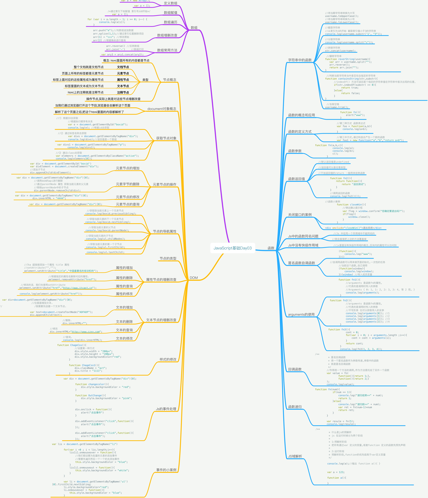

# JavaScript_Day01_函数的概念_函数定义_函数参数返回值_Js函数同名_匿名函数和自调函数_arguments_回调函数_节点概念_获取节点操作_元素节点操作_节点的导航属性_属性节点的操作_文本节点的操作

[TOC]




## DOM
* document object Model 文档对象,模型
* 用来操作html 页面上的内容
* 就是操作html里面的标签,属性,文本
* DOM 的核心就是操作html 里面的内容
* DOM是w3c指定的规范,各大浏览器厂商去实现,不同的浏览器实现

### 节点概念
* DOM html里面所有的内容都是节点
    * **文档节点** 整个文档就是文档节点
    * **元素节点** 页面上所有的标签都是元素节点 
    * **属性节点** 标签上面对应的这些属性成为属性节点
    * **文本节点** 标签里面的文本成为文本节点
    * **注释节点** html上的注释就是注释节点
* DOM操作 就是操作DOM中的节点
* 最常见的操作 元素节点 属性节点 文本节点 
* 操作节点,实际上就是对这些节点增删改查 

### document对象概念
* 当我们通过浏览器打开这个节目,浏览器会去解析这个页面
* 解析了这个页面之后,把这个html里面的内容都解析了
* 一个文档到document直接的映射关系
* document[对象] 这个对象代表当前html当前页面
* 操作document对象,就是操作html页面
* document中html里面都是节点
* 节点呈现树状节点

### document的操作
## 元素节点的查询操作


```html

<div id="boxid">111</div>
    <p class = "active"> 222 </p>
    <div class="active"> 333 </div>

    <script>

```

```js


        /**
         * 操作元素节点.元素节点的增删改查
         */

        /**
         * 查询.因为要操作,必须先得到
         * 查询具体的某个元素
         * document 提供了api
         * 有三中方式可以获取页面上的元素
         */
        //① 根据ID去获取
        //根据执行顺序有关系
        var e = document.getElementById("boxid");
        console.log(e); //根据id去获取

        //② 通过标签名称去获取
        var divs = document.getElementsByTagName("div");
        console.log(divs);//返回值是一个数组

        var divs1 = document.getElementsByTagName("p");
        console.log(divs1);

        //③ 通过class去获取
        var elemenrs = document.getElementsByClassName("active");
        console.log(elemenrs[0]);

    

```


### 元素节点的增加


```html

<style>
        #boxid {
            width: 200px;
            height: 200px;
            background-color: pink;
        }

        #boxid div{
            width: 100px;
            height: 100px;
            background-color: #c3ff76;
        }
    </style>
</head>
<body>
<input type="button" value="添加元素" onclick="add()">
    <div id="boxid">111</div>
    <p class = "active"> 222 </p>
    <div class="active"> 333 </div>
    

```

```js

        function add(){
            var div = document.getElementById('boxid')
            var divElement = document.createElement("div");
            //添加子节点
            div.appendChild(divElement);
        }

```

### 元素字节的删除

```js

/**
         * 删除
         */
        function deleteElement(){
             var div = document.getElementsByTagName("div")[0];
            //调用dom的api进行删除
            //通过parentNode 属性 获取当前元素的父元素
            //移除parentNode中的子节点
            div.parentNode.removeChild(div);
        }

```

### 元素节点的修改

```js

/**
         * 修改
         */
        function editElement(){
            var div = document.getElementsByTagName("div")[0];
            div.innerHTML = "4444";
        }

```

### 节点的导航属性

```js

function getElm(){
            var boxid = document.getElementById("boxid");
            var ul =  document.getElementsByTagName('ul')[0];
            //获取到当前元素上一个兄弟节点
            console.log(boxid.previousSibling);
            //获取当前元素的下一个兄弟节点
            console.log(boxid.nextSibling);
            //获取当前元素的父节点
            console.log(boxid.parentNode);
            //获取当前元素的子节点
            console.log(ul.childNodes);
            //获取当前元素的第一个子节点
            console.log(ul.firstChild);

            console.log(ul.lastChild);
        }

```

### 节点的类型

```js

//获取节点类型
        var els = document.getElementsByTagName('title')[0];
        console.log(els.nodeType());

```

## 属性节点增删改查


```html

<input type="button" value="增加属性" onclick="add()">
        <input type="button" value="删除属性" onclick="delAttr()">

        <input type="button" value="修改属性" onclick="updateAttr()">
        <input type="button" value="查询属性" onclick="queryAttr()">

        <script>

```

```js


            var aelement=document.getElementsByTagName("a")[0];
            function add(){
                //为a 超链接添加一个属性 title 属性
                //setAttribute("","");
                aelement.setAttribute("title","中国最著名的培训机构");
            }
            function delAttr(){
                //根据指定的属性名删除对应的属性.
                aelement.removeAttribute("href");
            }

            function updateAttr(){
                //修改的话，我们也使用setAttribute
                aelement.setAttribute("href","http://www.itcast.cn");
            }

            function queryAttr(){

                console.log(aelement.getAttribute("href"));

            }

```

## 文本节点的增删改查

```js

<script>
                function TextOperation(){
                     var div=document.getElementsByTagName("div")[0];
                      //往里面增加文本.
//                      /我需要先创建一个文本节点.

                     var text=document.createTextNode("ADFADF");
                     div.appendChild(text);

                     //删除.
                     div.innerHTML="";

                    //修改
                    div.innerHTML="http://www.czxy.com";

                    //查询.
                    console.log(div.innerHTML);


                }


        </script>

```

## 样式的修改


```html

<style>
        .act {
            width: 200px;
            height: 200px;
            background-color: pink;
        }
    </style>
</head>
<body>
    <div class="" title="111" ></div>
    <input type="button" value="修改样式" onclick="ChageCss()">
    <input type="button" value="修改样式1" onclick="ChageCss1()">


```

```js

 var div = document.getElementsByTagName("div")[0];
        function ChageCss(){

            //设置第一种方式
            div.style.width = "200px";
            div.style.height = "200px";
            div.style.backgroundColor="red";
        }

        function ChageCss1(){
            div.className = "act";
            div.title = "1111";
        }

```

## js 中的事件处理


```html

<div onmouseover="changecolor()" onmouseout="OutChange()">  </div>

```

```js
    
        /**
         * 用户的行为,人机交互,目前pc触发事件
         * 1.点击    onclick
         * 2.鼠标悬停 onmousever
         * 3.鼠标离开 onmouseout onmousemove
         * 4.捕获到焦点触发事件 onfocus
         * 5.滚动条滚动 onscroll
         * 6.onkeyup
         * 7.onkeydown
         * 这些事件都是以on 开头
         * 事件是绑定在某个载体上面的,或者事件源
         */

        var div = document.getElementsByTagName("div")[0];

        function changecolor(){
            div.style.backgroundColor = "red";
        }

        function OutChange(){
            div.style.backgroundColor = "pink";
        }


        div.onclick = function(){
            alert("点击事件")
        }

        div.addEventListener("click",function(){
            alert("点击事件");
        });

        div.addEventListener("click",function(){
            alert("点击事件");
        });

   

```

## 事件的小案例


```html

     <ul>
        <li>111</li>
        <li>111</li>
        <li>111</li>
        <li>111</li>
        <li>111</li>
        <li>111</li>
        <li>111</li>
        <li>111</li>
        <li>111</li>
        <li>111</li>
    </ul>
    
```

```js


var lis = document.getElementsByTagName("li")

        for(var i =0 ; i < lis.length;i++){
            lis[i].onmouseover = function(){
                //我们假设要为批量的元素的添加事件
                //需要先遍历然后一个一个的去添加事件
                this.style.backgroundColor = "blue";
            }
            lis[i].onmouseout = function(){
                this.style.backgroundColor = "white";
            }
        }

        var li = document.getElementsByTagName('ul')[0].firstChild.nextSibling;
        li.style.backgroundColor="red";
        li.onmouseover = function(){
            this.style.backgroundColor = "blue";
        }


```


