# JavaScript_Day06_AJAXpost请求_XML数据格式_JSON

[TOC]

## AJAX post请求
* 给服务器端的一个请求头 `Content-Type:application..`
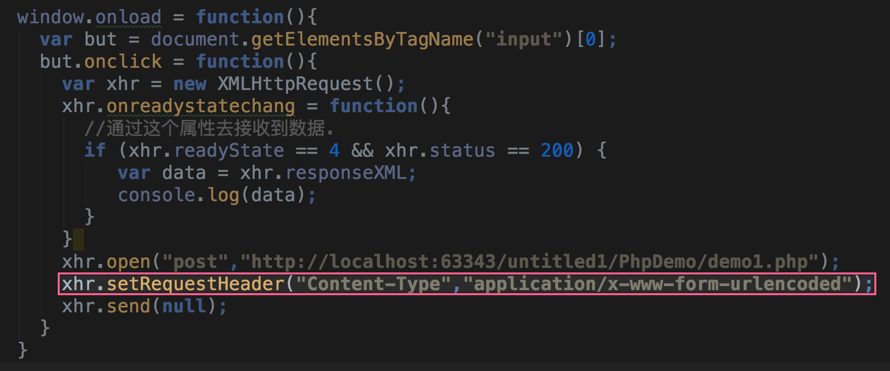


```js
  window.onload = function(){
      var but = document.getElementsByTagName("input")[0];
      but.onclick = function(){
        var xhr = new XMLHttpRequest();
        xhr.onreadystatechang = function(){
          //通过这个属性去接收到数据.
          if (xhr.readyState == 4 && xhr.status == 200) {
             var data = xhr.responseXML;
             console.log(data);
          }
        }
        xhr.open("post","http://localhost:63343/untitled1/PhpDemo/demo1.php");
        xhr.setRequestHeader("Content-Type","application/x-www-form-urlencoded");
        xhr.send(null);
      }
    }

```

## get提交和post方式的区别
1. get 提交没有请求体
2. get 请求参数在地址栏中
3. get 参数数据大小有限制
4. post 提交有请求体
5. post 发生数据大小没有限制
6. post提交有一个特殊的请求头 `Content-Type:application/x-www-form-urlcoded`
7. get 提交性能比post要高.get提交发生到服务器请求

## XML Extensible Markup languange 可扩展的标记语言
* **html超文本标记语言**
    * html 里面的标签固定的 w3c规定的
    
* **xml 可扩展标记语言**
    * 标记是自定义的,标记语法还是需要遵守html的标记语法
    * 标记有属性,可以嵌套,但是不能交叉嵌套
    
* **xml结构**
    * 文档声明,必须放在第一行 xml文档声明
    * `<?xml version "1.0" encoding="utf-8" ?>` 
    * 必须有且仅有一个根元素
    
* **html作用**:网页结构展示,浏览器解析
* **xml作用**: 一般用来做数据传输,或者软件配置文件

### 案例:客户端通过 AJAX 发送xml格式请求
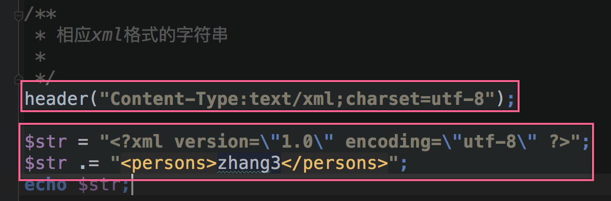

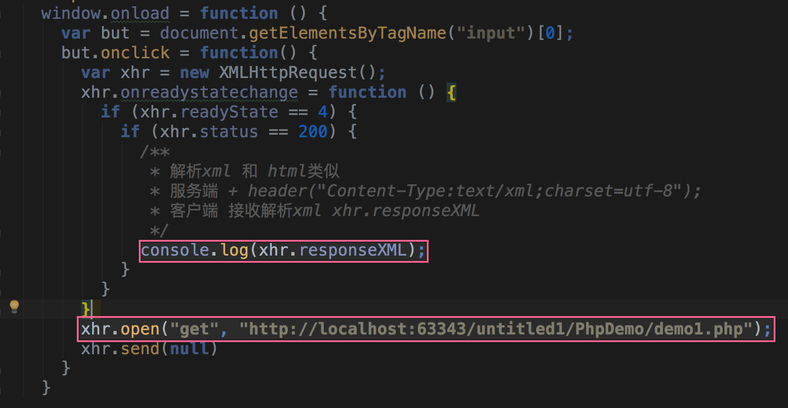


* 定义后台

```php
/**
 * 相应xml格式的字符串
 *
 */
header("Content-Type:text/xml;charset=utf-8");

$str = "<?xml version=\"1.0\" encoding=\"utf-8\" ?>";
$str .= "<persons>zhang3</persons>";
echo $str;

```

* 前端代码


```js

    window.onload = function () {
      var but = document.getElementsByTagName("input")[0];
      but.onclick = function() {
        var xhr = new XMLHttpRequest();
        xhr.onreadystatechange = function () {
          if (xhr.readyState == 4) {
            if (xhr.status == 200) {
              /**
               * 解析xml 和 html类似
               * 服务端 + header("Content-Type:text/xml;charset=utf-8");
               * 客户端 接收解析xml xhr.responseXML
               */
              console.log(xhr.responseXML);
            }
          }
        }
        xhr.open("get", "http://localhost:63343/untitled1/PhpDemo/demo1.php");
        xhr.send(null)
      }
    }

```

### 案例:利用解析XML属性显示在页面上
* 服务端代码
* 创建xml数据


* 编写php返回代码

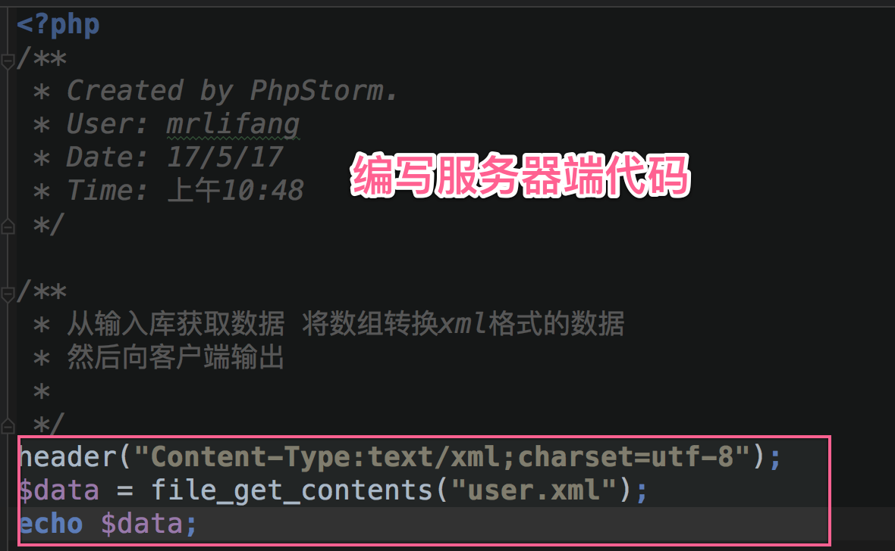

* 定义界面样式 和结构

```html

<table>
  <tr>
    <td>姓名</td>
    <td>描述</td>
    <td>性别</td>
    <td>照片</td>
    <td>操作</td>
  </tr>
</table>

```


```css

    table {
      width: 600px;
      border-collapse: collapse;
    }
    td {
      height: 40px;
      text-align: center;
      border: 1px solid #CCC;
    }

```

* 通过AJAX 获取数据

```js

window.onload = function () {

      var but = document.getElementsByTagName("input")[0];
      but.onclick = function() {
        var xhr = new XMLHttpRequest();
        xhr.onreadystatechange = function () {
          if (xhr.readyState == 4) {
            if (xhr.status == 200) {
              var data = xhr.responseXML;
              /**
               * 解析xml 和 html类似
               * 服务端 + header("Content-Type:text/xml;charset=utf-8");
               * 客户端 接收解析xml xhr.responseXML
               */
               
              }             
          }
        }
        xhr.open("get", "http://localhost:63343/untitled1/PhpDemo/user.php");
        xhr.send(null)
      }
    }

```


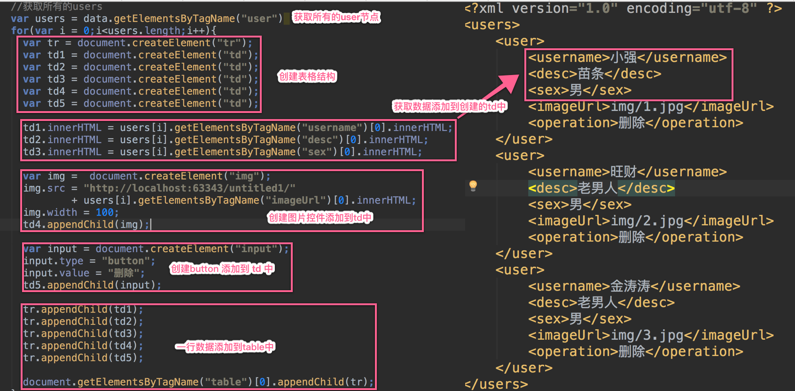


* 完整代码


```js

<!DOCTYPE html>
<html lang="en">
<head>
  <meta charset="UTF-8">
  <title>Title</title>
  <style>
    table {
      width: 600px;
      border-collapse: collapse;
    }
    td {
      height: 40px;
      text-align: center;
      border: 1px solid #CCC;
    }
  </style>
  <script>
    window.onload = function () {

      var but = document.getElementsByTagName("input")[0];
      but.onclick = function() {
        var xhr = new XMLHttpRequest();
        xhr.onreadystatechange = function () {
          if (xhr.readyState == 4) {
            if (xhr.status == 200) {
              var data = xhr.responseXML;
              /**
               * 解析xml 和 html类似
               * 服务端 + header("Content-Type:text/xml;charset=utf-8");
               * 客户端 接收解析xml xhr.responseXML
               */

              //获取所有的users
              var users = data.getElementsByTagName("user")
              for(var i = 0;i<users.length;i++){
                var tr = document.createElement("tr");
                var td1 = document.createElement("td");
                var td2 = document.createElement("td");
                var td3 = document.createElement("td");
                var td4 = document.createElement("td");
                var td5 = document.createElement("td");

                td1.innerHTML = users[i].getElementsByTagName("username")[0].innerHTML;
                td2.innerHTML = users[i].getElementsByTagName("desc")[0].innerHTML;
                td3.innerHTML = users[i].getElementsByTagName("sex")[0].innerHTML;

                var img =  document.createElement("img");
                img.src = "http://localhost:63343/untitled1/"
                        + users[i].getElementsByTagName("imageUrl")[0].innerHTML;
                img.width = 100;
                td4.appendChild(img);

                var input = document.createElement("input");
                input.type = "button";
                input.value = "删除";
                td5.appendChild(input);

                tr.appendChild(td1);
                tr.appendChild(td2);
                tr.appendChild(td3);
                tr.appendChild(td4);
                tr.appendChild(td5);

                document.getElementsByTagName("table")[0].appendChild(tr);
              }
            }
          }
        }
        xhr.open("get", "http://localhost:63343/untitled1/PhpDemo/user.php");
        xhr.send(null)
      }
    }


  </script>
</head>
<body>
<input type="button" value="查询用户" >

<table>
  <tr>
    <td>姓名</td>
    <td>描述</td>
    <td>性别</td>
    <td>照片</td>
    <td>操作</td>
  </tr>
</table>

</body>
</html>

```

* 页面效果
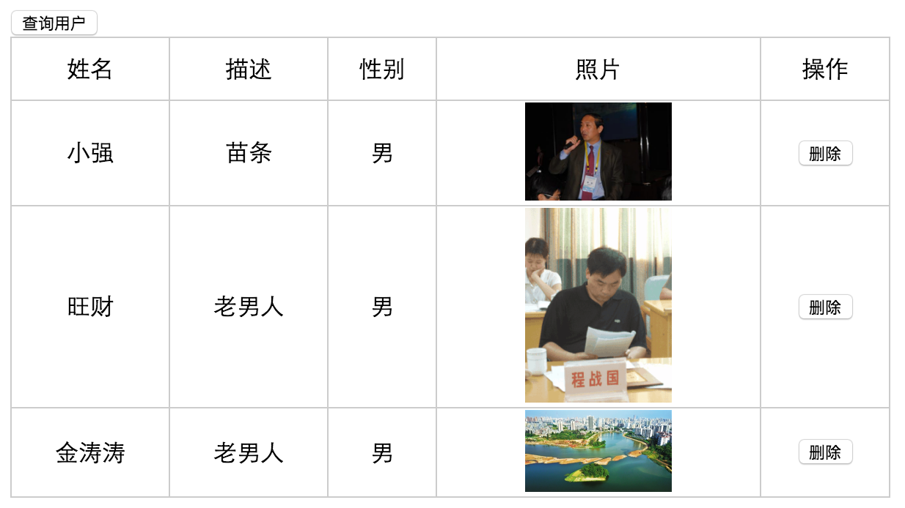


## JSON
## JSON的解析的两种方式
### JSON.parse() 解析JSON
* 使用JSON.parse解析对json的要求

#### ① 不允许在末尾添加多余的逗号

```js

JSON.parse('[1, 2, 3, 4, ]');
JSON.parse('{"foo" : 1, }');
// SyntaxError JSON.parse: unexpected character 
// at line 1 column 14 of the JSON data

```

* 正确写法

```js
JSON.parse('[1, 2, 3, 4 ]');
JSON.parse('{"foo" : 1 }');
```

#### ② JSON 的属性名必须使用双引号

```js

JSON.parse("{'foo' : 1 }");
// SyntaxError: JSON.parse: expected property name or '}' 
// at line 1 column 2 of the JSON data

```

* 正确写法

```js

JSON.parse('{"foo" : 1 }');

```


#### ③ 前导 0 和小数点 数字不能用 0 开头，
* 比如01，并且你的小数点后面必须跟着至少一个数字。

```js

JSON.parse('{"foo" : 01 }');
// SyntaxError: JSON.parse: expected ',' or '}' after property value 
// in object at line 1 column 2 of the JSON data

JSON.parse('{"foo" : 1. }'); 
// SyntaxError: JSON.parse: unterminated fractional number 
// at line 1 column 2 of the JSON data

```

* 正确写法

```js

JSON.parse('{"foo" : 1 }');
JSON.parse('{"foo" : 1.0 }');

```

## 使用 eval() 解析JSON

```js

var obj = eval("("+str+")");

```

### JSON结构
* 它是以 key value组成
* 假设使用 json 表示一条记录 或者多条记录
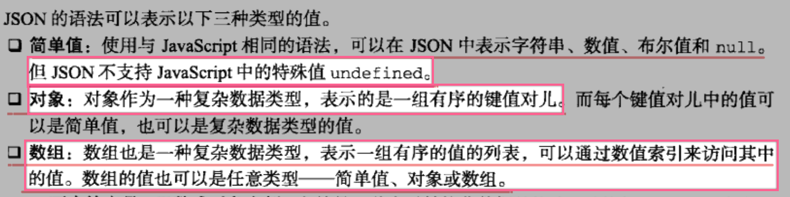

* 对象定义 `{"username" : "zhangs"}`
* 数组定义 `["user1":{"username" : "张三"} , "user2" : {"username" : "李四"}]`

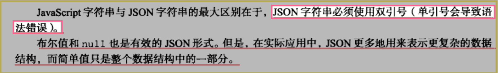

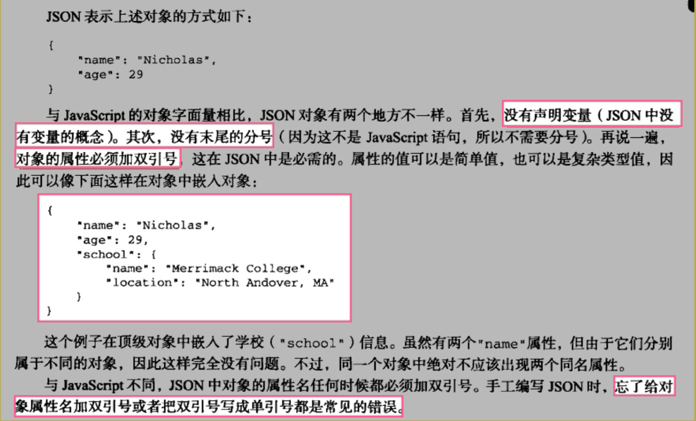

## JSON在JS中的解析和生成


### JS中生成JSON
* `JSON.stringify()`把一个JavaScript 对象序列化为一个JSON字符串 
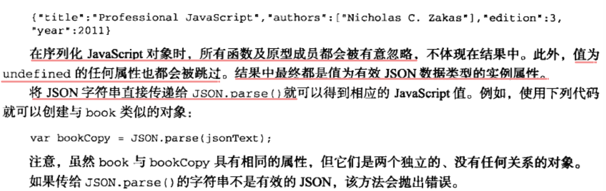

#### 过滤结果
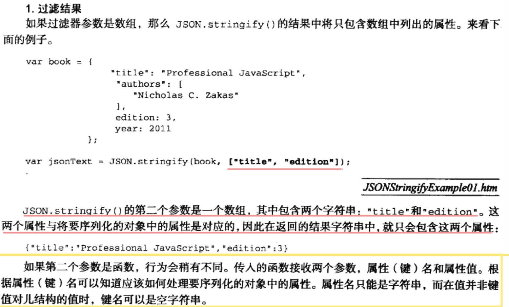

#### 字符串缩进
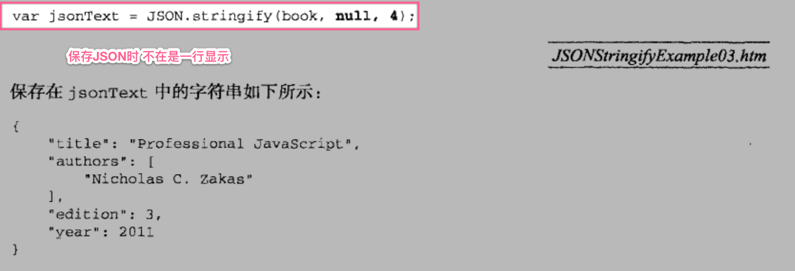


#### 案例:书籍列表
* 创建JSON数据

```JSON

[
  {
    "bookName": "JAVA从入门到治疗颈椎病(上)",
    "bookPrice": 100,
    "author": "金老师",
    "cbs": "朝鲜人民出版社"
  },
  {
    "bookName": "JAVA从入门到治疗颈椎病(中)",
    "bookPrice": 100,
    "author": "金老师",
    "cbs": "朝鲜人民出版社"
  },
  {
    "bookName": "JAVA从入门到治疗颈椎病(下)",
    "bookPrice": 100,
    "author": "金老师",
    "cbs": "朝鲜人民出版社"
  }
]

```

* 编写服务器端代码


```php

header("Content-Type:text/json;charset=utf-8");
$data = file_get_contents("book.json");
echo $data;

```

* 

#### 案例:省市区三级联动

```html

    <select name="" id="provinceId">
      <option value="">请选择省份</option>
    </select>
    <select name="" id="cityId">
      <option value="">请选择城市</option>
    </select>
    <select name="" id="areaId">
      <option value="">请选择区域</option>
    </select>
    
```


```JSON

[
  {
    "provinceId":1,
    "provinceName":"河北省",
    "cities" :
    [
      {
        "citieId":2,
        "cityName":"石家庄市",
        "areas" :
        [
          {
            "areaId":3,
            "areaName":"石家庄区"
          },
          {
            "areaId":4,
            "areaName":"裕华区"
          }

        ]
      },
      {
        "citieId":5,
        "cityName":"保定市",
        "areas" :
        [
          {
            "areaId":6,
            "areaName":"保区"
          },
          {
            "areaId":7,
            "areaName":"定区"
          }

        ]
      }
    ]
  },
  {
    "provinceId":8,
    "provinceName":"河南省",
    "cities" :
    [
      {
        "citieId":9,
        "cityName":"郑州市",
        "areas" :
        [
          {
            "areaId":10,
            "areaName":"郑区"
          },
          {
            "areaId":11,
            "areaName":"州区"
          }

        ]
      },
      {
        "citieId":12,
        "cityName":"XX市",
        "areas" :
        [
          {
            "areaId":13,
            "areaName":"X区"
          },
          {
            "areaId":14,
            "areaName":"X区"
          }

        ]
      }
    ]
  }
]

```


```js

window.onload = function(){
    /**
     * 1.1 通过ajax 请求 获取省份的数据
     * 1.2 解析省份的数据
     * 1.3 将省份的数据组装成option
     * 1.4 放在 provinceId select 里面
     */
      var obj;
      var cities;

      var xhr = new XMLHttpRequest();
      xhr.onreadystatechange = function(){
          if (xhr.readyState == 4 && xhr.status == 200) {
                var data = xhr.responseText;
                obj = JSON.parse(data);
                console.log(obj);
              for(var i = 0;i< obj.length ; i++){
                    var option = document.createElement("option");
                    option.innerHTML = obj[i].provinceName;
                    document.getElementById("provinceId").appendChild(option);
                }
          }
      }
      xhr.open("get","http://localhost:63343/untitled1/PhpDemo/province.php");
      xhr.send(null)

      /**
       * 当选省份改变时
       */
      document.getElementById("provinceId").onchange = function(){
          var provinceName  =  document.getElementById("provinceId").value;
            for(var i = 0; i < obj.length; i++){
                if (obj[i].provinceName == provinceName) {

                    cities=obj[i].cities;
                    document.getElementById("cityId").innerHTML='<option value="">请选择城市</option>';

                    for(var j=0;j<cities.length;j++){
                        var option = document.createElement("option");
                        option.innerHTML = cities[j].cityName;
                        document.getElementById("cityId").appendChild(option);
                    }
                }
            }
      }

      /**
       * 当选城市改变时
       */
      document.getElementById("cityId").onchange = function () {
          var cityName = document.getElementById("cityId").value;
          for(var i = 0;i < cities.length;i++){
              if (cities[i].cityName == cityName) {
                  var areas = cities[i].areas;
                  document.getElementById("areaId").innerHTML='<option value="">请选择区域</option>';
                  for(var j=0;j<areas.length;j++){
                    var option = document.createElement("option");
                      option.innerHTML = areas[j].areaName;
                      document.getElementById("areaId").appendChild(option);
                  }
              }
          }
      }

  }

```

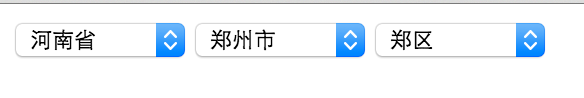


#### 案例:封装ajax


```js

var $={
      ajax:function(obj){
        var xhr=new XMLHttpRequest();
        if(obj.method=="get"){
          //参数在地址的后面,send(null)
          obj.url=obj.url+"?"+obj.data;
          obj.data=null;
        }
        xhr.open(obj.method,obj.url);
        if(obj.method=="post"){
          xhr.setRequestHeader("Content-Type","application/x-www-form-urlencoded");
        }
        xhr.send(obj.data);
        xhr.onreadystatechange=function(){
          if(xhr.readyState==4 && xhr.status==200){
            //得到数据.
            var data=xhr.responseText;
            obj.success(data);
          }
        }
      }
    }

```

* 使用封装对象


```js

 $.ajax({
      url:"http://localhost:63343/untitled1/PhpDemo/json.php",
      method:"get",
      data:"username=lisi",
      success:function(data){
        //解析使用数据
        console.log(data);

      }
    })

```

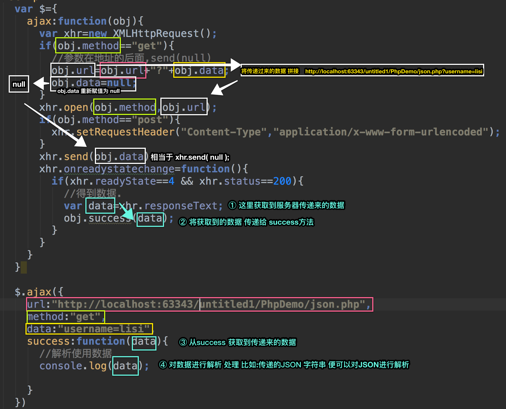


