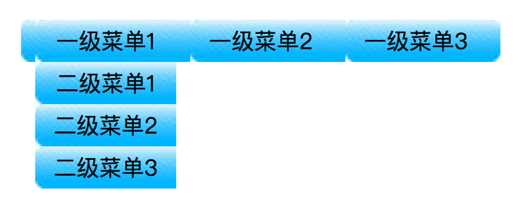

# jQuery_Day01_jQuery的使用_选择器_菜单选择_突出展示_好友列表_天猫搜索框_淘宝广告栏_JQuery样式操作

[TOC]

## jQuery 
* 原生的JS 有弊端 api功能有限,往往要完成简单的功能,需要编写复杂的代码
* 还要处理兼容性问题,我们在一个元素上面绑定相同的事件,还会覆盖就会出现一个新的框架jQuery 在pc端是最广的一个js框架
* jQuery 是一个框架,或者一个js库
* **jQuery的作用** 用于简化开发,让JS开发更容易
    * 1:操作 dom
    * 2:ajax 操作
    * 3:事件处理操作
    * 4:获取dom 元素  
    * 5:兼容处理
    * 6:执行动画
    * 7:api操作
    
* jQuery 解决了上述问题的复杂程度 

-------

## 案例:


>TODO对比图

* 使用JS原生的弊端 
    * 1:`window.onload` 入口函数只能写一次,会覆盖
    * 2:编写简单功能,我们需要写复杂的代码
    * 3:我们需要写兼容代码
    * 4:代码容错率低
      
    
* jQuery 的优势
    * 1: 入口函数可以写多个
    * 2:编写复杂功能,只需要简单逻辑
    * 3:不需要考虑兼容性问题
    * 4:代码容错率高
 
-------
     
## jQuery 的理解
* jQuery 封装了JS中常用的功能 能够提高开发效率
* JS库就是常用的代码放发哦一个单独的文件中,用的时候就引入来
* 框架:是为了解决一类问题而开发的产品 是代码集合成的一个产品

-------

## jQuery 学什么
* jQuery 封装好了一些功能方法,这些方法叫API(应用程序编程接口)
* 在使用时,都是方法调用,要加`()`,里面是相应的参数,参数不同,功能不同

-------

## jQuery 使用[*]
* 1:引包
* 2:写入口函数
* 3:实现功能 (事件处理)

-------

### 版本介绍
* 常用两个版本
* `1.12` 或者 `3.2*`
* `-min`代表迷你版

-------


### 1:引包


-------

### 2:写入口函数 3:实现功能 (事件处理)


-------

### ① 关于入口函数的解释


-------

### 入口函数的写法


> 与原生入口的区别

* `window.onload `需要等待页面上所有的元素加载完毕执行,包括图片和其他资源

-------

### ② $符号的解释
* `$`符号是一个变量 `$`对应的类型 它可以是函数也可以是对象
* `$` 实际上也符号 JS 的命名规范
* jQuery 仅有这样的一个对象,所有的属性和方法 都在这个对象的作用域里


* 函数里传入不同的参数,可以调用jQuery不同功能
* jQuery 对象有两个名字`jQuery === $`


-------

## jQuery对象 和 dom对象

* `$` `jQuery`帮助我们封装好的对象,里面提供了一些api

* document 对象是w3c给我们定义的标准 代表的是当前整个html文档
* ==注意:我们使用,可以在页面中同时使用document对象和jQuery对象==

* ==注意:jQuery对象不能调用document对象下的api==
* 注意: dom对象也不能调用jQuery对象下的api

-------

### jQuery转换dom对象
`var $obj = $("#div");`

* 返回的`$obj` jQuery对象是一个数字,这个数值里面存储着dom对象

* 第一种转换方式 根据角标获取值 


* 第二种转换方式 根据get方法获取dom对象


-------

### dom对象 转换成 jQuery对象


-------

### 案例:隔行变色

-------

## jQuery 的dom操作 选择器
* 原生js的dom操作


* jQuery 通过封装上面的这些原生js,
* jQuery 选择器 获取页面上的元素的
* 1:基本选择器
* 2:层级选择器
* 3:过滤选择器
* 4:属性选择器


-------

### ① 基本选择器
#### ① id选择器
* 根据id 去获取页面上的元素
* 前面必须是`#`开头
* `$("#biox1")`
* 返回的是一个jQuery 对象

-------

#### ② 类选择器
* 根据class 类名去获取页面上的元素 必须以`.`开头
* `$(".item")` 
* 返回是一个 dom 数组

-------

#### ③ 标签选择器
* 根据标签 去选中页面上的元素
* 直接根据标签去获取
* `$("li")`

-------

#### ④ 组合选择器
* 多个条件 以`,`号隔开
* `$("#id",div,p)`

#### ⑤ 并集选择器
* 比如:我想获取到 class的值等于item 的li元素
* `$("li.item")`

-------

#### ⑥ * 号选择器
* 获取页面上所有的元素
* `$("*")`

-------

### ② 层级选择器


-------

* **直接获取子元素 包括孙子元素**
* 根据元素的层级获取页面上的元素
* 获取item下的li元素
* 添加的是空格,获取的 `#item` 所有的li元素 包括孙子元素
* `$("#item li")`

-------

* **获取子元素 排除孙子元素**
* 加了`>` 是获取直接子元素 不包含孙子元素
* `$("#item>li")` 


-------

* **获取子元素下的子元素**
* `$("#item>li>ul>li")`

-------

### ③ 过滤选择器
* **找到一堆元素 然后根据条件进行筛选元素**
* 使用`:`后面跟筛选条件
* `$("li:first")`  获取第一个li元素
* `$("li:last")` 获取最后一个li元素
* `$("li:even")` 获取到索引值为偶数的li元素


* `$("li":odd)` 获取索引是奇数的li元素
* `$("li":eq(3))` 获取索引值是3的 

-------

### ④ 属性选择器
* 属性选择器是用`[]`包起来的
* `$("[type]")` 获取页面上所有有type 属性的元素
* `$("[type=text]")`获取type 属性等于text的元素
* `$("div[class=box]")`获取div 的 class属性是box的元素

-------

### 选择器的原理简介


### 选择器里的常见方法

-------

* **find()**  查找指定元素所有的后代元素
* 查找当前元素下的子元素`$(“#item").find(“#pink")` `$(“#item").find(“ul")` 

-------

* **children()** 获取到当前元素下的子元素
* 可以获取到当前元素下的子元素,可以children 添加指定的子元素 `$(“#item”).childern()`

-------

* **next()** 获取到当前元素的下一个兄弟元素
* `$(“#pink”).next();` 下一个元素节点 

-------

* **prev()** 获取的是上一个兄弟元素

-------

* **parent()** 获取当前元素的父元素

-------

* **parents()** 获取当前元素的所有的父元素
* `$(“#pink”).parents()` 包括父元素的父元素

-------

* **siblings()** 获取元素所有的兄弟元素,不包含自己
* `$(“#pink”).siblings()` 原生的js siblings是包含自己的
* `$(“#pink”).siblings(“p")`如果加了参数获取的就是指定的兄弟节点

-------

* **eq()** 获取指定的元素
* `$(“li”).eq(0)`  获取到当前元素角标等于0的

-------


## 案例: 
### 菜单选择




### 突出展示案例


### 好友列表案例


### 天猫搜索框


## 淘宝广告栏


-------

## jQuery样式操作
* **css()**  
* 返回指定的 CSS 属性的值

```js
$("p").css("background-color");
```

* 设置指定的 CSS 属性

```js

$("p").css("background-color","yellow");

```

* **addClass()**
* 向被选元素添加一个或多个类

```js
 $("h1,h2,p").addClass("blue");
 $("#div1").addClass("important blue");

```

* **removeClass()**
* 在不同的元素中删除指定的 class 属性


```js

 $("h1,h2,p").removeClass("blue");

```

* **toggleClass()** 
* 该方法对被选元素进行添加/删除类的切换操作：

```js

$("h1,h2,p").toggleClass("blue");

```

* **hasClass()**
* hasClass() 方法检查被选元素是否包含指定的类名称。
* 如果被选元素包含指定的类，该方法返回 "true".


```js

alert($("p").hasClass("intro"));

```


-------


