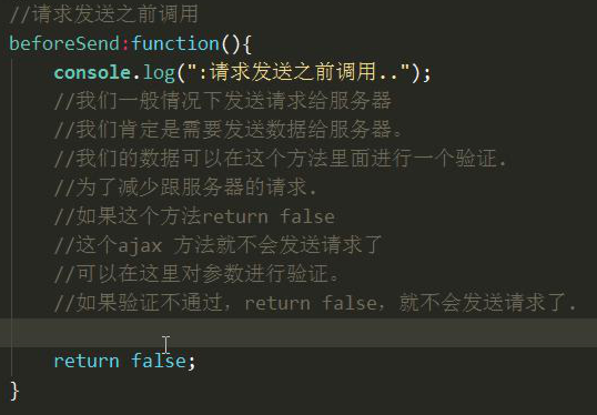
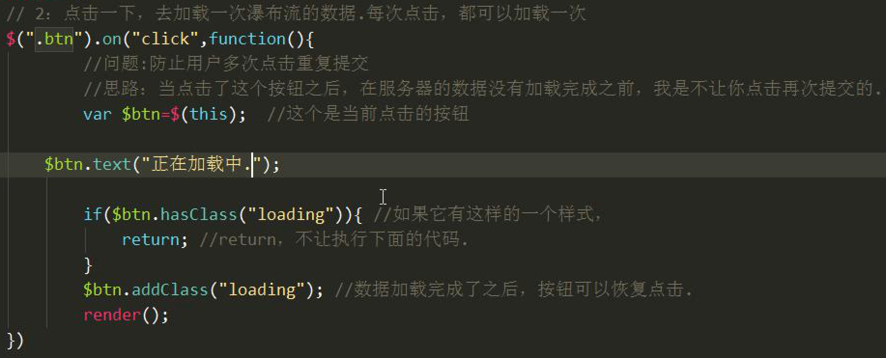

# jQuery_Day4_Ajax_模板使用_瀑布流分页加载_跨域解决

[TOC]

## jQuery 当中 ajax的使用 
* jQuery 针对原生的ajax进行了封装,封装是XMLHttpRequest对象
* 就是调用jQuery 里面的方法帮助我们去发生请求
* 发送请求的六个方法 `ajax() get() post() load() getScript() getJSON()`

-------
### Ajax请求最基本的格式
* 使用ajax方法 全局方法 
* **ajax()** 方法 传入一个obj
    * **type** 设置提交的请求方法
    * **data对象** 设置请求参数 
        * 请求格式:`username=zhangs`   
    * **url** 服务器地址
    * **success(data)** 回调方法 请求成功后的回调方法  


-------

* **timeout** 设置超时时间  值为毫秒值


* **error()回调方法** 请求失败的时候调用


* **complete回调方法** 请求完成的时候调用


* **beforeSend回调方法** 请求发生之前调用



-------

## 封装原生ajax请求
* 按照jQuery_ajax请求方式 封装ajax 
* 原理角度剖析 回调函数,需要什么时候被调用
* 第一步实现最基本的功能,能够发送请求 能够接受数据
* 兼容get 方式提交 已经 post方式提交
* 把请求参数包装在一个对象中
* 各个的其他的属性在方法里面封装 
* 代码提炼到一个js 文件中


```js

 /**
         * 创建对象 $
         * */
        var $ ={
            /**
             * 将参数对象拼接为为字符串
             * */
            params:function(obj){
                var str="";
                //把对象转换成字符串
                for(var key in obj){
                    str+=key+"="+obj[key]+"&"
                }
                //最后会剩余一个& 符号
                str=str.substr(0,str.length-1);
                return str;
            },

            /**
             * 创建ajax 方法
             */
            ajax:function(obj){
                var xhr = new XMLHttpRequest();

                //当发送请求前 调用 beforeSend() 方法
                //如果该方法返回 fales 不执行请求代码
                var flag = obj.beforeSend();
                if (flag == false) {
                    return;
                }

                //对数据的类型进行处理.
                if(typeof obj.data!="string"){
                    var str=this.params(obj.data);
                    obj.data=str;
                }

                //如果请求类型get
                if (obj.type.toLowerCase() == "get") {
                    obj.url = obj.url + "?" + obj.data;
                    obj.data = null;
                }
                //如果请求类型为post
                if (obj.type.toLowerCase() == "post") {
                    xhr.setRequestHeader("Content-Type",
                            "application/x-www-form-urlencoded");
                }


                xhr.onreadystatechange = function(){
                    if (xhr.readyState == 4 ) {
                        if(xhr.status == 200) {
                            //当数据返回成功 调用success方法 将数据返回

                            obj.success(xhr.responseText)
                        }else{
                            //当数据加载失败 调用error方法
                            obj.error();
                        }

                        //请求完成的时候调用
                        ;obj.complete();
                    }
                }

                xhr.open(obj.type,obj.url);
                xhr.send(obj.data);
            }
        }

```

```js

        $.ajax({
            url:"http://localhost:63343/untitled1/PhpDemo/province.php",
            type:"get",
            success:function(data){
                console.log("请求成功调用");
                //console.log(data);
            },
            beforeSend:function(){
                console.log("请求执行前调用");
                return true;
            },
            complete:function(){
                console.log("请求完成调用");
            }
        })

```


-------

## 模板使用
### 概念
* Ajax 发生请求给服务器 -> 服务器响应数据 -> 响应数据之后 -> 我们接受数据 -> 接受数据后 -> 解析数据 -> 然后把数据跟标签进行组装 -> 然后放在页面上
* 解析数据 将数据跟标签组装的时候非常繁琐
* 现在我们使用模板技术解析数据,将数据跟标签进行组装,然后放在页面上
* **模板作用**:**解析数据,把数据跟标签组装到一起**


-------

### ArtTemplate 使用方式

* 编写一个客户端,服务端进行交互,服务器返回json 格式互相,然后使用模板解析数据,进行标签组装
* 1: 引入模板文件
* 2:创建模板,模板里面的内容跟写到页面上的元素有关系
* 3:将模板跟数据进行绑定
    * 1: 模板 id
    * 2: 传进的数据数据必须是一个对象
    * template("templateId",data)
* 4:在模板里面去解析数据
    * `<%%>`逻辑 `<%= %>`向模板中输出
    
* 5:返回一个html元素 将这个内容直接写入到页面上   

### 准备 
* **① 后台准备**

```php

<?php

	header('Content-Type:text/json; charset=utf-8');
	/*
		1.请求方式  get
		2.请求url  data.php
		3.请求传递的参数   page  当前页数  pageSize  每一页多少条数据
		4.是后台在处理
		5.返回数据 {page:'下一页的页码',items:[{path:'图片路径',text:'文字'},{},{}...]}
	*/

	/*获取数据  字符串*/
	$data = file_get_contents('data.json');
	/*转化php对象？ 需要对其操作*/
	//php
	  //json_encode 将数组转换成  json 格式的字符串。
	 //json_decode  将字符串转换成 array
	$data = json_decode($data);
	/*页码*/
	$page = $_GET['page'];
	/*条数*/
	$pageSize = $_GET['pageSize'];
	/*获取数据的起始索引*/
	$offset = ($page - 1) * $pageSize;
	/*slice 从什么位子开始切割 切割多少条*/
	$result = array_slice($data, $offset, $pageSize);
	/*下一也的页码*/
	$page++;
	echo json_encode(array('page'=>$page, 'items'=>$result));/*｛items:[]｝*/
	sleep(1);
?>

```


```json

[
  {
    "path": "images/1.jpg",
    "text": "一支素笔，一杯花茶，一段时光，浅笑又安然一场盛世的繁华，愿不倾城，不倾国，只倾我所有。只为过简单安稳的生活，单纯不平凡。一支素笔，一杯花茶，一段时光，浅笑又安然。早安！"
  },
  {
    "path": "images/2.jpg",
    "text": "青春，青春，一场盛世不平凡。一支素笔，一杯花茶，一段时光，浅笑又安然一场盛世的繁华，愿不倾城，不倾国，只倾我所有。只为过简单安稳的生活，单纯不平凡。一支素笔，一杯花茶，一段时光，浅笑又安然。早安！"
  }
]

```


* **② 样式 和 waterFall引入**

```css

        .container {
            width: 1200px;
            margin: 0 auto;
            padding-top: 40px;
        }

        .items {
            position: relative;
        }

        .item {
            position: absolute;
            left: 0;
            top: 0;
            width: 232px;
            /*控制阴影.*/
            /*css3 样式控制的阴影.*/
            box-shadow: 0px 0px 10px rgba(0, 0, 0, 0.3);
        }

        .item > img {
            width: 100%;
            display: block;
        }

        /*这个是css3 里面的一个选择器，暂时我们不多做了解.
        */
        .item:nth-child(4n) img {
            display: block;
            height: 289px;
        }

        /*按钮的样式.*/
        .container > .btn {
            width: 280px;
            height: 40px;
            margin: 30px auto;
            text-align: center;
            line-height: 40px;
            background-color: #CCC;
            border-radius: 6px;
            font-size: 24px;
            cursor: pointer;
        }

        .container > .loading {
            background-color: transparent;
        }

```

```js

$.fn.waterFall = function(){
    //1:获取到指定的一些元素，然后计算出来space
    //2:控制所有的item 的位置,获取到所有的item，进行一个遍历,each 方法就可以进行遍历.
    //一个一个的去赋值。因为它的定位有规则，所以是可以去赋值.
    //每一列的width  以及的间距 space  space=总宽度-所有的列的item 的width /column-1;

    var $items = this;                                  //获取到items
    var parentWidth = $items.width();                   //获取到父元素的宽度
    var $itemsChildren = $items.children(".item");      //获取所有item
    var width = $items.children(".item").width();       //获取到所有的子元素item获取到item 的宽度
    var column = 5;                                     //固定有多少列 column
    var space= 10;    //计算出来间距 (parentWidth-column*width)/(column-1)


    //2:定位每一个item
    //2.1 遍历所有的item,对每一个item 进行遍历.
    colArray = [];
    $itemsChildren.each(function(index,dom){
        var $dom = $(dom); //把dom 包装成jQuery
        if(index<column) {
            $dom.css({
                top: 0,
                left: index*(width + space)
            });
            colArray[index]=$dom.height();
        }else{
            var minIndex = 0;
            var minHeight = colArray[0];
            for(var i = 0;i<colArray.length;i++){
                if(colArray[i] < minHeight){
                    minHeight = colArray[i];
                    minIndex = i;
                }
            }
            $dom.css({
                left:minIndex*(width + space),
                top:minHeight + space
            })

            //更新最矮的那一列的高度
            colArray[minIndex]=minHeight+space+$dom.height();
        }

    });

    var maxIndex = 0;
    var maxHeight = colArray[maxIndex];
    for(var i = 0;i< colArray.length;i++){
        if(colArray[i]>maxHeight){
            maxHeight = colArray[i];
        }
    }
    $(".items").css("height",maxHeight+100+"px");
}

```

* **使用步骤**
* 1:引入模板文件
* 2:创建模板
* 3:准备模板你内容
* 4:将数据跟模板进行绑定 返回要放在页面上的内容 
* 5:将返回的数据放置在页面上 模板里面提供了语法,进行数据解析 <%%> <%=%> 输出
* 6:调用模板返回一个html内容 将这个内容追加在页面上面即可

* **查询用户信息**


```js


<!DOCTYPE html>
<html lang="en">
<head>
    <meta charset="UTF-8">
    <title>Title</title>

    <!-- 引入模板文件 -->
    <script src="jQuery/jquery-3.2.1.js"></script>
    <script src="js/template-native.js"></script>

    <script type="text/template" id="templateId">
        <%for(var i = 0;i < rows.length ; i++ ){ %>
            <tr>
                <td><%=rows[i].username%></td>
                <td><%=rows[i].age%></td>
                <td>"></td>
                <td><input type="button" value="<%=rows[i].operation%>"></td>
            </tr>
        <%}%>
    </script>

    <script>
        $(function(){
            $("input").click(function(){
                $.ajax({
                    url:"http://localhost:63343/untitled1/PhpDemo/template.php",
                    type:"get",
                    success:function(data){
                        var obj = {
                            rows:data
                        }
                        console.log(data);
                        var html = template("templateId",obj);
                        $("table").append(html);
                    }
                })
            });

        });

    </script>
</head>
<body>
    <input type="button" value="获取数据">
    <table>
        <tr>
            <td>姓名</td>
            <td>年龄</td>
            <td>照片</td>
            <td>操作</td>
        </tr>
    </table>
</body>
</html>

```

* **查询天气预报**


-------

## 瀑布流分页加载的实现


* **实现:1** 页面加载完毕,获取第一屏瀑布流数据
    * 发生请求到服务器,获取第一屏的数据
    * 获取数据之后解析数据,解析数据渲染到页面[模板技术] 
* **实现:2** 点击一下,去加载一次瀑布流数据,每次点击都可以加载一次
* **实现:3** 滚动的时候,滚动距离到达某个位置的时候,也可以完成一个加载

-------

### 页面加载完毕,获取第一屏瀑布流数据

* (1) 页面加载完毕,获取第一屏瀑布流数据
    * 向服务器端传入 page pageSize get方式请求  


   
-------
 
* (2) 使用模板解析返回的json数据将

* **1:引入模板** 
    


* **2:创建模板**
    


    
* **3:准备模板内容**


* **4:在模板里面解析数据**
* **5:将模板跟数据进行绑定**


* **6:返回一个html文本,将html文本写入页面** 


* **实现瀑布流布局**


```js

            $.ajax({
                url:"http://localhost:63343/untitled1/PhpDemo/data.php",
                type:"get",
                data: {
                    page: 1,
                    pageSize: 10
                },
                success:function(data){
                    var html = template("wateFallId",data);
                    console.log(html);
                    $(".items").append(html);
                    $(".items").waterFall();
                }
            })

```


```html

    <script src="js/jquery-1.12.4.js"></script>
    <script src="js/jquery-waterFall.js"></script>
    <script src="js/template-native.js"></script>
    <script type="text/template" id="wateFallId">
        <%for(var i= 0; i<items.length ;i++){ %>
        <div class="item">
            " alt="" width="" height="300">
            <p>
                <%=items[i].text%>
            </p>
        </div>
        <%}%>
    </script>


```
-------

### 实现点击加载
* **实现:2** 点击一下,去加载一次瀑布流数据,每次点击都可以加载一次

* **(1)实现按钮显示**


```html

<body>
<!--页面布局-->
<div class="container">
    <div class="items">
    </div>
    <div class="btn">点击加载</div>
</div>
</body>

```


```css


        /*按钮的样式.*/
        .container > .btn {
            width: 280px;
            height: 40px;
            margin: 30px auto;
            text-align: center;
            line-height: 40px;
            background-color: #CCC;
            border-radius: 6px;
            font-size: 24px;
            cursor: pointer;
        }
        .container > .loading {
            background-color: transparent;
        }

```


```js

  /**
 * Created by mrlifang on 17/5/23.
 */
$.fn.waterFall = function(){
    //1:获取到指定的一些元素，然后计算出来space
    //2:控制所有的item 的位置,获取到所有的item，进行一个遍历,each 方法就可以进行遍历.
    //一个一个的去赋值。因为它的定位有规则，所以是可以去赋值.
    //每一列的width  以及的间距 space  space=总宽度-所有的列的item 的width /column-1;

    var $items = this;                                  //获取到items
    var parentWidth = $items.width();                   //获取到父元素的宽度
    var $itemsChildren = $items.children(".item");      //获取所有item
    var width = $items.children(".item").width();       //获取到所有的子元素item获取到item 的宽度
    var column = 5;                                     //固定有多少列 column
    var space= 10;    //计算出来间距 (parentWidth-column*width)/(column-1)


    //2:定位每一个item
    //2.1 遍历所有的item,对每一个item 进行遍历.
    colArray = [];
    $itemsChildren.each(function(index,dom){
        var $dom = $(dom); //把dom 包装成jQuery
        if(index<column) {
            $dom.css({
                top: 0,
                left: index*(width + space)
            });
            colArray[index]=$dom.height();
        }else{
            var minIndex = 0;
            var minHeight = colArray[0];
            for(var i = 0;i<colArray.length;i++){
                if(colArray[i] < minHeight){
                    minHeight = colArray[i];
                    minIndex = i;
                }
            }
            $dom.css({
                left:minIndex*(width + space),
                top:minHeight + space
            })

            //更新最矮的那一列的高度
            colArray[minIndex]=minHeight+space+$dom.height();
        }

    });

    var maxIndex = 0;
    var maxHeight = colArray[maxIndex];
    for(var i = 0;i< colArray.length;i++){
        if(colArray[i]>maxHeight){
            maxHeight = colArray[i];
        }
    }
    $(".items").css("height",maxHeight+100+"px");
}

```

-------


* **(2)实现点击加载逻辑**


-------

### 防止多次点击重复提交



```js

$(function () {

            var params = {
                page: 1,
                pageSize: 10
            };

            var render = function () {
                $.ajax({
                    url: "http://localhost:63343/untitled1/PhpDemo/data.php",
                    type: "get",
                    data: params,
                    success: function (data) {
                        params.page = data.page;
                        var html = template("wateFallId", data);
                        console.log(html);
                        $(".items").append(html);
                        $(".items").waterFall();
                        $(".btn").removeClass("loading").text("点击加载");
                    }
                })
            }

            render();

            $(".btn").click(function () {
                var btn = $(this);
                btn.text("正在加载中...");
                if (btn.hasClass("loading")) {
                    return;
                }
                btn.addClass("loading");
                render();
            });

        });

```
-------

### 关于图片错乱问题


-------


### 滚动加载的实现


```js

            $(window).on("scroll", function () {
                //获取.container 的高度 + 距离页面顶部的距离 获取的是内容高度
                var cheight =  $(".container").height();
                //距离页面上面的位置
                var top = $(".container").offset().top;
                //获取到的是整个内容的高度
                var containerHeight = cheight + top + 40;
                //获取被卷曲进去的高度 页面被卷曲进去的高度
                var scrollheight = $(document).scrollTop();
                //获取到窗口的高度
                var winheight = $(window).height();


                //当页面内容高度 - (窗口高度 + 被卷曲页面的高度) < 100 时触发事件
                if(containerHeight - (winheight + scrollheight)<100){
                    $(".btn").click();
                }
            });

```
-------

## 跨域
### 跨域的概念
* 当我访问服务器从 a 站点得到一个页面,在这个页面 使用 `js` 的`XMLHttpRequest`去请求b 站点的数据,这个时候浏览器会有安全问题而限制访问,这种请求叫跨域


* 在一个页面 请求两个站点的 跨域的话,这个数据获取不到,使用 XMLHttpRequest对象去发生请求 浏览器是对一个对象的跨域限制
* 在页面上不能通过其他的载体发生预报请求
* 浏览器对XMLHttpRequest 跨域选中 对script 标签没有跨域限制

-------

### 解决跨域:
* 由于浏览器对script标签没有跨域限制
* 点击一个按钮,创建一个script标签  给script标签添加一个src属性指向到一个外部地址
* 通过script标签给服务器发生请求,服务器返回的数据就会以js的方式解析,script标签的特性,数组怎么在我的js 

* 在js中，我们直接用XMLHttpRequest请求不同域上的数据时，是不可以的。但是，在页面上引入不同域上的js脚本文件却是可以的，jsonp正是利用这个特性来实现的。
* 比如，有个a.html页面，它里面的代码需要利用ajax获取一个不同域上的json数据，假设这个json数据地址是http://example.com/data.php,那么a.html中的代码就可以这样


* 我们看到获取数据的地址后面还有一个callback参数，按惯例是用这个参数名，但是你用其他的也一样。当然如果获取数据的jsonp地址页面不是你自己能控制的，就得按照提供数据的那一方的规定格式来操作了。
* 因为是当做一个js文件来引入的，所以http://example.com/data.php返回的必须是一个能执行的js文件，所以这个页面的php代码可能是这样的:


* 最终那个页面输出的结果是:


-------


## ① jsonp 解决跨域
* 1: 通过 `script` 标签 `src` 属性 跨域给服务器发送请求的
* 2:使用`script`标签发送数据 浏览器会与 js方式去解析数据


* 我们通过 `jsonp` 的方式去解决这种问题   
* 1: 通过`script`标签发送请求
* 2: 发送一个`callback` 参数给服务器,基本大家都会这么传递
    
* 3:我在客户端还需要去定义一个函数 接收 `callback`参数
* 4:服务器把要传递的数据 放在回调函数里面
    
    
 
 * 5: 客户端定义 `callback`传递过去的函数名 的函数 
 * 当数据返回后 数据会以`js`形式解析数据 就会 调用 getInfo 方法
 * 从getInfo 方法中 获取`json`数据

 


### jQuery的跨域处理


* jQuery 去解决这个跨域 
* 添加一个属性,`dataType` 属性值为 `jsonp`
* jQuery 会使用 `script` 发送请求 
* jsnop 要求服务器也支持jsonp 必须返回一个回调函数的调用 而且jsonp跨域 

-------

### 案例 360搜索


* html 样式

```html

    <div class="message">
        <input type="text" id="keyword"><input type="button" value="306一下">
        <div class="area">

        </div>
    </div>

```

* **①**:当页面加载后监听键盘事件 通过script标签发送请求

```js

    window.onload = function(){
        document.getElementById("keyword").onkeyup=function(){
            if(this.value.length > 0){
                console.log(this.value);
                var script = document.createElement("script");
                script.src = "https://sug.so.360.cn/suggest?callback=getInfo&encodein=utf-8&encodeout=utf-8&format=json&fields=word&word="+this.value;
                document.body.appendChild(script);
            }else{
                //隐藏area
                document.getElementsByClassName("area")[0].style.display = "none";
            }
        }
    }

```

* **②**: 绑定模板 显示数据

```js

     function getInfo(obj){
         var html=template("soId",obj);
         document.getElementsByClassName("area")[0].innerHTML=html;
         document.getElementsByClassName("area")[0].style.display="block";
     }


```

* **③**: 创建模板

```html

<!--创建模板-->
<script type="text/template" id="soId">
    <%for(var i=0;i<result.length;i++){%>
    <li><%=result[i].word%></li>
    <%}%>
</script>

```

-------

### 案例 手机号归属


```html
<input type="text" id="telephone"><span></span>
    <!--假设你输入了11位的手机号，就自动去发送请求，获取手机号的归属地-->
```

```js

        $(function(){
            //监听键盘的事件，获取用户输入的手机号
            //如果输入的是11位的手机号，我就去发送请求给服务器.
            $("#telephone").keyup(function(){
                var tel = this.value;
                var reg=/^1[3,5,8]{1}[0-9]{9}$/;
                console.log(reg.test(tel));
                if (reg.test(tel)) {
                    console.log("正在发送请求...")
                    //发送请求，我使用ajax
                    $.ajax({
                        type:"get",
                        url:"http://api.jisuapi.com/shouji/query",
                        data:{
                            appkey:"7ca5f245254f2b88",
                            shouji:tel
                        },
                        dataType:"jsonp",
                        success:function(data){
                            console.log(data);
                            var html = data.result.province+data.result.city;
                            $("span").html(html);
                        }
                    })
                }

            });
        })

```


-------

## ② cors 解决跨域
* **jsonp** 只能是 get 方式提交
* **cors** 跨域资源共享 解决方式 支持 get 和 post 请求
* cors 是通过 `head("Access-controll-allow-origin:*")`解决的
* 客户端不用做任何处理
* `Access-controll-allow-origin` 相应头 是http协议1.1 的版本 早起浏览器不支持


## ③ 通过服务器解决

* 我直接通过js 给自己的服务器发送请求,肯定是请求我的服务器的一个php文件
* php 服务器中请求第三方法的资源,然后得到数据,再把数据响应到客户端


## ④ 设置代理服务器
* 代理服务器,相当于一种中转服务器 


