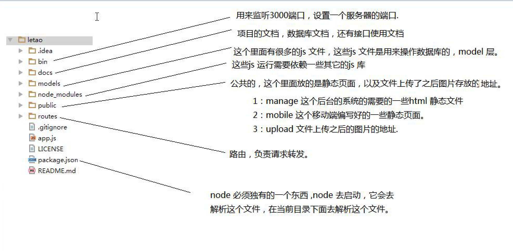

# 项目_day01:电商后台管理Demo


-------

## 环境搭建 
### ① 数据库搭建


* 导入表

-------

### ② 服务器搭建


* 修改models文件夹里面的db.js中的数据库链接信息

```js

const pool  = mysql.createPool({
    host : '127.0.0.1',
    user : 'root',
    password : '',
    database : 'letao'
});

```

host 数据库的ip地址
user 数据库的用户名
password 数据库密码
database 数据库的库名

-------

### ③ 启动 nodejs 服务
* 官网下载nodejs 后安装
* 命令行`npm start` 开启node服务


-------


### 接口的安全问题
* **目前比较流行的两种方式 session Cookie 和 token 机制**

-------

#### Cookie 认证
* 要求用户在调这些接口的时候,是必须要登录的


-------

#### token机制
* 令牌机制


-------

### ④ 页面架构介绍


-------

### 登录页的实现


* **① 引入jQuery**


* **② 获取用户名和密码 发送给服务器**


```js

$(function(){
            console.log("111");
                function login(){
                    //我要获取用户名，密码，发送给服务器。
                    var username=$("#username").val();
                    var password=$("#password").val();
                    console.log(username);
                    if(!username){
                        alert("请输入用户名");
                    }
                    if(!password){
                        alert("请输入用户名");
                    }
                    $.ajax({
                        type:"POST",
                        url:"/employee/employeeLogin",
                        data:{
                            username:username,
                            password:password
                        },
                        success:function(data){
                            console.log(data);
                            if(data.success){
                                //我要跳转到首页去
                                //怎么去在js 里面做跳转
                                //window.location.href="";
                                window.location.href="index.html";

                            }else{
                                //登录失败，我可以给用户提示信息.
                                alert(data.message);
                            }
                        },
                        error:function(e){
                            console.log(e);
                        }
                    });
                }


```


```html


<!-- 登录 -->
<div class="login">
    <div class="login-wrap">
        <div class="avatar">
            <!--头像区域.-->
            
        </div>
        <!--表单-->
        <form action="" class="col-md-offset-1 col-md-10">
            <div class="input-group input-group-lg">
                    <span class="input-group-addon">
                        <i class="fa fa-user"></i>
                    </span>
                <input type="text" class="form-control" id="username" placeholder="用户名">
            </div>
            <div class="input-group input-group-lg">
                    <span class="input-group-addon">
                        <i class="fa fa-key"></i>
                    </span>
                <input type="password" class="form-control" id="password" placeholder="密码">
            </div>
            <button type="button" class="btn btn-lg btn-primary btn-block">登 录</button>
        </form>
    </div>
</div>

```

* **③ 用户按住enter 键,就可以实现登录**


```js

                $(".btn-lg").on("click",function(){
                    login();
                });

```

* **④ NProgress 进度条的引入**


```js

                $(document).keydown(function(event){
                        //event.keyCode==13 就代表用户输入的enter 键.
                        if(event.keyCode==13){
                            login();
                        }
                })

```

-------

### 后台首页


* **① 引入 jQuery**

```js

    <script src="assets/jquery/jquery.js"></script>

```

* **② 验证当前用户是否登录 调用接口 checkRootLogin**


```js

           $.ajax({
                url:"/employee/checkRootLogin",
                type:"get",
                success:function(data){
                     if(data.success!=true){
                         //说明没有登录，我要跳转到登录页面.
                         window.location.href="login.html";
                     }
                }
           });

```


* **③ 后台首页实现 NProgress 进度条**


```html

<script src="assets/nprogress/nprogress.js"></script>

```

```js


/*做进度条使用的*/
//configure 配置
NProgress.configure({
    //禁止光圈的显示.
    showSpinner:false
});
/*查找文档.  */
NProgress.start(); //开启进度条.

//页面加载完毕，去结束这个进度条.
window.onload=function(){
    //结束的时候调用.
    NProgress.done();
}

```


* **④ 将NProgress 进度条定义公共文件**


```js


/*做进度条使用的*/
//configure 配置
NProgress.configure({
    //禁止光圈的显示.
    showSpinner:false
});
/*查找文档.  */
NProgress.start(); //开启进度条.

//页面加载完毕，去结束这个进度条.
window.onload=function(){
    //结束的时候调用.
    NProgress.done();
}

```


```html
<!--使用方式-->
<script src="assets/nprogress/nprogress.js"></script>
<script src="js/common.js"></script>

```
-------


