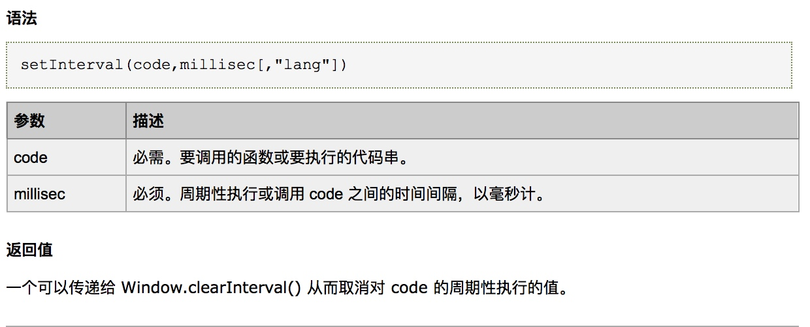

# JavaScript_Day03_BOM概念_history_screen_navigator_BOM全局方法_event事件对象_offset_scroll_client操作_固定导航栏_正则表达式

[TOC]

## BOM的概念
> JavaScript 三部分

* ECMAScript
* DOM Document Object Model 
* BOM Broswer Object Model 浏览器对象模型

> 什么浏览器对的模型

* 浏览器给我们提供的很多功能,我们可以调用浏览器的这些功能
* 浏览器给我们提供了一些对象,这些对象就是浏览器对象
* window 一个最顶层的对象
* 这个对象下面衍生出来很多子对象
* 每个对象都可以调用浏览器的一些功能
* 
                    
> 常见的对象有

* Window 我们在页面上定义的所有的变量函数 
    * window 对象的下的方法和变量可以省略window 
    * `window.alert()` 可以省略 成`alert()`
    * window 下面含有 document对象
    * 一个页面有一个window对象
    
* 都在Window对象中
* location 代表的是当前浏览器地址
* screen 代表的是屏幕
* navigator 代表的是当前浏览器
* history 代表的是浏览器的历史记录

> window 下的方法和属性

* 这些对象分别代表浏览器功能的各个部分，也叫作浏览器对象模型
* 我们要学习bom，其实就是学习里面的各个api


##BOM对象的使用

### history对象的使用


```html

<input type="button" value="后退" id="backId">
<input type="button" value="前进" id="forwardId">

```


```js

             document.getElementById("backId").onclick=function(){
                window.history.back();//调用history下的后退功能
            }

            document.getElementById("forwardId").onclick=function(){
                window.history.forward();//获取到history对象
            
            }

```

### screen 对象的使用 


```js

  /**
             * screen对象的使用
             * */

            console.log(window.screen.width); //获取屏幕宽
            console.log(window.screen.height); //获取屏幕高度
            console.log(window.screen.availHeight); //返回显示屏幕的高度 (除 Windows 任务栏之外)。


```

### navigator 对象的使用 导航者 浏览器


```js

            console.log(window.navigator.appName);

            console.log(window.navigator.language); //获取当前浏览器的语言

            console.log(window.navigator.userAgent);//获取浏览器的名称...
            // http协议 把这个值作为请求头发送给服务器
            // html5 里对navigator 对象进行增强 可以获取到经纬度

```

## BOM 全局方法的使用
### open()

* 打开一个新的浏览器窗口或查找一个已命名的窗口。
* `window.open(URL,name,features,replace)`

```js

 window.open("http://www.sohu.com","","width=500,height=400");

```

### print()

* print() 方法用于打印当前窗口的内容。
* 调用 print() 方法所引发的行为就像用户单击浏览器的打印按钮。通常，这会产生一个对话框，让用户可以取消或定制打印请求。
* `window.print()`

```js

//打印方法，可以调用出来浏览器打印功能，如果连着打印机
//就会去自动打印.
window.print();

```

### setInterval()
* setInterval() 方法可按照指定的周期（以毫秒计）来调用函数或计算表达式。
* setInterval() 方法会不停地调用函数，直到 clearInterval() 被调用或窗口被关闭。由 setInterval() 返回的 ID 值可用作 clearInterval() 方法的参数。
* `setInterval(code,millisec[,"lang"])`




```js

      var ids;
      var i=0;
      document.getElementById("startId").onclick=function(){

             ids=window.setInterval(function(){
                 i++;
                 document.getElementById("message").innerHTML=i;
             },1000);
      }

```

### clearInterval()

* clearInterval() 方法可取消由 setInterval() 设置的 timeout。
* clearInterval() 方法的参数必须是由 setInterval() 返回的 ID 值。
* `clearInterval(id_of_setinterval)`

```js

      document.getElementById("endId").onclick=function(){
            if(ids){
                 window.clearInterval(ids);
            }
      }

```

### setTimeout()
* setTimeout() 方法用于在指定的毫秒数后调用函数或计算表达式。
* `setTimeout(code,millisec)`
* 


```js

 /**
             * 使用setTimeOut 每一秒钟都执行一次函数
             * 利用递归
             */
            document.getElementById("forbut").onclick = function() {
                function foo() {
                    console.log("每一秒钟调用一次自己");
                    setTimeout(foo, 1000);
                }
                foo();
            }

```

### Date对象 在网页上动态显示时间

```js

            /**
             * 在网页上动态显示时间
             * 获取本地时间 一秒中调用一次 获取一次
             * 获取后通过 dom 写到页面上
             */
            window.setInterval(function(){
                var myDate = new Date();
                //需要处理时间格式化
                //yyyy年mm月dd日 hh小时mm分ss秒
                var year = myDate.getFullYear();//年
                var month = myDate.getMonth()+1;
                var day = myDate.getDate();
                var hours = myDate.getHours();
                var Minutes = myDate.getMinutes();
                var seconds = myDate.getSeconds();

                var date = year+"年"+month+"月"+day+"天";
                date = date+" "+hours+"时"+Minutes+"分"+seconds+"秒";

                //console.log(date);

                document.getElementsByTagName("div")[0].innerHTML = date;

            },1000);

```

## event事件对象
* 通过鼠标触发,可以获取到鼠标的位置
* 键盘触发,可以获得到键盘的按键keyCode值

```js
              document.onclick=function(event){
                     var e=event || window.event;
                    //获取的元素屏幕的距离
                    console.log("x=="+e.screenX+"y=="+e.screenY);
                    //clientX 浏览器窗口的距离
                    console.log("x=="+e.clientX+"y=="+e.clientY);
                    //pagex pageX 页面的距离
                    console.log("pagex=="+e.pageX+"pagey=="+e.pageY);
              }
```

## event事件对象中的target属性


```html

    <div class="divbox">
        <p>我这个是子元素.</p>
    </div>

```


```js

 window.onload = function() {
        /**
         * target 目标，它是一个对象，它指向到事件源.
         * @param event
         */
        document.getElementsByTagName("div")[0].onclick = function (event) {
            //可以获取target 里面的一些信息.
            //我要打印console.log 我们使用 console.dir 可以比log  打印的更加详细
            //我们通过target 对象 可以获取到当前元素，，事件源
            console.dir(event.target);

        }
    }

```


## event对象的兼容性问题
* 事件冒泡的兼容性处理


```js

        window.onload = function() {
            document.getElementById("box1").onclick = function () {
                console.log("点击box1");
            }

            document.getElementById("box2").onclick = function () {
                console.log("点击box2");

                if (event && event.stopPropagation()) {
                    ////阻止事件冒泡  针对的是非ie
                    event.stopPropagation();
                } else {
                    //针对ie浏览器解决事件穿透问题
                    window.event.cancelBubble = true;
                }

            }
        }

```


```js

    window.onload = function() {
        /**
         * target 目标，它是一个对象，它指向到事件源.
         * @param event
         */
        document.getElementsByTagName("div")[0].onclick = function (event) {
            //可以获取target 里面的一些信息.
            //我要打印console.log 我们使用 console.dir 可以比log  打印的更加详细
            //我们通过target 对象 可以获取到当前元素，，事件源
            console.dir(event.target.childNodes);

        }
    }

```


## 三大系列操作
### offsetWidth 和 offsetHeight


```html

<div id="box1" style="width: 200px;height: 200px; border: 10px solid plum;">

     </div>

```

```js

       window.onload = function(){

           var div = document.getElementById("box1");
           //offsetWidth height=width+border+padding
           console.log("offsetHeight: "+div.offsetHeight);
           console.log("offsetWidth: " +div.offsetWidth);

           //我要获取到当前元素宽高，我还可以使用 style.width  style.height
           //只能获取到内嵌样式的宽度以及高度. 获取到这个是带px 单位。
           console.log("width="+document.getElementById("box1").style.width);
           console.log("height="+document.getElementById("box1").style.height);

       }

```


### scrollHeight 和 scrollWidth的使用


```js

            document.getElementById("offsetId").onclick=function(){
               var div = document.getElementsByTagName("div")[0];

               //offsetWidth offsetHeight
               //width+border+padding
               console.log("offsetHeight== "+div.offsetHeight);
               //scrollWitdh  scrollHeight
               //height=height+padding 不包括border 获取的高度是内容的高度.
               console.log("scrollHeight== "+div.scrollHeight);
           }

```

### clientHeight 和 clientWidth


```js

     var div=document.getElementsByTagName("div")[0];

            //height+padding+border
            console.log("offsetHeight:"+div.offsetHeight); //output  
            //height+padding 不包含border  //这个可以获取内容的高度.
            console.log("scrollHeight:"+div.scrollHeight); //output  
            //height+padding 不包含border
            console.log("clientHeight:"+div.clientHeight); //output  
            
```


 
### offsetLeft 和 offsetTop
* 获取当前元素相对的offsetParent元素的偏移位置


* （1）当对象的offsetParent属性指向的是body时，offsetLeft和offsetTop指的是对象的边框（不包括边框）到页面边缘的距离。在FireFox中，会减去body的边框的宽度。


* （2）当对象的offsetParent属性指向的是最近的定位祖先元素时，offsetLeft和offsetTop指的是对象的边框（不包括边框）到最近的定位祖先元素的边框（不包括边框）的距离。在IE中，会将最近的定位祖先元素的边框宽度算在内。


### offsetParent
* 是当前元素的父元素有position的定位元素


* position为fixed元素是没有offsetParent，但firefox统一返回body。
* position为absolute, relative的元素的offsetParent总是为其最近的已定位的元素,没有找最近的td,th元素，再没有找body。
* position为static的元素的offsetParent则是先找最近的td,th元素，再没有找body。
* body为最顶层的offsetParent。

### scrollTop 和 scrolLeft
* 获取内容被滚动的时候被卷曲进去的高度


```js

        window.onload = function(){

           var div = document.getElementsByTagName("div")[0];
           
           div.onscroll = function () {
               console.log("scrollTop = " + div.scrollTop);
           }


       }

```


### 固定导航栏案例


```js


 /**
     * 逻辑代码  找事件,事件对应方法，方法里面编写业务逻辑代码.
     1:监听window的scroll 事件
     2:当滚动条滚动的时候，修改nav 的样式
     当页面被卷曲进去的高度大于top 的时候，我们就让nav 固定定位 position:fixed
     当页面被卷曲进去的高度小于top 的时候，我们就让nav 固定定位 position:static
     */

    window.onscroll = function(){

        var top = document.getElementsByClassName("top")[0];
        var nav = document.getElementsByClassName("nav")[0];
        var main = document.getElementsByClassName("main")[0];

        var scTop = document.body.scrollTop;
        var topHeight = top.offsetHeight;

        if(scTop>topHeight){
            nav.style.position = "fixed";
            nav.style.top = "0";
        }else {
            nav.style.position = "static";
        }
    }

```
## 正则表达式
### 定义规则的两种方式

```js

        //编写规则
        var reg=new RegExp("www");
        //正则主要用在字符串上面匹配的上面的.
        var str="asfadsfwwwadsfdsaf";
        var flag=reg.test(str);
        console.log(flag);//true

```

```js

        var reg=new RegExp();
        var reg=/\d/;
        console.log(reg.test("1111"));
```

* 验证字符串是否符合某个规则
    
```js

var reg=new RegExp();
var reg=/\d/;
            console.log(reg.test("1111"));

            /*
            * \D 匹配非数字
            * */
            var reg=/\D/;
            console.log(reg.test("ADSFAFD"));


            //\space 空格的意思，匹配空格

            var reg=/\s/;

            console.log(reg.test("dsaf adsf"));

            var reg=/[4-9]/;
            console.log(reg.test("123"));

            //匹配所有的小写字母
            var reg=/[w-z]/;
            //我现在可以定义，你现在这个字符串必须出现哪些字符串.
            console.log(reg.test("asdfadsf"));

            var reg=/[A-Z]/; //匹配所有的大写字母
            console.log(reg.test("asdfdEafsadsf"));

            //[A-z] 匹配所有的字母
            var reg=/[A-z]/;

            console.log(reg.test("afds"));

            //现在上面的这些都是字符串的规则..
            //现在上面的这些内容都是模糊匹配，我们可以起来精确匹配.

            //字符串必须以chuan 开头 匹配以..开头
            var reg=/^chuan/;
            console.log(reg.test("1chuan"));

            //还可以限制以什么结尾. $ 限定以...结尾.
            var reg=/chuan$/;

            console.log(reg.test("1chuan1"));

            /*限定开头，有限定结尾*/
            var reg=/^chuan$/;
            console.log(reg.test("chuan"));

            /*会精确匹配.*/
            //要求c 出现的次数>=1
            var reg=/^c+$/;
            console.log(reg.test("cccd"));

            //要求出现的次数>=0
            var reg=/^c*$/;
            console.log(reg.test("ccc"));

            //要求c 出现的次数 0 或者1 次
            var reg=/^c?$/;
            console.log(reg.test(""));

            //我们可以严格要求他出现的次数，我就需要来一个{2}
            var reg=/^a{2}$/;
            console.log(reg.test("aac"));

            /*我要求a 出现 2-6*/
            var reg=/^a{2,6}$/
            console.log(reg.test("aaaaaaa"));

            //a 出现的次数大于两次
            var reg=/^a{2,}$/;

            console.log(reg.test("aaaaa"));

            /*手机号是什么规则*/
            var reg=/^1(3|5|8)[0-9]{9}$/;
            var tel="18900000001";
            console.log(reg.test(tel));

```
    
* 正则在表单中的使用

```js

//失去焦点的时候触发.
                document.getElementById("email").onblur=function(){
                        //编写一个邮箱的正则.
                        //然后验证这个用户输入的字符串是否符合这个规则
                        //如果不符合，我给用户提示
                        //如果符合,给用户提示.
                       var email=this.value;
                       //编写一个邮箱的正则
                       var reg=/^\w{5,20}@(itcast|itheima).(cn|com)$/;
                       var flag=reg.test(email);
                       if(flag){
                            document.getElementById("message").innerHTML="<font color='green'>恭喜你，该账号可以使用</font>";
                       }else{
                            document.getElementById("message").innerHTML="<font color='red'>请输入正确的邮箱</font>";
                       }
                       //我们可以去网站上面拔取一些正则表达式.
                }

```


* 正则验证密码强度的案例

```css

body {
        background: #ccc;
    }

    label {
        width: 40px;
        display: inline-block;
    }

    span {
        color: red;
    }

    .container {
        margin: 100px auto;
        width: 400px;
        padding: 50px;
        line-height: 40px;
        border: 1px solid #999;
        background: #efefef;
    }

    span {
        margin-left: 30px;
        font-size: 12px;
    }

    .wrong {
        color: red
    }

    .right {
        color: green;
    }

    .strengthLv0 {
        height: 6px;
        width: 120px;
        border: 1px solid #ccc;
        padding: 2px;
    }

    .strengthLv1 {
        background: red;
        height: 6px;
        width: 40px;
        border: 1px solid #ccc;
        padding: 2px;
    }

    .strengthLv2 {
        background: orange;
        height: 6px;
        width: 80px;
        border: 1px solid #ccc;
        padding: 2px;
    }

    .strengthLv3 {
        background: green;
        height: 6px;
        width: 120px;
        border: 1px solid #ccc;
        padding: 2px;
    }

```


```html

<div class="container">
    <label>密码</label>
    <input type="text" id="inp1" maxlength="16" >
    <!--<input type="password" id="inp1" maxlength="16"/>-->
    <div class="pass-wrap">
        <em>密码强度：</em>
        <em id="strength"></em>
        <div id="strengthLevel" class="strengthLv0"></div>
    </div>
</div>

```


```js

/*
     * 要操作dom 必须先得到dom， 查找元素
     * */
    //用户输入的文本框
    var input=document.getElementById("inp1");
    //密码的强度的文本提示
    var strength=document.getElementById("strength");
    //密码的强度的样式提示
    var strengthLevel=document.getElementById("strengthLevel");

    //onkeydown键盘的按键按下的时候触发
    //onkeyup 键盘的按键按下松开的时候触发.
    /*input.onkeydown=function(){
     //我要把用户输入的值获取到，然后使用正则去进行校验
     //校验了之后给用户对应的提示信息.
     //这样是获取不到值的，因为用户的按键按下的时候就触发了
     //键盘的输入的值还没有到input 框里面去
     //所以是获取不到的，我们应该使用onkeyup
     console.log(this.value);
     }*/
    //键盘的按键按下抬起的时候触发，这个时候输入框里面有值了
    input.onkeyup=function(){
        /*
         * 如果你的密码里面
         *   只包含数字或者小写字母或者大写字母当中的一种:密码强度低
         *   只包含数字或者小写字母或者大写字母当中的二种:密码强度中
         *   只包含数字或者小写字母或者大写字母当中的三种:密码强度高
         * */
        var keyword=this.value;

        //我可以对密码的长度进行判断. 如果小于6 位，就不需要执行下面的代码，方法结束
        if(keyword.length<6){
            return;
        }

        var tips=["","低","中","高"];
        var level=0;
        if(/[a-z]/.test(keyword)){
            level++;
        }
        if(/[A-Z]/.test(keyword)){
            level++;
        }
        if(/[0-9]/.test(keyword)){
            level++;
        }
        strength.innerHTML=tips[level];
        //改变样式.
        strengthLevel.className="strengthLv"+level;
    }
    
```

* 去除字符串中的空格


