# JavaScript_Day04_面向对象_创建对象_继承_原型_call()_apply()

[TOC]

## ① 替换空格


```js

          //我们要编写一个正则，然后去匹配所有的空格，然后去把空格进行替换.
          //通过正则去匹配str 里面的字符串，如果匹配到了，去替换.
          //只帮我替换了一个空格，
          
          console.log(str.replace(/\s/g, "").length);

          console.log(str.replace(/\s/g, ""));
          
                    //我希望帮我替换掉所有，我需要.


          /*编写成一个方法*/
           function trimStr(str){
               return str.replace(/\s/g, "");
           }
```

## ② 关键字搜索

```css

        .box{
            width: 700px;
            margin: 100px auto;
        }
        /*获取所有的input 根据属性进行筛选*/
        input[type=text]{
            width: 500px;
            font-size: 28px;
        }
        input[type=button]{
            font-size: 24px;
        }
        li{
            margin: 0;
            padding: 0;
            list-style: none;
            padding: 5px;
            cursor: pointer;
        }
        .message{
            width: 500px;
            border: 1px solid #ccc;
            border-top:none;
            display: none;
        }
        .active{
            background-color: pink;
        }

```


```html

<!--页面结构-->
    <div class="box">
        <!--
        通过属性可以自动定位焦点. h5 autofocus
        -->
        <input type="text"  id="keyword" autofocus><input type="button" value="搜白一下">
        <div class="message">
            <li>郑州</li>
            <li>商丘</li>
            <li>开封</li>
            <li>洛阳</li>
            <li>鹤壁</li>
            <li>濮阳</li>
            <li>平顶山</li>
            <li>新乡</li>
            <li>南阳</li>
        </div>
    </div>

```
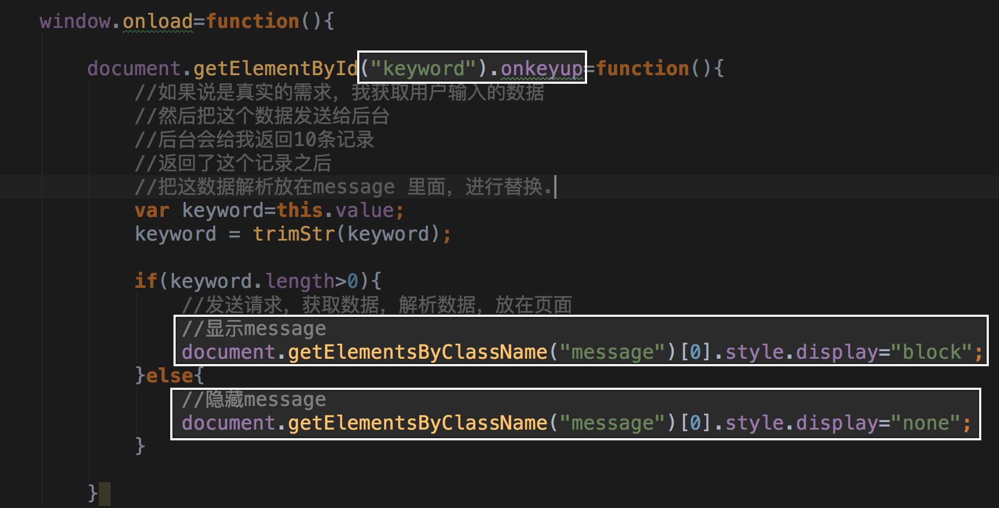

* 完成鼠标悬停更改样式

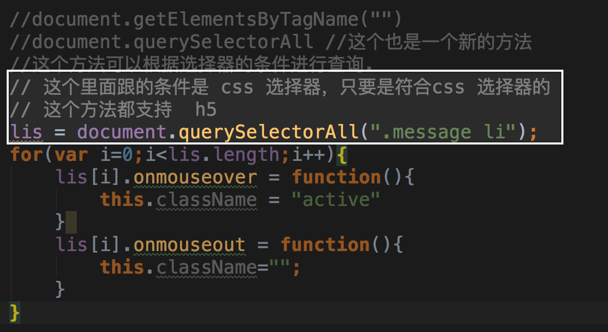

* 在整个页面上面按这个上下键都可以进行切换效果.

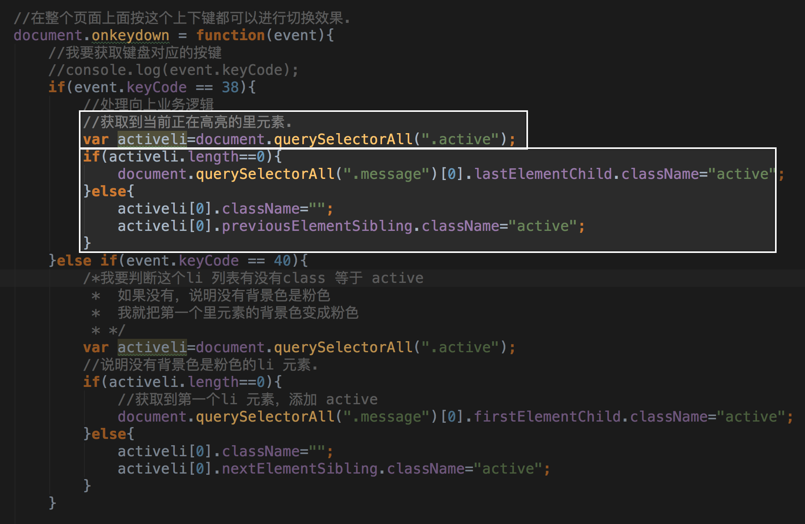


```js

 /*编写成一个方法*/
        function trimStr(str){
            return str.replace(/\s/g, "");
        }

        window.onload=function(){

            document.getElementById("keyword").onkeyup=function(){
                //如果说是真实的需求，我获取用户输入的数据
                //然后把这个数据发送给后台
                //后台会给我返回10条记录
                //返回了这个记录之后
                //把这数据解析放在message 里面，进行替换.
                var keyword=this.value;
                keyword = trimStr(keyword);

                if(keyword.length>0){
                    //发送请求，获取数据，解析数据，放在页面
                    //显示message
                    document.getElementsByClassName("message")[0].style.display="block";
                }else{
                    //隐藏message
                    document.getElementsByClassName("message")[0].style.display="none";
                }

            }

            //document.getElementsByTagName("")
            //document.querySelectorAll //这个也是一个新的方法
            //这个方法可以根据选择器的条件进行查询.
            // 这个里面跟的条件是 css 选择器，只要是符合css 选择器的
            // 这个方法都支持  h5
            lis = document.querySelectorAll(".message li");
            for(var i=0;i<lis.length;i++){

                lis[i].onmouseover = function(){
                    this.className = "active"
                }
                lis[i].onmouseout = function(){
                    this.className="";
                }
            }


            //在整个页面上面按这个上下键都可以进行切换效果.
            document.onkeydown = function(event){
                //我要获取键盘对应的按键
                //console.log(event.keyCode);
                if(event.keyCode == 38){
                    //处理向上业务逻辑
                    //获取到当前正在高亮的里元素.
                    var activeli=document.querySelectorAll(".active");
                    if(activeli.length==0){
                        document.querySelectorAll(".message")[0].lastElementChild.className="active";
                    }else{
                        activeli[0].className="";
                        activeli[0].previousElementSibling.className="active";
                    }
                }else if(event.keyCode == 40){
                    /*我要判断这个li 列表有没有class 等于 active
                     *  如果没有，说明没有背景色是粉色
                     *  我就把第一个里元素的背景色变成粉色
                     * */
                    var activeli=document.querySelectorAll(".active");
                    //说明没有背景色是粉色的li 元素.
                    if(activeli.length==0){
                        //获取到第一个li 元素，添加 active
                        document.querySelectorAll(".message")[0].firstElementChild.className="active";
                    }else{
                        activeli[0].className="";
                        activeli[0].nextElementSibling.className="active";
                    }
                }

                if(document.querySelectorAll(".active").length>0){
                    //当前选中的文本
                    var text=document.querySelectorAll(".active")[0].innerHTML;

                    //赋值给输入框
                    document.getElementById("keyword").value=text;
                }

            }


        }

```

# 基于对象
## ① 对象的基本构成
* JavaScript 对象的结构都是以键值对的方式去构成
* 键值对特性:键唯一，通过键可以获取到值
* key value 结构  php  key=>value JavaScript 里面的键值对
* key冒号链接 key:value 应该有个
* key:value 多个键值对还是以,号隔开


```js

 //怎么样去定义一个对象 这个对象它是 {}
                {} 里面放的都是键值对.
                var obj={
                      key:value,
                      key:value,
                      key:value
                }
//                key 唯一
//                value 的值可以是任意类型的值

```


```js

             var obj={
                  username:"张三",
                  age:11,
                  data:{
                       dataShow:function(){
                            alert("打印");
                       }
                  },
                  fav:["nv","shejiao","liaomei"],
                  show:function(){
                        console.log("dayin")
                  }
             }

```


```js

//        对象下面的访问key ，key 我们也可以理解成属性.
        console.log(obj.age);
        console.log(obj.fav);
        for(var j=0;j<obj.fav.length;j++){
            console.log(obj.fav[j]);
        }

```


## ② 定义对象

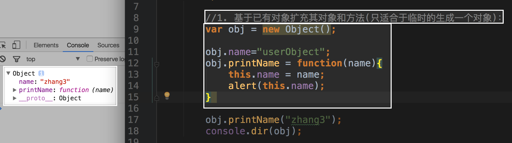


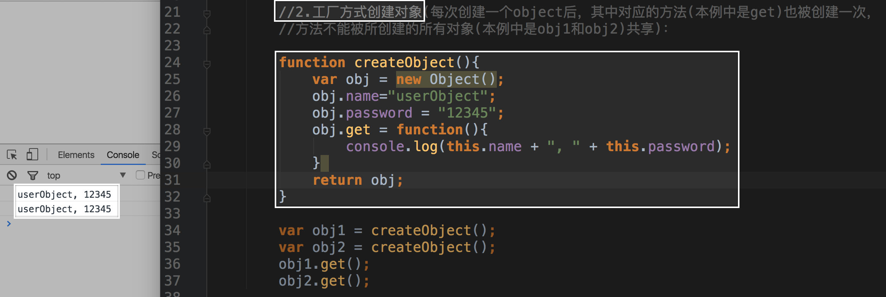

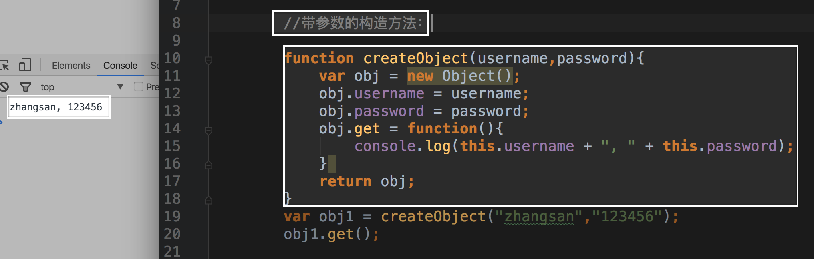

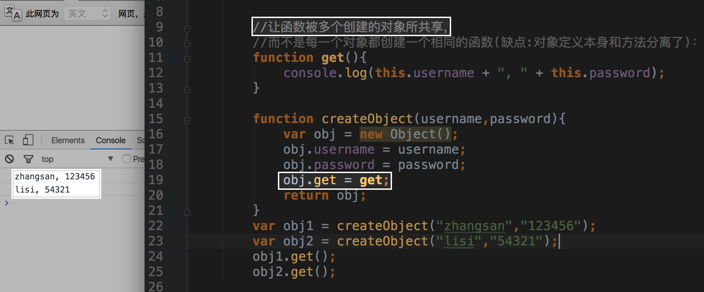


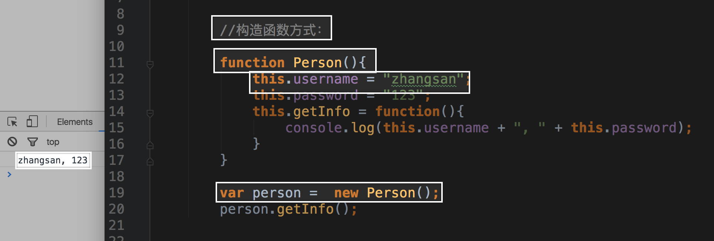

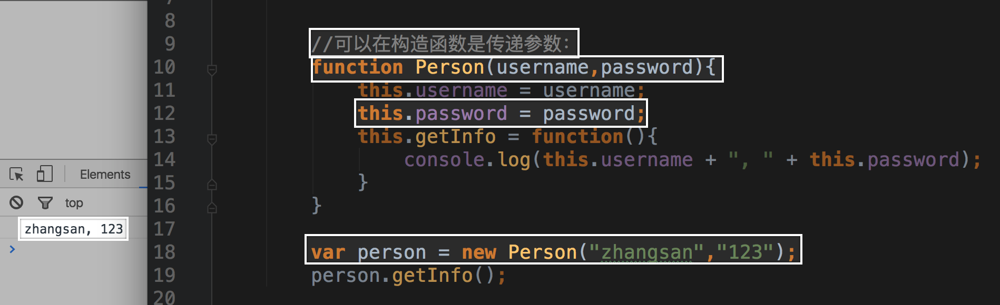

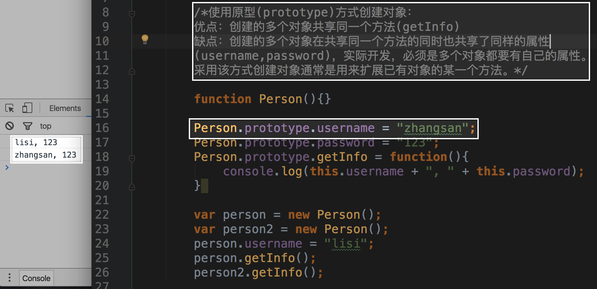


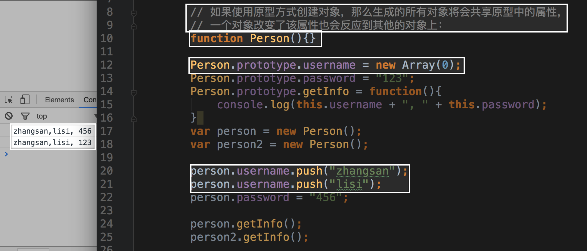

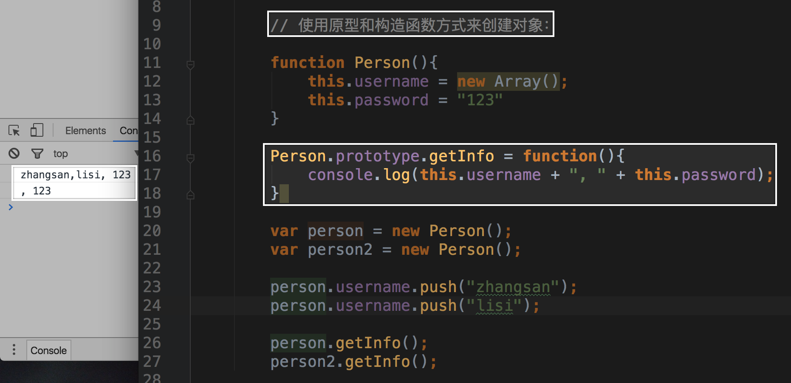

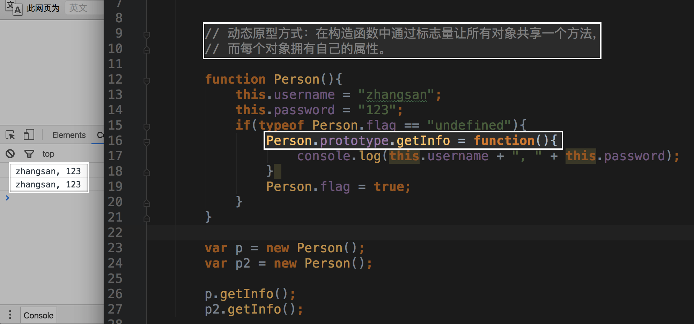


## ③ 对象的增删改查

```js

var obj={
            username:"zhangsan"
        }

        //根据属性名，去获取属性值.
        console.log(obj.username);

        //我要往这个obj 对象上面动态新增一个属性
        obj.age=11;

        delete obj.age;

        //更新一个属性值.
        obj.username="王者";

        console.log(obj.username);

        /*对象的属性的增删改查*/
        var obj1={
            name:"lisi"
        };
        obj1.name;          //调用
        obj1.age=11;        //添加属性
        delete obj1.name;   //删除属性
        obj1.name1="";      //先删除在增加就是更新

```

## ④ 对象的属性调用两种方式

```js

        var obj={
            name:"zhangsan"
        }

        //第一种方式方式
        console.log(obj.name);
        /*第二种访问方式*/
        console.log(obj['name']);

```


```js

        var obj={
            name:"zhangsan"
        }

        var vname="name";
        
        console.log(obj.vname); //output undefined
        console.log(obj[vname]); //output

```

## ⑤ 遍历对象 for in

```js

        var obj = {
            name:"zhangs",
            age:11
        }

        /*遍历对象
         js for() 遍历数组
         *       for in 去遍历对象.
         * */

        for(var mkey in obj){
         console.log("mkey=="+mkey); //遍历出来的是key

         //console.log(obj.mkey); //因为obj 上面没有mykey 属性
         console.log(obj[mkey]);

         console.log(mkey+"==="+obj[mkey]);
         }

```

## ⑥ 案例 将地址中的数据解析封装对象中

```js

        var str="http://www.itcast.cn?username=lifang&age=11&sex=nv&fav=xuexi";
        //把这个对象里面的参数解析出来，封装成一个对象

        var startIndex=str.indexOf("?");

        var endIndex=str.length;
        //我要将这个参数变成对象.
        str=str.substring(startIndex+1, endIndex);

        var arr=str.split("&");

        var params={};

        for(var z=0;z<arr.length;z++){
            params[arr[z].split("=")[0]]=arr[z].split("=")[1];
        }
        console.log(params);

```

## ⑦ 基于对象开发概念

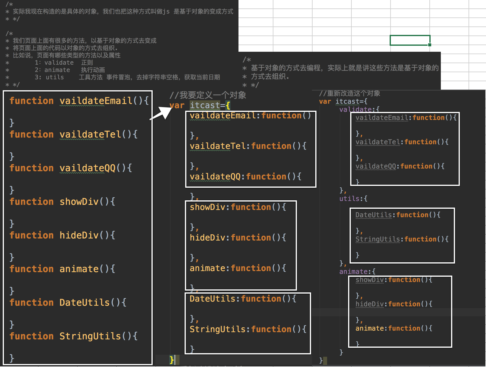


# 面向对象
## ① 面向对象的概念
* 对象就是事物,事物抽象的,具体的,抽象的是用来约束具体的
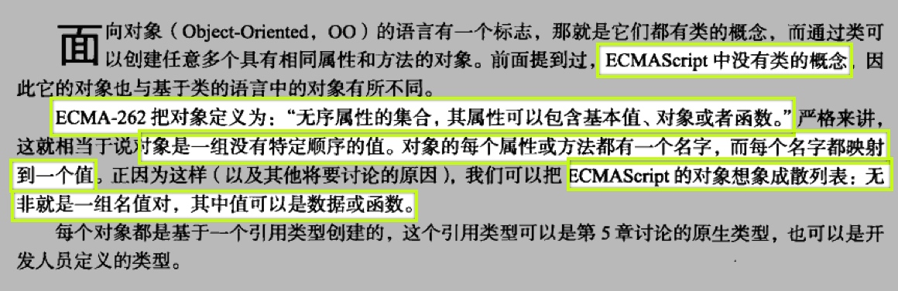


## ② 面向对象的编程

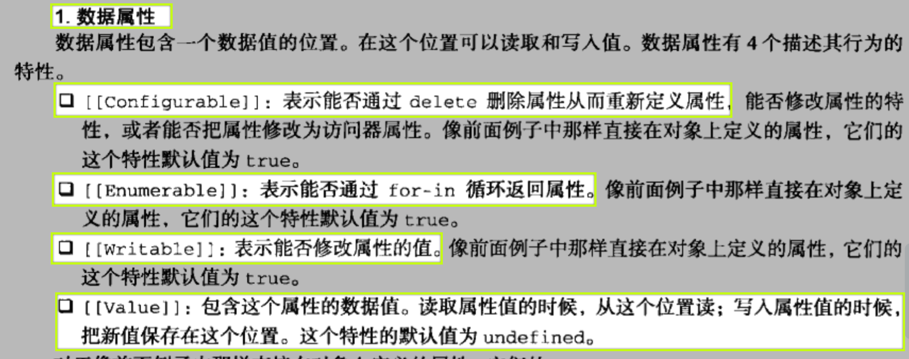

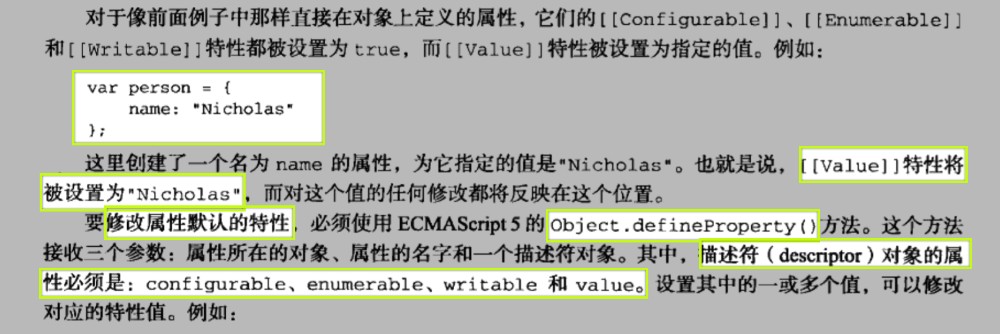


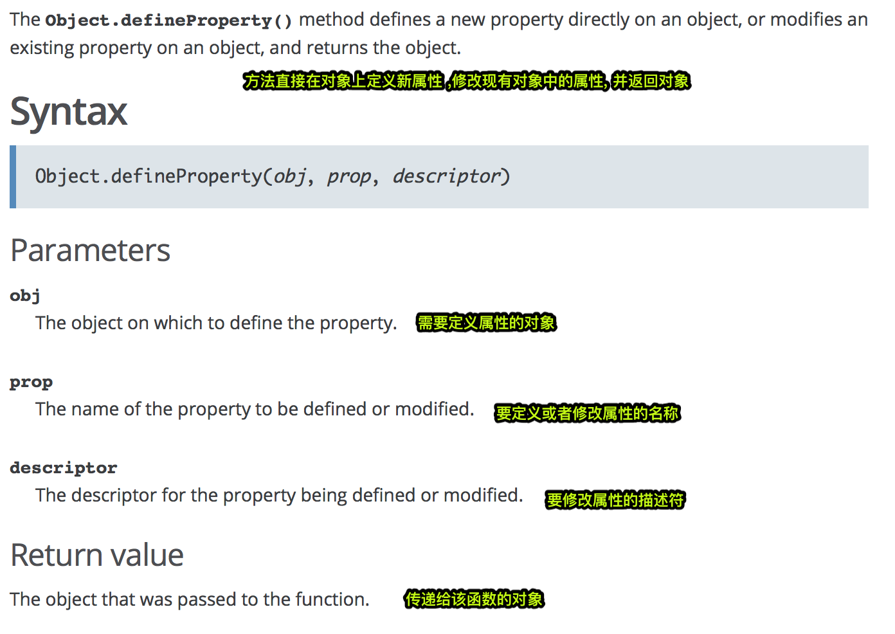


```js

        var person = {};
        Object.defineProperty(person,"name",{
            writable:false,
            value:"1111"
        });

        console.log(person.name); // 1111
        person.name = "222"
        console.log(person.name); // 1111

```

### 创建对象

```js

        var person = {};
        person.name = "zhangs";
        person.age = 11;

        console.log(person);
        //Object {name: "zhangs", age: 11}

``` 
### 工厂模式

```js

        function createPerson(name,age){
            var o = new Object();

            o.name = name;
            o.age = age;
            o.showinfo = function(){
                console.log("name =" + name + "age = " + age);
            };
            return o;
        }


       var person1 =  createPerson("张三",11);
       var person2 =  createPerson("李四",12);
        person1.showinfo(); //name =张三age = 11

```
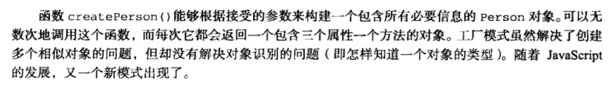


### 构造方式


```js

        function Person(name,age,job){
            this.name = name;
            this.age = age;
            this.job = job;
        }

        var person = new Person("zhangs",11,"Doctor");
        console.log(person);
        //Person {name: "zhangs", age: 11, job: "Doctor"}

```

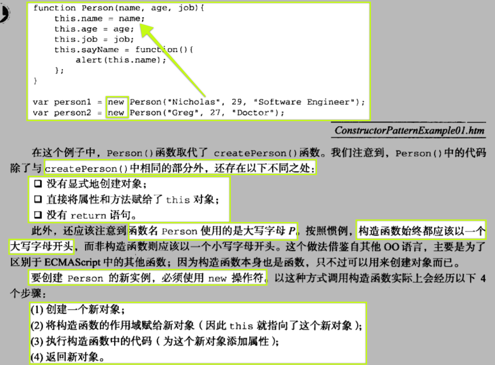
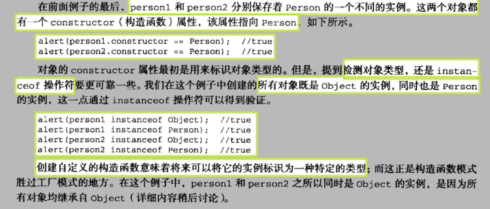

## ③ 构造函数和普通函数

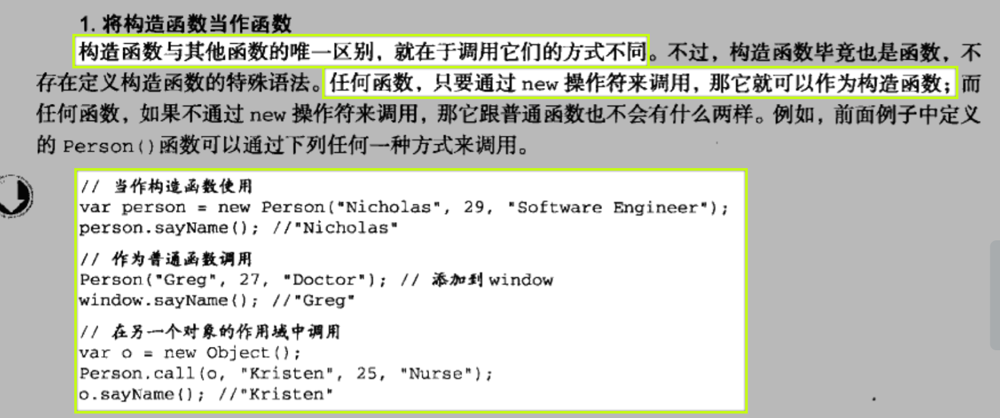

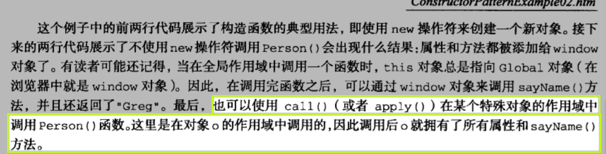


## ④ 基本数据类型和引用数据类型的比较

#原型
## ① 原型的概念
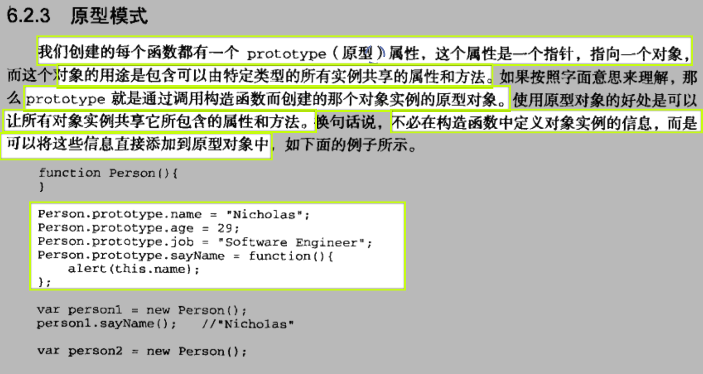

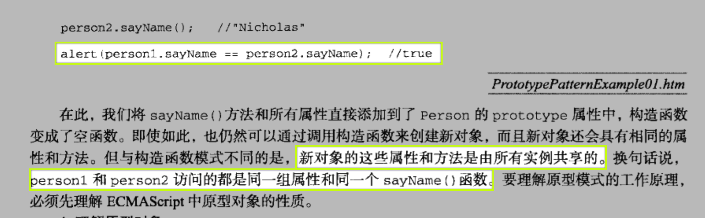

## ② 原型的实际应用

## ③ 构造函数 原型 实例对象的关系
* 原型是构造函数上面的属性,属性指向当前对象
* 所有通过构造函数产生的对象,都具备原型上面的属性以及方法
1. 构造函数上面有一个原型属性
2. 通过函数产生的实例对象都可以共享原型上面的方法
3. 实例对象上面又有一个__proto__ 或者 原型属性指向原型

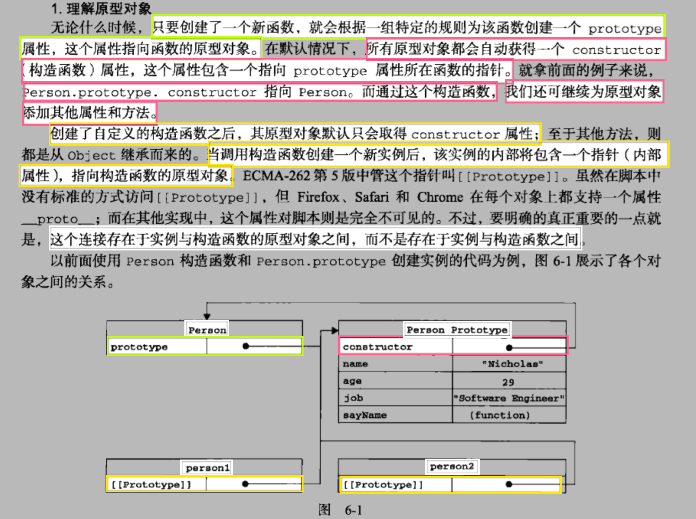

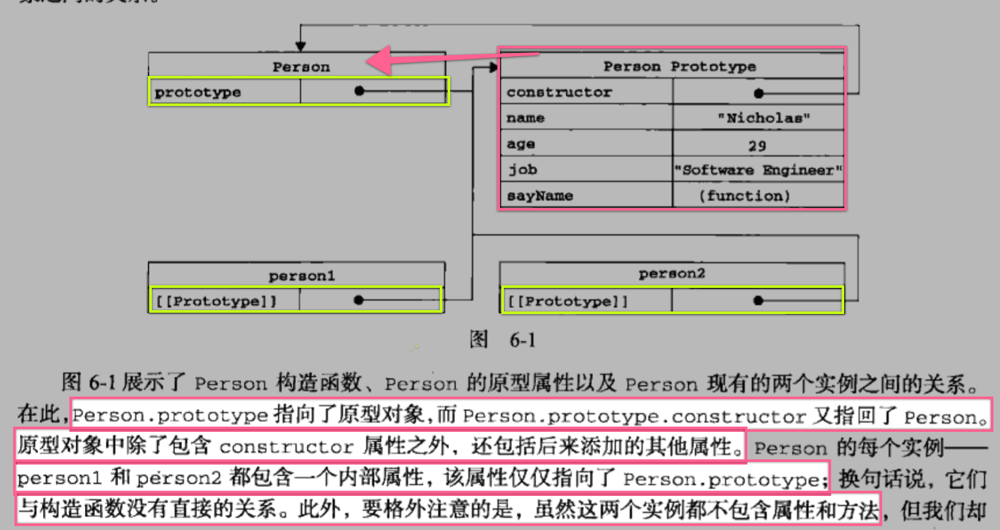

### 对象属性和方法的搜索过程
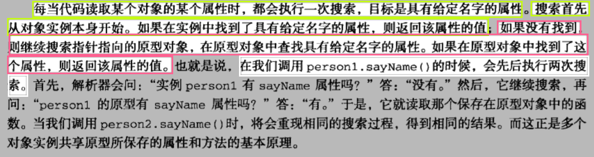


### 原型属性的重写问题

```js

    function Person(){
    }
        Person.prototype.name = "nicholas";
        Person.prototype.age = 11;
        Person.prototype.sayName = function(){
            console.log(this);
        }
        var person1 = new Person();
        var person2 = new Person();
        person1.name = "zhangs"

        console.log(person1.name); //zhangs --来自实例
        console.log(person2.name); //nicholas --来自原型

```

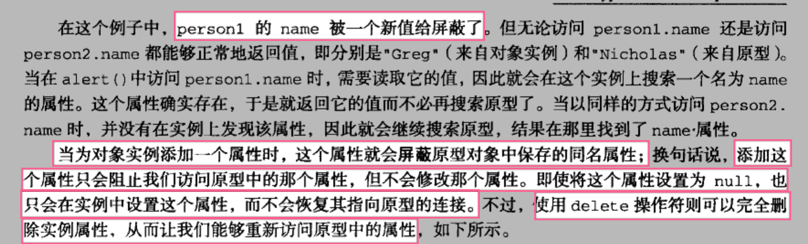


# 继承
## ① 原型链继承
* 让子构造器的原型等于父元素的实例对象
* 通过子构造器产生的新的对象就都具备父构造器
* 上面的属性以及方法,包括原型上面的属性以及方法


```js

        function SuperType(){
            this.property = true;
        }

        SuperType.prototype.getSuperValue = function(){
            return this.property;
        }

        function SubType(){
            this.subproperty = false;
        }

        //继承SuperType
        SubType.prototype = new SuperType();
        
    
        SubType.prototype.getSubValue = function(){
            return this.subproperty;
        }

        var instance = new SubType();
        console.log(instance.getSuperValue()); //true

```

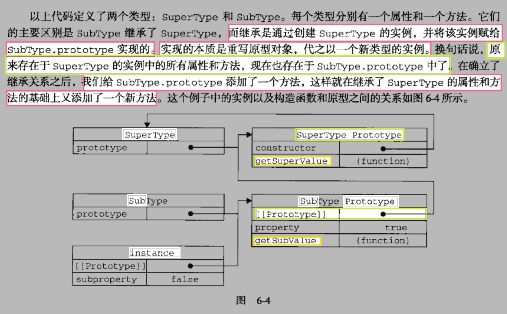

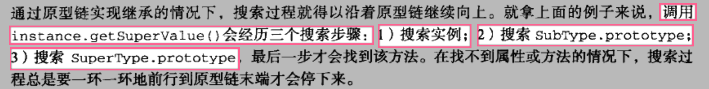

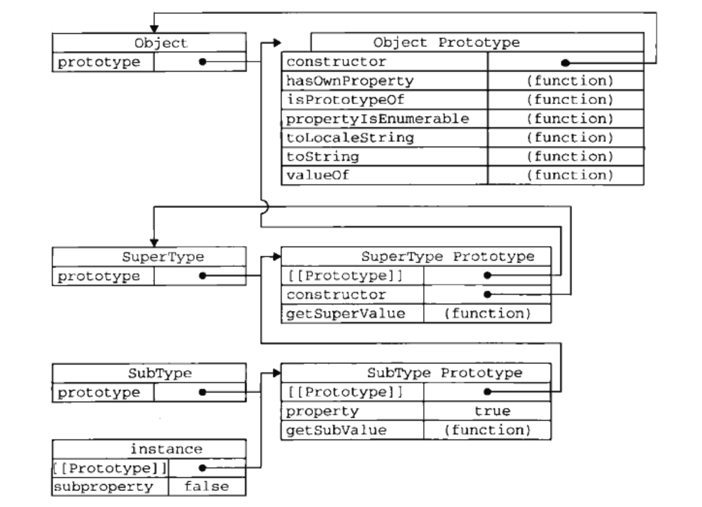

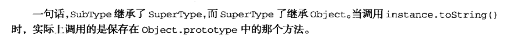


### 确定原型和实例之间的关系

#### instanceof关键字

```js

        console.log(instance instanceof Object); //true
        console.log(instance instanceof SuperType); //true
        console.log(instance instanceof SubType); //true

```

#### isPrototypeOf函数


```js

        console.log(Object.prototype.isPrototypeOf(instance)); //true
        console.log(SuperType.prototype.isPrototypeOf(instance)); //true
        console.log(SubType.prototype.isPrototypeOf(instance)); //true


```

## ② apply call方法的调用


```js

       function SuperType(){
           this.colors = ['red','blue','green'];
       }

       function SubType(){
       }

       //继承 SuperType
        SubType.prototype = new SuperType();

        var instancel = new SubType();
        instancel.colors.push("black");
       console.log(instancel.colors);//["red", "blue", "green", "black"]
       console.log(instancel.colors);//["red", "blue", "green", "black"]


```

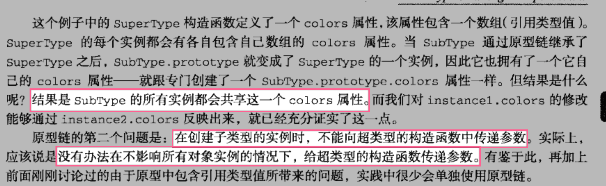


## ③ 借用构造函数继承
* 使用一个call 或者 apply的方式来实现
* 不能继承父构造器原型上面的属性和方法
* 父元素上面定义了原型,没有new person prototype定义的没有什么作用


```js

       function SuperType(){
           this.colors = ['red','blue','green'];
       }

       function SubType(){
           //继承 SuperType
           SuperType.call(this);
       }


        var instancel = new SubType();
        instancel.colors.push("black");
       var instancel1 = new SubType();

       console.log(instancel.colors);//["red", "blue", "green", "black"]
       console.log(instancel1.colors);//["red", "blue", "green"]

```


```js


 function SuperType(name){
          this.name = name;
      }

        function SubType(){
            //继承了SuperType 同时还传递了参数
            SuperType.call(this,"Nicholas");
            //实例属性
            this.age = 11;
        }

        var instance = new SubType();
       console.log(instance.name);
       console.log(instance.age);

```

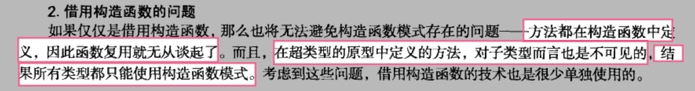


## ④ 组合继承

```js

function SuperType(name){
        this.name = name;
        this.colors = ['red','blue','green'];
    }

        SuperType.prototype.sayName = function () {
            console.log(this.name);
        }

        function SubType(name,age){
            //继承属性
            SuperType.call(this,name);
            this.age = age;
        }

        //继承方法
        SubType.prototype = new SuperType();

        SubType.prototype.sayAge = function(){
            console.log(this.age);
        }

       var instancel1 = new SubType("Nicholas",29);
        instancel1.colors.push("black");
        instancel1.sayName();
        instancel1.sayAge();
        console.log(instancel1);
        //SubType {name: "Nicholas", colors: Array[4], age: 29}

        var instancel2 = new SubType("Greg",27);
        console.log(instancel2);
        //SubType {name: "Greg", colors: Array[3], age: 27}


```

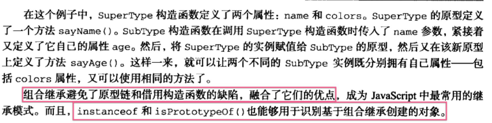


