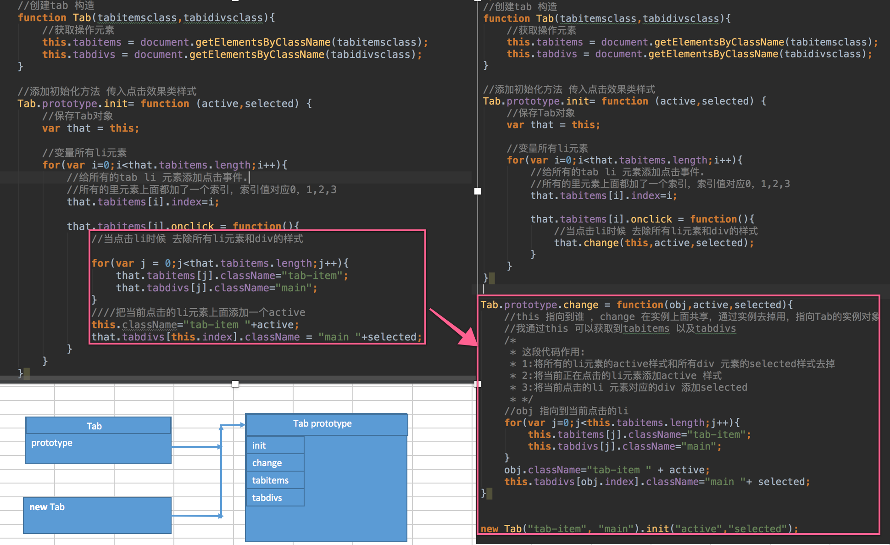
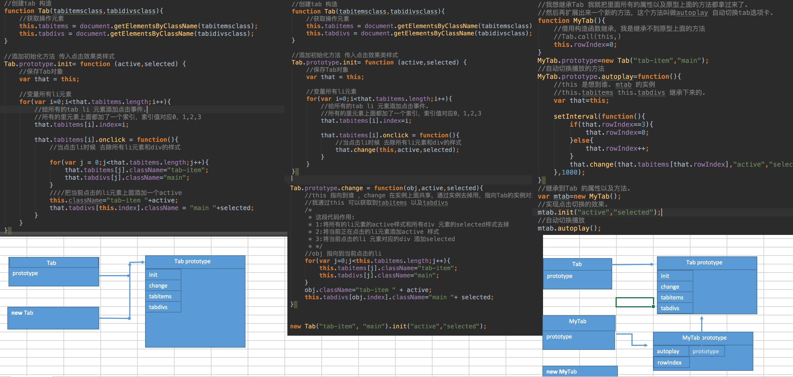
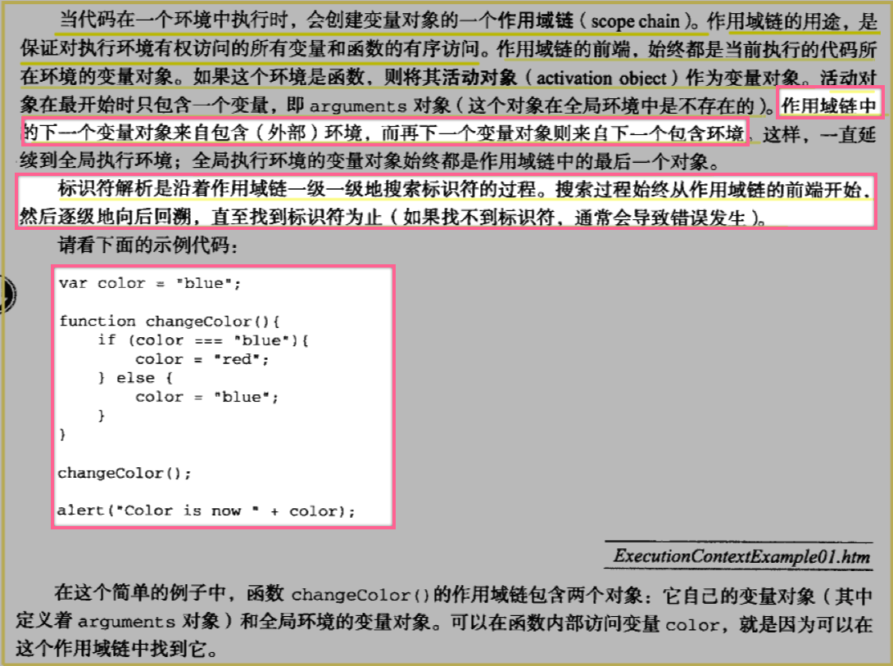
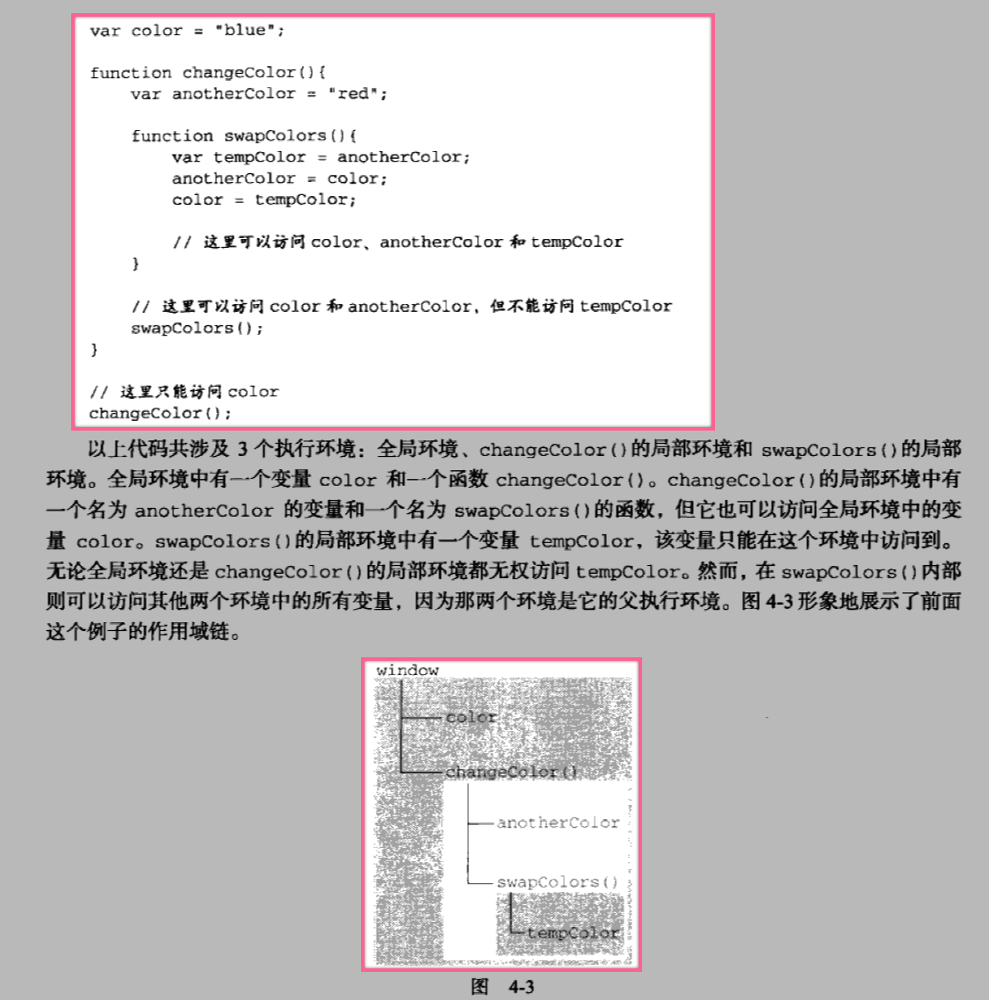
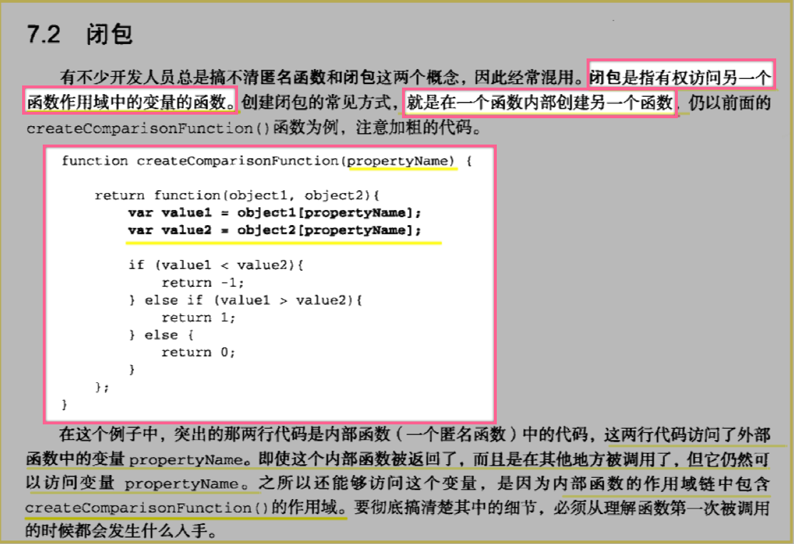
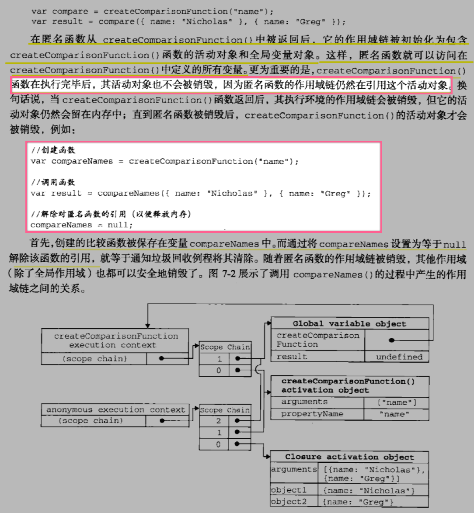

# JavaScript_Day05_this_作用域链_闭包_AJAX

[TOC]

## 选项卡 案例

```css

* {
            margin: 0;
            padding: 0;
        }
        ul {
            list-style: none;
        }
        .wrapper {
            width: 1000px;
            height: 475px;
            margin: 0 auto;
            margin-top: 100px;
        }

        .tab {
            border: 1px solid #ddd;
            border-bottom: 0;
            height: 36px;
            width: 320px;
        }
        .tab li {
            position: relative;
            float: left;
            width: 80px;
            height: 34px;
            line-height: 34px;
            text-align: center;
            cursor: pointer;
            border-top: 4px solid #fff;
        }

        .tab span {
            position: absolute;
            right: 0;
            top: 10px;
            background: #ddd;
            width: 1px;
            height: 14px;
            overflow: hidden;
        }
        .products {
            width: 1002px;
            border: 1px solid #ddd;
            height: 476px;
        }

        .products .main {
            float: left;
            display: none;
        }

        .products .main.selected {
            display: block;
        }

        .tab li.active {
            border-color: red;
            border-bottom: 0;
        }
        .message{
            width: 200px;
            height: 30px;
            line-height: 30px;
            padding-left: 40px;
            border: 1px solid #ccc;
            font-size: 12px;
            opacity: 0;
        }

```


```html

<div class="wrapper">
    <ul class="tab">
        <li class="tab-item active">国际大牌<span></span></li>
        <li class="tab-item ">国妆名牌<span></span></li>
        <li class="tab-item">清洁用品<span></span></li>
        <li class="tab-item">男士精品</li>
    </ul>
    <div class="products">
        <div class="main selected">
            <a href="###"></a>
        </div>
        <div class="main">
            <a href="###"></a>
        </div>
        <div class="main">
            <a href="###"></a>
        </div>
        <div class="main">
            <a href="###"></a>
        </div>
    </div>

```
### 案例:面向过程的tab选项卡



### 继承方式扩展的tab选项卡,自动选项卡切换



## this 的几种指向
### this 指向到window
```js
/*
 1:this 指向到window 普通方法
*/
function fn(){
    console.log(this);
}

```

### this 指向到undefined 

```js

/*
            * 2:this 在es6的严格语法 加这样一句就是严格模式 use strict
            * this 的指向就是undefined ，作为一个普通函数，
            * 就不需要在里面使用this
            * */

                          function fn(){
                  //但是在this 现在指向window ECMAScript 标准
                  //console.log(this);
                  //它最新的指向就是undefined
                  //ECMAScript6 的最新的严格语法模式.
                  //启用严格语法模式
                  "use strict"
                  //这个时候this 的指向就是undefined
                  console.log(this);

              }
              fn(); //fn 普通方法

```

### this 指向对象(call)

```js

   //3：this 指向到调用的这个对象.
          function fn(){
                     //1:this window
                     //2:undefined
                     //this
                     console.log(this);
                }
                var obj={
                    name:"zhangsan"
                }
                fn.call(obj);
                //这里的this 指向到对象本身
              var obj={
                   fn:function(){
                       console.log(this);
                   }
              }
              obj.fn();

```

### this 指向事件源

```js

//      this 指向当前触发事件的元素，实际我们可以理解成事件源.
        document.getElementsByTagName("div")[0].onclick=function(){
            console.log(this);

        }

```

## 作用域链 [局部域 全局域]






## 闭包
### 闭包的概念
* 在函数外的变量指向到函数中 内部私有函数
* 在全局域中操作局部域中的变量





```js

            /*闭包的概念*/

            function foo(){
                 var a=1;
                 function foo1(){
                      a++;
                      console.log(a);
                 }
                 return  foo1;
            }
            //我想在这个全局域当中直接去操作这个局部变量a
            var fn=foo();
            fn();
            /*
            * 这样的一个过程我就创建了一个闭包
            * foo1 是foo 的一个内部的函数.
            * fn 它指向到 foo 的内部的foo1 的函数.
            * 实际上这个过程就创建了闭包.
            * foo外的一个变量指向到foo内的一个私有函数，这个过程就叫做闭包.
            * 作用：在全局域当中去操作局部域当中的a 变量.
            * */

```

### 闭包的具体事例

```js

/*
            * 老段的私房钱
            * */
            //var money=100;
            function Adminmoney(){
                 var money=100;
                 return function(num){
                      if(num<1){
                          money=money-num;
                          console.log(money);
                      }else{
                          console.log("太多了，不能给这么多..")
                      }
                 }
            }
            //var fn=Adminmoney();
            //fn(0.9);
            //fn(0.8);
            //闭包，可以保护好一些变量.
            //在我们开发的时候，我们往往全局的变量
            //这个变量我们需要保护好，通过闭包进行一个保护.
            function nextPage(){
                 var currentPage=1;
                 return function (){
                     return currentPage=currentPage+1;
                 }
            }
            //这个是闭包的实际应用场景.
            console.log(nextPage()());

```

## tryCath 异常处理

```js

            //影响下面的代码继续运行


            function fn(){
                try{
                    console.log(num);
                }catch (e){ //exception 异常，错误.
                    console.log(e);
                    //处理的逻辑.
                    //在某个文件里面记录一下.
                    throw e; //往外抛出这个错误.
                }
            }
            fn();
            console.log("下面执行的代码.")

```

## in 和 hasOwnProperty 的使用
* in 判断一个对象中是否存在某个属性,包括对象在原型上的的属性
* hasOwnProperty 判断一个对象当中是否存在某个属性,不包括对象在原型上的属性
* typeof 和 instanceOf

## ajax 
### 同步交互和异步交互 
####同步交互
* 页面给服务器发生一个请求,服务器返回的数据会把原来的界面覆盖掉

#### 异步交互
* 页面给服务器发生一个请求,服务器返回的数据不会把原来的界面覆盖掉

### AJAX 的概念
* ajax概念:页面不刷新，就可以动态的跟服务器进行数据交互.
* ajax的原理：实际上是js 提供了一个对象XMLHttpRequest 对象，用来进行交互.

### AJAX 的使用
* 通过XMLHttpRequest 对象 去发生请求接收数据
* 交互分为四个步骤

1. **创建XMLHttpRequest** 对象 `var xhr=new XMLHttpRequest();`
2. **通过这个对象打开连接**【连接服务器】 open() 打开的
3. **给服务器发送数据**       send() 发送数据
4. **接收数据** 接收数据是通过一个回调函数,服务器有数据回来就会调用这个函数.

### AJAX 的简单交互

```js

   window.onload = function(){
      document.getElementsByTagName("input")[0].onclick = function(){

        var xhr = new XMLHttpRequest();
        xhr.onreadystatechange = function(){
          if(xhr.readyState == 4){
            if(xhr.status == 200){
              var data=xhr.responseText;
              console.log(data);
              //获取到数据之后，将数据放在页面上面，通过document
              document.getElementById("message").innerHTML=data;
            }
          }
        }

        xhr.open("get","http://localhost:63343/MVC12/Frame/Demo.php?username=zhangs");
        xhr.send(null);

      }
    }

```


### AJAX DEMO

```js

    window.onload = function(){
      document.getElementById("username").onblur = function(){
        var username = this.value;

        var xhr = new XMLHttpRequest();
        xhr.onreadystatechange = function () {
          if(xhr.readyState == 4 && xhr.status == 200){
              var data = xhr.responseText;
              document.getElementById("message").innerHTML = data;
          }
        }

        xhr.open("get","http://localhost:63343/MVC12/Frame/Demo.php?username="+username);
        xhr.send(null);

      }
    }

```

 


 


