# jQuery_Day02_jQuery的使用_动画_节点操作_设置内容_事件绑定_标签切换_下拉列表_随机切换图片_全选反选_选择好友案例_动态创建表格_乐淘加载框

[TOC]

## jQuery 的动画处理
### show() hide() 和 toggle()  显示隐藏
* 通过 jQuery，您可以使用 hide() 和 show() 方法来隐藏和显示 HTML 元素：

```js
$("#hide").click(function(){
  $("p").hide();
});
 
$("#show").click(function(){
  $("p").show();
});

```


```js

$("button").click(function(){
  $("p").toggle();
});

```


-------

### fadeIn fadeOut 和 fadeToggle() 淡入淡出
* fadeTo(2000,0.4) 以两秒的总数据 到达opacity 的值到0.4

    
```js

 $(function(){
            $("#btn1").click(function(){
                $("div").fadeIn(300);
            })

            $("#btn2").click(function(){
                $("div").fadeOut(300);
            })
            $("#btn3").click(function(){
                $("div").fadeToggle(300);
            })
            $("#btn4").click(function(){
                $("div").fadeTo(300,0.7);
            })

        });

```


-------

### slideUp slideDown 滑动动画
    * slideUp 只改高度 向上收起 显示当前元素
    * slideDown  只改高度 向下展开 显示当前元素
    * slideToggle 切换


```js

  $(function(){
            $("#btn1").click(function(){
                $("div").slideUp(300);
            })

            $("#btn2").click(function(){
                $("div").slideDown(300);
            })
            $("#btn3").click(function(){
                $("div").slideToggle(300);
            })
        });

```
    


-------

### 自定义动画 animate()
* 定义动画的时候,动画属性的值必须数字 比如:背景色就不能


```js

            $("#btn1").click(function(){
                //delay 延迟 延迟多少毫秒之后在执行
                //$("div").animate({"marginTop":"300px"},2000) 执行完毕
                //等待1500毫秒，继续执行下面的内容 animate({"marginLeft":"10px"},2000)
                $("div").animate({"marginTop":"100px"},2000)
                        .delay(1500).animate({"marginLeft":"100px"},2000);
            })

```

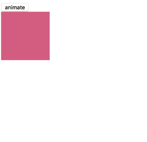

-------

### 动画队列
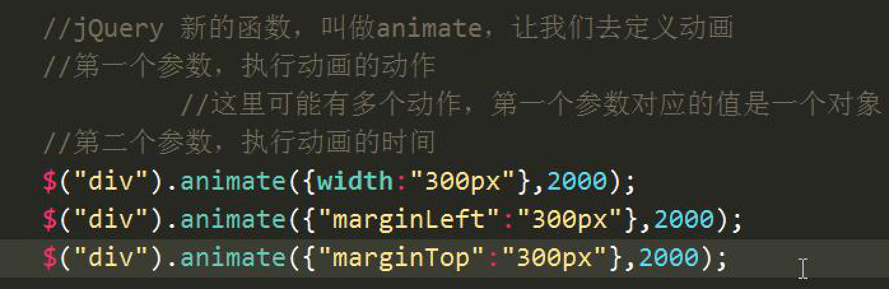
    
* 动画在执行过程总会形成一个队列
* 当前元素有一堆动画处理,先进先出
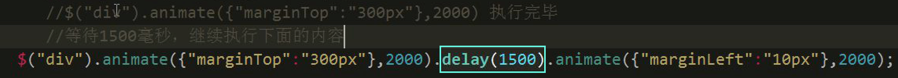

-------

### 补间动画和帧动画
* 执行动画 把背景色 从红色变成绿色

```js


                   //执行动画的值是背景色，比如我要把红色变成绿色
                  //因为现在给了一个jQuery 起始颜色是红色，终止颜色是绿色，
                  //jQuery 要执行动画，它不知道中间的颜色的状态 但是它不知道中间的颜色.
                  /*
                  * 动画分为两种类型的动画：
                  *         1：帧动画 要知道动画的任何一个状态，一帧一帧的去切换.
                  *         2：补间动画  只需要知道其实状态，结束状态，不需要管中间状态.
                  *     之前我们给的width=300px ，当前元素的width 刚开始100
                  *     起始状态是100 终止状态是300，中间的状态，jQuery 是可以去计算的
                  *     因为是数字，所以jQuery 可以去计算.
                  *     在使用的animate 的时候需要注意的
                  *     第一个参数是动画的行为，动画的行为对应的值必须是数字
                  *     fontSize:99px;
                  *     animate({})
                  * */
                  $("div").animate({"fontSize":"300px"},1000);

```

-------

### stop() 动画停止
* 方法中有两个参数
* 两个参数都是 boolean类型
* 当一个参数 如果是true ,就会把当前元素里面的动画队列清除掉
* 第二个参数,如果是true ,让当前动画立即回到它结束时候的状态,如果是false 会当当前动画立即停止 保留显示状态 


```js

$(function () {
            $("button:eq(0)").click(function () {
                /*
                 * 当我们队当前元素进行多次点击，
                 * 就会多次调用toggle
                 * 这个元素上面就会出现多次动画
                 * 这个动画就会形成一个队列。
                 * 等待上一次的动画执行完毕，接着执行下一个动画.
                 * 但是用户不希望看到这样.
                 * */
                $("div").toggle(2000);
            });
            $("button:eq(1)").click(function () {

                //停止动画.
                /*
                 *  这个方法里面有两个参数
                 *  两个参数都是boolean类型
                 *  第一个参数如果是true，把当前元素里面的动画的队列清楚掉.
                 *  第二个参数，
                 *   如果是true，让当前的动画立即回到它结束的时候的状态
                 *   如果是false，让当前的动画立即停止
                 * */
                $("div").stop(true,false);
            });
        });

```

-------

## jQuery 节点操作
### append()
* 描述: 网当前元素的**内部的**结尾处追加一个指定的元素


* 在所有 `<p>` 元素结尾插入内容：

```js

$("p").append("<b>Appended text</b>");

```

-------

### appendTo
* 描述: 将当前元素追加到指定元素的**内部**结尾处 当前元素会被剪切
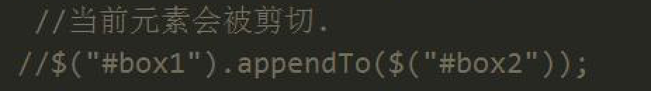

* 在每个 `<p>` 元素的结尾插入 `<span>` 元素：


```js

$("<span>Hello World!</span>").appendTo("p");

```

-------

### prepend
* 描述: 往当前元素的**内部的**开始处追加一个元素 被追加的元素会被剪切
* 在所有 `<p>` 元素开头插入内容：

```js

$("p").prepend("<b>Prepended text</b>");

```

-------

### prependTo
* 描述: 将当前元素追加到指定元素**内部的**开始处
* 在每个 `<p>` 元素的开头插入 `<span>` 元素：

```js

$("<span>Hello World!</span>").prependTo("p");

```

-------

### before 
* 在...之前 描述:在当前元素外部的**前面的**追加一个指定的元素
* 在每个 `<p>` 元素前插入内容：

```js

$("p").before("<p>Hello world!</p>");

```

-------

### after
* 在当前元素**外面的**后面的追加一个指定的元素
* 在每个 `<p>` 元素后插入内容：

```js

$("p").after("<p>Hello world!</p>");

```

-------

### insertAfter
* insertAfter() 方法在被选元素后插入 HTML 元素。

```js

 $("<p>这是一个新段落。</p>").insertAfter("button");

```

-------

### insertBefore
* insertBefore() 方法在被选元素前插入 HTML 元素。
* 在每个 `<p>` 元素前插入一个 `<span>` 元素：
* `$("<span>Hello world!</span>").insertBefore("p");`


-------

## 设置内容 和 获取内容
### html()方法 
* 设置内容 和 innrHTML
* 改变所有 `<p>` 元素的内容：

```js

$("p").html("Hello <b>world</b>!");

```

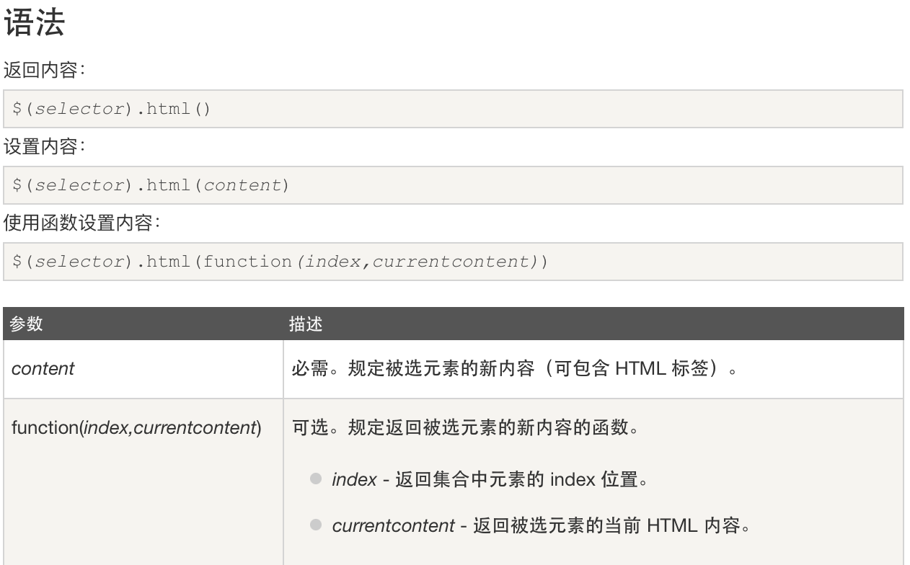


-------

### text() 方法

* 设置所有 `<p>` 元素的文本内容：

```js

$("p").text("Hello world!");

```

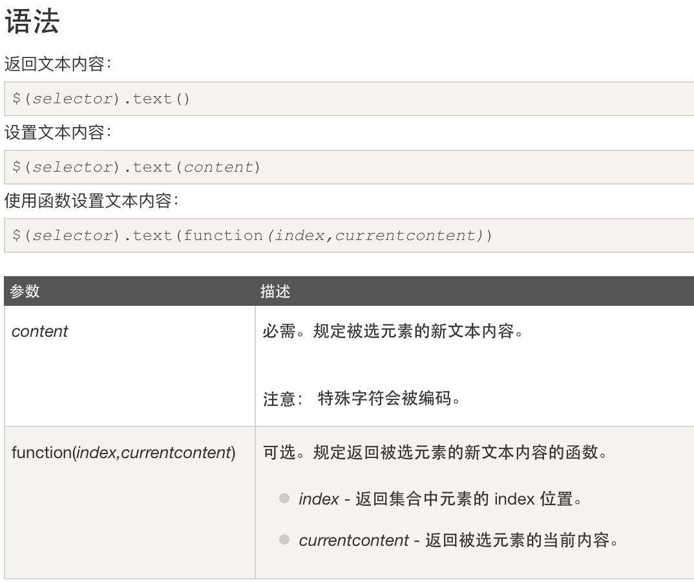


-------

### 清空元素
####empty()
`$("div").empty();`

* 只清除指定元素内部的内容
* empty() 方法从被选元素所有子节点和内容。
* ==注意：该方法不会移除元素本身，或它的属性==
* 提示：如需移除元素，但保留数据和事件，请使用 `detach()` 方法。
* 提示：如需移除元素及它的数据和事件，请使用 `remove()` 方法。

-------

####remove() 
`$("p").remove();`

* `remove()` 方法移除被选元素，包括所有的文本和子节点。
* ==该方法也会移除被选元素的数据和事件==
* 提示：如需移除元素，但保留数据和事件，请使用 `detach()` 方法代替。
* 提示：如只需从被选元素移除内容，请使用 `empty()` 方法。

-------


### 克隆元素 clone
`clone()`
`clone(true)` 深度克隆并且克隆当前元素的事件

* 克隆所有的 `<p>` 元素，并插入到 `<body>` 元素的结尾：
* `$("p").clone().appendTo("body");`

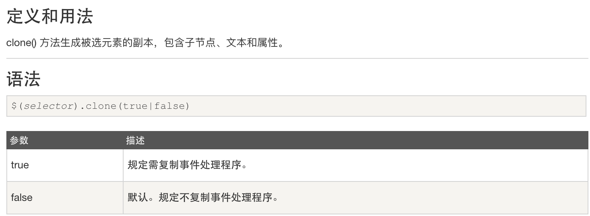


-------

### 属性操作
#### attr()
* `attr("href")`如果是一个参数,根据指定的属性名,获取到指定的属性值 

* 如果是两个参数 `attr("href","http://www.itcast.cn")`会设置属性值 

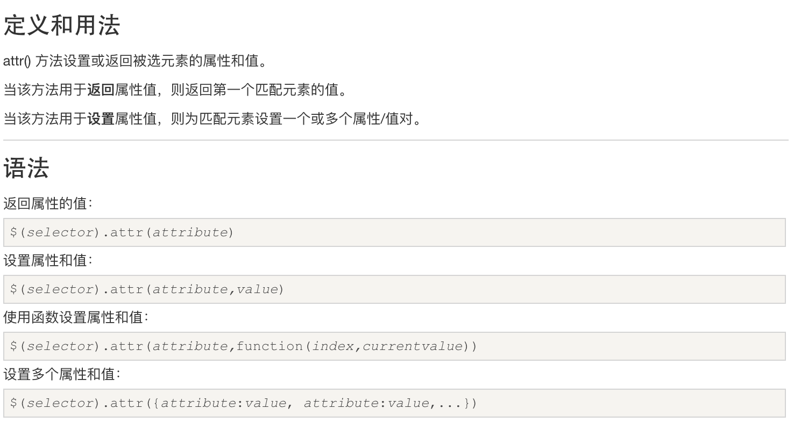

* 设置图像的 width 属性：
* `$("img").attr("width","500");`

-------

#### removeAttr()
* 从所有的 `<p>` 元素移除样式属性：
* `$("p").removeAttr("style");`
* removeAttr() 方法从被选元素移除一个或多个属性。

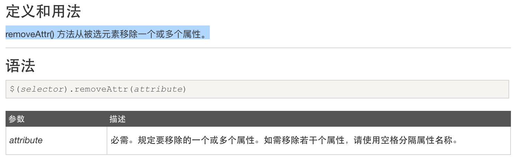


-------

#### prop()

* 注意: 表单属性,是只读属性 使用`prop("checked",值)` 操作 

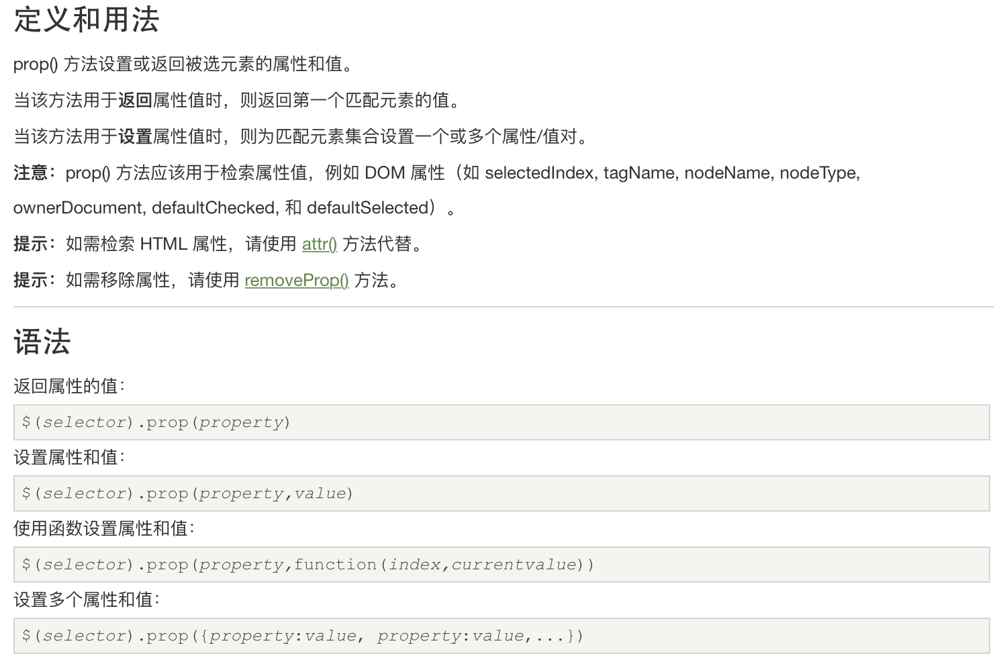

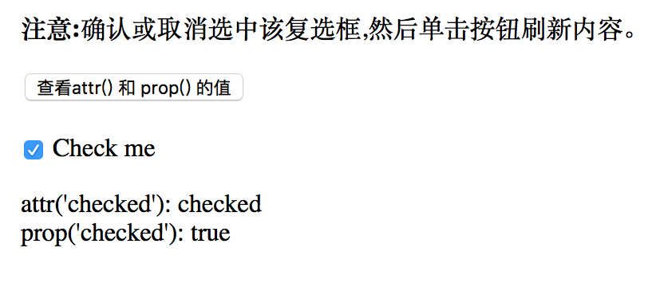

-------

### 内容操作

-------

`val()`   是获取表单输入框中的内容
`text()`  是获取当前元素下面的所有子元素的文本不包含标签
`html()`  是获取是获取当前元素下面的所有子元素的文本包含标签

-------

* `$("input[type=text]").val("要设置的值")` 如果添加参数就是设置内容
* `val()` 如果没有添加参数,就是获取当前输入框中的内容
* `val("")`如果添加参数,就是设置表单输入框中的值

-------

### 坐标操作 offset()
* 获取元素位置 `offset()`  
* 如果不加参数返回的是一个对象,对象有当前元素在页面上 的 left top 值
* `offset(obj)` 添加删除参数是一个对象,设置位置 设置位置 left 和 top
* ==注意: 相对的是当前浏览器窗口的值== 
* ==注意:会给当前元素设置 定位==

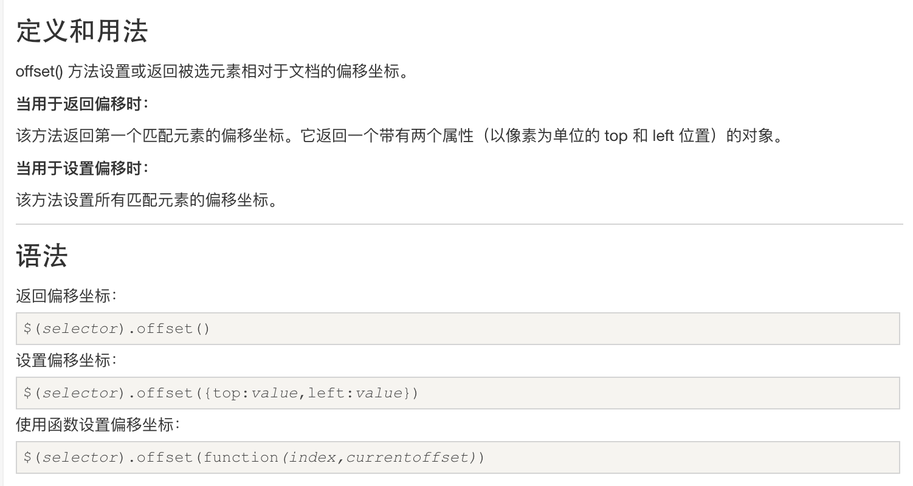

-------


## 事件绑定
### 直接通过方法进行绑定
* 每个不同类型事件绑定,对应jQuery  都有一个方法
* click() mouseover() mouseout()
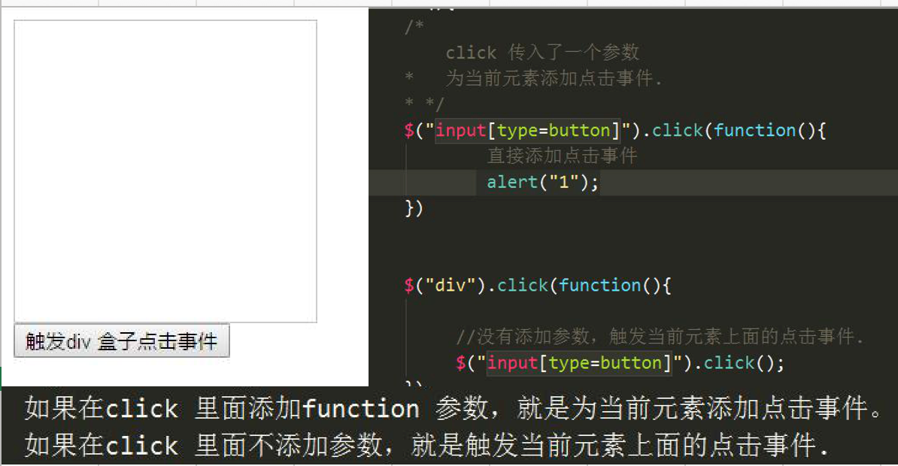

-------

### 直接同bind 绑定事件

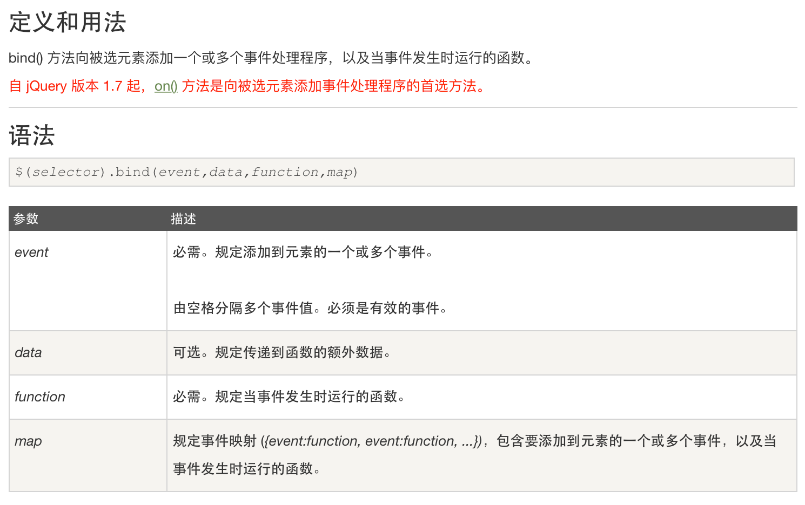


```js

$(document).ready(function(){
  $("p").bind("mouseover mouseout",function(){
    $("p").toggleClass("intro");
  });
});

```

-------

### delegate 
* [委托 委派的] 事件通过其他元素委派上去
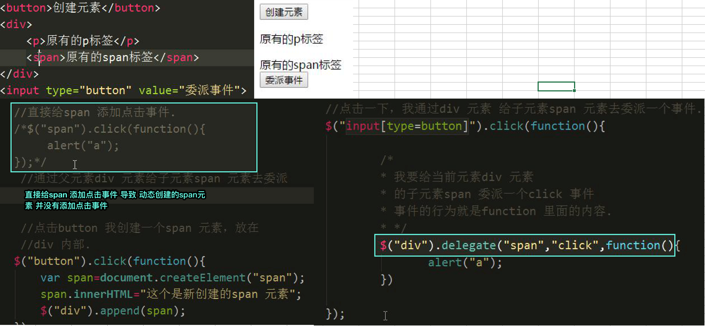

* 当单击 `<div>` 元素内部的 `<p>` 元素时，改变所有 `<p>` 元素的背景颜色：

```js

$("div").delegate("p","click",function(){
    $("p").css("background-color","pink");
});

```

### on 事件绑定 off()
#### on()
* 方法在被选元素及子元素上添加一个或多个事件处理程序
* `$("p").on("click",function(){})`

-------

#### off()
* 移除所有 `<p>` 元素上的 `click` 事件：
* `$("p").off("click");`


-------

### mouseenter mouseleave 与 mouseenter mouseover 的区别
* **mouseover与mouseenter**
* 不论鼠标指针穿过被选元素或其子元素，都会触发 mouseover 事件。
* 只有在鼠标指针穿过被选元素时，才会触发 mouseenter 事件。

* **mouseout与mouseleave**
* 不论鼠标指针离开被选元素还是任何子元素，都会触发 mouseout 事件。
* 只有在鼠标指针离开被选元素时，才会触发 mouseleave 事件

-------

## 案例
### 标签切换

```js

                $(function(){

                        //所有的tab 导航栏的点击事件
                        $(".tab-item").click(function(){
                                /*
                                * 1: 当前元素上面有一个红色的边框，其它的tab 导航栏的红色边框去掉
                                * 2: 找到当前导航栏的导航对应的这个区域显示，把其它的区域隐藏
                                *   可以根据索引去找到对应的区域
                                * */
                                //1: 当前元素上面有一个红色的边框，其它的tab 导航栏的红色边框去掉
                                $(this).addClass("active").siblings().removeClass("active");
                               //2: 找到当前导航栏的导航对应的这个区域显示，把其它的区域隐藏
                              /// *   可以根据索引去找到对应的区域
                                var index=$(this).index();
                                $(".products div").eq(index).show().siblings().hide();
                        })
                })

```

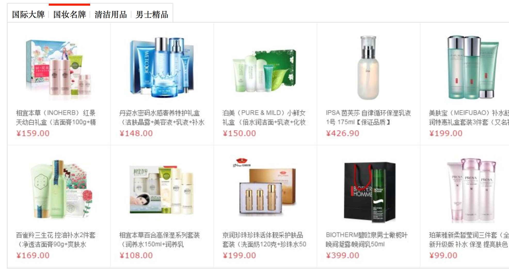


```html

<div class="wrapper">
    <ul class="tab">
        <li class="tab-item active">国际大牌<span></span></li>
        <li class="tab-item ">国妆名牌<span></span></li>
        <li class="tab-item">清洁用品<span></span></li>
        <li class="tab-item">男士精品</li>
    </ul>
    <div class="products">
        <div class="main selected">
            <a href="###"></a>
        </div>
        <div class="main">
            <a href="###"></a>
        </div>
        <div class="main">
            <a href="###"></a>
        </div>
        <div class="main">
            <a href="###"></a>
        </div>
    </div>
</div>

```
-------

### 下拉列表
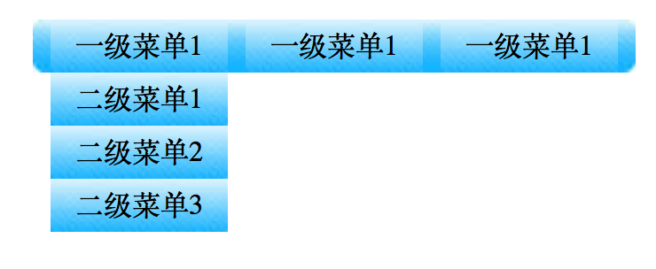

```js

        $(function () {
            //1.获取一级的li  绑定鼠标移入事件
            $(".wrap>ul>li").mouseenter(function () {

                  //让当前元素的动画的队列里面动画全部清除，让当前动画回到结束的时候的状态
                  $(this).children("ul").stop(true,true);
                  $(this).children("ul").slideDown();

            });
            //3.获取一级的li 绑定鼠标移出事件 离开后还要隐藏
            $(".wrap>ul>li").mouseleave(function () {
                    //让当前元素的动画的队列里面动画全部清除，让当前动画回到结束的时候的状态
                    $(this).children("ul").stop(true,true);
                    $(this).children("ul").slideUp();
            });
        });

```


```html

<div class="wrap">
    <ul>
        <li>
            <a href="javascript:void(0);">一级菜单1</a>
            <ul>
                <li><a href="javascript:void(0);">二级菜单1</a></li>
                <li><a href="javascript:void(0);">二级菜单2</a></li>
                <li><a href="javascript:void(0);">二级菜单3</a></li>
            </ul>
        </li>
        <li>
            <a href="javascript:void(0);">一级菜单1</a>
            <ul>
                <li><a href="javascript:void(0);">二级菜单1</a></li>
                <li><a href="javascript:void(0);">二级菜单2</a></li>
                <li><a href="javascript:void(0);">二级菜单3</a></li>
            </ul>
        </li>
        <li>
            <a href="javascript:void(0);">一级菜单1</a>
            <ul>
                <li><a href="javascript:void(0);">二级菜单1</a></li>
                <li><a href="javascript:void(0);">二级菜单2</a></li>
                <li><a href="javascript:void(0);">二级菜单3</a></li>
            </ul>
        </li>

```


### 随机切换图片
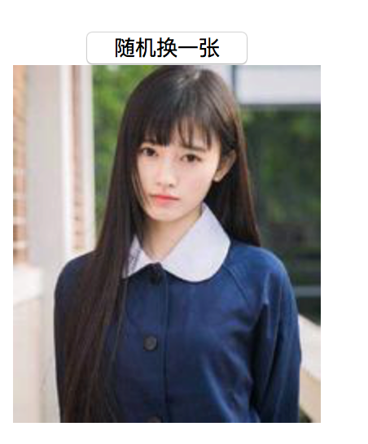

```js

  $(function () {
                /*1：页面加载完毕生成一张默认的图片
                * 2: 按钮点击事件。
                * 3: 点击业务逻辑处理
                * 4: 生成一个随机数. 0-5
                * 5: switch (randeom){
                *      case 0:{
                *           var src=""
                *
                *      }
                *      case 1:{
                *           var src=""
                *      }
                *      case 2:{
                 *          var src=""
                 *      }
                 *
                 *  src 的地址.
                 *
                 *  把这个地址设置到img 元素上面去  attr("src","")
                * }
                * */
                $("#imgMax").attr("src","imgs/b.jpg").attr("title","这个是一个美女").attr("imgs/b.jpg");


                $("#btnChangeImg").click(function(){

                        //生成随机数. 0,1,2,3,4
                        var random=Math.floor(Math.random() * 5);
                        var src="";
                        switch (random){
                             case 0:{
                                 src="imgs/a.jpg";
                                 break;
                             }
                             case 1:{
                                 src="imgs/b.jpg";
                                 break;
                             }
                             case 2:{
                                 src="imgs/c.jpg";
                                 break;
                             }
                             case 3:{
                                 src="imgs/d.jpg";
                                 break;
                             }
                             case 4:{
                                 src="imgs/e.jpg";
                                 break;
                             }
                         }
                        $("#imgMax").attr("src",src).attr("title","帅哥美女随心配").attr("alt",src);
                });

        });

```


```html

    <input type="button" value="随机换一张" id="btnChangeImg">
    

```

### 全选反选
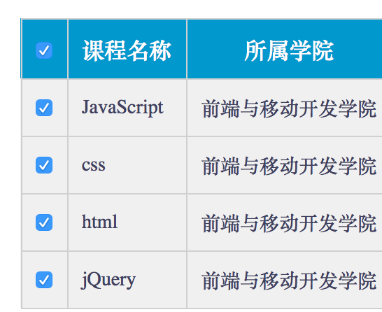

```js

  $(function () {

                //点击全选.
                $("#j_cbAll").click(function(){


                        var checked=$(this).prop("checked");


                         $("#j_tb input:checkbox").prop("checked",checked);

                });


        });

```


```html

<div class="wrap">
    <table>
        <thead>
        <tr>
            <th>
                <input type="checkbox" id="j_cbAll"/>
            </th>
            <th>课程名称</th>
            <th>所属学院</th>
        </tr>
        </thead>
        <tbody id="j_tb">
            <tr>
                <td>
                    <input type="checkbox"/>
                </td>
                <td>JavaScript</td>
                <td>前端与移动开发学院</td>
            </tr>
            <tr>
                <td>
                    <input type="checkbox"/>
                </td>
                <td>css</td>
                <td>前端与移动开发学院</td>
            </tr>
            <tr>
                <td>
                    <input type="checkbox"/>
                </td>
                <td>html</td>
                <td>前端与移动开发学院</td>
            </tr>
            <tr>
                <td>
                    <input type="checkbox"/>
                </td>
                <td>jQuery</td>
                <td>前端与移动开发学院</td>
            </tr>
        </tbody>
    </table>
</div>

```


```js

        $(function () {

                $("#j_cbAll").click(function(){
                        var checked=$(this).prop("checked");
                        $("#j_tb input:checkbox").prop("checked",checked);

                });

                $("#j_tb input:checkbox").click(function(){
                  //获取所有的checkedbox
                  var lilength=$("#j_tb input:checkbox").length;
                  //获取选中的checked
                  var lichecked=$("#j_tb input:checkbox:checked").length;
                  /*if(lilength==lichecked){
                      $("#j_cbAll").prop("checked",true);
                  }else{
                      $("#j_cbAll").prop("checked",false);
                  }*/
                  $("#j_cbAll").prop("checked",lilength==lichecked);

                });

        });

```

### 选择好友案例

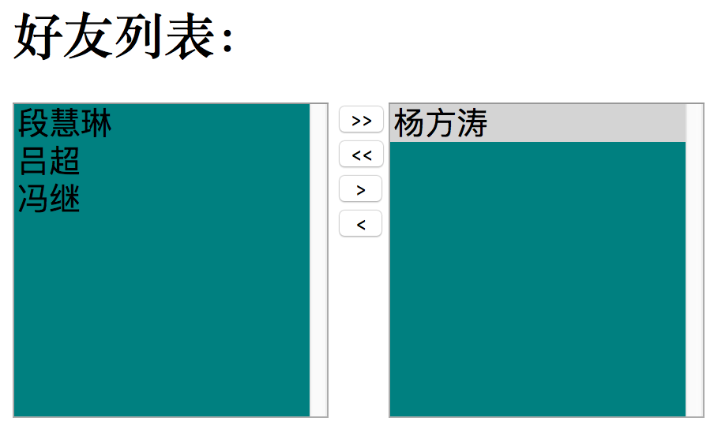


```js

        $(function () {
            //左边的下拉框
            var $leftSelect=$("#src-city");
            //右边的下拉框
            var $rightSelect=$("#tar-city");
            //要将左边所有的内容追加到右边，而且左边的内容要被剪切掉.
            $("#btn1").click(function () {
                $rightSelect.append($leftSelect.children("option"));
            });
            //要将右边所有的option 添加到左边.
            $("#btn2").click(function () {
                $leftSelect.append($rightSelect.children("option"));
            });
            //要将左边选中的option 添加到右边
            $("#btn3").click(function () {
                $rightSelect.append($leftSelect.children("option:selected"))
            });
            $("#btn4").click(function () {
                $leftSelect.append($rightSelect.children("option:selected"))
            })
        });

```


```html

<h1>好友列表：</h1>
<select id="src-city" name="src-city" multiple>
    <option value="1">段慧琳</option>
    <option value="2">吕超</option>
    <option value="3">冯继</option>
    <option value="4">杨方涛</option>
</select>

<div class="btn-box">
    <button id="btn1">&gt;&gt;</button>
    <button id="btn2">&lt;&lt;</button>
    <button id="btn3">&nbsp;&gt;&nbsp;</button>
    <button id="btn4">&nbsp;&lt;&nbsp;</button>
</div>
<select id="tar-city" name="tar-city" multiple>

</select>

```

### 动态创建表格案例

```js

        $(function(){
                /*
                * 点击j_btnGetData 按钮，要去获取数据，获取到数据之后，将数据渲染到table 里面去.
                * */
                $("#j_btnGetData").click(function(){

                        /*
                        * 如果是真实的开发，我们可能在这里去获取数据，从后台去获取数据。
                        * 数据.
                        * */
                        var datas=[
                            {"title":"传智播客","url":"http://www.itcast.cn","desc":"程序员的摇篮"},
                            {"title":"北大","url":"http://www.bd.com","desc":"中国的大学的标杆"},
                            {"title":"传智学院","url":"http://www.czxy.com","desc":"中国很好的大学"}
                        ];
                        /*解析这个数据， 跟标签进行拼接.
                        然后放到页面上面.
                        * <tr>
                             <td></td>
                             <td></td>
                             <td></td>
                         </tr>
                        * */
                        var array=[];
                        for(var i=0;i<datas.length;i++){
                            /*
                                datas[i].title
                                datas[i].url
                                datas[i].desc
                            */
                            var tr="<tr>";
                            tr+="<td>"+datas[i].title+"</td>";
                            tr+="<td>"+datas[i].url+"</td>";
                            tr+="<td>"+datas[i].desc+"</td>";
                            tr+="</tr>";
                            //将元素添加到数组里面去.
                            array.push(tr);
                        }
                        //将数组里面的元素是指定的符号进行连接.返回一个字符串.
                        var str=array.join("");
                        console.log(str);
                        $("#j_tbData").html(str);
                });
        });

```


```html

<input type="button" value="获取数据" id="j_btnGetData"/>
<table>
    <thead>
    <tr>
        <th>标题</th>
        <th>地址</th>
        <th>说明</th>
    </tr>
    </thead>
    <tbody id="j_tbData">

    </tbody>
</table>

```

### 乐淘

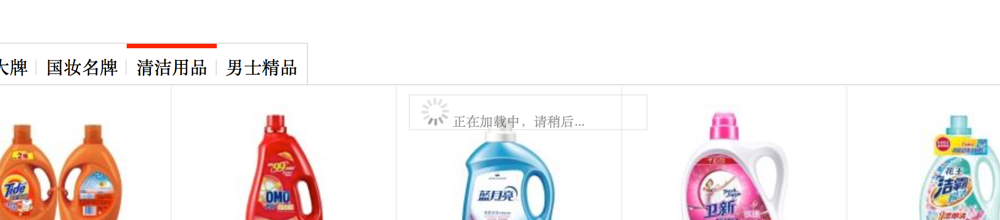

 
```js

              $(function(){

                    $(".tab-item").click(function(){
                          $(this).addClass("active").siblings().removeClass("active");
                          $(".products>div").eq($(this).index()).show().siblings().hide();
                          /*
                          * 逻辑应该写在这个点击事件里面.
                          * 1:准备一个盒子.
                          * 2:获取到当前点击的盒子的位置
                          * 3:根据当前点击的盒子的位置来设置正在加载中的盒子的位置
                          * 4：让正在加载中的盒子执行动画，从右向左滑动，慢慢显示 opacity 1
                          * 5：过1秒钟之后，我又执行动画，让盒子的位置还原。
                          * 让盒子从右向做滑动，慢慢隐藏。
                          * */
                            //2:获取到当前点击的盒子的位置
                            var offset=$(this).offset();
                            //获取当前元素的位置.
                            var top=offset.top;
                            var left=offset.left;
                            //3:根据当前点击的盒子的位置来设置正在加载中的盒子的位置
                            $(".message").offset({
                                 left:left+250,
                                 top:top+45
                            });
                            /*我要让当前的元素执行动画.*/
                            //4：让正在加载中的盒子执行动画，从右向左滑动，慢慢显示 opacity 1
                            $(".message").animate({"left":left,"opacity":1},300);
                            //5:过1秒钟之后，我又执行动画，让盒子的位置还原。让盒子从左向右滑动，慢慢隐藏。
                            window.setTimeout(function(){
                                $(".message").animate({"left":left+250,"opacity":0},300)
                            },1000);

                            //执行动画让盒子显示
                            //delay 延迟的意思. 延迟1秒然后执行后面的逻辑.
                            //$(".message").animate({"left":left,"opacity":1},300).delay(1000).animate({"left":left+250,"opacity":0},300);


                    })


              })

```


```html
<div class="wrapper">
    <ul class="tab">
        <li class="tab-item active">国际大牌<span></span></li>
        <li class="tab-item ">国妆名牌<span></span></li>
        <li class="tab-item">清洁用品<span></span></li>
        <li class="tab-item">男士精品</li>
    </ul>
    <div class="products">
        <div class="main selected">
            <a href="###"></a>
        </div>
        <div class="main">
            <a href="###"></a>
        </div>
        <div class="main">
            <a href="###"></a>
        </div>
        <div class="main">
            <a href="###"></a>
        </div>
    </div>

    <div class="message">
        
        正在加载中，请稍后...
    </div>

</div>

```

 


