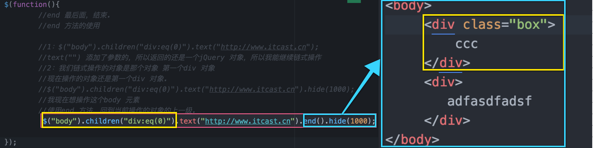
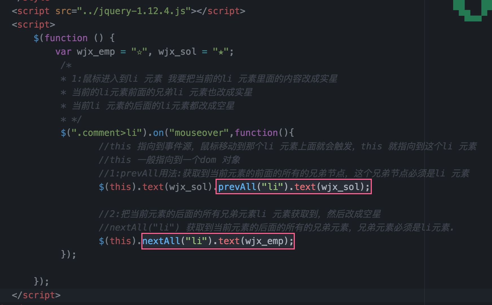
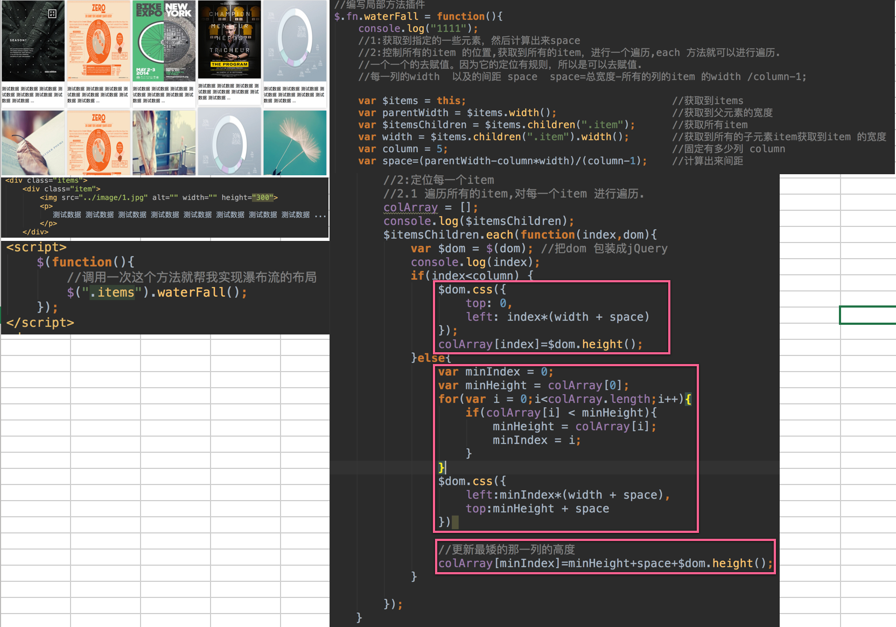

# jQuery_Day03_height()_end()_nextAll()_prevAll()_隐式迭代_noConflict()_scrollTop()_jquery插件_瀑布流插件

[TOC]

## height方法 和 width方法

```js

$(".box").width()); 
//只获取内容部分的宽 ,不包括 padding border

```

* 注意: 


```js

                /* 获取到div，被匹配到的元素有多个，我获取宽度，获取到的是
                * 第一个元素的宽度.
                * */
                console.log($("div").width());

```

## 链式编程

* 链式编程的前提是当前的这个方法返回的必须是一个jQuery 对象.

```js

$("div").show().width("400px").animate({"width":"20px","height":"30px"},2000)
                        .animate({"width":"400px","height":"400px"},2000).text();

```

* 原理:return  this; 链式编程的原理.
 
 


## end()
* 使用end 方法，回到当前操作的对象的上一级.



## nextAll() 
* 获取当前元素后面的 所有的兄弟元素,

## prevAll()
* 用法:获取到当前元素的前面的所有的兄弟节点`prevAll("li")` 表示 这个兄弟节点必须是li 元素
* 获取当前元素前面的 所有的兄弟元素

### 星级打分案例




## 隐式迭代 each方法
* **显示迭代** 可以看到这个for 语句，这种迭代叫做显示迭代.

```js

                for(var i=0;i<$div.length;i++){
//                     $div[i].style.color="red";
//                }

```

* **隐式迭代** 是通过jQuery 提供的一个方法，each 方法，通过这个方法迭代   
    * 我们是看不到for语句的
    * 隐式迭代，我需要传入的是一个回调函数.
    * $div 有多个个元素，function 就会被调用多少次.
    * 我们要获取到迭代之后对应的具体的内容.
    
    
```js


              /*
                *  $div 里面是一个一个的dom 对象
                *  param1:index 当前的元素的索引值
                *  param2:dom 遍历出来的dom元素.
                * */
                $div.each(function(index,dom){
                    //console.log("index=="+index);
                    //console.log(dom);
                    //dom   是一个dom 对象，我就可以调用dom 的api
                    dom.style.backgroundColor="red";
                })

```


```js

                //each 时候，遍历元素的时候用.
                //我把第一个opacity 改成0.1
                //我把第二个opacity 改成0.2
                //我把第三个opacity 改成0.3...
                $("li").each(function(index,dom){
                        //dom 遍历出来的一个一个的元素
                        //包装成jQuery 对象
                        $(dom).css("opacity",(index+1)/10);
                });


```

## 多库共存 noConflict() 
* 多库共存 使用jQuery 假设你在页面上面还有一个方法 也是用到$ ，就会有命名冲突。产生覆盖效果.
* 废弃jQuery 的`$`对象 用来解决多库共存问题

```js

//    jQuery 提供了一个方法
       //Conflict 1:废弃 $ 对象，2:返回一个新的jQuery对象,通过这样来实现多库共存
       //把 jQuery $ 对象废弃。
       var xiaoxuanfeng=$.noConflict();
       xiaoxuanfeng("button").on("click",function(){
             alert("通过新返回的对象添加的事件");
       });
       $.ajax();

```

## scrollTop()
* 获取页面卷曲进去的高度.

```js
                                //获取页面卷曲进去的高度.
                                var scrolltop=$(document).scrollTop();

```

## jQuery插件
* 全局方法的插件 [跟dom操作无关 ,独立的功能,如:去掉字符串 解析json]  


```js

//1:扩展的是jQuery 的全局方法的插件.
$.getCurrentTime=function(){
      //通过Date 去返回当前时间
      return new Date();
}

```

* 局部方法插件 局部方法一般是操作dom的

```js

//扩展一个局部方法的插件. 固定写法. 扩展jQuery 的局部
$.fn.lunbo=function(obj){

     //this.animate({"marginLeft":"400px"},2000);
     //获取到的是要滑动的距离
      var distance=obj.distance;  //传入的是距离
     //获取到滑动的时间.
      var seconds=obj.seconds;   //传入的是时间
      //获取到控制方向的
      var direction=obj.direction;  //用户必须传入  marginLeft marginRight maringBottom
      var obj={

      };
      //区别:
      //直接给obj 对象添加direction 属性
      //obj.direction=distance;
      //给obj 添加属性 direction 对应的值.
      //注意obj[key]的用法
      obj[direction]=distance;
      //执行动画.
      this.animate(obj,seconds);
      //把当前对象返回.
      return this;
}

```

## 瀑布流插件



```js

        //编写局部方法插件
        $.fn.waterFall = function(){
            console.log("1111");
            //1:获取到指定的一些元素，然后计算出来space
            //2:控制所有的item 的位置,获取到所有的item，进行一个遍历,each 方法就可以进行遍历.
            //一个一个的去赋值。因为它的定位有规则，所以是可以去赋值.
            //每一列的width  以及的间距 space  space=总宽度-所有的列的item 的width /column-1;

            var $items = this;                                  //获取到items
            var parentWidth = $items.width();                   //获取到父元素的宽度
            var $itemsChildren = $items.children(".item");      //获取所有item
            var width = $items.children(".item").width();       //获取到所有的子元素item获取到item 的宽度
            var column = 5;                                     //固定有多少列 column
            var space=(parentWidth-column*width)/(column-1);    //计算出来间距

            //2:定位每一个item
            //2.1 遍历所有的item,对每一个item 进行遍历.
            colArray = [];
            console.log($itemsChildren);
            $itemsChildren.each(function(index,dom){
                var $dom = $(dom); //把dom 包装成jQuery
                console.log(index);
                if(index<column) {
                    $dom.css({
                        top: 0,
                        left: index*(width + space)
                    });
                    colArray[index]=$dom.height();
                }else{
                    var minIndex = 0;
                    var minHeight = colArray[0];
                    for(var i = 0;i<colArray.length;i++){
                        if(colArray[i] < minHeight){
                            minHeight = colArray[i];
                            minIndex = i;
                        }
                    }
                    $dom.css({
                        left:minIndex*(width + space),
                        top:minHeight + space
                    })

                    //更新最矮的那一列的高度
                    colArray[minIndex]=minHeight+space+$dom.height();
                }

            });
        }

```


```css

<style>
        .container{
            width: 1200px;
            margin: 0 auto;
            padding-top: 40px;
        }
        .items{
            position: relative;
        }
        .item{
            position: absolute;
            left: 0;
            top: 0;
            width: 232px;
            /*控制阴影.*/
            /*css3 样式控制的阴影.*/
            box-shadow:0px 0px 10px rgba(0,0,0,0.3);
        }
        .item>img{
            width: 100%;
            display: block;
        }
        /*这个是css3 里面的一个选择器，暂时我们不多做了解.
        */
        .item:nth-child(4n) img{
            display: block;
            height: 289px;
        }
    </style>

```
## 第三方插件
* 图片懒加载 `jquery.lazyload.js`
* 颜色改变 `jquery.color.js`
* 日期插件 `foundation-datepicker.js`,`foundation-datepicker.css`
* ui插件 `jquery-ui.js`


