# jQuery_Day5_文件上传_bootstrap框架_bootstrap样式

[TOC]

## 文件上传
* 1: 文件上传,异步文件上传
* 2: 点击上传,上传之后页面不跳转,我们可以浏览上传的图片
* jQuery 插件 文件上传插件
* `jQuery File Upload` jQuery 图片上传控件
* http://www.jq22.com/jquery-info230

### 使用步骤
* **1:引入文件**
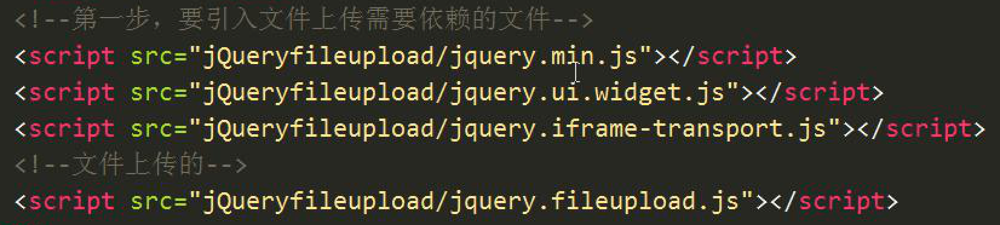

* **2: 定义文件上传的地址**
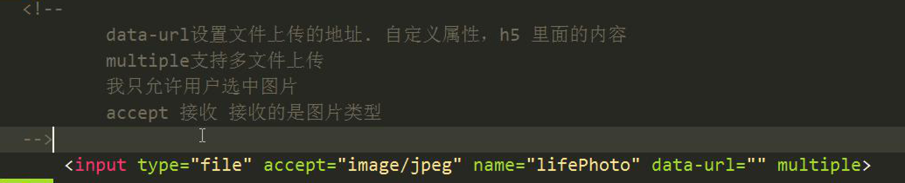


* **3: 使用插件 获取提交input 控件**
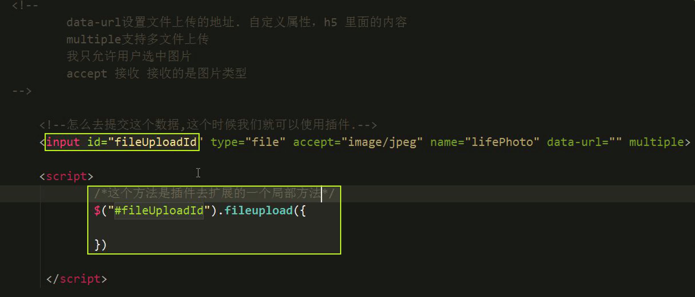

* **4: 创建后台接收文件**
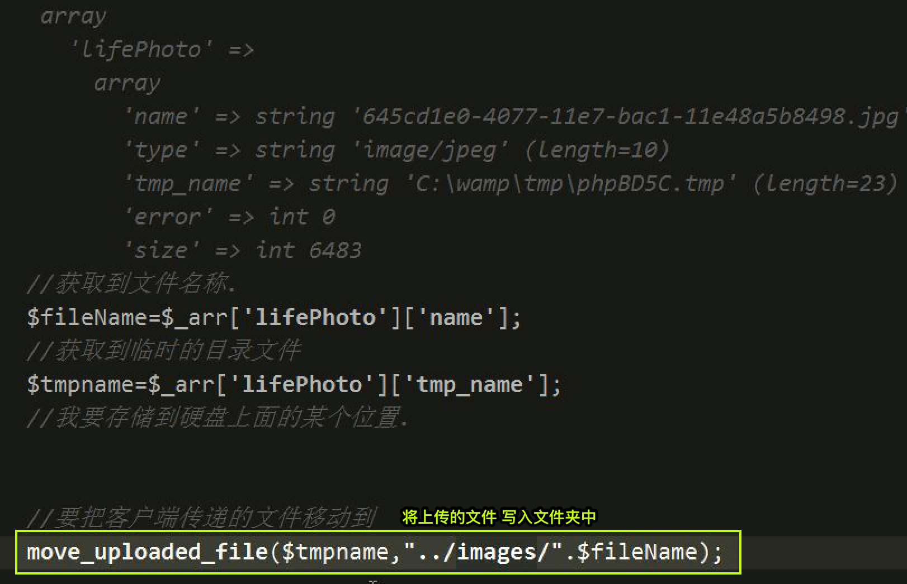


* **5: 添加上传代码 添加请求url**

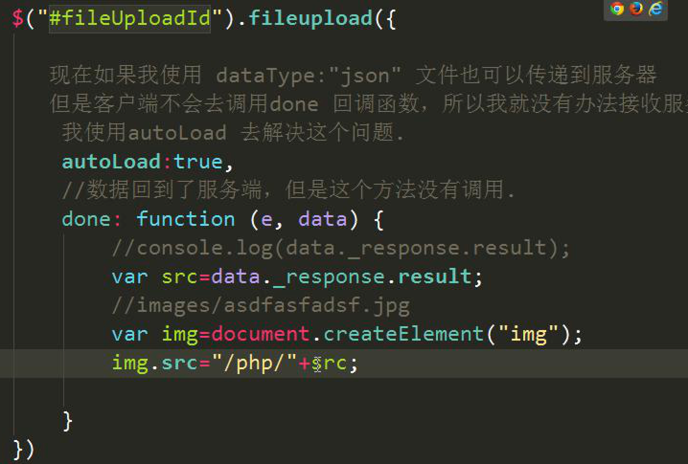


-------

## bootstrap 框架
* bootstrap 框架是用来解决 html css js 的问题
* 内置html css js 
* Bootstrap，来自 Twitter，是目前最受欢迎的前端框架。Bootstrap 是基于 HTML、CSS、JAVASCRIPT 的，它简洁灵活，使得 Web 开发更加快捷。
* 下载 bootstrap http://www.bootcss.com

-------

### bootstrap 使用

```html

<!DOCTYPE html>
<html lang="zh-CN">
  <head>
    <meta charset="utf-8">
    <!--① 如果客户端是ie浏览器,以最高版本去渲染页面-->
    <meta http-equiv="X-UA-Compatible" content="IE=edge">
    <!--② 移动的会使用的属性-->
    <meta name="viewport" content="width=device-width, initial-scale=1">
    <!-- 上述3个meta标签*必须*放在最前面，任何其他内容都*必须*跟随其后！ -->
    <title>Bootstrap 101 Template</title>

    <!--③ Bootstrap 给我们提供css样式 我们需要把css样式引入 -->
    <link href="css/bootstrap.min.css" rel="stylesheet">

    <!-- HTML5 shim and Respond.js for IE8 support of HTML5 elements and media queries -->
    <!-- WARNING: Respond.js doesn't work if you view the page via file:// -->
    <!--[if lt IE 9]>
      <script src="https://cdn.bootcss.com/html5shiv/3.7.3/html5shiv.min.js"></script>
      <script src="https://cdn.bootcss.com/respond.js/1.4.2/respond.min.js"></script>
    <![endif]-->
  </head>
  <body>
    <h1>你好，世界！</h1>
    
    <!--④ 引入jquery 和 bootstrap 文件-->
    <!-- jQuery (necessary for Bootstrap's JavaScript plugins) -->
    <script src="https://cdn.bootcss.com/jquery/1.12.4/jquery.min.js"></script>
    <!-- Include all compiled plugins (below), or include individual files as needed -->
    <script src="js/bootstrap.min.js"></script>
  </body>
</html>

```
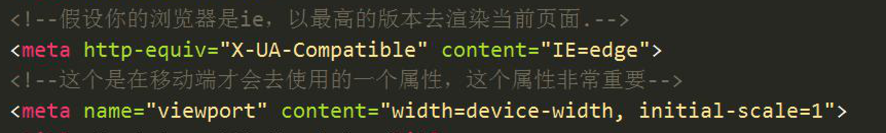
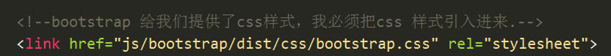
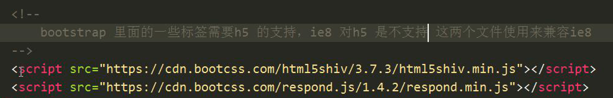
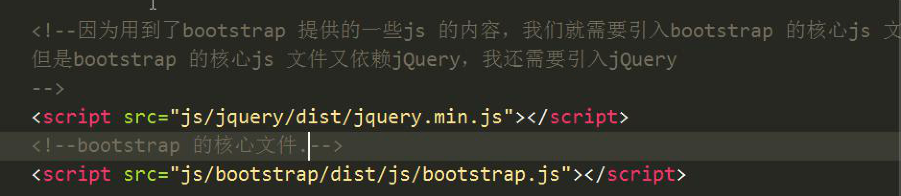


-------

* **添加一个删除按键 简单使用**

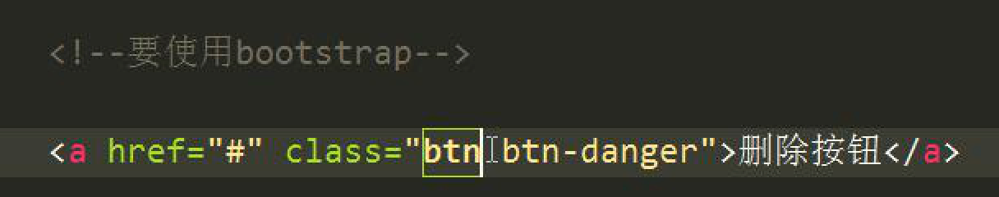

-------

### bootstrap 栅格系统 
* 用来页面布局 响应式布局

#### 响应式布局的概念
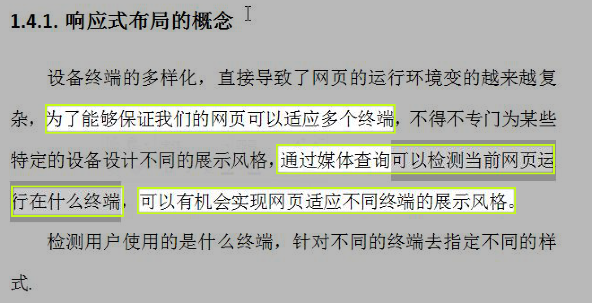
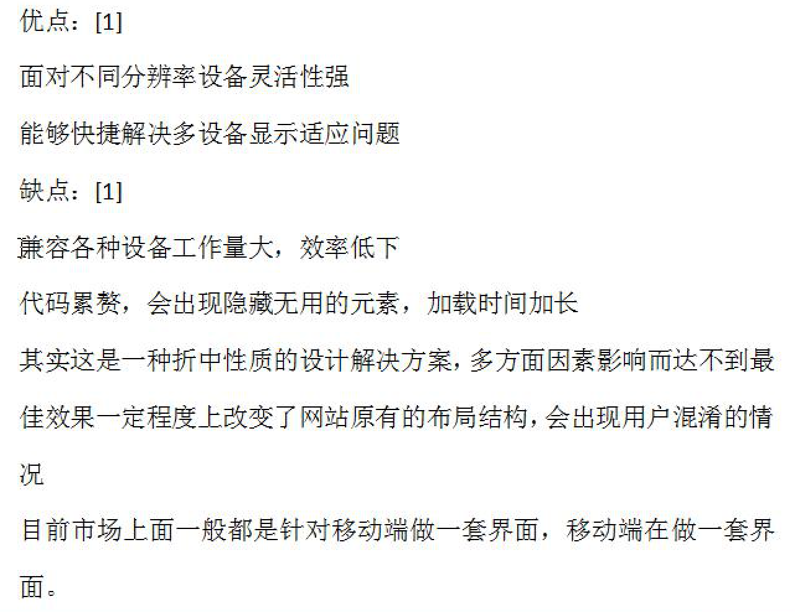

* **响应式概念**: 一套页面去适配多个终端
* **媒体查询**:通过媒体查询检测当前网页所运行在哪个设备上面 针对不同设备区指定不同的样式风格

> 响应式页面演示


* 使用媒体查询检测当前网页所运行的设备 
* 媒体查询是css3里面才支持的
* 我们一般分为四种设备


#### 媒体查询
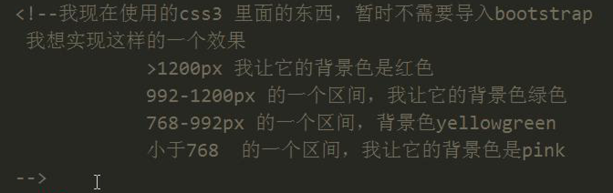

* **使用 `css3` 中的 `@media` 检测屏幕的区间**

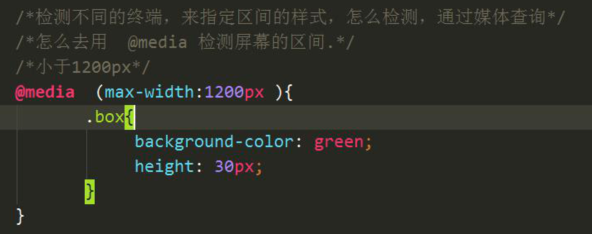


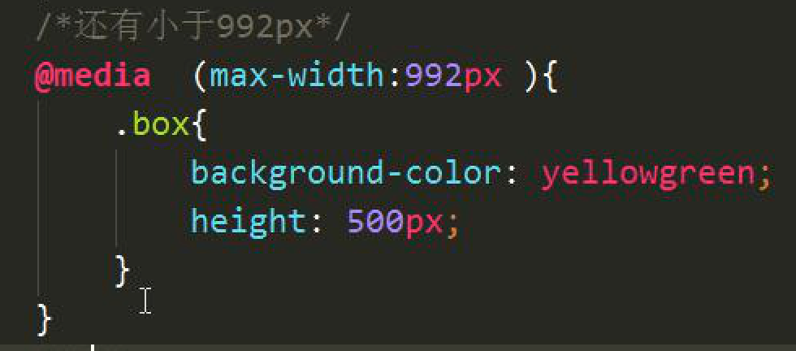

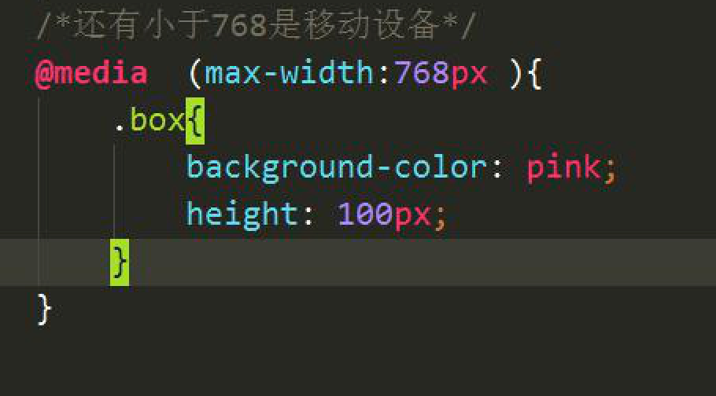

-------

#### 栅格系统 

* boostrap 给我们提供的一套组件 通过这套东西,我们可以在页面上进行布局 进行响应式布局,
* ==它的底层原理是媒体查询,栅格系统的底层原理是媒体查询,它可以用来做响应式布局==
* 1:使用 栅格里面还是多好多列

#### 栅格系统搭建

* 1:引入bootstrap 的 css 文件
* 2:如果我们要用到它的js 的一些组件 需要引入 bootstrap 的核心文件 包括引入 jQuery


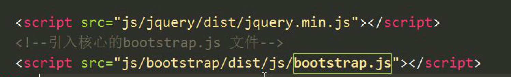

* 3:使用栅格布局 栅格必须放在 一个 bootstrap 的容器里面

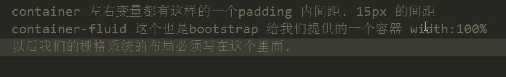


* **①: container 容器**

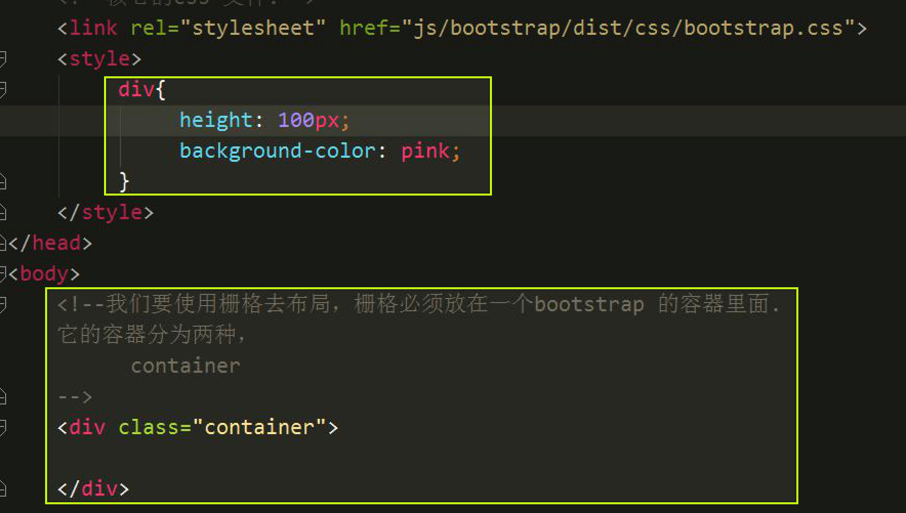

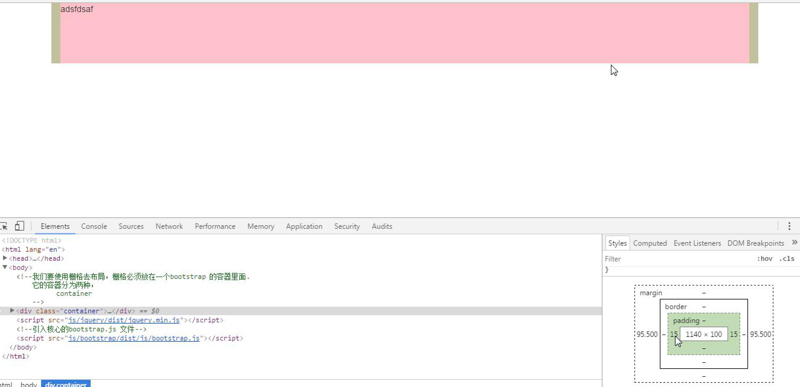


* **②: container-fluid 容器**

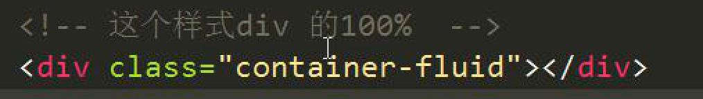

-------

#### 栅格系统的布局
* **1: 声明 container 容器**
* **2:声明一行**
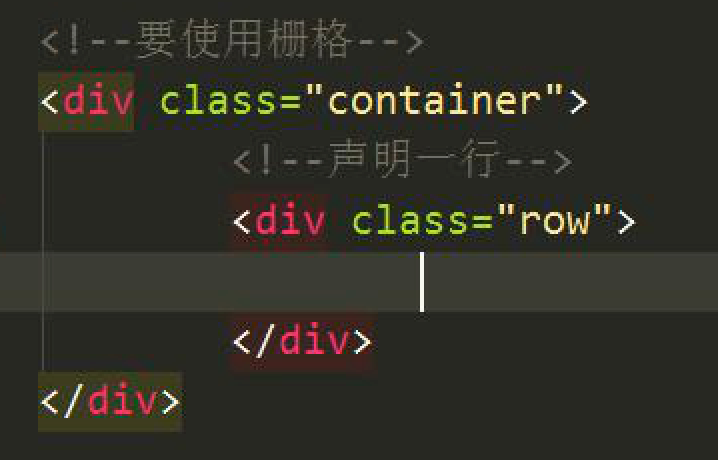

* **3: 行中的列 在bootstrap 默认每一行是12等份**
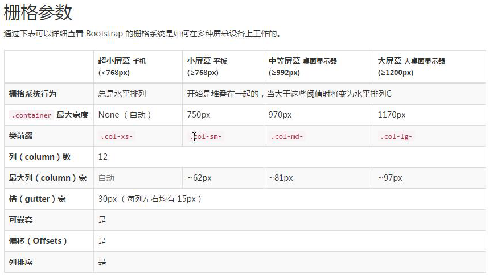

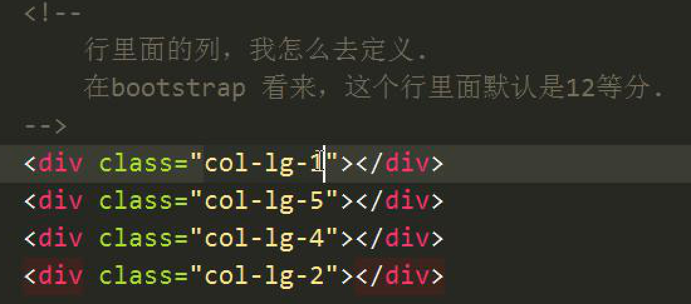
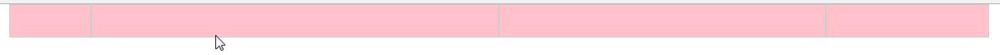

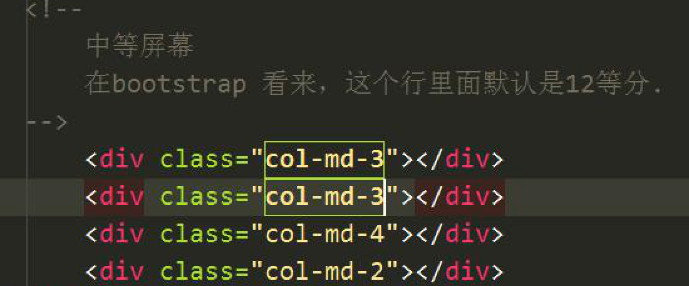


-------

##### 响应式行布局

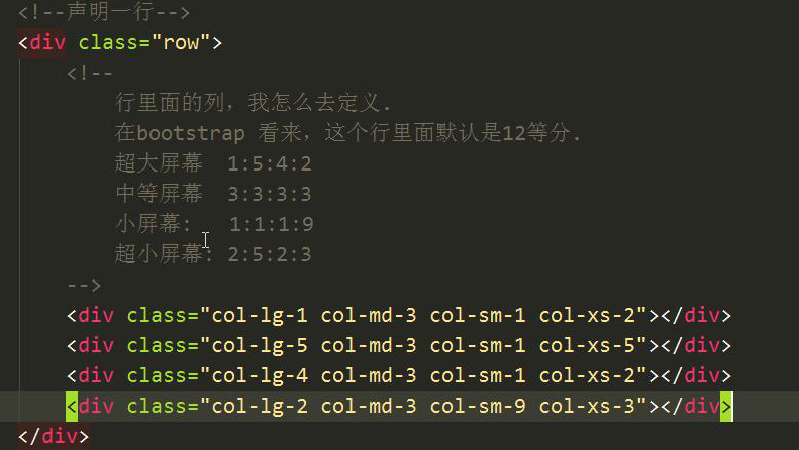


-------

##### 响应式行隐藏 

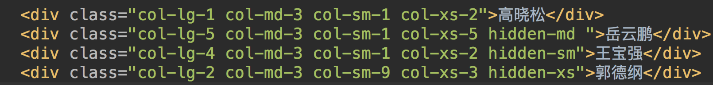


-------

### bootstrap 样式的介绍
#### from 样式
* http://v3.bootcss.com/css/
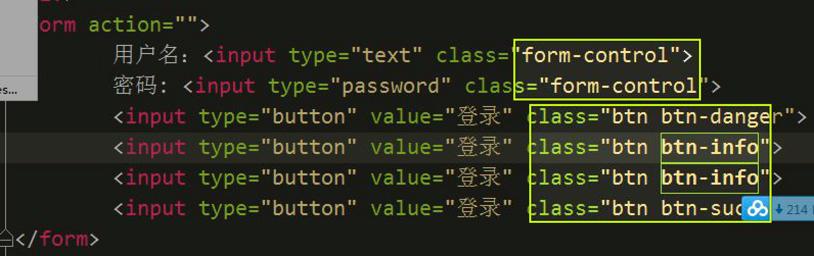

-------

#### table 样式介绍
* http://v3.bootcss.com/css/#tables


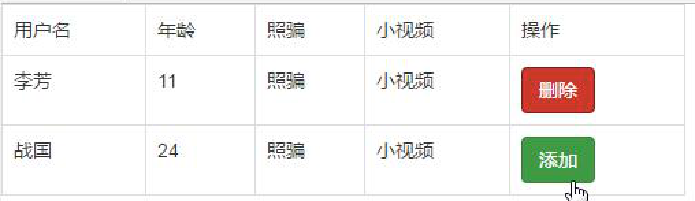

-------

### 字体图标介绍
* http://v3.bootcss.com/components/

* 引入css样式

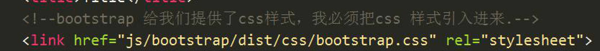


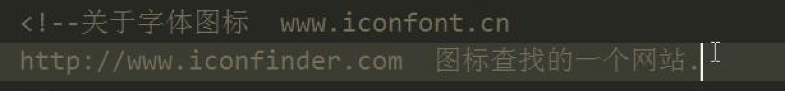

-------

### 导航条 汉堡包按钮
* http://v3.bootcss.com/components/#navbar

-------

### bootstrap 下拉菜单
* http://v3.bootcss.com/components/#dropdowns

* 引入bootstrap css


* 引入 jQuery 和 bootstrap js核心文件

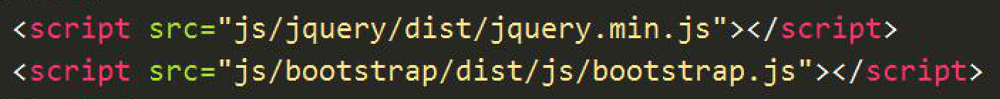


```html

<div class="dropup">
  <button class="btn btn-default dropdown-toggle" type="button" id="dropdownMenu2" data-toggle="dropdown" aria-haspopup="true" aria-expanded="false">
    Dropup
    <span class="caret"></span>
  </button>
  <ul class="dropdown-menu" aria-labelledby="dropdownMenu2">
    <li><a href="#">Action</a></li>
    <li><a href="#">Another action</a></qli>
    <li><a href="#">Something else here</a></li>
    <li role="separator" class="divider"></li>
    <li><a href="#">Separated link</a></li>
  </ul>
</div>

```


-------


### 进度条

* http://v3.bootcss.com/components/#progress

```html

<div class="progress">
  <div class="progress-bar" role="progressbar" aria-valuenow="60" aria-valuemin="0" aria-valuemax="100" style="width: 60%;">
    <span class="sr-only">60% Complete</span>
  </div>
</div>


```

-------

### 模态框

* http://v3.bootcss.com/javascript/#modals

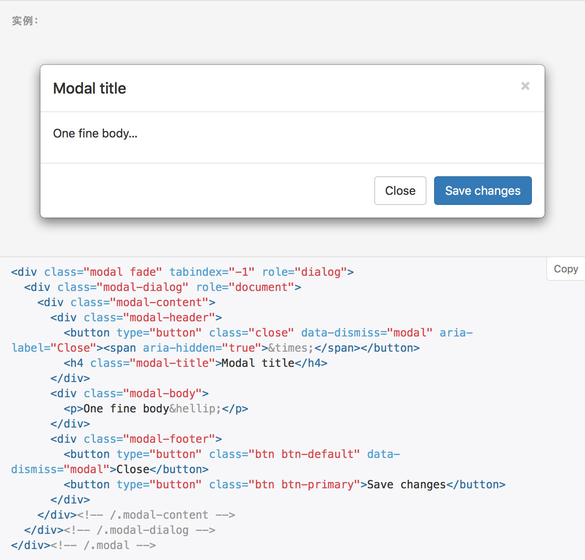


### 轮播图
* http://v3.bootcss.com/javascript/#carousel


     


