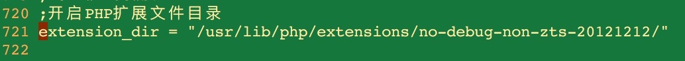

# nosql_Day01 之 memcache 

[TOC]

## 大型网站优化
### 概念
> nosql介绍

* **nosql** [not only sql] **非关系数据库**
* `key => value` 储存方式
* nosql产品: memcache redis mongodb

> memcache

* 内存缓存分布式数据库 用来缓存数据.提供数据的读写操作
* 注意:内存储存,断点重启之后,数据消失,定时保存备份到数据库(硬盘)
* `memcached -d install uninstall start stop`

> 大型网站优化介绍

* 随之网站的开发和使用,代码量多,数据量也多,之前的网站架构不能够满足用户的正常需要 页面返回时间和请求时间相对延长
* 要针对网站进行优化,提高返回速度,用户体验度

-------

### 网站访问流程

浏览器 => web 服务器[apache] => php => 数据库[mysql] 

* 流程越多,可能出现的问题的几率越大,所以返回的速度也会越慢

-------

### 大型网站 
* IP 访问的IP数
* PV 访问的页面点击数


-------

### 如何优化
* **页面静态化**,动态网站做成静态网页 ajax 
* **内存缓存** 把mysql数据缓存到内存中,提高读写速度 
* **优化数据库** 提高数据库的查询速度
* **WEB服务器** 提高服务器并发性(多个请求同时访问)

-------


## 内存缓存之 memcache
### 概念 
* 解决了数据库服务的压力


-------

### Mac下PHP安装Memcache扩展
> 安装服务器端

* 如果需要使用本地Memcache服务器，则应在本地安装Memcache服务器，即memcached
* （1）查找有没有memcached

```shell

$ brew search memcache 

返回结果：

libmemcached    memcache-top    memcached   memcacheq  

```

* 第一个是客户端，第三个是服务器。

* **(2)安装服务器**


```shell

$ brew install memcached  

```


* 3）如果需要开机自启动，输入以下命令


```shell

$ ln -sfv /usr/local/opt/memcached/*.plist ~/Library/LaunchAgents  

```

> 安装PHP的memcache扩展

* **（1）下载**：下载稳定版的memcache包
* 下载地址为：http://pecl.php.net/package/memcache

* **（2）解压** `$ tar -xzf memcache-2.2.7.tgz`

* **3）编译** 


```shell

$ cd memcache-2.2.7  
$ phpize  
$ ./configure  
$ make & make install   

```

* 如果在make install 时提示，没权限，则
* `$ sudo make install  `

* 然后输入密码进行编译 
* **4）编辑php.ini文件，将下面一行加入文件**


```shell

$ extension = memcache.so  

```




-------


## php操作memcache
### 记录格式
* `key => value`格式
* key 没有特殊限制要求,可以直观理解key 意义即可.不要过度缩写,时缩写
* 单key 存储默认是1m

> 语法

`$mem -> set(键,值,是否进行压缩储存,有效期)`
`$mem -> get(键)` 没有数据返回false

> 使用


 
 
* Tip 连接可能出现问题 


-------

### 有效期
> **① 时间差** 

* 单位 s 多少秒之后过期
* 超过 30 天的时间差被认为时间戳


> **② 时间戳** 

* time()+ 秒数 到设置时间戳过期


-------


### 储存各种数据类型

* **① 标量类型** int float string bool


-------

* **②复合类型** array obj

```php


<?php
/**
 * Created by PhpStorm.
 * User: mrlifang
 * Date: 17/6/6
 * Time: 下午2:15
 */
$mem = new Memcache();
$mem->connect('127.0.0.1',11211);


$arr = array(1,2,3,4,5);
class Person{
    //public
    //private 私有的
    //protected 受保护的 类内继承类
    //构造方法 初始化操作 属性赋值
    private $name;
    private $age;
    public function __construct($name,$age)
    {
        $this->name = $name;
        $this->age = $age;
    }

    //普通方法
    public function sayhello(){
        echo "$this->name 已经 $this->age";
    }

}
$Person = new Person("zhangs",18);
$Person->sayhello();

var_dump($mem->set('array',$arr,0,0));
echo "<hr>";
var_dump($mem->set('obj',$Person,0,0));
echo "<hr>";

var_dump($mem->get('array'));
var_dump($mem->get('obj'));

```

-------

* **③ 特殊类型** NULL 资源类型


* **序列化反序列化**


-------

### 相关其他方法
* `$mem->close`关闭memcache连接
* `$mem->add(key,value,压缩,有效期)` key 存在就添加,不存在就报错
* `$mem->decrment(key,num=1)` 安装


-------

### 命令行操作 memcache
* 可以通telnet协议连接 ip + 端口,进行操作memcached 
* **① 使用windows 下的telnet客户端**
* 开启telnet客户端 
* set key 是否压缩 有效期 

* **② 使用之前telnet协议的客户端**


-------

### 失效机制
* **① 懒惰模式**


* **② 缓存空间**


-------

### 其他方式操作memcache


-------

### session共享机制
* session 会话机制 
* cookie 存储客户端,可以通过浏览器进行管理操作
* session 储存在服务器端 session获取需要借助cookie

-------

* **问cookie禁用,session可用吗?**
* 答: 

* 一般cookie禁用后 session就不能使用了
* 但是可以通过其他方式传输session id

* session的使用场景: 登录验证 校验验证码

-------

* **问session为什么共享,如何共享?**
* 答:


* 可以把 session 进行入库操作,入memcache 和 mysql 操作 


-------

* **操作实施步骤**

* 查看php.ini配置文件


* ==一般不要去修改配置文件,因为其他项目也会受到影响==

* **设置session_id 存入 memcache**


-------

### 分布式memcache的运行
* ==分布式多台服务器的架构==

* **分布式服务器的好处:**
    * 效率高,并行高
    * 储存空间大
     
     
* **分布式服务器的缺点**
    * 资金投入大 
    * 维护复杂


> 分布式示意


> 启动多个memcache的方法

* ① 使用多台服务器,性能更好
* ② 同一台服务器,通过监听不同端口号,性价比更高


> 操作实现启动多个memcache

* **① 打开三个命令行 把memcache拖进去**


* **② 编写代码测试使用多个memcache**

 


* 分布式memcache 的可用内存大小等于多个memcache的内存的算数和相加

-------

### memcache实例实现


