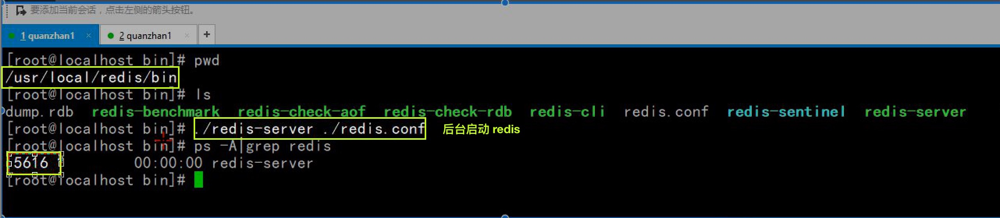

# nosql_Day02 之 Redis

[TOC]

## 介绍及其安装
### 介绍


****

### 什么场合使用


****

### 对比memcache


## redis安装

### linux 安装
* https://github.com/antirez/redis/releases

* ① 上传安装包到linux下


-------


**② 编译安装**

* `configure && make && make install`


```shell

shell > tar zxvf redis-3.2.9.tar.gz
shell > cd redis-3.2.9
shell > make PREFIX=/usr/local/redis install

```

* **安装后效果**r


* **③ 启动服务**


* `shell > /usr/local/redis/bin/redis-server  或者./redis-server`


* **④ 后台启动**

* `control + c` 终结redis服务端进程,赋值配置文件


* `shell > cp /usr/local/src/redis-3.2.9/redis.conf /usr/local/src/redis/bin`


* `shell > vim +128 redis.conf`


* `shell > ./redis-server ./redis.conf`




-------


### 启动 

* 启动服务端
* 注意这种方式启动redis 使用的是默认配置。也可以通过启动参数告诉redis使用指定配置文件使用下面命令启动。


```shell

$ cd src
$ ./redis-server

```

*  redis.conf是一个默认的配置文件。我们可以根据需要使用自己的配置文件。

* 关联配置文件启动


```shell

$ cd src
$ ./redis-server redis.conf

```


* 启动redis服务进程后，就可以使用测试客户端程序redis-cli和redis服务交互了。 比如：


```shell

$ cd src
$ ./redis-cli
redis> set foo bar
OK
redis> get foo
"bar"

```


## 简单使用
* 在操作使用redis 前 一定要注意服务端是开启的
* **① linux 下使用**


****

## 操作使用
## 数据类型
* **[string]** key对应一个value,一个键最大能存储512MB,二进制安全的,redis的string可以包含任何数据。比如jpg图片或者序列化的对象 
* **[hash]** 是一个键值对集合,是一个string类型的field和value的映射表，hash特别适合用于存储对象
* **[list]** Redis 列表是简单的字符串列表，按照插入顺序排序。你可以添加一个元素到列表的头部（左边）或者尾部（右边）。 
* **[set]** Redis的Set是string类型的无序集合,集合是通过哈希表实现的，所以添加，删除，查找的复杂度都是O(1)。
* **[zset] [sorted set]** Redis zset 和 set 一样也是string类型元素的集合,且不允许重复的成员。 不同的是每个元素都会关联一个double类型的分数。redis正是通过分数来为集合中的成员进行从小到大的排序。zset的成员是唯一的,但分数(score)却可以重复。

---------

### key 

* key的命名规则不同于一般语言，键盘上除了空格、\n换行外其他的大部分字符都可以使用。
* 像“my key”和“mykey\n”这样包含空格和换行的key是不允许的。
* 我们在使用的时候可以自己定义一个Key的格式。
* 例如 object-type:id:field 
* Key不要太长。占内存，查询慢。
* Key不要太短。像u:1000 pwd:123456   就不如   user:1000
*  password:123456  可读性好


* redis 默认有16个库
* 查看配置文件


* ==可以把不同的页面使用不同的库,或者不同的库存储不同的数据格式==


-------

### String
* string是redis最基本的类型
* redis的string可以包含任何数据。包括jpg图片或者序列化的对象。
* 单个value值最大上限是1G字节。 
* 如果只用string类型，redis就可以被看作加上持久化特性的memcache


-------


### List

* list类型其实就是一个双向链表。通过push,pop操作从链表的头部或者尾部添加删除元素。
* 这使得list既可以用作栈，也可以用作队列。


* **队列**: 一端进 一端出 先进先出
* **栈**: 同一端进出 先进后出 

* 需求:建立一个list,用来存储迷彩创建的面层语言 
* 设计: key LA
* value: c c++ c# java html javascript python ruby node


-------

### Set

* redis的set是string类型的无序集合。集合没有重复元素
* set元素最大可以包含(2的32次方-1)个元素。
* 关于set集合类型除了基本的添加删除操作，其他有用的操作还包含集合的取并集(union)，交集(intersection)，差集(difference)。通过这些操作可以很容易的实现sns中的好友推荐功能

* 需求:存储两人人的朋友圈
* 设计
* oneFR   a b c d e 
* twoFR   b c d e f 





 
 
 


-------

### zset

* 和set一样sorted set也是string类型元素的集合，
* 不同的是每个元素都会关联一个权。
* 通过权值可以有序的获取集合中的元素


* APP 下载排行榜 key APPTOP

| app name | score |
| --- | --- |
| QQ | 1 |
| wechat | 5 |
| king | 10 |
| taboo | 2 |
| jd | 6 |


-------


### Hash
* 类似于 mysql 里存储的一条护甲 key value 结构 
* key field:value 
* 存储数据数据 和 对象数据

* 需求:存储两条数据
* 设计: person1 tom 18 php
* person2 jerry 20 java 


-------


## 优化操作
### snappshoting

* redis 提供了两种备份机制 
* ① snappshoting 快照备份 默认开启
* ② aof 文件追加写,配置文件开启


* **备份频率** 


-------

### append only file
* 需要开启配置文件里的选项


* **查看aof频率**


* 修改好配置文件之后，进行重启redis操作


* **查看aof备份操作**


-------

## php操作redis 
### redis的php拓展的安装
* 拓展下载地址：http://pecl.php.net/

#### linux下拓展安装

* 拓展需要编译生成，生成的拓展文件.so
* **①编译生成拓展文件**

```shell
shell > tar zxvf phpredis-2.2.4.tar.gz 
shell > cd phpredis-2.2.4

```

* 因为是php的拓展，所有要和php产生联 系生成configure，使用phpize进行拓展文件的关联（挂载）。

* 查看php安装目录bin


* **在拓展安装包的目录里执行phpize**


```shell

shell > ./configure --with-php-config=/usr/local/php/bin/php-config && make && make install

```


* **②php.ini开启拓展,重启服务，查看phpinfo**


-------


### 防火墙问题
* 注意: 本地访问不到虚拟机 apache 网页 可能是 虚拟机防火墙开启的问题
* `service iptables stop` 关闭防火墙

* **1.即时生效，重启后失效**

* 开启：`service iptables start`
* 关闭：`service iptables stop`

* **2 重启后生效**

* 开启：`chkconfig iptables on`
* 关闭：`chkconfig iptables off`


-------

### php代码操作


### Redis实例


