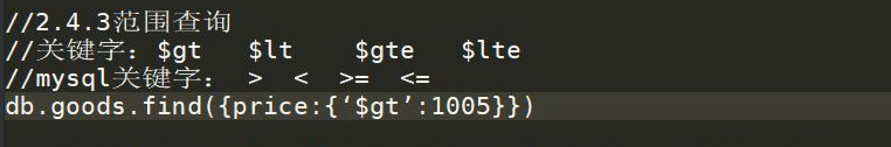
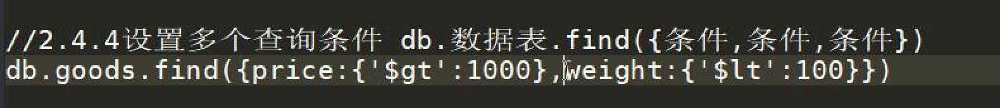
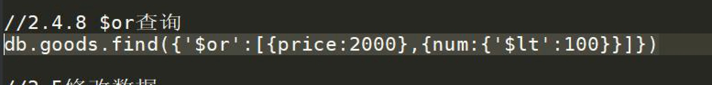
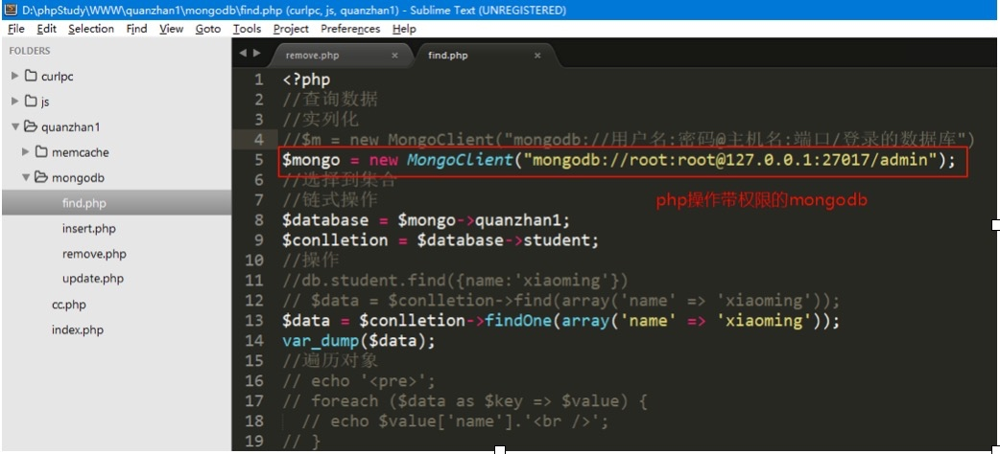

# nosql_Day03 之 MongoDB

[TOC]

* nosql[not only sql] 非关系型数据库
    * 没有链表操作 
    * 没有sql语句操作 
    * key=>value 结构
 
* memcache redis 存储在内存中 
* redis 有数据持久化功能
* **mongoDB** 数据存储在硬盘文件中

* 关系型数据库
* mysql sqlservice oracle

  
* mysql  最初属于AB公司=>sun公司（java）=>oracle
       mariaDB mysql分支
* sqlsever  微软公司  sql2000 2005 
* oracle   oracle（甲骨文）  java   10g 11g
* DB2   IBM
* postgresql 加州伯克利大学  
* access  微软小型数据库  asp
* sqlite3  手机移动端存储数据使用

  
  
  
  
## MongoDB特点

* 存储性

单表存储PB级别
1KB= 1024B
1MB = 1024KB
1GB = 1024MB
1TB = 1024GB
1PB = 1024TB
1EB （Exabyte 百亿亿字节 艾字节）=1024PB，
1ZB （Zettabyte 十万亿亿字节 泽字节）= 1024EB，
1YB （Yottabyte 一亿亿亿字节 尧字节）= 1024ZB，
1BB （Brontobyte 一千亿亿亿字节）= 1024YB。

* 效率性

## mongoDB安装

### 使用 brew 安装
`sudo brew install mongodb`

### 启动
* 启动服务器端 
* 注意启动 mongod 要加 sudo权限

`sudo mongod`

* 启动客户端

`./mongo`

* 配置文件

* `/usr/local/etc/mongod.conf`

****

## mongoDB操作
### 结构

* **开启客户端**

****

* ① `help`命令

****

* ② `show logs` 

****

* ③ `show log global`

****

* ④ `use`命令 如果数据库存在就切换 如果不存在就创建

****

* ⑤ 创建数据库 `use`

****

* ⑥ 查看数据库帮助 `db.help()`

****

* ⑦ 计算编写js方法代码

****

## 添加数据
### 普通数据添加
`db.collection.insert(document)`
`db.goods.insert({})`

* `db.goods.insert({name:'z',price:100,weight:135,number:35})`

* **document 数据类似是一种 BSON 类型**

****

### 多维数据添加

* `db.goods.insert({name:'xiaomi5',price:1999,weight:156,namber:45,area:{province:'bj',city:'bj'}})`

* 全部查询用 `find()`方法

****

### 添加数组信息

* `db.goods.insert({name:'xmMax',price:2000,weight:180,number:100,area:{province:'bj',city:'bj'},color:['red']})`

 
****

##查询数据
* **语法:**
* `db.collection.find([查询条件]，[筛选])`  返回所有符合条件的结果
* `db.collection.findOne([查询条件],[筛选])`  返回所有符合条件的结果第一条

****

### 笼统查询

****

### 条件限制查询
* `db.goods.find({})`
* `db.goods.find({name:'xiaomi5'})`

****

### 范围条件查询
* `db.goods.find({price:{'':value}})`
* `db.goods.find({price:{'$gt':1999}})`

****

### 多个查询条件 AND操作
* `db.goods.find({},{})`

****

### 满足其中一条查询 $or查询
* `db.goods.find({'$or':[{},{}])`

****

### 多维字段查询

****

### 数组查询条件查询

* `db.goods.find({key:{'$all':['value1','value2']}})`

* `_id`是自动生成的主键id 

*

****

### count语法

****

## 修改数据
### 有$set的修改

* `db.goods.save({'_id':ObjectId("593a4771c87cccd4618274dd"),name:'xiaomi6',price:2001})`

****

### 没有$set的修改
* 没有`$set` 没有设置数据的字段,就会被删除掉

****

## 删除数据 
* `db.collection.remove(查询条件)`

### 删除字段
* `db.collection.update({条件},{‘$unset’:{字段:1/字段:0}})	`

****

### 删除字段

**** 

## 使用php操作
### 安装 php-mongo扩展
## php操作
* 使用 mongo扩展中 MongoClient 类
* 安装php扩展并了解

****

### 添加数据

****

### 查找数据

****

### 更新数据

****

### 删除数据

****

## 账户权限
### 创建账户权限
* **① 先增加用户权限**

* **② 停止mongo服务,使用**

****

### php操作mongodb查看

****

## mongodb使用实列

* **① 文件获取数据存储到mongodb**

* ② 从mysql里获取数据存储到mongodb

