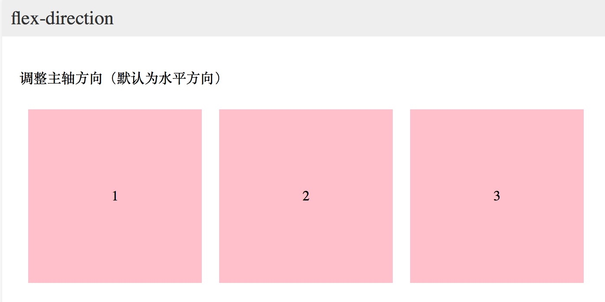

# CSS _Day03_2D转换_3D转换_动画_伸缩布局

[TOC]

## 2D 转换

* 要实现转换效果,需要使用`transform` 转换效果常见 


```css

 .box{
            width: 200px;
            height: 200px;
            border: 1px solid #ccc;
            margin: 100px auto;
            transition: all 1s linear;
        }
        
        .box:hover{
            /* 鼠标悬停让盒子变形
                 translate 移动的意思
                 translate() 调用浏览器底层的渲染函数
                  translate(500px) 给一个参数 指在水平方向
                  两个参数 水平 垂直

            */

            transform: translate(500px,200px);

        }


        .box:hover{
            /*
             scale 缩放的意思
             调用浏览器缩放的函数
             参数 大于1的数,就是放大
             小于1 就是缩小


             两个参数的情况
             age0 水平方向放大到原来的2倍
             age1 垂直方向放大原来的3倍
            */

            transform: scale(2,3);
        }


        .box:hover{
            /*
                rotate 旋转
                如果是正数是 顺时针方向
            */

            transform: rotate(170deg);
        }


```

* 移动: `translate()`
* 旋转: `rotate()`
* 缩放: `scale()`

* 旋转有一个中心点 通过`transform-origin` 改变旋转原点的位置

-------


### 案例:火箭


```css

 html,body{
            height: 100%;
        }
        body{
            margin: 0;
            padding: 0;
            overflow: hidden;
            background-color: #00b3ee;
        }

        section{
            width: 100%;
            background-color: #00b3ee;
            position: relative;
        }

        .rocket{
            width: 101px;
            height: 190px;
            position: absolute;
            left: 30%;
            bottom: 30%;
            transform:translate(140px,700px) rotate(30deg);
            transition: all 1s linear;
        }

        section:hover .rocket{
            transform: translate(600px,-400px) rotate(30deg);
        }

```


```html

<section>
        <div class="rocket">
            
        </div>
    </section>

```

-------

### 案例:盾牌


```css

html,body{
            height: 100%;
        }

        body{
            margin: 0;
            padding: 0;
            overflow: hidden;
            background-color: #2b2b2b;
        }

        section{
            width: 453px;
            margin: 100px auto;
        }

        .shield img{
            display: block;
            float: left;
            transition: all 1s linear;
        }


        .shield img:nth-child(1){ transform: translate(500px,300px) rotate(45deg)}
        .shield img:nth-child(2){ transform: translate(500px,320px) rotate(25deg)}
        .shield img:nth-child(3){ transform: translate(500px,310px) rotate(35deg)}
        .shield img:nth-child(4){ transform: translate(500px,310px) rotate(15deg)}
        .shield img:nth-child(5){ transform: translate(600px,300px) rotate(15deg)}
        .shield img:nth-child(6){ transform: translate(800px,200px) rotate(25deg)}
        .shield img:nth-child(7){ transform: translate(-500px,-300px) rotate(45deg)}
        .shield img:nth-child(8){ transform: translate(-500px,-200px) rotate(55deg)}
        .shield img:nth-child(9){ transform: translate(500px,300px) rotate(65deg)}

        .shield:hover img{
            transform: translate(0px,0px) rotate(0deg) ;
        }

```


```html

<section>
    <div class="shield">
        
        
        
        
        
        
        
        
        
    </div>
</section>


```

### 案例:原点  transform-origin

```css

html,body{
            height: 100%;
        }

        body{
            margin: 0;
            padding: 0;
            overflow: hidden;
        }

        .box{
            width: 218px;
            position: relative;
            margin: 300px auto;
        }

        .box img{
            position: absolute;
            left: 0;
            top: 0;
            width: 100%;
            transition: all 1s linear;
            transform-origin: left top;
        }

        .box:hover img:nth-child(1){transform: rotate(60deg)}
        .box:hover img:nth-child(2){transform: rotate(120deg)}
        .box:hover img:nth-child(3){transform: rotate(180deg)}
        .box:hover img:nth-child(4){transform: rotate(240deg)}
        .box:hover img:nth-child(5){transform: rotate(300deg)}
        .box:hover img:nth-child(6){transform: rotate(360deg)}


```


```html

<div class="box">
    
    
    
    
    
    
</div>

```

-------

### 扩展: 盒子居中

-------

## 3D转换

### 旋转 
* x 轴旋转的方向 正负方向


```css

 body{
            margin: 0;
            padding: 0;
            background-color: #F7F7F7;
        }

        .rotateX{
            height: 226px;
            padding-top: 100px;
            text-align: center;
            /*透视 添加观察着平面的距离*/
            perspective: 1000px;
        }

        .rotateX img{
            transition: all 5s;
        }

        .rotateX:hover img{
            transform: rotateX(90deg);
        }

```


```css

    transform: rotateX(-90deg);

```


* y 轴旋转方向 正负方向


```css

 body{
            margin: 0;
            padding: 0;
            background-color: #F7F7F7;
        }

        .rotateY{

            height: 226px;
            padding-top: 100px;
            text-align: center;
            /**/
        }

        .rotateY img{
            transition: all 2s;
        }

        .rotateY:hover img{
            transform: perspective(100px) rotateY(90deg);
        }

```


```html

<body>
    <div class="rotateY">
        
    </div>
</body>

```

-------


```css

transform: perspective(100px) rotateY(-90deg);

```


-------


* **z 轴旋转方向**


```css

body {
            margin: 0;
            padding: 0;
            background-color: #F7F7F7;
        }
        .rotateZ {
            height: 226px;
            padding-top: 100px;
            text-align: center;
        }
        .rotateZ img {
            transition: all 2s;
        }
        .rotateZ:hover img {
            transform: rotateZ(180deg);
        }

```


```html

<div class="rotateZ">
    
</div>


```


```css

 transform: rotateZ(-180deg);

```


-------


### 移动 
* **x 轴上移动**

```css

body {
            margin: 0;
            padding: 0;
            background-color: #F7F7F7;
        }
        .translateX{
            width: 200px;
            height: 200px;
            background-color: green;
            transition: all linear 1s;
        }

        .translateX:hover{
            transform: translateX(300px);
        }

```


```html

<body>
<div class="translateX"></div>
</body>

```


-------


* **y 轴上移动**


```css
body {
			margin: 0;
			padding: 0;
			background-color: #F7F7F7;
		}

		.translateY {
			width: 200px;
			height: 200px;
			background-color: green;
			transition: all 1s;
		}
		
		.translateY:hover {
			transform:  translateY(400px);
		}

```


```html

<body>
	<div class="translateY"></div>
</body>

```


-------


* **z 轴上移动 透视**

```css

 body {
            margin: 0;
            padding: 0;
            background-color: #F7F7F7;
        }

        .translate {
            /*perspective: 600px;*/
        }

        .translateZ {
            width: 200px;
            height: 200px;
            margin: 100px auto;
            background-color: green;
            transition: all 1s;
        }

        .translateZ:hover {
            transform:perspective(100px) translateZ(-1400px);
        }


```


```html

<div class="translate">
    <div class="translateZ"></div>
</div>

```


-------

### 透视 perspective


```css

 body{
            margin: 0;
            padding: 0;
            background: #F7F7F7;
        }

        .perspective{
            width: 200px;
            height: 200px;
            margin: 100px auto;

            perspective: 1000px;
        }
        .rotate{
            width: 200px;
            height: 200px;
            background-color: #64e264;
            transition: all 2s linear;
        }

        .perspective:hover .rotate{
            transform: translate(200px) rotateY(90deg);
        }

```


```html

<div class="perspective">
        <div class="rotate">
        </div>
    </div>

```


-------


### 案例: 3D盒子

* 旋转是整个坐标系发送改变
* 每个盒子都对应一个 `3d` 坐标系
* 旋转的默认是中心点 可以改


```css


.box {
           width: 200px;
           height:200px;
           margin: 100px auto;
           position: relative;
           /*电脑平面本来是2d 平面，
           如果想让当前盒子看上去有立体效果，
           我们可以当前盒子成立体盒子*/

           transform-style: preserve-3d;
           transition: all 1s linear;
           animation: change 30s linear infinite;
       }

        .top,.bottom,.left,.right,.forward,.back{
            width: 200px;
            height: 200px;
            position: absolute;
            left: 0;
            top: 0;
            opacity: 0.2;
            perspective: 1000px;
        }

        .top{background-color: #984fdb;transform: rotateX(90deg) translateZ(100px)}
        .bottom{background-color: #486fbc;transform: rotateX(90deg) translateZ(-100px)}
        .left{background-color: #56ff71;transform: rotateY(90deg) translateZ(-100px)}
        .right{background-color: #fbff4b;transform: rotateY(90deg) translateZ(100px)}
        .forward{background-color: #ffa55e;transform: translateZ(100px)}
        .back{background-color: #ff4148;transform: translateZ(-100px)}


        @keyframes change {
            from{
                transform: rotateX(0deg)rotate(0deg);
            }to{
                transform: rotateX(360deg)rotate(720deg);
            }
        }

```


```html

<div class="box">
        <div class="top"></div>
        <div class="bottom"></div>
        <div class="left"></div>
        <div class="right"></div>
        <div class="forward"></div>
        <div class="back"></div>
    </div>

```


-------


## 动画
* 动画有是css3 当中具有颠覆性特征之一
* 通过过渡也可以做动画 过渡配置要执行动画的属性
* `2d`和`3d` 要出现动画效果 必须配合过渡

> 动画我们怎么去使用

### 定义动画

```css

 @keyframes change {
            from{

                background-color: palevioletred;
                border: 1px solid palegoldenrod;
                width: 100px;
            }to{

                background-color: palegoldenrod;
                border: 1px solid palevioletred;
                width: 400px;
             }
        }
```


```css

        @keyframes change {
            20%{
                width: 400px;
                height: 200px;
            }40%{
                background: red;

            }60%{
                width: 400px;
                height: 400px;
            }80%{
                height: 100px;
            }100%{

            }
        }

```

### 使用动画


```css

 animation: change 2s linear infinite;
 
```

* `animation-name: change` 动画名称
* `animation-duration: 2s` 动画的持续时间
* `animation-timing-function: linear` 动画的速度
* `animation-iteration-count` 动画执行的次数
* `animation-delay:0s` 动画延迟的时间
* `animation-iteration-count:5` 动画执行的次数 
    * `infinite`

* `animation-direction` 动画的运动方向
    * `normal` 正常方向执行动画
    * `reverse` 反方向执行动画
    * `alternate` 先正方向，再反向执行动画

* `animation-fill-mode` 动画的状态
    * `none` 动画结束之后回到当前元素最初始的状态.
    * `forwards` 设置动画的状态为结束的时候的状态.
    * `backwards` 设置动画结束的状态为开始的时候的状态

* `animation-play-state` 动画的运行状态
    * `running` 运行的状态 
    * `paused` 暂停的状态       


-------


### 案例: 理发店动画


```css

.box {
            width: 1000px;
            height: 100px;
            margin: 100px auto;
            background-size: 100px 100px;
            background-image: linear-gradient(
                135deg,
                black 0%,
                black 25%,
                transparent 25%,
                transparent 50%,
                black 50%,
                black 75%,
                transparent 75%
            );
            animation: change 1s linear infinite;
        }

        @keyframes change {
            0%{
                background-position: -100px 0px;
            }100%{
                background-position: 0px 0px;
            }
        }

```


```html
     <div class="box">
     </div>
```


-------


### 案例:大海


```css

html,body{
            height: 100%;
        }
        body{
            margin: 0;
            padding: 0;

        }

        section{
            position: relative;
            overflow: hidden;
            height: 100%;
            background-color: #00b3ee;
        }

        .sun{
            position: absolute;
            width: 100px;
            height: 100px;
            border-radius: 50%;
            background-color: azure;
            left: 200px;
            top:100px;
        }

        .sun::before,.sun::after{
            content: "";
            width: 100px;
            height: 100px;
            position: absolute;
            left: 0;
            top: 0;
            border-radius: 50%;
            background-color: #fff;
        }

        .sun::before{
            animation: scaleSun 1s linear infinite;
        }

        .sun::after{
            animation: scaleSun 1s linear .5s infinite;
        }


        .bg1{
            position: absolute;
            left: 0;
            bottom: -100px;
            background-image: url("images/dahai1.png");
            width: 100%;
            height: 211px;
            animation: change .6s linear infinite alternate;
        }

        .bg2{
            position: absolute;
            left: 0;
            bottom: -100px;
            background-image: url("images/dahai2.png");
            width: 100%;
            height: 211px;
            animation: change .6s linear infinite 0.3s alternate;
        }

        /* 定义太阳动画 */
        @keyframes scaleSun {
            0%{
                transform: scale(1);
                opacity: 1;
            }100%{
                transform: scale(2.5);
                opacity: 0;
            }
        }

        /* 定义波涛的动画 */
        @keyframes change {
               from{
                   bottom: -50px;
               }to{
                    bottom: 0;
                }
        }

```


```html

<section>
            <div class="sun"></div>
            <div class="bg1"></div>
            <div class="bg2"></div>
     </section>

```


-------


### 案例:宇宙

```css

html,body{
            height: 100%;
        }

        body{
            margin: 0;
            padding: 0;
            background-size: 100%;
            background-image: url("images/bg.jpg");
            overflow: hidden;
        }

        ul li{
            list-style: none;
            margin: 0;
            padding: 0;
            border: 1px solid #ccc;
            border-radius: 50%;
            position: absolute;
            left: 50%;
            top: 50%;
            transform: translate(-50%,-50%);
            animation-name: change;
            animation-timing-function: linear;
            animation-iteration-count: infinite;
        }

        ul{
            width: 600px;
            height: 600px;
            margin: 10px auto;
            position: relative;
        }

        li:nth-child(1){width: 60px;height: 60px;background-color: #c90; box-shadow: 0px 0px 50px #c90;}
        li:nth-child(2){width: 120px;height: 120px; animation-duration: 3s}
        li:nth-child(3){width: 180px;height: 180px; animation-duration: 3.1s}
        li:nth-child(4){width: 240px;height: 240px; animation-duration: 3.2s}
        li:nth-child(5){width: 300px;height: 300px; animation-duration: 3.3s}
        li:nth-child(6){width: 360px;height: 360px; animation-duration: 3.4s}
        li:nth-child(7){width: 420px;height: 420px; animation-duration: 3.5s}
        li:nth-child(8){width: 480px;height: 480px; animation-duration: 3.6s}
        li:nth-child(9){width: 540px;height: 540px; animation-duration: 3.7s}
        li:nth-child(10){width: 600px;height: 600px; animation-duration: 3.8s}

        ul li span{
            width: 10px;
            height: 10px;
            background-color: #F7F7F7;
            border-radius: 50%;
            border: 1px solid #F7F7F7;
            position: absolute;
            left: 50%;
            margin-left: -5px;
            margin-top: -5px;
        }

        ul li:nth-child(2) span{background-color: greenyellow}
        ul li:nth-child(5) span{background-color: orangered}
        ul li:nth-child(7) span{background-color: orange}
        ul li:nth-child(9) span{background-color: blueviolet}
        ul li:nth-child(1) span{background-color: #64e264  }
        ul li:nth-child(3) span{background-color: palevioletred}


        @keyframes change {
            from{
                transform: translate(-50%,-50%) rotate(0deg)
            }to{
                transform: translate(-50%,-50%) rotate(360deg);
            }
        }


```


```html

<ul>
    <li></li>
    <li><span></span></li>
    <li><span></span></li>
    <li><span></span></li>
    <li><span></span></li>
    <li><span></span></li>
    <li><span></span></li>
    <li><span></span></li>
    <li><span></span></li>
    <li><span></span></li>
</ul>

```


-------


### 案例:钟表


```css

.clock{
            width: 200px;
            height: 200px;
            border: 10px solid #000;
            margin: 100px auto;
            border-radius: 110px;
            position: relative;
        }

        /*所有的line综合样式*/
        .line{
            position: absolute;
            top: 0;
            left: 50%;
            margin-left: -3px;
            width: 6px;
            height: 100%;
            background-color: cornflowerblue;
        }

        .line1{transform: rotate(30deg)}
        .line2{transform: rotate(60deg)}
        .line3{transform: rotate(90deg)}
        .line4{transform: rotate(120deg)}
        .line5{transform: rotate(150deg)}

        /* 覆盖里面的盒子 */
        .cover{
            width: 160px;
            height: 160px;
            background-color: white;
            border-radius: 50%;
            position: absolute;
            left: 50%;
            top: 50%;
            margin-left: -80px;
            margin-top: -80px;
        }

        /*定位小时*/
        .hours{
            width: 8px;
            height: 60px;
            background-color: greenyellow;
            left: 50%;
            top:50%;
            position: absolute;
            margin-left: -4px;
            margin-top: -60px;
            animation: change 3600s linear infinite;
            transform-origin: bottom center;
        }

        /*定位分钟*/
        .minutes{
            width: 6px;
            height: 70px;
            background-color: aquamarine;
            position: absolute;
            left: 50%;
            top: 50%;
            margin-left: -3px;
            margin-top: -70px;
            animation: change 3600s linear infinite;
            transform-origin: bottom ;
        }

        /*定位秒钟*/
        .seconds{
            width: 4px;
            height: 80px;
            background-color: #CCCCCC;
            position: absolute;
            left: 50%;
            top: 50%;
            margin-left: -4px;
            margin-top: -80px;
            animation: change 60s linear infinite;
            transform-origin: bottom ;
        }

        .dotted{
            width: 30px;
            height: 30px;
            background-color: #00b3ee;
            border-radius: 50%;
            position: absolute;
            left: 50%;
            top: 50%;
            margin-left: -15px;
            margin-top: -15px;
        }

        /*定义动画*/
        @keyframes change {
            from{
                transform: rotate(0deg);
            }to{
                 transform: rotate(360deg);
             }
        }


```


```html

<div class="clock">
            <div class="line line1"></div>
            <div class="line line2"></div>
            <div class="line line3"></div>
            <div class="line line4"></div>
            <div class="line line5"></div>
            <div class="line line6"></div>
            <div class="cover"></div>
            <div class="hours"></div>
            <div class="minutes"></div>
            <div class="seconds"></div>
            <div class="dotted"></div>
        </div>

```


-------


## 伸缩布局
* 用来做定位的的 
* `display:flex` 用来改变当前盒子为伸缩盒子
* `flex-direction` 用来改变主轴的方向
    * `column` 列
    * `row-reverse` 行反转
    * `column-reverse` 列反转    
    
* `justify-content` 用来调整伸缩盒子的内容在主轴上面的对齐方式
    * `flex-start` 在主轴的起点对齐
    * `center` 居中对齐
    * `space-around` 四周环绕
    * `space-between` 两端对齐

* `align-times` 用来调整内容在侧轴上面的对齐方式
    * `flex-start`
    * `flex-end`
    * `center`中间
    * `stretch` 侧轴上面拉伸 
    

* `flex-wrap` 用来调整内容是否允许可以换行
    * `wrap` 允许伸缩盒子可以换行
    * `nowrap`不允许换行 允许换行

    
* `align-content` 这个是用允许换行之后堆叠的元素在侧轴上的对齐方式
* `flex-start`
* `center`
* `flex-end`
* `space-around`


* `align-self` 用来控制伸缩的单个内容盒子 在侧轴上面的对齐方式
* `flex` 用来控制内容盒子在伸缩盒子中所占有的比例
* `order` 用来控制伸缩盒子在主轴上面的排序


-------

### 伸缩布局介绍

```css

/*声明当前盒子为伸缩盒子*/
            display: flex;
            /*声明盒子中的内容是两端对齐*/
            justify-content: space-between;

```


-------


### flex-direction

* 调整主轴方向（默认为水平方向）包括`row`、`column`、`row-reverse`、`column-reverse`

* **row**




* **column**


* **row-reverse**


* **column-reverse**


-------

### justify-content 

* 主轴方向对齐，可以调整元素在主轴方向上的对齐方式，包括`flex-start`、`flex-end`、`center`、`space-around`、`space-between`几种方式

* **flex-start**


* **flex-end**


* **center**


* **space-around**


* **space-between**


-------


### align-items

* 调整侧轴方向对齐方式，包括`flex-start`、`flex-end`、`center`、`stretch`


-------


### flex-wrap
* 控制是否换行，包括`wrap`、`nowrap`

* **nowrap**


* **wrap**


-------

### align-content

* 堆栈排列，可对应用flex-wrap: wrap后产生的换行进行控制，包括`flex-start`、`flex-end`、`center`、`space-between`、`space-around`、`stretch`

* **flex-start**


* **flex-end**


* **center**


* **space-around**


* **space-between 两端对齐**


* **stretch**


-------


### flex

* 控制子元素伸缩比例


```css

/*flex 是用来控制子元素的大小的比例，该属性是写在内容盒子上面的.*/
		.flex121 li:nth-child(1){
				flex: 2;

		}
		.flex121 li:nth-child(2){
				flex: 1;
		}
		.flex121 li:nth-child(3){
				flex: 1;
		}

```


```css

.flex21 li:nth-child(1){
				width: 400px;
		 }
		.flex21 li:nth-child(2){
				flex: 2;
		 }
		.flex21 li:nth-child(3){
				flex: 1;
		 }


```

-------

### align-self

* `align-self` 用来控制伸缩的单个内容盒子 在侧轴上面的对齐方式，包括`flex-start`、`flex-end`、`center`、`stretch`

```css

.flex-start li:nth-child(1) {
			align-self: stretch;
			height: auto;
		}

```


-------


### order

* 控制子元素的顺序

```css

/*用来控制内容盒子的摆放顺序，值越小，摆放在最前面.*/
		.order li:nth-child(1) {
			 order: 5;
		}
		.order li:nth-child(2) {
			order: 2;
		}
		.order li:nth-child(3) {
			order: 3;
		}

```


-------

### 底部通栏
  
  
```css

 /*伸缩盒子方式布局*/
        .flex{
            width: 400px;
            height: 40px;
            background: yellow;
            margin: 200px auto;
            display: flex;
        }

        .flex li{
            flex: 1;
            height: 40px;
            line-height: 40px;
            color: #fff;
            text-al
ign: center;
        }

```  


```html

<!--
        伸缩盒子布局方式
        可以根据伸缩盒子里面的内容去适应宽度，不需要使用百分比固定写死.
    -->
    <ul class="flex">
        <li>消息</li>
        <li>通讯录</li>
        <li>朋友圈</li>
        <li>我的</li>
    </ul>

```  


  
    
    
     
    
         


