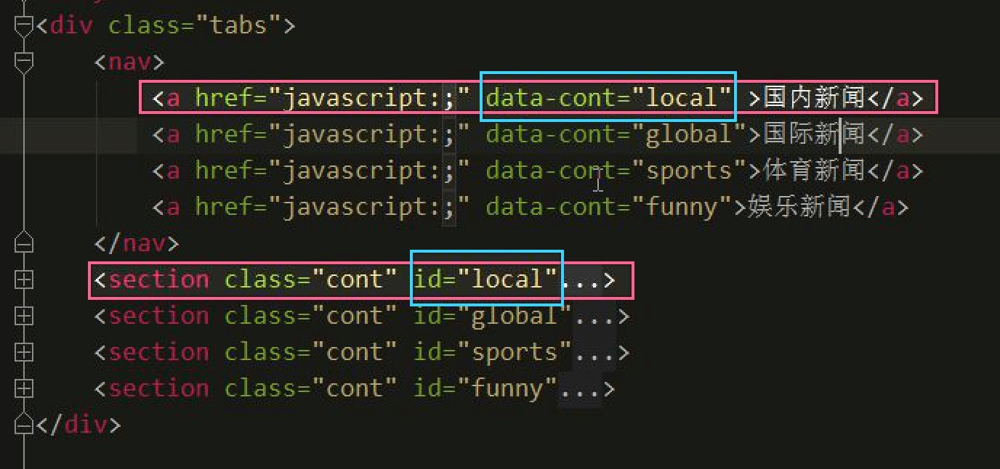

# CSS3 和 HTML5 Day_01_标签语义化_表单增强_多媒体标签_自定义属_querySelector() 和 querySelectorAll()_classList_定位_客户端缓存数据

[TOC]

### 标签语义化

> 标签语义化Demo

```html

   <body>
   
    <header></header>
    <section>
        <aside></aside>
        <article></article>
    </section>
    <footer></footer>
    
    </body>

```

> 解决ie语义化标签兼容问题

* 在使用html5 时候由于ie兼容性的问题 
* 需要引入 html5shiv ` <script src="https://cdn.bootcss.com/html5shiv/3.7.3/html5shiv.min.js"></script>`

-------

### HTML5 新增表单类型和属性
* 在表单上进行了增强 增强`form`

* **表单新增表单项**
* 类型: `tel,number,color,renge,seach,time,date-time-local,date,month,week`

```html

<form action="" >
        <!--通过type属性值,去增强这个表单项目的类型
            这些类型在不同的浏览器上面会有一定的输入,有兼容性
            在移动端支持很好
        -->

        <!--tel 代表输入项是电话 在移动端焦点定位会弹出数字键盘-->
        <div class="form-group">
            <label for="address">电话号</label>
            <input id="address" class="form-control" type="tel">
        </div>
        <!--eamil 代表输入项是一个邮箱 无需正则验证 -->

        邮箱: <input type="eamil" class="form-control" placeholder="Email">
        数字: <input type="number" class="form-control" >
        颜色: <input type="color" class="form-control">
        搜索框:<input type="search" class="form-control">
        <!--选择时间-->
        时间: <input type="time" >
        选择日期: <input type="date">
        选择月份: <input type="week">
    </form>

```

-------

* **表单新增属性**
* 属性: 
    * `autofocus 定位焦点`
    * `required 必填`
    * `placeholder 占位符` 

```html

<form action="">
        <!--占位符-->
        <input type="text" placeholder="请输入啥啥啥" autofocus required>
        <!--autofocus 自带定位焦点-->
        <!--required 非空校验-->
    </form>

```


-------

### 多媒体标签
* **直接通过标签去播放视频**
1. 视频播放: 使用js去调用`windows media player`
2. `flash adobe flash` 通过这个去做播放器 使用较广
3. 后面小的视频网站都是使用js 调用快播
4. html5 新增的标签直接播放视频


```html

<!--播放音频
        autoplay 自动播放
        controls 控制 可以用来控制该音频的播放
        loop 循环播放
    -->
    <audio src="" autoplay controls loop></audio>


    <!--视频播放-->
    <video src="" autoplay controls loop></video>

```

-------

* 一般查询api 客户端注意
    * **方法**:通过去调用方法,我们可以实现一定的功能
    * **属性**:通过属性 可以获取到一些我们想要的值 获取去设置一些属性值
    * **事件**:通过事件去进行编程,在客户端事件是入口 


-------


### 自定义属性

* 定义: 自定义属性必须是data- 
* 获取: `节点.dataset.属性`
* 使用: 一般是用来保存缓存一些变量的值

```html

<body>
    <!--自定义属性

    w3c 给我们提供了一些属性,这些属性不能满足我们的要求
    就需要自定义属性

    1: 定义的规则
        所有的自定义属性必须是data- 开头

    2: 操作自定义属性
        通过js 去操作 授权获取到这个属性所在的元素 然后在操作属性

    3:自定义属性的应用场景
        一般是用来保存缓存一些变量的值
        编写框架使用的较多
    -->
    <div data-shuxing="我是属性1" data-shuxing1="我是属性2">
    </div>

<script>
    var div = document.getElementsByTagName('div')[0];

    /**
     * dataset 是固定的 dataset set(设置,集合)
     * 通过dataset 可以获取所有的自定义属性
     *
     * 得到的是一个对象
     *
     * console.log(div.dataset);
     * DOMStringMapshuxing: "我是属性1"shuxing1: "我是属性2"__proto__: DOMStringMap
     */

    console.log(div.dataset);
    console.log(div.dataset.shuxing1); //我是属性2


</script>

</body>

```


-------


### querySelector() 和 querySelectorAll()

* `querySelector()`  如果选择器得到了匹配到多个元素 获取到的一个元素
* `querySelectorAll()` 匹配的所有元素 返回一个数组 需要将数据遍历

```js

//新增api 是用来做查询的
    //之前学习的查询页面上面的元素的方法
    //getElementById
    //get

    //新增了两个方法
    //① querySelector() 根据指定的选择器去查询
    //如果选择器得到了匹配到多个元素 获取到的一个元素

    console.log(document.querySelector('.box'));
    //

    //②querySelectorAll() 根据指定的选择器查询
    //匹配的所有元素 返回一个数组 需要将数据遍历

    var divs = document.querySelectorAll('div')

```

-------

### 选项卡点击案例

* ① 初始化默认选中
    * 默认选中那个`a`元素的导航 对应的`section`显示

* ② 给所有的导航 `a` 元素添加点击事件
    * 清除所有的兄弟 `a` 元素的`active` 样式
    * 给当前元素本身上面添加一个`active`样式
    
* ③ 获取当前点击`a`元素的自定义属性`cont`的值
    * 根据`cont`的值获取对应的`section`
    * 要将所有的`section`隐藏 在将对应的`section`显示



   

```css

body {
            margin: 0;
            padding: 0;
            background-color: #F7F7F7;
        }

        .tabs {
            width: 400px;
            margin: 30px auto;
            background-color: #FFF;
            border: 1px solid #C0DCC0;
            box-sizing: border-box;
        }

        .tabs nav {
            height: 40px;
            text-align: center;
            line-height: 40px;
            overflow: hidden;
            background-color: #C0DCC0;
            display: flex;
        }

        nav a {
            display: block;
            width: 100px;
            border-right: 1px solid #FFF;
            color: #000;
            text-decoration: none;
        }

        nav a:last-child {
            border-right: 0 none;
        }

        nav a.active {
            background-color: #9BAF9B;
        }

        .cont {
            overflow: hidden;
            display: none;
        }

        .cont ol {
            line-height: 30px;
        }

```


```js

/*
          * 1:默认的选中 默认选中那个a 元素的导航，那个a 元素导航对应的section 显示
          *
          * 2：我要给所有的导航  a 元素添加点击事件
          * 2.1 我要清除所有的兄弟a 元素的active 的样式
          * 2.2 我要给当前元素的本身上面添加一个active 样式.
          *
          * 3:我要获取到当前点击的a 元素的自定义属性cont的值
          * 3.1 根据cont 的值获取到对应的section
          * 3.2 我先要把所有的section 先隐藏起来，再把对应的section 显示出来.
          * */
          //页面上面所有的dom 绘制完毕就执行，不包含图片.
          document.addEventListener("DOMContentLoaded",function(){
                /*1:默认的选中 默认选中那个a 元素的导航，那个a 元素导航对应的section 显示*/
               /* function defaultTab(index){
                }
                //这里传递的实参是0,1,2,3
                defaultTab(1); 定义即调用*/
               (function(index){
                     //1：我要给所有的导航  a 元素添加点击事件
                     var navs=document.querySelectorAll("nav a");
                     //1.1 遍历所有的a 元素，a 元素的索引值等于index 的，添加active 样式.
                     for(var i=0;i<navs.length;i++){
                          if(index==i){
                               navs[i].setAttribute("class","active");
                               //1.2 我要找到当前的a 元素的自定义属性 data-cont
                               var scont=navs[i].dataset.cont;
                              //1.3 根据自定义属性的值找到对应的section，然后显示这个section
                               document.querySelector("#"+scont).style.display="block";
                          }
                          //2：我要给所有的导航  a 元素添加点击事件
                          navs[i].onclick=function(){
//                              2.1 我要清除所有的兄弟a 元素的active 的样式
                                for(var j=0;j<navs.length;j++){
                                     navs[j].removeAttribute("class");
                                }
//                              2.2 我要给当前元素的本身上面添加一个active 样式.
                                this.setAttribute("class","active");
//                              3: 我要获取到当前点击的a 元素的自定义属性cont的值
                                var clickcont=this.dataset.cont;
//                              * 3.1 我先要把所有的section 先隐藏起来，再把对应的section 显示出来.
                                var sections=document.querySelectorAll("section");
                                for(var z=0;z<sections.length;z++){
                                    sections[z].style.display="none";
                                }
//                              * 3.2 根据cont 的值获取到对应的section
                                document.querySelector("#"+clickcont).style.display="block";
                          }
                     }

              })(1)
          })


```


```html

<div class="tabs">
    <nav>
        <a href="javascript:;" data-cont="local" >国内新闻</a>
        <a href="javascript:;" data-cont="global">国际新闻</a>
        <a href="javascript:;" data-cont="sports">体育新闻</a>
        <a href="javascript:;" data-cont="funny">娱乐新闻</a>
    </nav>
    <section class="cont" id="local" >
        <ol>
            <li>河感在生矿难，死伤在全10</li>
            <li>禽流感在感在广1处继续蔓延，温家宝指示</li>
            <li>南方大旱，农作物减产绝收面积上亩</li>
            <li>猪流感在广在全国暴发</li>
            <li>禽流感在全国多处继续蔓延，温家宝指示</li>
            <li>南方大旱，农作物减产绝收面积上亩</li>
            <li>猪流感在广东群体性暴发</li>
        </ol>
    </section>
    <section class="cont" id="global">
        <ol>
            <li>河南再次发生矿难，死伤人数超过100</li>
            <li>禽流感次发生蔓延，温家宝指示</li>
            <li>南方大旱，农作物减产绝收面积上亩</li>
            <li>猪流感在广减产绝收发</li>
            <li>禽流感在全国多作物减产绝收面积上亩</li>
            <li>猪流感在广东群体性暴发</li>
        </ol>
    </section>
    <section class="cont" id="sports">
        <ol>
            <li>河南再次发生矿难，死伤人数超过100</li>
            <li>禽流感在全国多处农作物农延，温家宝指示</li>
            <li>南方大旱，农作物减产绝收面积上亩</li>
            <li>猪流感在广东群体性暴发</li>
            <li>禽流感在全农作物继续蔓延，温家宝指示</li>
            <li>南方大农作物减产绝收面积上亩</li>
            <li>猪流感在广东群体性暴发</li>
        </ol>
    </section>
    <section class="cont" id="funny">
        <ol>
            <li>福建发生血腥命案:两女遭割喉 1男孩被砍数刀</li>
            <li>四川原副省长李成云被查 5年前曾违纪又复出</li>
            <li>胡歌反对粉丝探班：以前请吃饭现在会黑脸</li>
            <li>曝郑爽爸爸歌厅撩妹 与女子勾肩搭背显亲密</li>
            <li>宜宾公安副局长无证驾驶出车祸 弃车离开现场</li>
            <li>国子监大街门匾现错字 已悬挂近10年(图)</li>
            <li>猪流感在广东群体性暴发</li>
        </ol>
    </section>
</div>

```


-------


### classList

* 用于操作样式
* `setAttribute('class','')`
* `removeAttribute("","")`

* html5 新增api操作样式 list 集合
* `Node.classList.add` 添加一个类名
* `Node.classList.remove` 删除一个类名
* `Node.classList.contains` 判断当前元素是否包含某个类名

```js

<body>
    <div class="box"></div>
    <input type="button" value="类名操作">

<script>
    document.querySelector('input').onclick=function(){
        var div = document.querySelector('div');
        if(div.classList.contains('active')){
            //删除类名
            div.classList.remove('active')
        }else{
            //在当前元素上追加一个类名
            div.classList.add('active');
        }
    }
</script>

```


```js

document.querySelector('input').onclick=function(){
        var div = document.querySelector('div');
        //toggle 切换判断当前元素是否具备该样式 如果有就移除
        div.classList.toggle('active');
    }

```

-------

### 定位

* 获取用户的位置
1. ip定位 给服务器发送一个请求,给服务器传递客户端ip ip是由运营商管理
2. gps 定位 根据微信定位

* lbs `location base service`

* 获取用户的位置,获取经纬度 调用js提供的api 进行位置的获取
* `window.navigator.geolocation.getCurrentPosition()`


```js

/**
             * 两个参数 都是回调函数
             * 第一个回调函数是,位置获取成功的时候调用
             *      position 是一个形参 谁调用谁传递这个参数
             *      这个参数是浏览器获取到位置后 将位置通过形参传递给我们
             * 第二个 也是个回调函数 这个函数是位置获取失败的时候调用
             */
            window.navigator.geolocation.getCurrentPosition(
                    function(postion){
                        //position.coords  获取坐标
                        console.log('经度' + postion.coords.longitude);
                        console.log('纬度' + postion.coords.latitude);

                        //获取到经纬度之后 可以调用第三方地图

                    },
                    function () {
                        console.log('获取不到');
                    }
            )

```


> 使用百度地图Api 显示位置


```js

 var panorama = new BMap.Panorama('panorama');
    panorama.setPosition(new BMap.Point(116.357406,39.768063)); //根据经纬度坐标展示全景图


var map = new BMap.Map("normal_map", mapOption);
var testpoint = new BMap.Point(116.357406,39.768063);

```

-------

### 客户端缓存数据
* 调用`sessionStorage` 和 `localStorage` 的api存储数据
* 调用api 去进行存储 存储方式是以键值方式进行存储


* `setItem("Key","Value")`
* `getItem("key")`
* `removeItem("key")` 
* `clear()`     


```js

 window.sessionStorage.setItem('username','淑华');
 var username = window.sessionStorage.getItem('username');
         console.log(username);
 window.sessionStorage.removeItem("username");
 window.sessionStorage.clear();        

```

```js

window.localStorage.setItem('username','淑华');
var username = window.localStorage.getItem('username');
            console.log(username);
window.localStorage.removeItem("username");
window.localStorage.clear();

``` 

-------


#### sessionStorage 和 localStorage 的区别

*  `sessionStorage` 会话存储如果关闭当前浏览器 数据会被清空
*  `localStorage` 本地存储 如果保存数据后 关闭浏览器后不会被清空 除非手动清除 或者 使用软件清除 否则一直保存在本机中

-------


#### 使用场景

* **① 记住用户的皮肤,主题**

```js


 <!--
        做一个页面 这个页面有一个默认的颜色 我可以选择一个颜色
        选择颜色后 将页面颜色进行改变 将选中的颜色进行保存
        保存在localstorage中

        下次打开页面 获取到保存在localstorage中的页面颜色 在进行设置
    -->

    <div class="box" style=" float: right">
        <select id="colorChangeID">
            <option value="green">绿色</option>
            <option value="blue">蓝色</option>
            <option value="yellow">黄色</option>
            <option value="black">黑色</option>
        </select>
    </div>


    <script>
        document.getElementById('colorChangeID').onchange = function(){
            var color = this.value;
            document.body.style.backgroundColor = color;

            //将这个颜色的值保存在 localstorage 中
            window.localStorage.setItem("color",color);
        }

        //当用户打开这个页面 从 localstorage 中获取颜色 获取颜色之后直接设置给body
        var color = window.localStorage.getItem('color');
        //注意 首次打开页面是没有值的
        if(color) {
            document.body.style.backgroundColor = color;
        }
    </script>


```


-------

* **② 我们做小说阅读器 记住用户上一次的阅读位置**


```html

<!--
    阅读会去滚动滚动条 退出的时候获取到用户阅读的位置
    设置这个位置到localstorage 里面
    当再次打开页面时.我们从 loaclstorage获取到用户阅读的位置
    让滚动到用户阅读的位置
    -->

    <div class="box1"></div>
    <div class="box2"></div>
    <div class="box3"></div>

```

```js

/**
         * ① 要监听用户关闭浏览器窗口的行为 window.onbeforeload在浏览器关闭之前去调用
         * ② 获取到用户滚动的位置 得到localstroage 往这个对象里面去设置位置
         * ③ 当打开页面 从localstroage中去获取滚动到对应的位置,让滚动条到具体位置
         */

        window.onload = function(){
            //获取被卷曲进去的长度 让滚动条滚动到这个位置
            var top = window.localStorage.getItem('scrollTop');
            if(top){
                //滚动到具体的位置
                window.scrollTo(0,top);
            }
        }

        window.onbeforeunload = function(){
            //这个里面的代码会执行
            var top = document.body.scrollTop;
            window.localStorage.setItem('scrollTop',top);
        }

```


-------


* **③ 使用搜索的时候 记住用户搜索历史**


```html

  <!--
            1:点击input type=text 的框 ,捕获到焦点的事件，我要从localStorage 里面去获取用户搜索的历史记录
             因为可能获取多条. 搜索的历史记录存储的是一个有规则的字符串，我把这个字符串进行切割，转换成数组。
            遍历这个数组，然后把这个数据放在页面上面对应的位置
            2:用户点击搜索的时候，我要把用户是的搜索的关键字记录起来。
                1：我获取到关键字，
                2：往localStorage 里面存，为了避免不把原来的历史记录覆盖。
                3：所以我在存的时候先把原来的历史记录获取出来，在原来的基础上进行追加
                4：然后把追加之后的结果放在localstorage 里面.
    -->
    <input type="text" id="keyword"> <input type="button" value="一下">
    <div class="message">

```

```js

document.querySelector("input[type=button]").onclick=function(){
                //获取到用户搜索的关键字
                var keyword=document.getElementById("keyword").value; //有值
                var data=window.localStorage.getItem("searchkeyword");
                if(data==null){
                       data=keyword;
                }else{
                       data=data+","+keyword;
                }
                //会往里面保存数据，但是保存的时候，原来的searchkeyword对应的值会被清空.
                window.localStorage.setItem("searchkeyword",data);
         };
         /*焦点定位到input 框的时候触发事件.*/
         document.querySelector("input[type=text]").onfocus=function(){
               //我要获取到localStorage 里面的searchkeyword 的key 对应的值，这个值就是用户的搜索历史关键字
               //每个关键字存储是以,号隔开，我需要把这个内容转换成一个数组，然后把它放在
               var keyWords=window.localStorage.getItem("searchkeyword");
               if(keyWords!=null){
                     //将字符串使用指定的符号进行切割.
                    var arr=keyWords.split(",");
                    var div="";
                    for(var i=0;i<arr.length;i++){
                            div+="<div>"+arr[i]+"</div>";
                    }
                    document.querySelector(".message").innerHTML=div;

               }
         }

```


