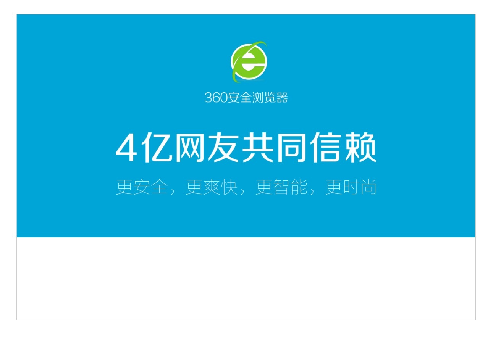

# CSS3_Day02_添加私有化前缀_选择器增强_新增颜色表示方式_阴影_盒模型计算_边框圆角_渐变_background-size_过渡

[TOC]

### CSS 添加私有化前缀
 
* `CSS2`的升级版本 
* 在移动端支持优于 pc 端 
* 广泛应用


```css

.box{
            width:200px;
            height: 200px;
            background-color: palevioletred;

            /* css3 特点属性 所以有兼容性问题 添加私有化前缀*/
            /* border-radius: 50%; */

            -webkit-border-radius: 50%;
            -moz-border-radius: 50%;
        }

```

-------

### CSS3选择器增强
#### 属性选择器


```css

/* 属性选择器 */
        [class]{ /*获取页面上所有的元素 有class属性的元素*/

        }

        /* 获取页面上所有的元素 class 属性值等于box的元素 */
        [class = "box"]{}

        /* 获取到页面上所有的div class 属性的值等于box 的div*/
        div[class="box"]{}

        /*获取到所有的div class 的属性以bo 开头的div 元素会被匹配 */
        div[class^="bo"]{}

        /* 获取到所有的div元素 class属性的值以 ox结尾 的元素被匹配*/
        div[class$="ox"]{}

        /* 获取页面上所有的div元素 div元素class属性值包含 box元素值会被匹配*/
        div[class*="box"]{}

```

-------

#### 伪类选择器


```css

/*获取li元素 父元素下面的第一个子元素
        第一个子元素必须是li元素
        */
        li:first-child{}
        /* 获取li元素 父元素下面的最后一个子元素
        最后一个子元素必须是li元素
        */
        li:last-child{}

        /*
        获取li元素  父元素下面的第2个子元素
        第2个子元素必须是 li 元素
        */
        li:nth-child(2){}

        /* 获取li元素 父元素下面的所有的子元素
        所有的子元素只有是li元素才会被匹配
        */
        li:nth-child(n){}

        /* 获取所有li 元素为偶数的元素 */
        li:nth-child(2n){}

        /* 获取所有li 元素为基数的元素 */
        li:nth-child(2n-1){}

        /*偶数*/
        li:nth-child(even){}

        /*基数*/
        li:nth-child(odd){}
        
        /* 获取 li 元素 父元素下的最后一个子元素
        最后一个子元素必须是 li 元素
        */
        li:nth-last-child(1){}


        /*
        获取ul 下面前5个li元素
        */

        li:nth-child(-n+5){}

        /*获取ul 下面的后面5个li元素*/
        li:nth-last-child(-n+5){}
        
```

-------

##### 日历选择案例


```css

  body, ul, dl, dt, dd {
            margin: 0;
            padding: 0;
        }

        body {
            background-color: #F7F7F7;
        }

        ul {
            list-style: none;
        }

        .calendar {
            width: 385px;
            height: 312px;
            padding: 48px 141px 10px 12px;
            margin: 100px auto;
            background: url(./images/bg.jpg) 0 0 no-repeat;
        }

        .calendar dt, .calendar dd {
            overflow: hidden;
        }

        .calendar span {
            display: block;
            width: 48px;
            height: 48px;
            text-align: center;
            margin-right: 1px;
            border: 3px solid transparent;
            float: left;
        }

        .calendar dt {
            border-top: 1px solid #5CADFF;
        }

        .calendar dt span {
            height: 28px;
            line-height: 34px;
            font-size: 14px;
        }

        .calendar dd {
            border-top: 1px solid #c8cacc;
            cursor: pointer;
        }

        .calendar span > b,
        .calendar span > b {
            display: block;
            line-height: 1;
        }

        .calendar span > b {
            height: 26px;
            line-height: 30px;
            font-size: 18px;
            font-family: Arial;
            font-weight: normal;
        }

        .calendar span > i {
            color: #999;
            font-size: 12px;
            font-style: normal;
        }

        /* 以下为自主完成部分 */
        /*红色 #e02d2d 黄色 #ffbb00 */
        span:nth-child(7n){
            color:#e02d2d;
        }
        span:nth-child(7n-1){
            color:#e02d2d;
        }
        span:hover{
            border: 3px solid #ffbb00;
        }

```


```html

<!-- 日历 -->
<div class="calendar">
    <dl>
        <dt>
            <span>一</span>
            <span>二</span>
            <span>三</span>
            <span>四</span>
            <span>五</span>
            <span>六</span>
            <span>日</span>
        </dt>
        <dd>
				<span data-range="prev-month">
					<b>30</b>
					<i>十九</i>
				</span>
				<span class="today">
					<b>1</b>
					<i>艾滋病日</i>
				</span>
				<span>
					<b>2</b>
					<i>廿一</i>
				</span>
				<span>
					<b>3</b>
					<i>廿二</i>
				</span>
				<span>
					<b>4</b>
					<i>廿三</i>
				</span>
				<span>
					<b>5</b>
					<i>廿四</i>
				</span>
				<span>
					<b>6</b>
					<i>廿五</i>
				</span>
        </dd>
        <dd>
				<span data-flag="festival">
					<b>7</b>
					<i>廿六</i>
				</span>
				<span>
					<b>8</b>
					<i>廿七</i>
				</span>
				<span>
					<b>9</b>
					<i>廿八</i>
				</span>
				<span>
					<b>10</b>
					<i>廿九</i>
				</span>
				<span>
					<b>11</b>
					<i>初一</i>
				</span>
				<span>
					<b>12</b>
					<i>初二</i>
					</span>
				<span>
					<b>13</b>
					<i>初三</i>
				</span>
        </dd>
        <dd>
				<span>
					<b>14</b>
					<i>初四</i>
				</span>
				<span>
					<b>15</b>
					<i>初五</i>
				</span>
				<span>
					<b>16</b>
					<i>初六</i>
				</span>
				<span>
					<b>17</b>
					<i>初七</i>
				</span>
				<span>
					<b>18</b>
					<i>初八</i>
				</span>
				<span>
					<b>19</b>
					<i>初九</i>
				</span>
				<span>

					<b>20</b>
					<i>初十</i></span>
        </dd>
        <dd>
				<span>
					<b>21</b>
					<i>十一</i>
				</span>
				<span data-flag="festival">
					<b>22</b>
					<i>十二</i>
				</span>
				<span>
					<b>23</b>
					<i>十三</i>
				</span>
				<span>
					<b>24</b>
					<i>十四</i>
				</span>
				<span>
					<b>25</b>
					<i>十五</i>
				</span>
				<span>
					<b>26</b>
					<i>十六</i>
				</span>
				<span>
					<b>27</b>
					<i>十七</i>
				</span>
        </dd>
        <dd>
				<span>
					<b>28</b>
					<i>十八</i>
				</span>
				<span>
					<b>29</b>
					<i>十九</i>
				</span>
				<span>
					<b>30</b>
					<i>二十</i>
				</span>
				<span>
					<b>31</b>
					<i>廿一</i>
				</span>
				<span data-range="next-month">
					<b>1</b>
					<i>元旦</i>
				</span>
				<span data-range="next-month">
					<b>2</b>
					<i>廿三</i>
				</span>
				<span data-range="next-month">
					<b>3</b>
					<i>廿四</i>
				</span>
        </dd>
    </dl>
</div>

```


-------

##### 扩展 nth-of-type(1)

```css

        /* 获取到li元素 父元素下面的第一个li元素 */
        li:nth-of-type(1){
            color: coral;
        }

```

-------

#### 伪元素选择器

* 两个`::` 通过`css` 往页面上添加元素

```css

.box{
            width: 400px;
            height: 400px;
            border-right:1px solid #ccc;
            margin: 100px auto;
        }

        /*
        新增一个盒子 往box 内部的前面新增一个盒子
        注意: 一定要添加content属性 如果新增这个盒子没有内容 也不可以省略
        必须要转换为块级元素
        */
        .box::before{
            content: "";
            display: block;
            width: 200px;
            height: 200px;
            background-color: coral;
        }

        .box::after{
            content: "";
            display: block;
            width: 200px;
            height: 200px;
            background-color: hotpink;
        }
        

```


-------

### 新增颜色的表示方式

* `rgba`  red green blue alpha
* `hsla` hue色调 Saturation(饱和度) lighless(亮度) alpha 

```css

  .box{
            width: 100px;
            height: 100px;

            /*新增的两种方式 rgba red green blue alpha*/
            background-color: rgba(28, 255, 99, 0.5);

            /*hue色调 Saturation(饱和度) lighless(亮度) alpha */
            /*
                hue 0-360 0 代表红 120代表绿色 240蓝色
                Saturation 100%
                lighless 50%
                1
            */
            background-color: hsla(120,100%,50%,1);
        }

```

-------


#### 颜色的继承

```css

.box{
              width: 200px;
              height: 200px;
              background-color: black;
              //opacity: 0.1;
             background-color: rgba(0,0,0,0.1);
         }
         /*我们可以发现当前元素的box1的opacity继承了父元素box 的的opacity*/
         .box1{
              width: 100px;
              height: 100px;
              background-color: blue;
         }

```

-------


#### 遮罩案例


```css

  html,body{
            width: 100%;
            height: 100%;
        }
        *{
            margin: 0;
            padding: 0;
        }
        .win{
            position: fixed;
            left: 0;
            top: 0;
            display: none;
            width: 100%;
            height: 100%;
            background-color: rgba(0,0,0,0.3);
        }
        .win_box{
            width: 200px;
            height: 100px;
            margin: 100px auto;
            border: 1px solid #ccc;
            background-color: #fff;
        }

```


```html

<input type="button" value="遮罩">
<div class="win">
      <div class="win_box">
                <div>您确定要退出系统吗</div>
                <input type="button" value="确定">
                <input type="button" value="取消">
      </div>
</div>
<a href="http://www.baidu.com">我是百度</a>
<script>
     document.querySelector("input").onclick=function(){
          document.querySelector(".win").style.display="block";
     }
</script>

```

-------


### 阴影

#### 文本阴影

```css

  /* 文本阴影 text-shadow
        age0 影子水平方向偏移度 正数右 负数左
        age1 影子在垂直方向的偏移 如果是正数 则向下
        age2 影子的模糊度 不能为负数
        age3 影子的颜色

        可以设置多个影子
        */
        p{
            text-shadow: 1px 1px 20px red,
            20px 10px 20px pink;
        }

```

-------

##### 浮雕文字案例


```css

        p {
           font-size: 80px;
            font-weight: 700;
            color: #cccccc;
        }

        body {
            background-color: #cccccc;
        }

        .to{
            text-shadow: -1px -1px 1px #fff,1px 1px 1px #000;
        }

        .ao{
            text-shadow: -1px -1px 1px #000,1px 1px 1px #fff;
        }
        

```

-------

#### 盒子阴影
* `box-shadow`
* `box-shadow: inset `

```css

.box {
            width: 100px;
            height: 100px;
            border: 1px solid #ccc;
            border-radius: 50%;
            margin: 20px;
            /*也可以设置多个*/
            box-shadow: 2px 2px 4px #2b2b2b;

            /*内阴影*/
            box-shadow: inset 2px 2px 20px #2b2b2b,inset -2px -2px 40px #2b2b2b;
        }

```

### 盒模型


```css

.box{
                 width: 200px;
                 height: 200px;
                 border: 20px solid #ccc;
                 padding: 10px;
                 /*width=本身width+borderWidth+padding */
                 /*box-sizing: content-box;*/
                 /*width=width */
                 box-sizing: border-box;
            }
            /*
                盒子原来的计算方式:
                width=本身width+borderWidth+padding
                通过盒模型改变
                box-sizing: content-box;
                box-sizing: border-box;
            */


```

-------


### 边框圆角

```css

.box{
            width: 200px;
            height: 200px;
            background-color: palegoldenrod;

            /*
            边框圆角是使用一个 border-radius 的属性
            130px 代表的是水平方向的距离
            40px 代表垂直方向的距离
            圆心 水平方向与垂直方向的交叉位置
            半径 130px 40px

            */
            border-top-left-radius: 130px 40px;
            border-radius: 100px;

        }

```


-------

#### Android机器人案例


```css

body{
             margin: 0;
             padding: 0;
             background-color: #f3f3f3;
         }
         .main{
              margin: 100px auto;
              width: 600px;
              height: 500px;
              background-color: #fff;
         }

        .content{
             width: 320px;
             height: 400px;
             background-color: pink;
             margin: 0 auto;
             padding-top: 20px;
             position: relative;
        }

        header{
             width: 220px;
             height: 100px;
             background-color: green;
             margin: 0 auto;
             border-top-left-radius: 100px;
             border-top-right-radius: 100px;
             position: relative;
        }

         header::before,header::after{
             width: 20px;
             height: 20px;
             background-color: #fff;
             content: '';
             border-radius: 50%;
             position: absolute;
             top: 50px;
         }
         header::before{
             left: 50px;
         }
         header::after{
             right: 50px;
         }

         main{
             position: relative;
             width: 220px;
             height: 200px;
             background-color: green;
             margin: 10px auto;
             border-radius: 0px 0px 20px 20px;
         }

         main::before{
             content: '';
             background-color: green;
             position: absolute;
             width: 40px;
             height: 80px;
             left: 40px;
             bottom: -90px;
             border-radius: 10px;
         }
         main::after{
             content: '';
             background-color: green;
             position: absolute;
             width: 40px;
             height: 80px;
             right: 40px;
             bottom: -90px;
             border-radius: 10px;
         }


         footer::before{
              width: 40px;
              height: 140px;
              content: '';
              left: 5px;
              top: 150px;
              background-color: green;
              position: absolute;
              border-radius: 10px;
         }
         footer::after{
             width: 40px;
             height: 140px;
             content: '';
             right: 5px;
             top: 150px;
             background-color: green;
             position: absolute;
             border-radius: 10px;
         }

```

```html

<body>
       <div class="main">
            <div class="content">
                    <header></header>
                    <main></main>
                    <footer></footer>
            </div>
       </div>
</body>

```


-------

### 渐变
#### 线性渐变
* 线性渐变指沿着某条直线朝着一个方向产生渐变效果
1. 渐变方向
2. 渐变的启起始颜色
3. 渐变的终止颜色

* 渐变实际行是在浏览器在`background-image`


```css

 .box{
            width: 300px;
            height: 300px;
            margin: 0 auto;
            /*
            linear-gradient 实际上是调用浏览器底层的一个函数
            渐变的方向
                第一种表示方式
                    to left,right,top,bottom
                第二种表示方式
                   90deg,135deg 通过角度

            渐变的启颜色


            渐变的终止颜色

            */
            background-image: linear-gradient(135deg,aquamarine,coral);
        }

```


-------


```css

 .box1{
            width: 1000px;
            height: 300px;
            margin: 0 auto;
            color: lightgoldenrodyellow;
            background-image: linear-gradient(
                    to right,
                    aquamarine 0%,
                    coral 25%,
                    cyan 50%,
                    yellow 75%,
                    lightgoldenrodyellow 100%
            );
        }

```


-------

##### 线性渐变案例


```css

 * {
            margin: 0;
            padding: 0;
        }

        .box {
            width: 1200px;
            height: 300px;
            margin: 0px auto;
            background-image: linear-gradient(
                135deg,
                black 0%,
                black 25%,
                white 25%,
                white 50%,
                black 50%,
                black 75%,
                white 75%
            );
            background-size: 100px 100px;

            animation: change 0.2s linear infinite;
        }

        .box1 {
            width: 1200px;
            height: 300px;
            margin: 0px auto;
            background-image: linear-gradient(
                    45deg,
                    black 0%,
                    black 25%,
                    white 25%,
                    white 50%,
                    black 50%,
                    black 75%,
                    white 75%
            );
            background-size: 100px 100px;

            animation: change 0.2s linear infinite;
        }

        /* 定义动画*/
        @keyframes change {
            from{
               background-position: -100px 0px;
            }to{
               background-position: 0px 0px;
             }
        }

```


```html

<body>
       <div class="main">
            <div class="content">
                    <header></header>
                    <main></main>
                    <footer></footer>
            </div>
       </div>
</body>

```

-------

#### 径向渐变

```css

.box{
            width: 200px;
            height: 200px;
            margin: 100px auto;

            /*
                中心点位置
                位置的第一种表示方式
                at center center
                left center
                第二种表示方式
                at 20px 20px
            */

            background-image:radial-gradient(
                at 20px 20px,
                yellow,
                green
            );
        }

```

-------

##### 径向渐变案例


```css

.box1{
            width: 200px;
            height: 200px;
            border-radius: 50%;
            background-image: radial-gradient(
                at 50px 50px,
                rgba(0,0,0,0.4),
                black
            );
        }

```

-------


### background-size 背景尺寸

* **设置背景尺寸的大小等于当前盒子的大小**
    * 背景图片会拉伸变形
    * 背景图片不能随着盒子大小的改变而改变
    
* **设置百分比**
    * 背景图片可以随着盒子大小的改变

* **contain**
    * 背景不会拉伸变形
    * 会留下空白    


 

* **cover** 覆盖
    * 背景不会被拉伸变形
    * 不会留下空白 但背景图片有些区域会被截取掉 


```css


.box{
            width: 600px;
            height: 400px;
            border: 1px solid #ccc;
            margin: 300px auto;
            background-repeat: no-repeat;
            background-image: url("images/1.jpg");

            /*1：直接设置背景的高度以及宽度等于当前盒子的宽高*/
            /*但当时背景的宽度以及高度不能自动适应当前盒子*/

            background-size: 600px 400px;

            /*2:直接设置背景的宽度以及高度等于100%*/
            /*但这种方式当前盒子在大小发生改变的时候背景图片会变形，但是
            能够整体盖住当前元素
            */

            background-size: 100% 100%;

            /*这种方式是按照图片的比例等比缩放的，这样的图片不会变形
             当盒子的大小比例与图片的比例大小相等时，会填满当前所有的元素，
             但是比例不相等时，会出现留白的效果.*/
            background-size: contain;

            /*
                    这种方式背景图片是根据当前盒子的实际大小等比缩放的，
                而且也会始终填满整个盒子。
                    当盒子的尺寸与背景图片的尺寸比例不一致时，当前背景图片
              会以最大的比例方式来覆盖整个盒子，背景图片超出的部分会被隐藏掉.
                */

            background-size: cover;


        }

```

-------

### 过渡 
* 是`css3`中具有颠覆性的特性之一 是用来做动画效果的
* **补间动画** 起始状态 ---> 终止状态
* **帧动画** 要知道中间的每一个状态

* 让起始状态到终止状态过渡 我们使用`transtion`属性
* `transtion-property:width` 需要过渡的属性
* `transition-duration:2s` 动画的持续时间
* `transition-timing-function:linear` 过渡的速度
* `transtion-delay:2s` 过渡的延时时间 多个动画在执行的时候 为了让执行有先后顺序
* `transition:all 3s linear 1s;` 简便写法


-------

#### 过渡气泡案例[!]


-------


#### 手风琴案例


```html


<div class="box">
        <div class="list">
            <h3>人事管理</h3>
            <div class="item">

            </div>
        </div>

        <div class="list">
            <h3>流程管理</h3>
            <div class="item">

            </div>
        </div>

        <div class="list">
            <h3>工资管理</h3>
            <div class="item">

            </div>
        </div>


        <div class="list">
            <h3>基础设施管理</h3>
            <div class="item">

            </div>
        </div>
    </div>

```


```css

body{
            margin: 0;
            padding: 0;
        }

        h3{
            margin: 0;
            padding: 0;
        }

        .box {
            width: 300px;
            margin: 0 auto;
        }
        .list h3{
            height: 33px;
            line-height: 33px;
            text-align: center;
            background: #486fbc;
            font-size: 14px;
            color: #ffffff;
            font-weight: normal;
            border-bottom: 2px solid #ffffcc;
            transition: all 1s linear;
        }

        .list .item{
            transition: all 0.5s linear;
            height: 0px;
            background: palevioletred;
        }

        .list:hover h3{
            background-color: #486fbc;
        }

        .list:hover .item{
            height: 300px;
        }

```


-------


