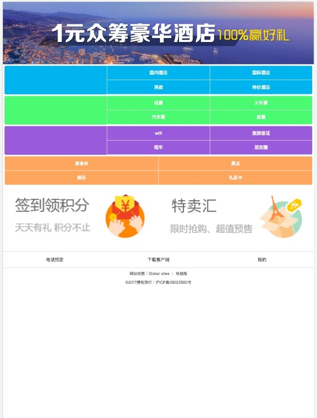

# CSS_Day04_伸缩布局案例_兼容性问题_字体_字体图标_fullpage_360官网案例

[TOC]

### 伸缩布局案例:携程旅行案例





```css


 *{
            margin: 0;
            padding: 0;
        }

        a{
            text-decoration: none;
        }

        .banner a{
            width: 100%;
            display: block;
        }

        .banner a img{
            width: 100%;
            display: block;
        }

        .nav {
            padding: 5px;
        }
        .nav .item{
            height: 90px;
            border-radius: 5px;
            margin-bottom: 5px;
            display: flex;
        }

        .item .pub{
            flex:1;
        }

        .item .sub{
            flex:2;
        }

        .item .sub a{
            height: 45px;
            line-height: 45px;
            text-align: center;
            width: 50%;
            float: left;
            color: #fff;
            font-size: 14px;
            border-left: 1px solid #fff;
            box-sizing: border-box;
            border-bottom: 1px solid #fff;
        }

        .itme .sub a:nth-last-child(-n+2){ border-bottom: none}
        .item:nth-child(1){background-color: #00b3ee}
        .item:nth-child(2){background-color: #56ff71}
        .item:nth-child(3){background-color: #984fdb}
        .item:nth-child(4){background-color: #ffa55e}

        .extra{display:flex}
        .extra a {flex: 1}
        .extra a img{ width: 100%;display: block}


        footer{ margin-top: 10px}
        footer div{text-align: center;height:50px;line-height: 50px;border-bottom: 1px solid #ccc;border-top: 1px solid #ccc;}
        footer div a{width: 33.333%; display: block; float: left;color: black;font-size: 14px}
        footer p { text-align: center;font-size: 12px;margin-top: 10px}


```


```html

<header>
        <section class="banner">
            <a href="#">
                
            </a>
        </section>
    </header>

    <main>

        <section class="nav">
            <div class="item">
                <div class="pub"></div>
                <div class="sub">
                    <a href="#">国内酒店</a>
                    <a href="#">国际酒店</a>
                    <a href="#">民宿</a>
                    <a href="#">特价酒店</a>
                </div>
            </div>

            <div class="item">
                <div class="pub"></div>
                <div class="sub">
                    <a href="#">机票</a>
                    <a href="#">火车票</a>
                    <a href="#">汽车票</a>
                    <a href="#">船票</a>
                </div>
            </div>

            <div class="item">
                <div class="pub"></div>
                <div class="sub">
                    <a href="#">wifi</a>
                    <a href="#">旅游签证</a>
                    <a href="#">租车</a>
                    <a href="#">朋友圈</a>
                </div>
            </div>
            <div class="item">
                <div class="sub">
                    <a href="#">美食林</a>
                    <a href="#">景点</a>
                    <a href="#">娱乐</a>
                    <a href="#">礼品卡</a>
                    <a href="#">会员积分</a>
                    <a href="#">用户反馈</a>
                </div>
            </div>

            <div class="extra">
                <a href=""></a>
                <a href=""></a>
            </div>
        </section>
    </main>

    <footer>
        <div>
            <a href="">电话预定</a>
            <a href="">下载客户端</a>
            <a href="">我的</a>
        </div>
        <p>网站地图｜Global sites ｜ 电脑版</p>
        <p>©2017携程旅行｜沪ICP备08023580号</p>
    </footer>

```

-------

### CSS3_兼容性问题
* 有些属性我们要针对浏览器加前缀 `-webkit` `-mox`
* http://caniuse.com 查阅兼容性文档

-------

### 字体

* 开发人员可以为自已的网页指定特殊的字体，无需考虑用户电脑上是否安装了此特殊字体，从此把特殊字体处理成图片的时代便成为了过去。
* 字体为了兼容性 针对不同的浏览器 拥有不同的字体格式

* 不同浏览器所兼容的格式是不同的

* **1、TureTpe(.ttf)格式**
* .ttf字体是Windows和Mac的最常见的字体，是一种RAW格式，支持这种字体的浏览器有IE9+、Firefox3.5+、Chrome4+、Safari3+、Opera10+、iOS Mobile、Safari4.2+；

* **2、OpenType(.otf)格式**
* .otf字体被认为是一种原始的字体格式，其内置在TureType的基础上，支持这种字体的浏览器有Firefox3.5+、Chrome4.0+、Safari3.1+、Opera10.0+、iOS Mobile、Safari4.2+；

* **3、Web Open Font Format(.woff)格式**
* woff字体是Web字体中最佳格式，他是一个开放的TrueType/OpenType的压缩版本，同时也支持元数据包的分离，支持这种字体的浏览器有IE9+、Firefox3.5+、Chrome6+、Safari3.6+、Opera11.1+；

* **4、Embedded Open Type(.eot)格式**
* .eot字体是IE专用字体，可以从TrueType创建此格式字体，支持这种字体的浏览器有IE4+；

* **5、SVG(.svg)格式**
* .svg字体是基于SVG字体渲染的一种格式，支持这种字体的浏览器有Chrome4+、Safari3.1+、Opera10.0+、iOS Mobile Safari3.2+；

* iconfont.cn 查找需要的字体

-------

> 使用字体

1. 下载字体
2. 在页面中引入字体文件
3. 使用字体


```css

  /*在页面去引入字体*/
            @font-face {
                font-family: 'itcast_font';
                /*引入不同类型的字体是为了兼容不同类型的浏览器*/
                src: url('fonts/ali/webfont.eot'); /* IE9*/
                src: url('fonts/ali/webfont.eot?#iefix') format('embedded-opentype'), /* IE6-IE8 */
                url('fonts/ali/webfont.woff') format('woff'), /* chrome、firefox */
                url('fonts/ali/webfont.ttf') format('truetype'), /* chrome、firefox、opera、Safari, Android, iOS 4.2+*/
                url('fonts/ali/webfont.svg#webfont') format('svg'); /* iOS 4.1- */
            }
            /*我在我的body 当中要使用字体*/
            body{
                 font-family: itcast_font;
                 color: red;
            }

```


```html

<body>
        小旋风
</body>

```

-------

### 字体图标

* 将图片制作成字体
* 常见的是把网页常用的一些小的图标，借助工具帮我们生成一个字体包，然后就可以像使用文字一样使用图标了。

* 优点：
1. 将所有图标打包成字体库，减少请求；
2. 具有矢量性，可保证清晰度；
3. 使用灵活，便于维护；

* 我们可以通过该网站来完成在线图标打包成字体包 https://icomoon.io/

1. iconfont.cn 下载对应的svg格式的图片


```css

@font-face {
  font-family: 'icomoon';
  src:  url('myfonts/icomoon.eot?4r94xx');
  src:  url('myfonts/icomoon.eot?4r94xx#iefix') format('embedded-opentype'),
    url('myfonts/icomoon.ttf?4r94xx') format('truetype'),
    url('myfonts/icomoon.woff?4r94xx') format('woff'),
    url('myfonts/icomoon.svg?4r94xx#icomoon') format('svg');
  font-weight: normal;
  font-style: normal;
}

[class^="icon-"], [class*=" icon-"] {
  /* use !important to prevent issues with browser extensions that change fonts */
  font-family: 'icomoon' !important;
  speak: none;
  font-style: normal;
  font-weight: normal;
  font-variant: normal;
  text-transform: none;
  line-height: 1;
  /* Better Font Rendering =========== */
  -webkit-font-smoothing: antialiased;
  -moz-osx-font-smoothing: grayscale;
}

.icon-home3:before {
  content: "\e902";
}
.icon-pencil:before {
  content: "\e905";
}
.icon-blog:before {
  content: "\e909";
}
.icon-droplet:before {
  content: "\e90b";
}
.icon-paint-format:before {
  content: "\e90c";
}
.icon-images:before {
  content: "\e90e";
}
.icon-headphones:before {
  content: "\e910";
}
.icon-play:before {
  content: "\e912";
}
.icon-spades:before {
  content: "\e917";
}
.icon-download3:before {
  content: "\e9c7";
}
.icon-evil:before {
  content: "\e9ef";
}
.icon-volume-high:before {
  content: "\ea26";
}
.icon-android:before {
  content: "\eac0";
}


```

```html

<!--第一步，我需要引入字体的对应的css 文件-->
    <link rel="stylesheet" href="fonts/font.css">
</head>
<body>
    <!--
        icon- 开头，这个class 类里面用到了 icomoon
        .icon-android:before 在当前元素下面添加一个伪元素 before 它的内容是eac0
        eac0 会被 icomoon 字体库解析成一个图标
    -->
    <span class="icon-android">

    </span>


    <span class="icon-download3">
        <!--\e9c7-->
    </span>

```

-------


### jQuery + fullPage


```html

<script src="js/jquery.min.js"></script>
<!--再引入插件-->
<script src="js/jquery.fullPage.min.js"></script>

```

```html

 <div id="fullpage">
        <!--使用fullpage 要求，每一屏上面都需要有一个section 的类名-->
        <div class="section first"></div>
        <div class="section seconds"></div>
        <div class="section third "></div>
        <div class="section fourth"></div>
        <div class="section fivth"></div>
    </div>

    <ul class="pointBox">
        <li class="active"></li>
        <li></li>
        <li></li>
        <li></li>
        <li></li>
    </ul>
    
```


```css

 *{
            margin: 0;
            padding: 0;
            list-style: none;
        }
        /*定义每一屏的样式*/
        .first{background-color: #c9302c;}
        .seconds{background-color: #00b0e0;}
        .third{background-color:#0D3349;}
        .fourth{background-color: #1b809e;}
        .fivth{background-color: pink;}

        /*五个盒子的定位*/
        .pointBox{
            position: fixed;
            right: 20px;
            top: 50%;
            margin-top: -45px;
        }
        .pointBox li{
            width: 8px;
            height: 8px;
            border: 1px solid #ccc;
            border-radius: 50%;
            margin-top: 10px;
            cursor: pointer;
        }
        .pointBox li:nth-child(1){
            margin-top: 0;
        }
        .pointBox li.active{
            background-color: #fff;
        }

```


```js

        $(function(){
            $("#fullpage").fullpage({
                afterLoad:function(anchorLink,index){
                    $(".pointBox li").removeClass("active");
                    $(".pointBox li").eq(index-1).addClass("active");
                }
            });

            $(".pointBox li").on("click",function(){
                $(".pointBox li").removeClass('active');
                $(this).addClass('active');
                var index = $(this).index();
                $.fn.fullpage.moveTo(index+1);
            });
        });

```


-------


### 360官网案例

* **① 先完成轮播图逻辑**


```html

<script src="js/jquery.min.js"></script>
<!--再引入插件-->
<script src="js/jquery.fullPage.min.js"></script>

```

```css

*{
            margin: 0;
            padding: 0;
            list-style: none;
        }

        /*5个盒子的定位*/
        .pointBox{
            position: fixed;
            right: 20px;
            top: 50%;
            margin-top: -45px;
        }

        .pointBox li{
            width: 8px;
            height: 8px;
            border: 1px solid #ccc;
            border-radius: 50%;
            margin-top: 10px;
            cursor: pointer;
        }

        .pointBox li:nth-child(1){margin-top: 0}

        .jumpbox{
            width: 10px;
            height: 10px;
            background-color: #fff;
            border-radius: 50%;
            position: fixed;
            right: 20px;
            box-shadow: 0px 0px 20px white;
            transition: all .4s ease-in;
        }

```


```html

<div id="fullpage">
    <div class="section fitst"></div>

    <div class="section seconds"></div>

    <div class="section third"></div>
    <div class="section fourth"></div>
    <div class="section fivth"></div>
</div>

<ul class="pointBox">
    <li></li>
    <li></li>
    <li></li>
    <li></li>
    <li></li>
</ul>
<div class="jumpbox">
</div>

```


```js

$(function(){
        var top = $(".pointBox li:first-child").offset().top;
        $(".jumpbox").css("top",top);


        $("#fullpage").fullpage({
            sectionsColor: ['#0da5d6', '#2AB561', '#DE8910', '#16BA9D', '#0DA5D6'],
            afterLoad:function(anchoLink,index){
                $(".section").removeClass("current");

                var litop = $(".pointBox li").eq(index-1).offset().top;
                $(".jumpbox").css('top',litop);
            }
        });
    })

    /*点击的时候切换到某一屏上*/
    $(".pointBox li").on("click",function(){

        var litop = $(this).offset().top;
        $(".jumpbox").css("top",litop);
        var index = $(this).index();
        /**
         * 滚动到第几屏幕
         */
        $.fn.fullpage.moveTo(index + 1);

    });

```


-------

* **② 实现第一屏**


```html

  <div class="section first">
        <div class="logo"></div>
        <div class="text">
            
            
            
            
            
            
            
            
        </div>
        <div class="info"></div>
    </div>

```


```css

.first{ padding-top: 40px}
        .first .logo{
            background-image: url("./images/logo.png");
            background-repeat: no-repeat;
            width: 251px;
            height: 186px;
            margin: 0 auto;
        }

        .first .text{
            text-align: center;
            margin: 60px 0;
        }

        .first .text img{
            margin: 0px 32px;
            opacity: 0.1;
            transition: all 1s linear;
        }
        
        .first .info{
            background-image: url("./images/info_1.png");
            width: 772px;
            height: 49px;
            margin: 50px auto;
        }

        /*第一屏的动画*/
        .first.current .text img{
            opacity: 1;
            margin: 0px;
        }

```


```js

    $("#fullpage").fullpage({
                sectionsColor: ['#0da5d6', '#2AB561', '#DE8910', '#16BA9D', '#0DA5D6'],
                afterLoad:function(anchoLink,index){
                    $(".section").removeClass("current");
    
                //index 1,2,3,4,5
                //滚动到某一屏幕之后都会调用这里的代码.
                window.setTimeout(function(){
                    $(".section").eq(index-1).addClass("current")
                },100);


                var litop = $(".pointBox li").eq(index-1).offset().top;
                $(".jumpbox").css('top',litop);
            }
        });

```


> 注意

```css

    .first{ padding-top: 40px}
        .first .logo{
            background-image: url("./images/logo.png");
            background-repeat: no-repeat;
            width: 251px;
            height: 186px;
            margin: 0 auto;
        }

        .first .text{
            text-align: center;
            margin: 60px 0;
        }

        .first .text img{
            margin: 0px 32px;
            opacity: 0.1;
        }
        
        .first .info{
            background-image: url("./images/info_1.png");
            width: 772px;
            height: 49px;
            margin: 50px auto;
        }

        /*第一屏的动画*/
        .first.current .text img{
            opacity: 1;
            margin: 0px;
            /*将过渡在此执行*/
            transition: all 1s linear;
        }

```


-------

* **③ 实现第二屏**


```html

   <div class="section seconds">
            <div class="shield">
                
                
                
                
                
                
                
                
                
            </div>
            <div class="info"></div>
        </div> 
    

```


```css

/*第二屏------------------------------------------------------------------*/

        .seconds{overflow: hidden;}
        .seconds>div{
            display: flex;
            justify-content: space-around;
            align-items: center;
        }
        .seconds .shield{
            width: 470px;
            height: 470px;
        }

        .seconds .shield img{
            display: block;
            float: left;
        }

        .seconds .info{
            background-image: url("./images/info_2.png");
            width: 635px;
            height: 309px;
        }

        /*将图片顺序打乱*/
        .seconds .shield img:nth-child(1){transform: translate(400px,300px) rotate(45deg)}
        .seconds .shield img:nth-child(2){transform: translate(400px,300px) rotate(35deg)}
        .seconds .shield img:nth-child(3){transform:translate(-100px,300px) rotate(145deg);}
        .seconds .shield img:nth-child(4){transform:translate(400px,200px) rotate(245deg);}
        .seconds .shield img:nth-child(5){transform:translate(-100px,200px) rotate(345deg);}
        .seconds .shield img:nth-child(6){transform:translate(-300px,400px) rotate(145deg);}
        .seconds .shield img:nth-child(7){transform:translate(-100px,-200px) rotate(-45deg);}
        .seconds .shield img:nth-child(8){transform:translate(-100px,-200px) rotate(345deg);}
        .seconds .shield img:nth-child(9){transform:translate(-300px,-300px) rotate(-245deg);}

        /*第二屏动画*/
        .seconds.current .shield img{
            transition: all 1s linear;
            transform: translate(0px,0px) rotate(0deg);
        }

```


       

-------

* **④ 实现第三屏幕**


```html

<div class="section thirds">
            <div class="info"></div>
            <div class="circle"></div>
            <div class="rocket"></div>
        </div>

```


```css

/*第三屏----------------------------------------------------------------------------------------*/

        .thirds{
            overflow: hidden;
            position: relative;
        }

        .thirds>div{
            display: flex;
            justify-content: space-around;
            align-items: center;
        }

        .thirds .info{
            background-image: url("./images/info_3.png");
            width: 631px;
            height: 278px;
        }

        .thirds .circle{
            background-image: url("./images/circle.png");
            width: 453px;
            height: 449px;
        }

        .thirds .rocket{
            background-image: url("./images/rocket.png");
            width: 203px;
            height: 204px;
            position: absolute;
            left: 100px;
            bottom: -300px;
        }

        /*第三屏执行动画*/
        .thirds.current .rocket{
            transition: all 1s linear;
            transform: translate(950px,-600px);
        }


```


-------


* **⑤ 实现第四屏幕**


```html

<div class="section fourth">
            <div class="search">
                <div class="key"></div>
                <div class="input"></div>
                <div class="wrap">
                    <div class="result"></div>
                </div>
            </div>
            <div class="info"></div>
        </div>

```


```css

/*第四屏------------------------------------------------------------------*/
        .fourth>div{
            display: flex;
            align-items: center;
            justify-content: space-around;
        }

        .fourth .search{
            width: 539px;
            height: 400px;
            position: relative;
        }

        .fourth .search .input{
            background-image: url("./images/search.png");
            width: 529px;
            height: 66px;
            transform: translateX(-120%);
        }

        .fourth .search .key{
            background-image: url("./images/key.png");
            width: 0px;
            height: 22px;
            position: absolute;
            left: 21px;
            top:22px;
        }

        .fourth .wrap{overflow: hidden;}
        .fourth .result{
            background-image: url("./images/result.png");
            width: 529px;
            height: 372px;
            transform: translateY(-100%);
        }

        .fourth .info{
            background-image: url("./images/info_4.png");
            width: 612px;
            height: 299px;
        }

        /*第四屏幕动画*/
        .fourth.current .search .input{
            transition: all 1s linear;
            transform: translateX(0px);
        }

        .fourth.current .search .key{
            transition: all 1s steps(5) 1s;
            width: 99px;
        }

        .fourth.current .search .result{
            transition: all 1s linear 2.3s;
            transform: translateY(-20px);
        }

```


-------


* **⑥ 实现第五屏幕**


```html


  <div class="section fivth active">
            <div class="info"></div>
                <div class="browser">
                    <div class="leftlien"></div>
                    <div class="topline"></div>
                    <div class="bottomlien"></div>
                    <div class="rightline"></div>
                    <div class="box">
                        <span></span>
                    </div>
                    <div class="line"></div>
                    <div class="extra"></div>
                </div>
        </div>

```


```css

/*第五屏-------------------------------------------------------------------*/
        .fivth{
            padding: 40px 0;
            overflow: hidden;
        }

        .fivth>div{
            display: flex;
            flex-direction: column;
            align-items: center;
        }

        .fivth .info{
            background-image: url("./images/info_5.png");
            width: 1077px;
            height: 134px;
        }

        .fivth .browser{
            position: relative;
            flex: 1;
            width: 1077px;
        }

        .fivth .browser .topline{
            width: 100%;
            height: 1px;
            background-color: #fff;
            opacity: 0.1;
            transform: translateX(-100%);
        }

        .fivth .browser .leftlien{
            position: absolute;
            top:0px;
            width: 1px;
            height: 100%;
            background-color: #fff;
            opacity: 0.1;
            transform: translateY(-100%);
        }

        .fivth .browser .rightline{
            position: absolute;
            opacity: 0.1;
            top: 0;
            right: 0px;
            width: 1px;
            height: 100%;
            background-color: #fff;
            transform: translateY(100%);
        }

        .fivth .browser .bottomlien{
            position: absolute;
            height: 1px;
            width: 100%;
            bottom: 0px;
            left: 0px;
            background-color: #fff;
            opacity: 0.1;
            transform: translateX(100%);
        }

        .fivth .browser .box{
            background-image: url("./images/toolbar.png");
            width: 1004px;
            height: 79px;
        }

        .fivth .browser .box span{
            position: absolute;
            width: 0px;
            height: 30px;
            border: 1px solid #fff;
            left: 110px;
            top: 30px;
            opacity: 0.1;
        }

        .fivth .browser .extra{
            background-image: url("./images/extra.png");
            width: 394px;
            height: 29px;
            position: absolute;
            right: 0;
            bottom: 40px;
        }

        .fivth .browser .line{
            width: 100%;
            height: 1px;
            background-color: #fff;
            position: absolute;
            bottom: 70px;
            left: 0;
            opacity: 0.3;
        }

        /*第五屏幕动画*/
        .fivth.current .browser div:nth-child(-n+4){
            transform: translate(0,0);
            opacity: 0.7;
            transition: all 1s linear;
        }
        .fivth.current .browser .box span{
            width: 940px;
            opacity: 0.7;
            transition: 1s linear .7s;
        }

```
 
-------


