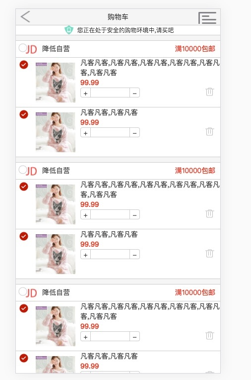
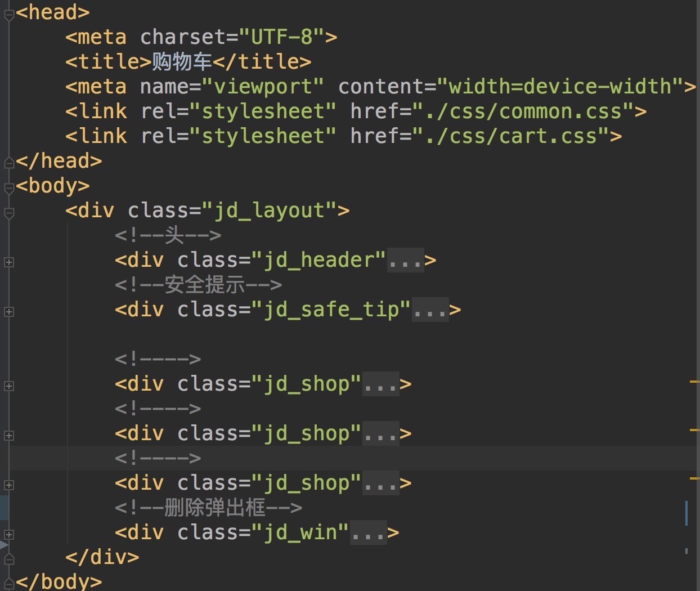
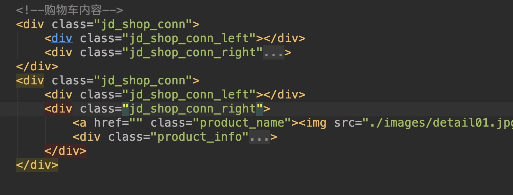
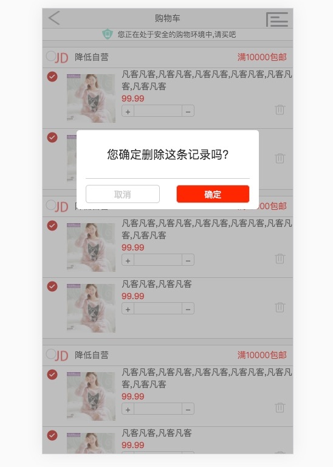
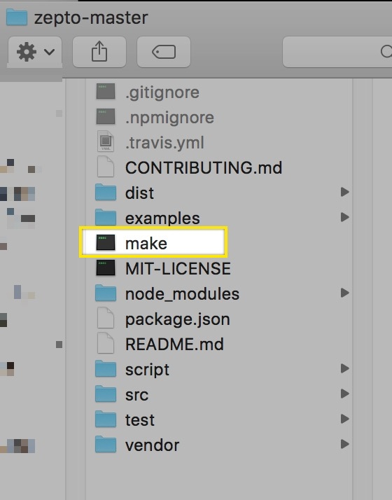
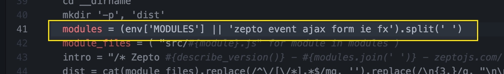
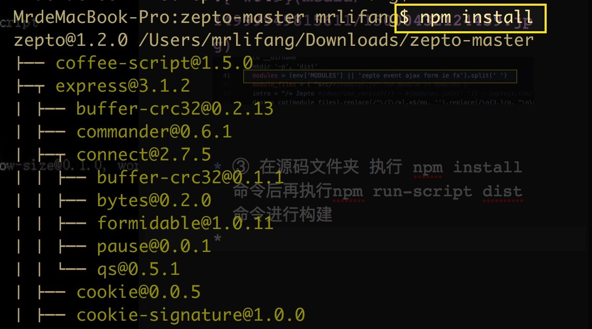
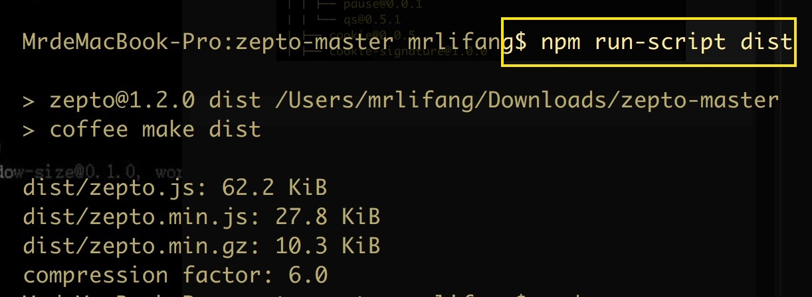
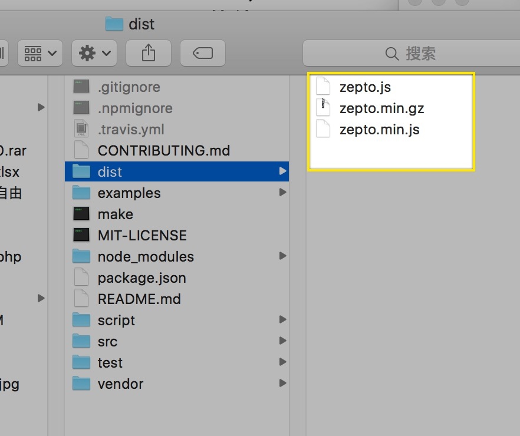

# WEB移动端_Day_06

[TOC]

## 京东案例
### 轮播图滚动的实现


```js

function banner1(){
    var jd_banner = document.querySelector(".jd_banner");
    //获取图片的宽度
    var w = jd_banner.offsetWidth;

    //获取到图片盒子
    var imageBox = jd_banner.querySelector("ul:nth-child(1);");

    //默认第二屏幕
    var index = 1;

    /*获取到点盒子*/
    var pointsBox = jd_banner.querySelectorAll("ul:nth-child(2) li");

    /**
     * 添加移动
     */
    var addTranslate = function(w){
        imageBox.style.transform = "translateX("+w+"px)";
        imageBox.style.webkitTransform = "translateX("+w+"px)";
    };

    /**
     * 添加过渡
     */
    var addTransition = function(){
        imageBox.style.transition = "all 0.5s linear";
        imageBox.style.webkitTransition = "all 0.5s linear"
    };

    /**
     * 移除过渡
     */
    var removeTransition = function(){
        imageBox.style.transition = "none";
        imageBox.style.webkitTransition = "none";
    };


    var  indexOper = function(){
        if(index < 1){
            index = 8;
            removeTransition();
            addTranslate(-index * w);

        }else if(index>8){
            index = 1;
            removeTransition();
            addTranslate(-index * w);
        }

        setPoint();
    };


    //不间断的进行更改 必须是定时器
    setInterval(function(){
        index++;
        removeTransition();
        addTranslate(-index * w);
        addTransition();
    },2000);


    /**
     * 改变点盒子的位置 事件在做兼容处理的时候都需要实现webkit前缀
     * 做一个兼容处理的工具类
     */
    imageBox.addEventListener("webkitTransitionEnd",indexOper)
    imageBox.addEventListener("transitionEnd",indexOper);


    var setPoint = function(){
        //pointBox
        for(var i = 0;i < pointsBox.length;i++){
            //移除当前元素的类名
            pointsBox[i].style.background="none"
        }
        //给当前imageBox 对应的点盒子添加背景色
        pointsBox[index-1].style.background="#fff"
    }

}

```

-------

### 轮播图webkit封装

* 创建`common.js`


```js

var Common = {
        /**
         * 需要传递三个参数
         * 1:把对应的元素传递进来
         * 2:添加事件的名称
         * 3:事件被触发之后要执行的函数
         */

        capOperation: function (dom,eventName,callback) {
            //让代码更健壮一些
            if (dom && typeof dom === "object") {
                dom.addEventListener(eventName, function () {
                    callback && callback();
                });
                //webkitTransitionEnd 注意:首字母大写
                eventName = this.catpilize(eventName);
                dom.addEventListener("webkit" + eventName, function () {
                    callback && callback();
                });
            }
        },
        //将单词的首字母变成大写
        catpilize: function (str1) {

            var str1 = str1.charAt(0).toUpperCase()+str1.substring(1,str1.length);

            return str1;
        }
    };

```


> index.js


```js

function banner1(){
    var jd_banner = document.querySelector(".jd_banner");
    //获取图片的宽度
    var w = jd_banner.offsetWidth;

    //获取到图片盒子
    var imageBox = jd_banner.querySelector("ul:nth-child(1)");

    //默认第二屏幕
    var index = 1;

    /*获取到点盒子*/
    var pointsBox = jd_banner.querySelectorAll("ul:nth-child(2) li");

    /**
     * 添加移动
     */
    var addTranslate = function(w){
        imageBox.style.transform = "translateX("+w+"px)";
        imageBox.style.webkitTransform = "translateX("+w+"px)";
    };

    /**
     * 添加过渡
     */
    var addTransition = function(){
        imageBox.style.transition = "all 0.5s linear";
        imageBox.style.webkitTransition = "all 0.5s linear"
    };

    /**
     * 移除过渡
     */
    var removeTransition = function(){
        imageBox.style.transition = "none";
        imageBox.style.webkitTransition = "none";
    };


    var  indexOper = function(){
        if(index < 1){
            index = 8;
            removeTransition();
            addTranslate(-index * w);

        }else if(index>8){
            index = 1;
            removeTransition();
            addTranslate(-index * w);
        }

        setPoint();
    };


    //不间断的进行更改 必须是定时器
    setInterval(function(){
        index++;
        removeTransition();
        addTranslate(-index * w);
        addTransition();
    },2000);


    /**
     * 改变点盒子的位置 事件在做兼容处理的时候都需要实现webkit前缀
     * 做一个兼容处理的工具类
     */

    Common.capOperation(imageBox,"transitionEnd",indexOper);


    var setPoint = function(){
        //pointBox
        for(var i = 0;i < pointsBox.length;i++){
            //移除当前元素的类名
            pointsBox[i].style.background="none"
        }
        //给当前imageBox 对应的点盒子添加背景色
        pointsBox[index-1].style.background="#fff"
    }

}


```

-------


### 触屏事件演示


```js

var box = document.querySelector(".box");
        box.addEventListener("touchstart",function(event){
            //触摸开始的时候
            console.log("触摸开始");
            console.log("触摸开始X: " + event.changedTouches[0].clientX);
            console.log("触摸开始Y: " + event.changedTouches[0].clientY);
        });

        box.addEventListener("touchmove",function(){
            //触摸移动的时候
            console.log("触摸移动");
        });

        box.addEventListener("touchend",function(){
            //触摸结束的时候
            console.log("触摸结束");
            console.log("触摸结束X: " + event.changedTouches[0].clientX);
            console.log("触摸结束Y: " +event.changedTouches[0].clientY);
        });

```

-------

### 轮播图移动端支持


```css

/**
 *  需求:
 *  触摸屏幕 我在屏幕上进行移动,图片随之手指的移动而移动(这里支持单点触摸)
 *  判断用户滑动第距离和滑动的方向
 *      1: 判断滑动的方向
 *          1.1 向左滑动 切换到下一张 index++ (还需要判断滑动的距离 如果滑动的距离大于当前盒子的1/3就切换到下一张)
 *          1.2 向右滑动 切换的上一张 index-- (如果滑动的距离大于当前盒子的1/3就切换到下一张)
 *
 *
 * 需要的事件
 *      touchstart 触摸开始的时候触发
 *      tuchmove   触摸当前元素上面移动的时候触发
 *      touchend   触摸结束的时候
 *
 *有一个需求:判断用户滑动的距离(就需要知道用户在屏幕触摸点的位置)
 * 触摸开始的位置 触摸结束的位置
 *
 *
 */
function banner3(){
    var jd_banner = document.querySelector(".jd_banner");
    //获取图片的宽度
    var w = jd_banner.offsetWidth;

    //获取到图片盒子
    var imageBox = jd_banner.querySelector("ul:nth-child(1);");

    //默认第二屏幕
    var index = 1;

    /*获取到点盒子*/
    var pointsBox = jd_banner.querySelectorAll("ul:nth-child(2) li");

    /**
     * 添加移动
     */
    var addTranslate = function(w){
        imageBox.style.transform = "translateX("+w+"px)";
        imageBox.style.webkitTransform = "translateX("+w+"px)";
    };

    /**
     * 添加过渡
     */
    var addTransition = function(){
        imageBox.style.transition = "all 0.3s linear";
        imageBox.style.webkitTransition = "all 0.3s linear"
    };

    /**
     * 移除过渡
     */
    var removeTransition = function(){
        imageBox.style.transition = "none";
        imageBox.style.webkitTransition = "none";
    };


    var  indexOper = function(){
        if(index < 1){
            index = 8;
            removeTransition();
            addTranslate(-index * w);

        }else if(index>8){
            index = 1;
            removeTransition();
            addTranslate(-index * w);
        }

        setPoint();
    };


    //不间断的进行更改 必须是定时器
    var ids = setInterval(function(){
        index++;
        removeTransition();
        addTranslate(-index * w);
        addTransition();
    },2000);


    /**
     * 改变点盒子的位置 事件在做兼容处理的时候都需要实现webkit前缀
     * 做一个兼容处理的工具类
     */
        //imageBox.addEventListener("webkitTransitionEnd",indexOper)
        //imageBox.addEventListener("transitionEnd",indexOper);

    Common.capOperation(imageBox,"transitionEnd",indexOper);


    var setPoint = function(){
        //pointBox
        for(var i = 0;i < pointsBox.length;i++){
            //移除当前元素的类名
            pointsBox[i].style.background="none"
        }
        //给当前imageBox 对应的点盒子添加背景色
        pointsBox[index-1].style.background="#fff"
    };

    /**
     * 移动端触摸  ------------------------------------------
     * 要清除浮动
     * 要计算出滑动的距离
     */
    var startX = 0;     //开始触摸点的位置
    var distincX = 0;   //结束触摸点的位置
    var moveX = 0;      //移动的距离
    var isMove = false; //用户是否移动


    /**
     * 触摸屏幕要结束轮播图滚动
     * 记录开始的触摸点位置
     */
    imageBox.addEventListener("touchstart",function(event){
        window.clearInterval(ids);
        startX = event.changedTouches[0].clientX;
    });
    /**
     * 图片随着手指的移动去移动
     * 记录手指移动的触摸点的位置
     * 计算出来移动的距离
     * 让图片盒子随着移动的距离发送改变
     */
    imageBox.addEventListener("touchmove",function(event){
        isMove = true;
        moveX =  event.changedTouches[0].clientX;
        /**
         * 移动的距离
         */
        distincX = moveX - startX;
        //移除过渡
        removeTransition();

        //在当前轮播图片的位置基础之上移除距离
        addTranslate(-index*w+distincX);
    });
    /**
     * 判断滑动方向
     * 当滑动距离是否大于整个盒子的1/3页面变化
     */
    imageBox.addEventListener("touchend",function(event){
        //首先判断当前页面是否移动过
        if(isMove && distincX > 0){
            //大于0 就是从左向右滑动
            /*判断滑动距离是否大于整个盒子的1/3*/
            if(Math.abs(distincX) > w/3){
                //移动的距离已经大于本身盒子的3分之1"
                index--; //上一张
                addTransition();
                addTranslate(-index*w);
            }else{
                //否则回到原位置
                addTransition();
                addTranslate(-index*w);
            }
        }else if(isMove && distincX < 0){
            //小于0 就是从右向左滑动
            if(Math.abs(distincX) > w/3){
                index++; //下一张
                addTransition();
                addTranslate(-index*w);
            }else{
                addTransition();
                addTranslate(-index*w);
            }
        }

        /*滑动图片后 继续循环自动轮播*/
        ids = setInterval(function(){

            startX = 0;    //开始触摸点的位置
            distincX = 0; //结束触摸点的位置
            moveX = 0;     //移动的距离
            isMove = false; //用户是否移动

            index++;
            removeTransition();
            addTranslate(-index * w);
            addTransition();

        },2000)

    });

}


```

-------


## 购物车页面

### 头内容







```html

<!--头-->
        <div class="jd_header">
            <span class="icon_back"></span>
            <h4>购物车</h4>
            <span class="icon_menu"></span>
        </div>
        <!--安全提示-->
        <div class="jd_safe_tip">
            <p>您正在处于安全的购物环境中,请买吧</p>

        </div>

```


```css

.jd_layout{
    min-width: 320px;
    max-width: 640px;
    margin: 0 auto;
    background: #f5f5f5;

}

.jd_header{
    height: 33px;
    background: #f5f5f5;
    text-align: center;
    line-height: 33px;
    border-bottom: 1px solid #ccc;
    position: relative;
}

.jd_header h4{
    font-weight: normal;
}

.jd_header .icon_back{
    position: absolute;
    left: 5px;
    height: 26px;
    top:4px;
    width: 27px;
    background-position: -37px 0px;
    background-image: url("../images/jd-sprites.png");
    background-size: 334px 234px;
}
.jd_header .icon_menu{
    position: absolute;
    right: 5px;
    height: 26px;
    top:4px;
    width: 40px;
    background-position: -121px 0px;
    background-image: url("../images/jd-sprites.png");
}

/*京东安全提示*/
.jd_safe_tip{
    height: 20px;
    text-align: center;
    line-height: 20px;
    border-bottom: 1px solid #ccc;
    font-size: 12px;
    background: #fff;
}

.jd_safe_tip p{
    position: relative;
    display: inline-block;
    padding-left: 30px;
}

.jd_safe_tip p::before{
    position: absolute;
    left: 5px;
    content: "";
    background: url("../images/safe_icon.png");
    background-size: 18px;
    width: 18px;
    height: 18px;
}

```


-------


### 购物车内容




```html

<div class="jd_shop_conn">
                <div class="jd_shop_conn_left"></div>
                <div class="jd_shop_conn_right">
                    <a href="" class="product_name"></a>
                    <div class="product_info">
                        <p>凡客凡客,凡客凡客</p>
                        <p>99.99</p>

                        <div class="option">
                            <div class="option_left">
                                <span>+</span>
                                <input type="text">
                                <span>-</span>
                            </div>
                            <div  class="option_right">
                                <div class="deleteBtn">
                                    <div class="up"></div>
                                    <div class="down"></div>
                                </div>
                            </div>
                        </div>
                    </div>
                </div>
            </div>


```


```css

/*购物车选项*/
.jd_shop{
    margin-top: 10px;
    border-top:1px solid #CCCCCC;
    border-bottom: 1px solid #CCCCCC;
}
.jd_shop .jd_shop_tit{
    height: 33px;
    line-height: 33px;
    position: relative;
    background-color: #fff;
}

.jd_shop .jd_shop_tit_left{
    position: absolute;
    width: 20px;
    height: 20px;
    background: url("../images/shop-icon.png");
    left: 5px;
    top: 5px;
    background-position: 200px 0;
    background-size: 50px 100px;

}
.jd_shop .jd_shop_tit_right{}
.jd_shop .jd_shop_tit_right img{
    float: left;
    width: 23px;
    height: 24px;
    margin-top: 5px;
    margin-left: 20px;
}

.jd_shop .jd_shop_tit_right span{

}
.jd_shop .jd_shop_tit_right span:nth-child(2){
    float: left;
    margin-left: 10px;

}
.jd_shop .jd_shop_tit_right span:nth-child(3){
    float: right;
    margin-right: 10px;
    color: red;
    font-size: 14px;
}


/*.jd_shop .jd_shop_conn:nth-child(2n-1){*/
    /*border-bottom: 1px solid #cccccc;*/
    /*margin-bottom: 10px;*/
/*}*/

    /*内容区域*/
.jd_shop_conn{
    border-top: 1px solid #CCCCCC;
    position: relative;
    padding-left:30px;
    height: 100px;
    background-color: #fff;
}


.jd_shop_conn .jd_shop_conn_left{
    width: 20px;
    height: 20px;
    position: absolute;
    left: 5px;
    top: 5px;
    background: url("../images/shop-icon.png");
    background-size: 50px 100px;
    background-position: 77px 0;
}
.jd_shop_conn .jd_shop_conn_right{
    overflow: hidden;
}
.jd_shop_conn .jd_shop_conn_right .product_name{
    padding: 10px;
    float: left;
}

.jd_shop_conn .jd_shop_conn_right .product_name img{
    width: 80px;
    height: 80px;
    display: block;
}

.jd_shop_conn .jd_shop_conn_right .product_info p:nth-child(2){
    color: red;
    font-weight: 700;
}


.jd_shop_conn .option .option_left{
    float: left;
}

.jd_shop_conn .option .option_left span{
    width: 20px;
    height: 20px;
    float: left;
    border: 1px solid #CCCCCC;
    text-align: center;
}

.jd_shop_conn .option .option_left span:nth-child(1){
    border-right: none;
    border-top-left-radius: 4px;
    border-bottom-left-radius: 4px;
}

.jd_shop_conn .option .option_left span:nth-last-child(1){
    border-left: none;
    border-top-right-radius: 4px;
    border-bottom-right-radius: 4px;

}

.jd_shop_conn .option .option_left input{
    float: left;
    border: 1px solid #CCCCCC;
    width: 80px;
    height: 20px;
}

.jd_shop_conn .option .option_right{
    float: right;
    width: 20px;
    height: 20px;

    margin-right: 10px;
    position: relative;
}
.jd_shop_conn .option .option_right .up{
    position: absolute;
    background: url("../images/delete_up.png");
    background-repeat: no-repeat;
    background-size: 18px 4px;
    width: 18px;
    height: 4px;
    top:0;
    left:0;
}

.jd_shop_conn .option .option_right .down{
    position: absolute;
    background: url("../images/delete_down.png");
    background-repeat: no-repeat;
    background-size: 17px 18px;
    width: 17px;
    height: 18px;
    top:0;
    left:0;
}


```

-------

### 删除商品对话框




```html

 <!--删除弹出框-->
        <div class="jd_win">
            <div class="jd_win_box">
                <div class="info">
                    您确定删除这条记录吗?
                </div>
                <div class="btn">
                    <a href="javascript:;" class="ok" >取消</a>
                    <a href="javascript:;" class="cancel" >确定</a>
                </div>
            </div>
        </div>

```


```css

/*弹出盒子的定位--------------------------------------------------*/

.jd_win{
    position: fixed;
    width: 100%;
    height: 100%;
    display: none;
    left: 0px;
    top: 0px;
    background-color: rgba(126,126,126,0.5);
}
.jd_win .jd_win_box{
    width: 300px;
    background: #fff;
    border-radius: 5px;
    margin: 200px auto;
}
.jd_win .jd_win_box .info{
    height: 80px;
    line-height: 80px;
    width: 90%;
    border-bottom: 1px solid #ccc;
    text-align: center;
    font-size: 19px;
    margin: 10px auto;
}
.jd_win .jd_win_box .btn{
    overflow: hidden;
    width: 90%;
    margin: 10px auto;
    padding-bottom: 10px;
}
.jd_win .jd_win_box .btn a{
    float: left;
    height: 30px;
    line-height: 30px;
    width: 45%;
    border: 1px solid #ccc;
    border-radius: 5px;
    text-align: center;
}
.jd_win .jd_win_box .btn a.ok{
    margin-right: 10%;
}
.jd_win .jd_win_box .btn a.cancel{
    background-color: red;
    color: #fff;
}

```

-------

### animated.css的使用


* https://daneden.github.io/animate.css/


```html

 <link rel = "stylesheet" href="../css/animate.css">

-------------------------------

 <div class="box animateName"></div>

```


```css

 .box{
            margin: 300px auto;
            width: 200px;
            height: 200px;
            border-radius: 50%;
            background-image: radial-gradient(
                    at 40px 40px,
                    #FFF,
                    #1251bc
            );
        }

        .animateName{
            animation:bounceInDown .5s linear 1;
        }

```


-------


### 对话框弹出动画


```js

window.onload = function(){

    /**
     * 1：页面加载完毕，我需要给所有的删除的垃圾箱添加点击事件
     *      1.1：jd_win 这个要显示 display:none
     *      1.2  还需要让 jd_win_box 盒子执行动画，调用animate.css 的动画
     *      1.3  获取到对应垃圾箱的盖，把它翻起来（旋转-30deg） 还需要有动画，需要过渡
     *
     * 2: 弹出框取消按钮
     *      2.1 点击取消，把jd_win 这个要隐藏
     *      2.2  找到对应的垃圾箱的盖子，盖上  旋转0deg）
     *
     */

    var btns = document.querySelectorAll(".deleteBtn");
    var jd_win = document.querySelector(".jd_win");
    var jd_win_box = document.querySelector(".jd_win_box");
    var upBtn;
    for(var i= 0;i<btns.length;i++){
        btns[i].onclick = function(){
            //1.1：jd_win 这个要显示 display:block
            jd_win.style.display = "block";
            //1.2  还需要让 jd_win_box 盒子执行动画，调用animate.css
            jd_win_box.classList.add("animateName");
            //1.3  获取到对应垃圾箱的盖，把它翻起来（旋转-30deg） 还需要有动
            upBtn = this.querySelector(".up");

            upBtn.style.transform = "rotate(-30deg)";
            upBtn.style.webkitTransform = "ritate(-30deg)";

            //调垃圾盖选择的中心点位置
            upBtn.style.transformOrigin = "left bottom";
            upBtn.style.webkitTransformOrigin = "left bottom";
            upBtn.style.transition="all .2s linear";
            upBtn.style.webkitTransition="all .2s linear";
        }
    }

    document.querySelector(".cancel").onclick = function(){
        // 2.1 点击取消，把jd_win 这个要隐藏
        jd_win.style.display = "none";
        // 2.2  找到对应的垃圾箱的盖子，盖上  旋转0deg）
        upBtn.style.transform="rotate(0deg)";
        upBtn.style.webkitTransform="rotate(0deg)";
        upBtn.style.transition="all .2s linear";
        upBtn.style.webkitTransition="all .2s linear";

    }

};

```

-------

## zepto框架
* 移动端zepto框架 跟jQuery有什么不同
* zepto框架用法跟jquery 90%一样 连方法都一样
* 但zepto主要专注移动端 
* jquery是因为ie6->ie11兼容性处理 jquery 在pc 端用的非常多
* zepto这个针对移动端它比 jquery体积小

* ① zepto 是针对移动端 移动端没有ie所以zepto.js代码没有兼容性
* ② zepto 中功能 进行模块化开发 把里面的方法按功能分成了很多模块
* ③ zepto.js 支持移动端的触屏实现海封装了很多手势(判断方向)事件

* ④ zepto.js 是采用模块化开发,我需要使用那些功能,我就导入对应的模块js 文件
* ⑤ zepto.js 有16个模块 对应有16个js 文件,假设我要使用里面的功能,在我页面导入16个js文件 这样就会发送16次请求 这样肯定会损耗性能
* ⑥ zepto 定制安装需要来定制zepto的功能

#### zepto 定制化

* ① 首先在自己的电脑上要安装node.js和npm包管理工具.然后下载好github上的源码包

> https://github.com/madrobby/zepto

* ② 进入解压好的zepto源码根目录找到make文件，打开，找到第42行的位置，添加需要的模块名称（这里我增加了fx_methods  touch 和 fx 模块）,参考阴影部分和插件表加入自己想要的插件后保存







* ③ 在源码文件夹 执行 npm install 命令后再执行npm run-script dist 命令进行构建






* ④ 执行完成之后再根目录下的dist文件夹内就有已经构建好的zepto文件了




-------


 


